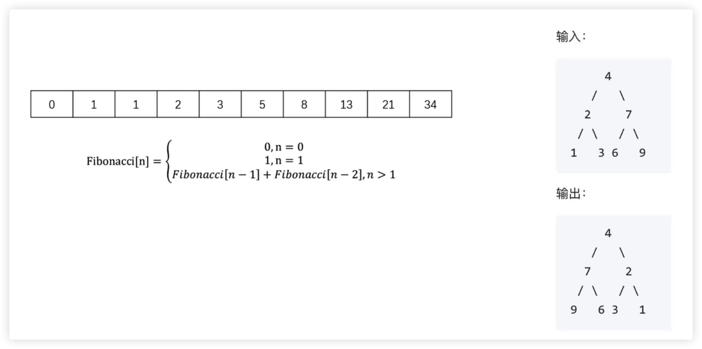
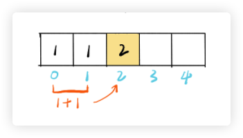

## 动态规划是什么？

- 动态规则是算法设计中的一种方法
- 它将一个问题分解为 **相互重叠** 的子问题，通过反复求解子问题，来解决原来的问题

<br/>

### 斐波那契数列

动态规划在斐波那契数列中的应用


- 定义子问题：F(n) = F(n-1) + F(n-2)
- 反复执行：从 2 循环到 n，执行上述公式

<br/>
<br/>
<br/>

## 动态规划 VS 分而治之



它们之间的最大区别在于 子问题是否是独立的。
- 如果他们的子问题是相互重叠的，那么就是动态规划
  - 比如，斐波那契数列，F(n) 分解成了 F(n-1) F(n-2)，这两个子问题是相互重叠的
- 如果子问题是独立的，那么就是分而治之
  - 反转二叉树，本来的问题是反转整棵树，结果最后分解成了反转左右子树，反转左右子树这两个子问题，它们是完全独立的，相互独立，各反转各的

<br/>

**动态规划**：通过把原问题分解为相对简单的子问题的方式求解复杂问题的方法。动态规划常常适用于有重叠子问题和最优子结构性质的问题。

**基本思想**：若要解一个给定问题，我们需要解其不同部分（即子问题），再合并子问题的解以得出原问题的解。 通常许多子问题非常相似，为此动态规划法试图仅仅解决每个子问题一次，从而减少计算量： 一旦某个给定子问题的解已经算出，则将其记忆化存储，以便下次需要同一个子问题解之时直接查表。 这种做法在重复子问题的数目关于输入的规模呈指数增长时特别有用。

### 分治法与动态规划

- **共同点**：二者都要求原问题具有最优子结构性质,都是将原问题分而治之,分解成若干个规模较小(小到很容易解决的程序)的子问题.然后将子问题的解合并,形成原问题的解.
- **不同点**：分治法将分解后的子问题看成相互独立的，通过用递归来做。

动态规划将分解后的子问题理解为相互间有联系,有重叠部分，需要记忆，通常用迭代来做。

<br/>

### 问题特征

- **最优子结构**：当问题的最优解包含了其子问题的最优解时，称该问题具有最优子结构性质。
- **重叠子问题**：在用递归算法自顶向下解问题时，每次产生的子问题并不总是新问题，有些子问题被反复计算多次。动态规划算法正是利用了这种子问题的重叠性质，对每一个子问题只解一次，而后将其解保存在一个表格中，在以后尽可能多地利用这些子问题的解。

<br/>
<br/>
<br/>

## [爬楼梯](https://leetcode-cn.com/problems/climbing-stairs/)

**思路**

- 爬到第 n 阶可以在第 n-1 阶爬 1 个台阶，或者在第 n-2 阶爬 2 个台阶
- F(n) = F(n-1) + F(n-2)
- 使用动态规划

**步骤**

- 定义子问题：F(n) = F(n-1) + F(n-2)
- 反复执行：从 2 循环到 n，执行上述公式



```javascript
/**
 * @param {number} n
 * @return {number}
 *
 *  时间复杂度：O(n)
 *  空间复杂度：O(h)
 */
var climbStairs = function (n) {
  if (n < 2) return 1

  const dp = [1, 1] // 假设下标是 n，数组的第 n 位代表着有多少种爬法，那么就可以通过 f0 + f1 = f2 的数量了
  for (let i = 2; i <= n; i++) {
    dp[i] = dp[i - 1] + dp[i - 2]
  }

  return dp[n]
};


/**
 * @param {number} n
 * @return {number}
 *
 *  时间复杂度：O(n)
 *  空间复杂度：O(1)
 */
var climbStairs = function (n) {
  if (n < 2) return 1

  let dp0 = 1
  let dp1 = 1

  for (let i = 2; i <= n; i++) {
    const temp = dp0
    dp0 = dp1
    dp1 = dp1 + temp
  }

  return dp1
};
```

<br/>
<br/>
<br/>

## [打家劫舍](https://leetcode-cn.com/problems/house-robber/)

**思路**

- f(k) = 从前 k 个房屋中能偷窃到的最大金额
- AK = 第 k 个房屋的钱数
- f(k) = max( f(k-2) + AK, f(k-1) )

**步骤**

- 定义子问题：f(k) = max( f(k-2) + AK, f(k-1) )
- 反复执行

```javascript
/**
 * @param {number[]} nums
 * @return {number}
 *
 *  时间复杂度：O(n)
 *  空间复杂度：O(n)
 */
var rob = function (nums) {
  if (nums.length === 0) return 0

  const dp = [0, nums[0]]

  for (let i = 2; i <= nums.length; i++) {
    dp[i] = Math.max(dp[i - 2] + nums[i - 1], dp[i - 1])
  }

  return dp[nums.length]
};
```

```javascript
/**
 * @param {number[]} nums
 * @return {number}
 *
 *  时间复杂度：O(n)
 *  空间复杂度：O(1)
 */
var rob = function (nums) {
  if (nums.length === 0) return 0

  let dp0 = 0
  let dp1 = nums[0]

  for (let i = 2; i <= nums.length; i++) {
    const dp2 = Math.max(dp0 + nums[i - 1], dp1)
    dp0 = dp1 // 后移
    dp1 = dp2 // 后移
  }

  return dp1
};
```


