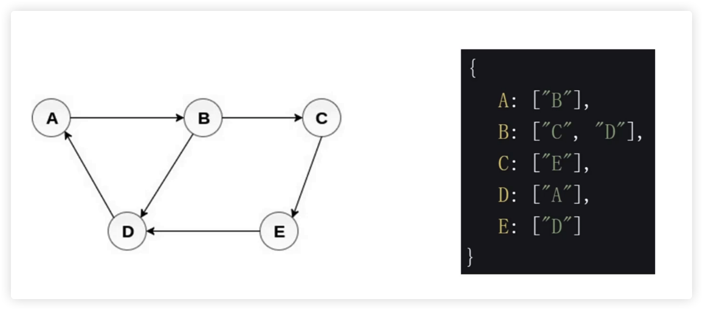
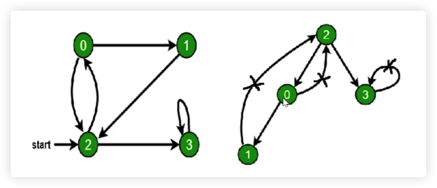

## 图是什么？

- 图是 **网络架构** 的抽象模型，是一组由 **边** 连接的 **节点**。
- 图可以表示任何二元关系，比如 路、航班、...
- JS 中没有图，但是可以用 Object 和 Array 构建图
- 图的表示法：邻接矩阵、邻接表、关联矩阵、...
- 图的常用操作：深度/广度优先遍历

<br/>
<br/>
<br/>

## 图的表示法：邻接矩阵


<br/>
<br/>
<br/>

## 图的表示法：邻接表



<br/>
<br/>
<br/>

## 什么是深度/广度优先遍历？

- 深度优先遍历：尽可能深的搜索图的分支
- 广度优先遍历：先访问离根节点最进的节点

<br/>
<br/>

### 深度优先遍历

- 访问根节点
- 对根节点的 **没访问过的相邻节点** 挨个进行深度优先遍历



```javascript
const graph = {
  0: [1, 2],
  1: [2],
  2: [0, 3],
  3: [3]
}

const visited = new Set()
const dfs = (node) => {
  console.log(node);
  visited.add(node)
  graph[node].forEach(c => {
    if (!visited.has(c)) { // 未访问过的节点
      dfs(c)
    }
  })
}

dfs(2)
```

<br/>
<br/>

### 广度优先遍历

- 新建一个队列，把根节点入队
- 把对头出队并访问
- 把对头的 **没访问过的相邻节点** 入队
- 重复第二、三步，直到队列为空


```javascript
const graph = {
  0: [1, 2],
  1: [2],
  2: [0, 3],
  3: [3]
}

const visited = new Set()
visited.add(2)
const queue = [2]

while (queue.length) {
  const n = queue.shift()
  console.log(n);

  graph[n].forEach((c) => {
    if (!visited.has(c)) {
      queue.push(c)
      visited.add(c)
    }
  })
}
```

<br/>
<br/>
<br/>

## [有效数字](https://leetcode-cn.com/problems/valid-number/)

**思路**

8个节点分别代表字符串的8种不同的状态，只有3、5、6这三个状态是合法的数字，而且状态之间是可以相互转换的（如：状态1上加一个点，则可将其转化为状态2）。有了这个图，就很方便判断一个字符串是否是有效的了。


**步骤**

- 构建一个表示状态的图。
- 遍历字符串，并沿着图走，如果到了某个节点无路可走就返回false。
- 遍历结束，如走到 3 / 5 /6 ，就返回true，否则返回false。

```javascript
// 正则
var isNumber = function(s) {
    // 开头和结尾空格 0 ~ n 个
    // 正负号可选
    // 整数或小数，注意小数可能有 "a.b"，"a."，".b" 三种情况，测试用例告诉我的
    // 科学计数法可选
    // 科学计数法部分，e 开头，正负号可选，次幂为整数。
   return /^\s*[\-\+]?(\d+\.?\d*|\.\d+)(e[\-\+]?\d+)?\s*$/.test(s);
};

/**
 * @param {string} s
 * @return {boolean}
 *
 *  时间复杂度：O(n) => n 为字符串的长度。
 *  空间复杂度：O(1) => graph 图不会线性增长，是常量级的，因此为1.
 */
var isNumber = function (s) {
  // 构件图(节点，节点之间连接需要显示怎么过去的?)
  const graph = {
    // 'blank' 表示空格 'sign' 表示加减号 . 表示 .  'digit' 表示数字
    0: { 'blank': 0, 'sign': 1, '.': 2, 'digit': 6 },
    1: { 'digit': 6, '.': 2 },
    2: { 'digit': 3 },
    3: { 'digit': 3, 'e': 4 },
    4: { 'digit': 5, 'sign': 7 },
    5: { 'digit': 5 },
    6: { 'digit': 6, '.': 3, 'e': 4 },
    7: { 'digit': 5 }
  }

  // 当前字符串状态，默认为0
  let state = 0;

  for (c of s.trim()) {
    if (c >= '0' && c <= '9') {
      c = 'digit'
    } else if (c === ' ') {
      c = 'blank'
    } else if (c === '+' || c === '-') {
      c = 'sign'
    }

    state = graph[state][c] // 更新状态
    if (state === undefined) return false;
  }

  // 遍历完了，走出循环了
  if (state === 3 || state === 5 || state === 6) return true;
  return false;
}
```

<br/>
<br/>
<br/>

## [太平洋大西洋水流问题](https://leetcode-cn.com/problems/pacific-atlantic-water-flow/)

**思路**

- 把矩阵想象成图
- 把海岸线逆流而上遍历图，所到之处就是可以流到某个大洋的坐标

```shell
给定下面的 5x5 矩阵:

  太平洋 ~   ~   ~   ~   ~
       ~  1   2   2   3  (5) *
       ~  3   2   3  (4) (4) *
       ~  2   4  (5)  3   1  *
       ~ (6) (7)  1   4   5  *
       ~ (5)  1   1   2   4  *
          *   *   *   *   * 大西洋

返回:

[[0, 4], [1, 3], [1, 4], [2, 2], [3, 0], [3, 1], [4, 0]] (上图中带括号的单元).
```

**步骤**

- 新建两个矩阵，分别记录能流到两个大洋的坐标
- 从海岸线，多管齐下，同时深度优先遍历图，过程中填充上述矩阵
- 遍历两个矩阵，找出能流到两个大洋的坐标

```javascript
/**
 * @param {number[][]} heights
 * @return {number[][]}
 *
 *  时间复杂度：O(m * n) => 遍历了m * n的格子。
 *  空间复杂度：O(m * n) => flow1，flow2 它们两个都是 m*n 的矩阵
 */
var pacificAtlantic = function (heights) {
  // 矩阵无值或不是二维
  if (!heights || !heights[0]) return [];

  const row = heights.length;       // 行数
  const column = heights[0].length; // 列数

  const flow1 = Array.from({ length: row }, () => new Array(column).fill(false));  // 记录能流到太平洋的坐标
  const flow2 = Array.from({ length: row }, () => new Array(column).fill(false));  // 记录能流到大西洋的坐标

  // 深度优先遍历
  const dfs = (r, c, flow) => {
    flow[r][c] = true;

    // 遍历相邻节点，上 下 左 右 四个节点
    [[r - 1, c], [r + 1, c], [r, c - 1], [r, c + 1]].forEach(([nextR, nextC]) => {
      if (
        // 保证节点在矩阵中
        nextR >= 0 && nextR < row &&
        nextC >= 0 && nextC < column &&
        // 防止死循环，保证之前没访问该节点
        !flow[nextR][nextC] &&
        // 保证逆流而上
        heights[nextR][nextC] >= heights[r][c]
      ) {
        dfs(nextR, nextC, flow);
      }
    });
  };

  //  沿着海岸线逆流而上
  for (let r = 0; r < row; r++) {
    dfs(r, 0, flow1);          // 第1列
    dfs(r, column - 1, flow2); // 最后1列
  }
  for (let c = 0; c < column; c++) {
    dfs(0, c, flow1);       // 第一行
    dfs(row - 1, c, flow2); // 最后一行
  }

  // 收集能流到两个大洋的坐标
  const res = [];
  for (let r = 0; r < row; r++) {
    for (let c = 0; c < column; c++) {
      if (flow1[r][c] && flow2[r][c]) {
        res.push([r, c]);
      }
    }
  }
  return res;
};
```

<br/>
<br/>
<br/>

## [克隆图](https://leetcode-cn.com/problems/clone-graph/)

**思路**

- 拷贝所有节点
- 拷贝所有的边

**步骤**

- 深度或广度优先遍历所有节点
- 拷贝所有的节点，存储起来
- 将拷贝的节点，按照原图的连接方法进行连接

```javascript
/**
 * // Definition for a Node.
 * function Node(val, neighbors) {
 *    this.val = val === undefined ? 0 : val;
 *    this.neighbors = neighbors === undefined ? [] : neighbors;
 * };
 */

/**
 * @param {Node} node
 * @return {Node}
 *
 * 深度优先遍历
 *  时间复杂度：O(n) => 遍历了所有节点。
 *  空间复杂度：O(n) => 有个 map 存储着它们，虽然有递归栈，但是它们前后排列，选最大值
 */
var cloneGraph = function (node) {
  if (!node) return

  const visited = new Map()

  const dfs = (n) => {
    const nCopy = new Node(n.val) // 克隆节点
    visited.set(n, nCopy);        // 存储节点

    (n.neighbors || []).forEach((ne) => {
      if (!visited.has(ne)) dfs(ne)

      nCopy.neighbors.push(visited.get(ne)) // 连接边
    })
  }

  dfs(node)

  return visited.get(node)
};
```

```javascript
/**
 * // Definition for a Node.
 * function Node(val, neighbors) {
 *    this.val = val === undefined ? 0 : val;
 *    this.neighbors = neighbors === undefined ? [] : neighbors;
 * };
 */

/**
 * @param {Node} node
 * @return {Node}
 *
 * 广度优先遍历
 *  时间复杂度：O(n) => 遍历了所有节点。
 *  空间复杂度：O(n) => 有个 queue 可能很长，和节点数差不多
 */
var cloneGraph = function (node) {
  if (!node) return
  const visited = new Map()
  visited.set(node, new Node(node.val)) // 存储节点
  const q = [node]

  while (q.length) {
    const n = q.shift();

    (n.neighbors || []).forEach(ne => {
      if (!visited.has(ne)) {
        q.push(ne)
        visited.set(ne, new Node(ne.val)) // 存储节点
      }

      visited.get(n).neighbors.push(visited.get(ne)) // 连接边
    })
  }

  return visited.get(node)
};
```

<br/>
<br/>
<br/>
