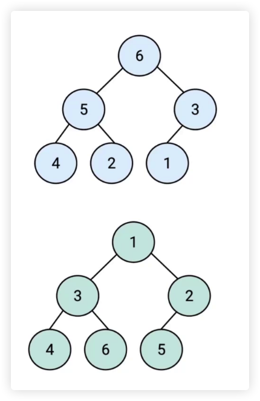

## 堆是什么？

- 堆是一种特殊的 **完全二叉树**
  - 每层节点都完全填满
  - 在最后一层上，如果不是满的，则指确少右边的若干节点
- 所有的节点都大于等于（最大堆）或小于等于（最小堆）它的子节点
  - 在最大堆中，父节点的值大于等于每一个子节点的值。
  - 在最小堆中，父节点的值小于等于每一个子节点的值。
  - 这就是所谓的“堆属性”，并且这个属性对堆中的每一个节点都成立。
    

<br/>
<br/>
<br/>

## JS 中的堆

- JS 中通常用数组表示堆

  

- **左侧子节点**的位置是 `2 * index + 1`。
- **右侧子节点**的位置是 `2 * index + 2`。
- **父节点**位置是 `parseInt((index - 1) / 2)`、`Math.floor((index - 1) / 2)`、`(i - 1) >> 2`。

<br/>
<br/>
<br/>

## 堆的应用

- 堆能高效、快速地找出最大值和最小值，时间复杂度：O(1)
- 找出第 K 个最大（小）元素

<br/>
<br/>
<br/>

## 第 K 个最大元素

- 构建一个最小堆，并将元素依次插入堆中
- 当堆的容量超过 K，就删除堆顶
- 插入结束后，堆顶就是第 K 个最大元素

<br/>
<br/>
<br/>

## JavaScript 实现：最小堆类

- 在类里，声明一个数组，用来装元素。
- 主要方法：插入、删除堆顶、获取堆顶、获取堆大小。

<br/>
<br/>

### 插入

- 将值插入堆的底部，即数组的尾部
- 然后上移：将这个值和它的父节点进行交换，直到父节点小于等于这个插入的值。
- 大小为 K 的堆中插入元素的时间复杂度为 O(logk)。时间主要花在了上移操作

```javascript
class MinHeap {
  constructor() {
    this.heap = []
  }

  // 寻找父节点
  getParentIndex(index) {
    return (index - 1) >> 2
  }

  // 寻找左子节点
  getLeftIndex(index) {
    return index * 2 + 1
  }

  // 寻找右子节点
  getRightIndex(index) {
    return index * 2 + 2
  }

  // 交换
  swap(i1, i2) {
    // const temp = this.heap[i1]
    // this.heap[i1] = this.heap[i2]
    // this.heap[i2] = temp
    [this.heap[i1], this.heap[i2]] = [this.heap[i2], this.heap[i1]]
  }

  /**
   * 插入操作
   * @param value
   */
  insert(value) {
    this.heap.push(value)
    this.shiftUp(this.heap.length - 1)
  }

  // 上移
  shiftUp(index) {
    if (index == 0) return // 堆顶

    const parentIndex = this.getParentIndex(index)

    if (this.heap[parentIndex] > this.heap[index]) {
      this.swap(parentIndex, index)
      this.shiftUp(parentIndex)
    }
  }
}

const h = new MinHeap()
h.insert(3)
h.insert(2)
h.insert(1)

console.log(h.heap);
```

<br/>
<br/>

### 删除堆顶

- 用数组尾部元素替换堆顶（直接删除堆顶会破坏结构）。
- 然后下移：将新堆顶和它的子节点进行交换，直到子节点大于等于这个新堆顶。
- 大小为 k 的堆中删除堆顶的时间复杂度为 O(logk)。时间主要花在了下移操作

```javascript
class MinHeap {
  constructor() {
    this.heap = []
  }

  // 寻找父节点
  getParentIndex(index) {
    return (index - 1) >> 2
  }

  // 寻找左子节点
  getLeftIndex(index) {
    return index * 2 + 1
  }

  // 寻找右子节点
  getRightIndex(index) {
    return index * 2 + 2
  }

  // 交换
  swap(i1, i2) {
    // const temp = this.heap[i1]
    // this.heap[i1] = this.heap[i2]
    // this.heap[i2] = temp
    [this.heap[i1], this.heap[i2]] = [this.heap[i2], this.heap[i1]]
  }

  /**
   * 删除操作
   */
  pop() {
    this.heap[0] = this.heap.pop()
    this.shiftDown(0)
  }

  // 下移
  shiftDown(index) {
    const leftIndex = this.getLeftIndex(index)
    const rightIndex = this.getRightIndex(index)

    if (this.heap[leftIndex] < this.heap[index]) {
      this.swap(leftIndex, index)
      this.shiftDown(leftIndex)
    }

    if (this.heap[rightIndex] < this.heap[index]) {
      this.swap(rightIndex, index)
      this.shiftDown(rightIndex)
    }

  }
}
```

<br/>
<br/>

### 获取堆顶和堆的大小

- 获取堆顶：返回数组的头部
- 获取堆的大小：返回数组的长度

```javascript
class MinHeap {
  constructor() {
    this.heap = []
  }

  /**
   * 获取堆顶
   * @returns {*}
   */
  peek() {
    return this.heap[0]
  }

  /**
   * 获取堆的大小
   * @returns {number}
   */
  size() {
    return this.heap.length
  }
}
```

### 最终

```javascript
class MinHeap {
  constructor() {
    this.heap = []
  }

  // 寻找父节点
  getParentIndex(index) {
    return (index - 1) >> 2
  }

  // 寻找左子节点
  getLeftIndex(index) {
    return index * 2 + 1
  }

  // 寻找右子节点
  getRightIndex(index) {
    return index * 2 + 2
  }

  // 交换
  swap(i1, i2) {
    // const temp = this.heap[i1]
    // this.heap[i1] = this.heap[i2]
    // this.heap[i2] = temp
    [this.heap[i1], this.heap[i2]] = [this.heap[i2], this.heap[i1]]
  }

  /**
   * 插入操作
   * @param value
   */
  insert(value) {
    this.heap.push(value)
    this.shiftUp(this.heap.length - 1)
  }

  // 上移
  shiftUp(index) {
    if (index == 0) return // 堆顶

    const parentIndex = this.getParentIndex(index)

    if (this.heap[parentIndex] > this.heap[index]) {
      this.swap(parentIndex, index)
      this.shiftUp(parentIndex)
    }
  }

  /**
   * 删除操作
   */
  pop() {
    this.heap[0] = this.heap.pop()
    this.shiftDown(0)
  }

  // 下移
  shiftDown(index) {
    const leftIndex = this.getLeftIndex(index)
    const rightIndex = this.getRightIndex(index)

    if (this.heap[leftIndex] < this.heap[index]) {
      this.swap(leftIndex, index)
      this.shiftDown(leftIndex)
    }

    if (this.heap[rightIndex] < this.heap[index]) {
      this.swap(rightIndex, index)
      this.shiftDown(rightIndex)
    }
  }

  /**
   * 获取堆顶
   * @returns {*}
   */
  peek() {
    return this.heap[0]
  }

  /**
   * 获取堆的大小
   * @returns {number}
   */
  size() {
    return this.heap.length
  }
}


const h = new MinHeap()
h.insert(3)
h.insert(2)
h.insert(1)

h.pop()

console.log(h.heap);
```

<br/>
<br/>
<br/>

## [数组中的第K个最大元素](https://leetcode-cn.com/problems/kth-largest-element-in-an-array/)

**思路**

- 看到 "第 K 个最大元素"
- 考虑选择使用最小堆

**步骤**

- 构建一个最小堆，并依次把数组的值插入堆中
- 当堆的容量超过 K，就删除堆顶
- 插入结束后，堆顶就是第 K 个最大元素

```javascript
class MinHeap {
  constructor() {
    this.heap = []
  }

  // 寻找父节点
  getParentIndex(index) {
    return (index - 1) >> 2
  }

  // 寻找左子节点
  getLeftIndex(index) {
    return index * 2 + 1
  }

  // 寻找右子节点
  getRightIndex(index) {
    return index * 2 + 2
  }

  // 交换
  swap(i1, i2) {
    // const temp = this.heap[i1]
    // this.heap[i1] = this.heap[i2]
    // this.heap[i2] = temp
    [this.heap[i1], this.heap[i2]] = [this.heap[i2], this.heap[i1]]
  }

  /**
   * 插入操作
   * @param value
   */
  insert(value) {
    this.heap.push(value)
    this.shiftUp(this.heap.length - 1)
  }

  // 上移
  shiftUp(index) {
    if (index == 0) return // 堆顶

    const parentIndex = this.getParentIndex(index)

    if (this.heap[parentIndex] > this.heap[index]) {
      this.swap(parentIndex, index)
      this.shiftUp(parentIndex)
    }
  }

  /**
   * 删除操作
   */
  pop() {
    this.heap[0] = this.heap.pop()
    this.shiftDown(0)
  }

  // 下移
  shiftDown(index) {
    const leftIndex = this.getLeftIndex(index)
    const rightIndex = this.getRightIndex(index)

    if (this.heap[leftIndex] < this.heap[index]) {
      this.swap(leftIndex, index)
      this.shiftDown(leftIndex)
    }

    if (this.heap[rightIndex] < this.heap[index]) {
      this.swap(rightIndex, index)
      this.shiftDown(rightIndex)
    }

  }

  /**
   * 获取堆顶
   * @returns {*}
   */
  peek() {
    return this.heap[0]
  }

  /**
   * 获取堆的大小
   * @returns {number}
   */
  size() {
    return this.heap.length
  }
}

/**
 * @param {number[]} nums
 * @param {number} k
 * @return {number}
 *
 *  时间复杂度：O(n * logk) => n 是 forEach nums 的长度。
 *                           logk 是 MinHeap 类中的 shiftUp、shiftDown 方法的时间复杂度。
 *  空间复杂度：O(k) => k 就是参数 k
 */
var findKthLargest = function (nums, k) {
  const h = new MinHeap()

  nums.forEach(n => {
    h.insert(n)

    if (h.size() > k) {
      h.pop()
    }
  })

  return h.peek()
};
```

<br/>
<br/>
<br/>

## [前 K 个高频元素](https://leetcode-cn.com/problems/top-k-frequent-elements/)

```javascript
/**
 * @param {number[]} nums
 * @param {number} k
 * @return {number[]}
 *
 *  时间复杂度：O(n) => for
 *  空间复杂度：O(n * logn) => 原生的 sort 最快也是 O(n * logn)，map 为 O(n)，取最大值
 */
var topKFrequent = function (nums, k) {
  const map = new Map()
  nums.forEach(n => {
    map.set(n, map.has(n) ? map.get(n) + 1 : 1)
  })
  const list = Array.from(map).sort((a, b) => b[1] - a[1])
  return list.slice(0, k).map(n => n[0])
};
```

优化版

```javascript
class MinHeap {
  constructor() {
    this.heap = []
  }

  // 寻找父节点
  getParentIndex(index) {
    return (index - 1) >> 2
  }

  // 寻找左子节点
  getLeftIndex(index) {
    return index * 2 + 1
  }

  // 寻找右子节点
  getRightIndex(index) {
    return index * 2 + 2
  }

  // 交换
  swap(i1, i2) {
    // const temp = this.heap[i1]
    // this.heap[i1] = this.heap[i2]
    // this.heap[i2] = temp
    [this.heap[i1], this.heap[i2]] = [this.heap[i2], this.heap[i1]]
  }

  /**
   * 插入操作
   * @param value
   */
  insert(value) {
    this.heap.push(value)
    this.shiftUp(this.heap.length - 1)
  }

  // 上移
  shiftUp(index) {
    if (index == 0) return // 堆顶

    const parentIndex = this.getParentIndex(index)

    if (this.heap[parentIndex] && this.heap[parentIndex].value > this.heap[index].value) {
      this.swap(parentIndex, index)
      this.shiftUp(parentIndex)
    }
  }

  /**
   * 删除操作
   */
  pop() {
    this.heap[0] = this.heap.pop()
    this.shiftDown(0)
  }

  // 下移
  shiftDown(index) {
    const leftIndex = this.getLeftIndex(index)
    const rightIndex = this.getRightIndex(index)

    if (this.heap[leftIndex] && this.heap[leftIndex].value < this.heap[index].value) {
      this.swap(leftIndex, index)
      this.shiftDown(leftIndex)
    }

    if (this.heap[rightIndex] && this.heap[rightIndex].value < this.heap[index].value) {
      this.swap(rightIndex, index)
      this.shiftDown(rightIndex)
    }

  }

  /**
   * 获取堆顶
   * @returns {*}
   */
  peek() {
    return this.heap[0]
  }

  /**
   * 获取堆的大小
   * @returns {number}
   */
  size() {
    return this.heap.length
  }
}

/**
 * @param {number[]} nums
 * @param {number} k
 * @return {number[]}
 *
 *  时间复杂度：O(n * logk) => n 是 forEach nums 的长度。
 *                           logk 是 MinHeap 类中的 shiftUp、shiftDown 方法的时间复杂度。
 *  空间复杂度：O(n) => map 最坏情况下是 n，heap 则是 k，则取最大值 n
 */
var topKFrequent = function (nums, k) {
  const map = new Map()
  nums.forEach(n => {
    map.set(n, map.has(n) ? map.get(n) + 1 : 1)
  })

  const h = new MinHeap()
  map.forEach((value, key) => {
    h.insert({ value, key })
    if (h.size() > k) {
      h.pop()
    }
  })

  return h.heap.map(a => a.key)
};
```

<br/>
<br/>
<br/>

## [合并K个升序链表](https://leetcode-cn.com/problems/merge-k-sorted-lists/)

**思路**

- 新链表的下一个节点一定是 k 个链表头中的最小节点
- 考虑选择使用最小堆

```shell
输入：lists = [[1,4,5],[1,3,4],[2,6]]
输出：[1,1,2,3,4,4,5,6]
解释：链表数组如下：
[
  1->4->5,
  1->3->4,
  2->6
]
将它们合并到一个有序链表中得到。
1->1->2->3->4->4->5->6
```

**步骤**

- 构建一个最小堆，并依次把链表头插入堆中
- 弹出堆顶接到输出链表，并将堆顶所在链表的新链表头插入堆中
- 等堆元素全部弹出，合并工作就完成了

```javascript
class MinHeap {
  constructor() {
    this.heap = []
  }

  // 寻找父节点
  getParentIndex(index) {
    return (index - 1) >> 2
  }

  // 寻找左子节点
  getLeftIndex(index) {
    return index * 2 + 1
  }

  // 寻找右子节点
  getRightIndex(index) {
    return index * 2 + 2
  }

  // 交换
  swap(i1, i2) {
    // const temp = this.heap[i1]
    // this.heap[i1] = this.heap[i2]
    // this.heap[i2] = temp
    [this.heap[i1], this.heap[i2]] = [this.heap[i2], this.heap[i1]]
  }

  /**
   * 插入操作
   * @param value
   */
  insert(value) {
    this.heap.push(value)
    this.shiftUp(this.heap.length - 1)
  }

  // 上移
  shiftUp(index) {
    if (index == 0) return // 堆顶

    const parentIndex = this.getParentIndex(index)

    if (this.heap[parentIndex] && this.heap[parentIndex].val > this.heap[index].val) {
      this.swap(parentIndex, index)
      this.shiftUp(parentIndex)
    }
  }

  /**
   * 删除操作
   */
  pop() {
    if (this.size() === 1) return this.heap.shift()
    const top = this.heap[0]
    this.heap[0] = this.heap.pop()
    this.shiftDown(0)
    return top
  }

  // 下移
  shiftDown(index) {
    const leftIndex = this.getLeftIndex(index)
    const rightIndex = this.getRightIndex(index)

    if (this.heap[leftIndex] && this.heap[leftIndex].val < this.heap[index].val) {
      this.swap(leftIndex, index)
      this.shiftDown(leftIndex)
    }

    if (this.heap[rightIndex] && this.heap[rightIndex].val < this.heap[index].val) {
      this.swap(rightIndex, index)
      this.shiftDown(rightIndex)
    }

  }

  /**
   * 获取堆顶
   * @returns {*}
   */
  peek() {
    return this.heap[0]
  }

  /**
   * 获取堆的大小
   * @returns {number}
   */
  size() {
    return this.heap.length
  }
}

/**
 * Definition for singly-linked list.
 * function ListNode(val, next) {
 *     this.val = (val===undefined ? 0 : val)
 *     this.next = (next===undefined ? null : next)
 * }
 */
/**
 * @param {ListNode[]} lists
 * @return {ListNode}
 *
 *  时间复杂度：O(n * logk) => forEach 循环了 k 次
 *                           while 遍历了所有链表的所有节点，假设为 O(n)，其中又有 pop、insert 操作为 O(logk)
 *  空间复杂度：O(k) => 中间变量只有一个堆，其大小为 k
 */
var mergeKLists = function (lists) {
  const res = new ListNode(0)
  let p = res
  const h = new MinHeap()

  lists.forEach(l => {
    if (l) h.insert(l)           // 将头部节点插入堆里
  })

  while (h.size()) {
    const n = h.pop()            // 弹出堆头
    p.next = n                   // 接到新链表上
    p = p.next                   // 指针往下走，方便接后面的节点
    if (n.next) h.insert(n.next) // 将上面弹出的对头的下一个节点放入堆中
  }

  return res.next
};
```


