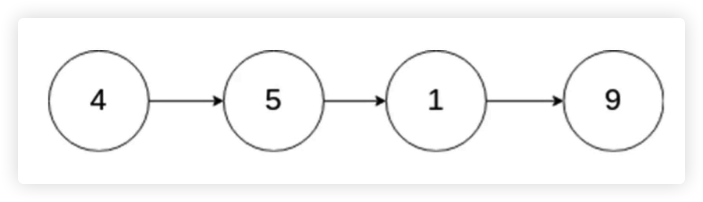
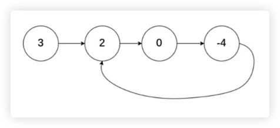

## 链表是什么？

- 多个元素组成的列表
- 元素存储不连续，用 next 指针连在一起
- JavaScript 中没有链表，可以用 `Object` 模拟链表


> 列表为何设计的如此复杂？数组 VS 链表

- **数组**：增删非首尾元素时，往往需要移动元素 ( 中间增时，后面的元素需要后移。中间删时，后面的元素需要前移 )
- **链表**：增删非首尾元素时，不需要移动元素，只需要更改 next 的指向即可。

<br/>
<br/>
<br/>

## Coding Part

```javascript
const a = { val: 'a' }
const b = { val: 'b' }
const c = { val: 'c' }
const d = { val: 'd' }

a.next = b
b.next = c
c.next = d


// 1、遍历列表
let p = a // 声明一个指针，指向 a

while (p) { // p 还有值时，不断移动到下一个 next
  console.log(p.val);
  p = p.next
}


// 2、插入值：在 c 和 e 之间
const e = { val: 'e' }
c.next = e
e.next = d


// 3、删除
c.next = d
```

<br/>
<br/>
<br/>

## 例子

> [删除链表中的节点](https://leetcode-cn.com/problems/delete-node-in-a-linked-list/)



**思路**

- 无法直接获取被删除节点的上个节点，就将被删除节点转移到下个节点

**步骤**

- 将被删除节点的值改为下个节点的值。
- 删除下个节点。

```javascript
/**
 * @param {ListNode} node
 * @return {void} Do not return anything, modify node in-place instead.
 *
 *  时间复杂度：O(1) 没有任何循环
 *  空间复杂度：O(1) 这个 function 中没有任何数组或许矩阵
 */
var deleteNode = function (node) {
  node.val = node.next.val     // 将下个值复制过来
  node.next = node.next.next   // 将下个next指向复制过来
};
```

<br/>
<br/>

> [反转链表](https://leetcode-cn.com/problems/reverse-linked-list/)

**思路**

- 先看，如何反转两个节点，将 n+1 的 next 指向 next
  - ```javascript
    // 输入：... -> n -> n+1 -> ...
    // 输出：... -> n+1 -> n -> ...
    ```

- 然后，重复上述操作。反转多个节点，利用双指针遍历链表
  - ```javascript
    // 输入：1 -> 2 -> 3 -> 4 -> 5 -> NULL
    // 输出：Null -> 5 -> 4 -> 3 -> 2 -> 1
    ```

**步骤**

- 双指针一前一后遍历链表

- 反转双指针


```javascript
/**
 * Definition for singly-linked list.
 * function ListNode(val, next) {
 *     this.val = (val===undefined ? 0 : val)
 *     this.next = (next===undefined ? null : next)
 * }
 */

const a = { val: '1' }
const b = { val: '2' }
const c = { val: '3' }
const d = { val: '4' }
const e = { val: '5' }

a.next = b
b.next = c
c.next = d
d.next = e

/**
 * @param {ListNode} head
 * @return {ListNode}
 *
 *  时间复杂度：O(n) while 循环体
 *  空间复杂度：O(1) 变量是单个值，没有数组，没有矩阵
 */
const reverseList = function (head) {
  let p1 = head; // 指向表的表头
  let p2 = null; // 指向表头的前面 -1

  while (p1) {
    // 1、暂存
    const tmp = p1.next;

    // 2、然后反转两个链表，把后面链表中的 next 指针往前指
    p1.next = p2;

    // 3、两个指针 都往前移动一位
    p2 = p1;
    p1 = tmp
  }

  return p2;
};

let rObj = reverseList(a)

while (rObj) {
  console.log(rObj.val);
  rObj = rObj.next;
}
```

<br/>
<br/>

> [两数相加](https://leetcode-cn.com/problems/add-two-numbers/)

**步骤**

- 新建一个空链表

- 遍历被相加的两个链表，模拟相加操作，将**个位数**追加到新链表上，将十位数留到下一位去相加。

```javascript
// 输入：( 2 -> 4 -> 3 ) + ( 5 -> 6 -> 4 )
// 输出：7 -> 0 -> 8
// 原因：342 + 465 = 807
```

```javascript
/**
 * Definition for singly-linked list.
 */
function ListNode(val, next) {
  this.val = (val === undefined ? 0 : val)
  this.next = (next === undefined ? null : next)
}

/**
 * @param {ListNode} l1
 * @param {ListNode} l2
 * @return {ListNode}
 *
 *  时间复杂度：O(n) 有个 while 循环体，n 就是两个链表长度的较大的值
 *  空间复杂度：O(n) 虽然没有数组，没有矩阵，但是创建了一个新的链表 n。
 *                   - 这个链表可能是两个链表中长度较长的。
 *                   - 也有可能是较长的链表在加上一位 ( 进一的情况 )，但是它不可能再有一个线性的增长，最多多出一位。
 */
var addTwoNumbers = function (l1, l2) {
  const l3 = new ListNode() // 创建新链表，来记录相加的值

  let p1 = l1; // 指针
  let p2 = l2; // 指针
  let p3 = l3; // 相加结果的指针

  let carry = 0; // 上次相加，是否产生了十位数，是否需要进一

  while (p1 || p2) {
    const v1 = p1 ? p1.val : 0;
    const v2 = p2 ? p2.val : 0;
    const val = v1 + v2 + carry;

    carry = Math.floor(val / 10) // 相加结果是否需要进一，需要放到下一次循环的相加中
    p3.next = new ListNode(val % 10) // 相加结果的个位数，放入创建的新链表中，然后将相加的指针指向这个 new ListNode(val % 10)

    // 指针往后移
    if (p1) p1 = p1.next;
    if (p2) p2 = p2.next;
    p3 = p3.next
  }

  if (carry) p3.next = new ListNode(carry) // 最后结束，是否需要进一

  return l3.next; // 因为链表创建时，默认值是 0，需要跳过它
};
```

<br/>
<br/>

> [删除排序链表中的重复元素](https://leetcode-cn.com/problems/remove-duplicates-from-sorted-list/)

**思路**

- 因为链表是有序的，所以重复元素一定相邻
- 遍历链表，如果发现当前元素和下个元素值相同，就删除下个元素值

**步骤**

- 遍历链表，如果发现当前元素和下个元素值相同，就删除下个元素值
- 遍历结束后，返回原链表的头部

```javascript
/**
 * Definition for singly-linked list.
 * function ListNode(val, next) {
 *     this.val = (val===undefined ? 0 : val)
 *     this.next = (next===undefined ? null : next)
 * }
 */
/**
 * @param {ListNode} head
 * @return {ListNode}
 *
 *  时间复杂度：O(n) 有个 while 循环体，n 就是链表长度
 *  空间复杂度：O(1) 没有数组、矩阵、链表。
 */
var deleteDuplicates = function (head) {
  let p = head;

  while (p && p.next) {
    if (p.val === p.next.val) { // 相同，就删除
      p.next = p.next.next
    } else { // 不相同，往后移动
      p = p.next
    }
  }

  return head
};
```

<br/>
<br/>

> [环形链表](https://leetcode-cn.com/problems/linked-list-cycle/)



**思路**

- 两个人在圆形操场上的起点同时起跑，速度快的人一定会超过速度慢的人一圈
- 用一快一慢两个指针遍历链表，如果指针能够相逢，那么链表就有圈

**步骤**

- 用一快一慢两个指针遍历链表，如果指针能够相逢，就返回 true
- 遍历结束后，还没有相逢就返回 false

```javascript
/**
 * Definition for singly-linked list.
 * function ListNode(val) {
 *     this.val = val;
 *     this.next = null;
 * }
 */

/**
 * @param {ListNode} head
 * @return {boolean}
 *
 *
 *  时间复杂度：O(n) 有个 while 循环体，n 有可能跑很多圈，1n 2n 3n 都是一个量级的 ( On )，只要不是 n^2 n^3
 *  空间复杂度：O(1) 没有数组、矩阵、链表。
 */
var hasCycle = function (head) {
  let p1 = head;
  let p2 = head;

  while (p1 && p2 && p2.next) {
    p1 = p1.next;
    p2 = p2.next.next;

    if (p1 === p2) {
      return true;
    }
  }

  return false
};
```

<br/>
<br/>
<br/>

## 前端与链表：JS 中的原型链

> 原型链简介

- 原型链的本质是链表
- 原型链上的节点是各种原型对象，比如
  - `Function.prototype`、`Object.prototype`、......
- 原型链通过 `__proto__` 属性链接各种原型对象

<br/>

> 原型链长啥样？

`->` = `__proto__`

- obj -> `Object.prototype` -> `null`
- func -> `Function.prototype` -> `Object.prototype` -> `null`
- arr -> `Array.prototype` -> `Object.prototype` -> `null`

<br/>

> 原型链知识点

- 如果 A 沿着原型链能找到 `B.prototype`，那么 `A instanceof B` 为 `true`。
- 如果在 A 对象上没有找到 x 属性，那么会沿着原型链找 x 属性。

<br/>

> instanceof 的原理，并用代码实现。

- 知识点：如果 A 沿着原型链能找到 `B.prototype`，那么 `A instanceof B` 为 `true`。
- 解法：遍历 A 的原型链，如果找到 `B.prototype`，返回 `true`，否则返回 `false`。

```javascript
const instanceOf = (A, B) => {
  let p = A

  while (p) {
    if (p === B.prototype) {
      return true
    }
    p = p.__proto__;
  }

  return false
}

instanceOf([], Array)
```

<br/>

> 使用链表指针获取 JSON 的节点

```javascript
const json = {
  a: { b: { c: 1 } },
  d: { e: 2 }
}

const path = ['a', 'b', 'c']

let p = json
path.forEach(k => {
  p = p[k]
})

console.log(p);
```

<br/>

- JS 中的原型链也是一个链表
- 使用链表指针可以获取 JSON 的节点值

