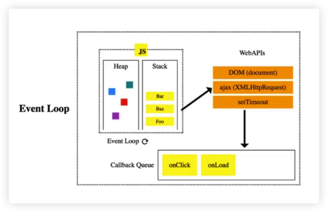

## 队列是什么？

- 一个先进先出的数据结构
- JavaScript 中没有队列，但可以用 `Array` 实现队列的所有功能
- 队列常用操作：push、shift、queue[0]


<br/>
<br/>
<br/>

## 队列的应用场景

- 需要 **先进先出** 的场景
- 比如：食堂排队打饭、JS 异步中的任务队列，计算最近请求次数。

<br/>

> 场景二：JS 异步中的任务队列

- JS 是单线程，无法同时处理异步中的并发任务
- 使用任务队列先后处理异步任务



<br/>
<br/>
<br/>

## 例子

> [最近的请求次数](https://leetcode-cn.com/problems/number-of-recent-calls/)

- 有新请求就入队，3000ms 前发出的请求出队。
- 队列的长度就是最近请求次数。

```javascript
/*
 * 输入：inputs = [[], [1], [100], [3001], [3002]]
 * 输出：[null, 1, 2, 3, 3]
 *
 *  时间复杂度：O(n) - 有一个 while, n 就是用于踢出老请求的函数 this.q.shift()
 *  空间复杂度：O(n) - 有一个 array, n 就是队列的长度，就是最近的请求次数
 * */

var RecentCounter = function () {
  this.q = []
};

/**
 * @param {number} t
 * @return {number}
 */
RecentCounter.prototype.ping = function (t) {
  this.q.push(t)                 // 每次请求入队
  while (this.q[0] < t - 3000) { // 对头是否小于 t - 3000，踢出
    this.q.shift()
  }
  return this.q.length           // 返回长度
};

/**
 * Your RecentCounter object will be instantiated and called as such:
 * var obj = new RecentCounter()
 * var param_1 = obj.ping(t)
 */
```


