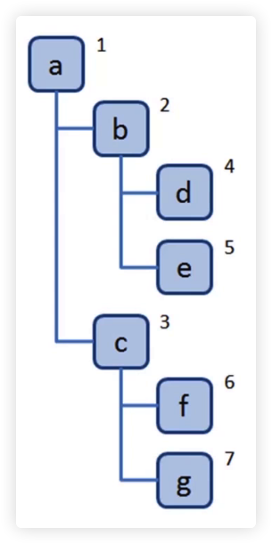
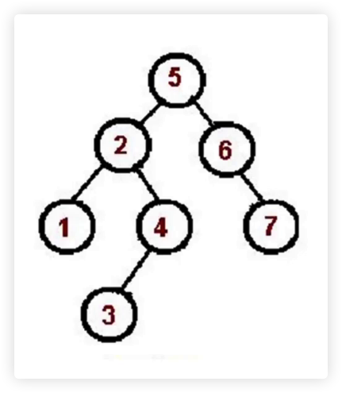

## 树是什么？

- 一种分层数据的抽象模型
- 前端工作中常见的数包括：DOM 数、级联选择、树形控件、......
- JS 中没有树，但是可以用 Object 和 Array 构建树
- 树的常用操作：深度/广度优先遍历、先中后序遍历

<br/>
<br/>
<br/>

## 什么是深度/广度优先遍历

- **深度优先遍历**：尽可能深的搜索树的分支。

  

- **广度优先遍历**：先访问离根节点最近的节点。

  

<br/>
<br/>
<br/>

## 深度优先遍历算法

- 访问根节点
- 对根节点的 children 挨个进行深度优先遍历

```javascript
const tree = {
  val: 'a',
  children: [
    {
      val: 'b',
      children: [
        { val: 'd', children: [] },
        { val: 'e', children: [] }
      ]
    },
    {
      val: 'c',
      children: [
        { val: 'f', children: [] },
        { val: 'g', children: [] }
      ]
    }
  ]
}

const dfs = root => {
  console.log(root.val);
  root.children.forEach(dfs)
}

dfs(tree)
```

<br/>
<br/>
<br/>

## 广度优先遍历算法

- 新建一个队列，把根节点入队
- 把对头出队并访问
- 把对头的 children 挨个入队
- 重复第二、三步，直到队列为空

```javascript
const tree = {
  val: 'a',
  children: [
    {
      val: 'b',
      children: [
        { val: 'd', children: [] },
        { val: 'e', children: [] }
      ]
    },
    {
      val: 'c',
      children: [
        { val: 'f', children: [] },
        { val: 'g', children: [] }
      ]
    }
  ]
}

const bfs = root => {
  const queue = [root]

  while (queue.length > 0) {
    const n = queue.shift()
    console.log(n.val);
    n.children.forEach(child => {
      queue.push(child)
    })
  }
}

bfs(tree)
```

<br/>
<br/>
<br/>

## 二叉树是什么？

树也有多种，前面讲的是多叉树

- 树中每个节点最多只能有两个子节点
- 在 JS 中通常用 Object 来模拟二叉树

<br/>
<br/>
<br/>

## 二叉树的先中后序遍历


简单来说，对于上图正常的一个满节点

- **前序遍历**：A：根节点、B：左节点、C：右节点（根节点排最先，然后同级先左后右）
- **中序遍历**：B：左节点、A：根节点、C：右节点（先左后根最后右）
- **后序遍历**：B：左节点、C：右节点、A：根节点（先左后右最后根）

<br/>
<br/>
<br/>

## 先序遍历

- 访问 **根** 节点
- 对根节点的 **左** 子树进行先序遍历
- 对根节点的 **右** 子树进行先序遍历


```javascript
const bt = {
  val: 1,
  left: {
    val: 2,
    left: { val: 4, left: null, right: null },
    right: { val: 5, left: null, right: null },
  },
  right: {
    val: 3,
    left: { val: 6, left: null, right: null },
    right: { val: 7, left: null, right: null },
  },
}

const preorder = (root) => {
  if (!root) return

  console.log(root.val);

  preorder(root.left)
  preorder(root.right)
}

preorder(bt)
```

<br/>
<br/>
<br/>

## 中序遍历

- 对根节点的 **左** 子树进行中序遍历
- 访问 **根** 节点
- 对根节点的 **右** 子树进行中序遍历



```javascript
const bt = {
  val: 1,
  left: {
    val: 2,
    left: { val: 4, left: null, right: null },
    right: { val: 5, left: null, right: null },
  },
  right: {
    val: 3,
    left: { val: 6, left: null, right: null },
    right: { val: 7, left: null, right: null },
  },
}

const inorder = (root) => {
  if (!root) return

  inorder(root.left)
  console.log(root.val);
  inorder(root.right)
}

inorder(bt)
```

<br/>
<br/>
<br/>

## 后序遍历

- 对根节点的 **左** 子树进行后序遍历
- 对根节点的 **右** 子树进行后序遍历
- 访问 **根** 节点


```javascript
const bt = {
  val: 1,
  left: {
    val: 2,
    left: { val: 4, left: null, right: null },
    right: { val: 5, left: null, right: null },
  },
  right: {
    val: 3,
    left: { val: 6, left: null, right: null },
    right: { val: 7, left: null, right: null },
  },
}

const postorder = (root) => {
  if (!root) return

  postorder(root.left)
  postorder(root.right)
  console.log(root.val);
}

postorder(bt)
```

<br/>
<br/>
<br/>

## 二叉树的先中后序遍历（非递归版）

## 先序遍历
```javascript
const bt = {
  val: 1,
  left: {
    val: 2,
    left: { val: 4, left: null, right: null },
    right: { val: 5, left: null, right: null },
  },
  right: {
    val: 3,
    left: { val: 6, left: null, right: null },
    right: { val: 7, left: null, right: null },
  },
}

const preorder = (root) => {
  if (!root) return

  const stack = [root]

  while (stack.length) {
    const n = stack.pop()

    console.log(n.val);

    if (n.right) stack.push(n.right)
    if (n.left) stack.push(n.left)
  }
}

preorder(bt)
```

<br/>
<br/>
<br/>

## 中序遍历

```javascript
const bt = {
  val: 1,
  left: {
    val: 2,
    left: { val: 4, left: null, right: null },
    right: { val: 5, left: null, right: null },
  },
  right: {
    val: 3,
    left: { val: 6, left: null, right: null },
    right: { val: 7, left: null, right: null },
  },
}

const inorder = (root) => {
  if (!root) return

  const stack = []
  let p = root

  while (stack.length || p) {
    while (p) {
      stack.push(p) // 把的所有左节点推入栈中
      p = p.left
    }

    const n = stack.pop()
    console.log(n.val);
    p = n.right
  }
}

inorder(bt)
```

<br/>
<br/>
<br/>

## 后序遍历

```javascript
const bt = {
  val: 1,
  left: {
    val: 2,
    left: { val: 4, left: null, right: null },
    right: { val: 5, left: null, right: null },
  },
  right: {
    val: 3,
    left: { val: 6, left: null, right: null },
    right: { val: 7, left: null, right: null },
  },
}

const postorder = (root) => {
  if (!root) return

  const stack = [root]
  const outputStack = []

  while (stack.length) {
    const n = stack.pop()
    outputStack.push(n)
    if (n.left) stack.push(n.left)
    if (n.right) stack.push(n.right)
  }

  while (outputStack.length) {
    const n = outputStack.pop()
    console.log(n.val);
  }
}

postorder(bt)
```

<br/>
<br/>
<br/>


