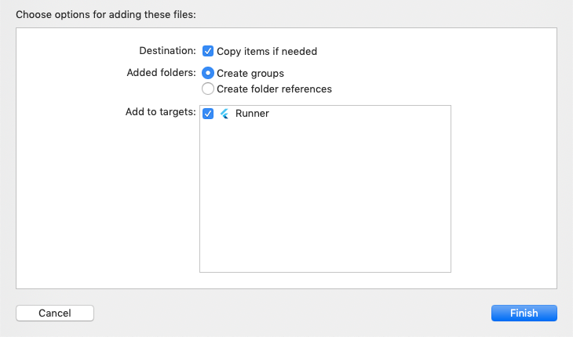
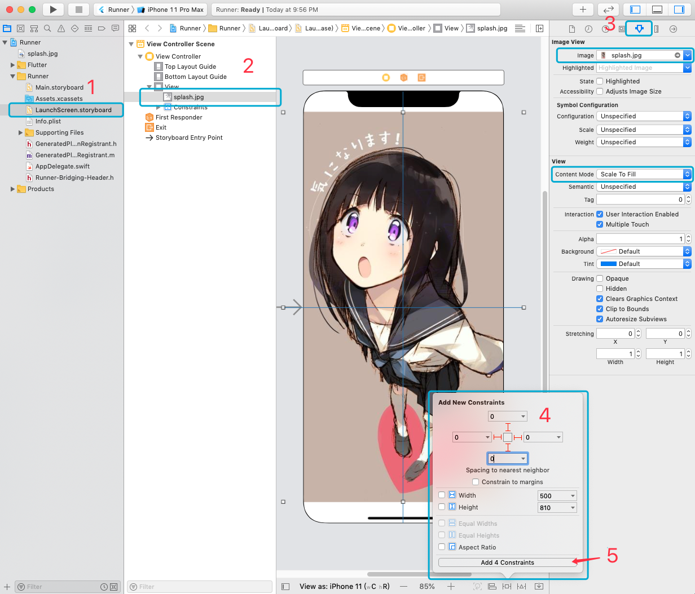

设置启动屏

<br/>

### `Android` 端

**1、** 进入 `项目根目录 -> android -> app -> src -> main -> res` 目录，找到以 `mipmap-` 开头的文件，将对应分辨率的图片放入对应的文件夹中。

**2、** 进入 `项目根目录 -> android -> app -> src -> main -> res -> drawable`目录，打开 `launch_background.xml` 文件,如下

```xml
<?xml version="1.0" encoding="utf-8"?>
<layer-list xmlns:android="http://schemas.android.com/apk/res/android">
    <item android:drawable="@android:color/white" />

   <!-- 添加 -->
   <item>
        <bitmap
            android:gravity="fill"
            android:mipMap="true"
            android:src="@mipmap/splash"/>
    </item>
</layer-list>

```

<br/>
<br/>
<br/>

### `IOS` 端

**1、** 使用 xcode 打开 `项目根目录 -> ios` 目录中的 `Runner.xcworkspace` 文件

**2、** 将图片拖进 xcode 打开的根目录后，会弹下图所示。



**3、** 如下图

- 1. 在左侧菜单中找到 `Runner -> Runner` 中的 `LaunchScreen.storyboard` 文件打开。

- 2. 打开 `View Controller Scene -> View Controller -> View` 中打开 `LaunchImage`。

- 3. 点击右上角的 `'箭头'`

  - `Image View -> Image` 中设置为刚才拖进来的图片

  - `View -> Content Mode` 中设置为 `Scale To Fill`

- 4、将四个方向的值设置为 0

- 5、点击 `Add Constraints`


