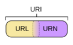

## 一、 HTTP协议特点

- http 协议，支持客户/服务器模式（是由客户端向服务器发出请求，服务器端响应请求，并进行相应服务）。

- 简单快速
    - 客户向服务器请求服务时，只需传送请求方法和路径。
    - 请求方法常用的有 GET、POST、...。每种方法规定了客户与服务器联系的类型不同。
    - 由于 HTTP 协议简单，使得 HTTP 服务器的程序规模小，因而通信速度很快。

- 灵活
    - HTTP 允许传输任意类型的数据对象。
    - 正在传输的类型由 Content-Type (是 HTTP 包中用来表示内容类型的标识) 加以标记。

- 无连接
    - 无连接的含义是限制每次连接只处理一个请求。
    - 服务器处理完客户的请求，并收到客户的应答后，即断开连接。
    - 采用这种方式可以节省传输时间。

    ```为什么当初这么设计呢？ 由于 HTTP 协议产生于互联网，因此服务器需要处理来自全世界的网页客户端访问，但是每个客户端（浏览器）与服务器之间交换数据的间隙性特别特别大，也就是说我们传输这个东西，它是由突发性，瞬时性的，并且网页浏览器的联想性、发散性导致两次、多次的传送的数据关联性很低很低，大部分的通道其实都是很空闲的，也就无端的占用资源。HTTP 的设计者就将协议设计为请求的时候连接，请求完就释放掉连接，以尽快的将资源释放出来，服务于其他客户端。```

- 无状态
    - HTTP 协议是无状态协议
    - 无状态是指协议对于事务处理没有记忆能力。缺少状态意味着如果后续处理需要前面信息，则它必须重传，这样可能导致每次连接传送的数据量增大。
    - 另一方面，在服务器不需要先前信息时，它的应答就较快。

<br/>
<br/>
<br/>

## 二、 详解URL与URI的区别与联系

Q: 我们输入在浏览器里的Web地址应该叫 URL 还是 URI ？

- URI: 一个紧凑的字符串用来标示抽象或者物理资源
- A URI 可以进一步被分为定位符、名字或者两者都是
- 术语 "Uniform Resource Locator" (URL) 是 URI 的子集，除了确定一个资源，还提供一种定位该资源的主要访问机制（如其网络"位置"）

<br/>
<br/>
<br/>




- URI 可以分为 URL，URN 或同时具备 locators 和 names 特性的一个东西。

- URN 作用就好像一个人的名字，URL 就像一个人的地址。

- 换句话说：URN 确定了东西的身份，URL提供了找到它的方式。

<br/>
<br/>
<br/>

- URL 是 URI 的一种，但不是所有的 URI 都是 URL。
- URI 和 URL 最大的差别就是“访问机制”。
- URN 是唯一标识的一部分，是身份信息。

<br/>
<br/>
<br/>

## 三、 HTTP报文结构分析

- 请求报文

    - HTTP 报文头
        - HTTP 的报文头大体可以分为四类，分别是：（通用报文头、请求报文头、响应报文头和实体报文头）。
        - HTTP/1.1 里一共规范了 47 中报文头字段。

        - 通用报文头

        首部字段名 | 说明
        ---- | ---
        Cache-Control | 控制缓存的行为
        Connection |  逐跳首部、连接的管理
        Date |  创建报文的日期时间
        Pargma |  报文指令
        Trailer |  报文末端的首部一览
        Transfer-Encoding |  指定报文主体的传输编码方式
        Upgrade |  升级为其他协议
        Via |  代理服务器的相关信息
        Warning |  错误通知

        - 请求报文头

         首部字段名 | 说明
         ---- | ---
         Accept | 用户代理可处理的媒体类型
         Accept-Charset | 优先的字符集
         Accept-Encoding | 优先的内容编码
         Accept-Language | 优先的语言（自然语言）
         Authorization | Web 认证信息
         Expect | 期待服务器的特定行为
         From | 用户的电子邮箱地址
         Host | 请求资源所在服务器
         If-Match | 比较实体标记（ETag）
         If-Modified-Since | 比较资源的更新时间
         If-None-Match | 比较实体标记（与 If-Match 相反）
         If-Range | 资源未更新时发送实体 Byte 的范围请求
         If-Unmodified-Since | 比较资源的更新时间（与 If-Modified-Since 相反）
         Max-Forwards | 最大传输逐跳数
         Proxy-Authorization | 代理服务器要求客户端的认证信息
         Range | 实体的字节范围请求
         Referer | 对请求中 URI 的原始获取方
         TE | 传输编码的优先级
         User-Agent | HTTP 客户端程序的信息

        - 响应报文头

         首部字段名 | 说明
         ---- | ---
         Accept-Ranges | 是否接受字节范围请求
         Age | 推算资源创建经过时间
         ETag | 资源的匹配信息
         Location | 令客户端重定向至指定 URI
         Proxy-Authenticate | 代理服务器对客户端的认证信息
         Retry-After | 对再次发起请求的时机要求
         Server | HTTP 服务器的安装信息
         Vary | 代理服务器缓存的管理信息
         WWW-Authenticate | 服务器对客户端的认证信息

        - 实体报文头

         首部字段名 | 说明
         ---- | ---
         Allow | 资源可支持的 HTTP 方法
         Content-Encoding | 实体主体适用的编码方式
         Content-Language | 实体主体的自然语言
         Content-Length | 实体主体的大小（单位：字节）
         Content-MD5 | 实体主体的报文摘要
         Content-Range | 实体主体的位置范围
         Content-Type | 实体主体的媒体类型
         Expires | 实体主体的过期时间
         Last-Modified | 资源最后的修改日期时间

<br/>
<br/>
<br/>


## 四、 HTTP请求方法剖析

- GET
    - Get 方法用来请求访问已被 URI 识别的资源。

- POST
    - 1、Post 方法与 Get 功能类似，一般用来传输实体的主体。
    - 2、在客户端 Get 通过 URL 传递数据， POST 是放在 HTTP 包的 body 中。
    - 3、Get 请求有大小限制，POST 没有大小限制。
    - 4、无论是 Get 和 POST 都可以被拦截到，并没有绝对的安全。

- PUT
    - 1、从客户端向服务端传送的数据取代指定的文档的内容。
    - 2、PUT 方法与 POST 方法最大的不同是： PUT 是幂等的，而 POST 是不幂等的。（简单来说，在创建对象的时候用 POST，在更新对象的时候用 PUT）。
    - 由于，HTTP1.1 的 PUT 方法自身不带有验证机制，存在一定的安全性问题。可以使用 POST 从后端逻辑层达到同样的 PUT 效果。

- HEAD
    - 1、类似于 GET 请求，只不过返回的响应中没有具体的内容，用于获取报文。
    - HEAD 只请求消息的报文头，而不是完整的内容，对于 HEAD 请求的回应部分来说，它的 HTTP 头部信息中，包含的信息与通过 GET 请求得到的信息是相同的，所以通过这个方法就没必要传输整个资源内容，就可以得到我们想要的那个 request uri 所表示的资源信息。
    - 该方法经常用于测试超链接的有效性，是否可以访问、更新（超链接探测工具）。

- DELETE
    - 1、请求服务器删除指定的资源。
    - 2、与 PUT 一样，HTTP1.1 中也没有验证机制。

- OPTIONS
    - 1、用于查询针对请求 URI 指定的资源支持的方法。

- TRACE
    - 1、回显服务器收到的请求，主要用于测试或诊断
    - 客户端可以通过 TRACE 方法查询发送出去的请求是到底怎么样被加工修改，或者说是被篡改，这是因为请求想要连接到原目标服务器的时候，可能会经过代理中转， TRACE 方法就是确认连接过程中，发生的一系列的操作，看看中转的过程，本身该方法不常用，且容易引发一种工具方式（XST : Cross Site Tracing - 跨站追踪）,和 DELETE 一样，如果发现，可以看做一个安全漏洞。

- CONNECT
    - 1、开启一个客户端与所请求资源之间的双向沟通的通道，它可以用来创建隧道
    - 常用于 HTTP 代理，通过代理服务器访问 google，首先浏览器向代理服务器发送 CONNECT 请求，代理服务器返回 HTTP 200 状态码，告诉我们链接建立，之后浏览器和服务器握手，并且交换数据，代理服务器只负责传递相互之间的数据包，并不能读取里面的内容，无论是 HTTP 、HTTPS。

<br/>
<br/>
<br/>

## 五、 HTTP响应状态码拆解

状态码：是用以表示网页服务器超文本传输协议响应状态的三位数字代码。

分类 | 含义
---- | ---
1XX | 表示消息。这一类型的状态码，代表请求已被接受，需要继续处理。这类响应式临时响应，只包含状态行的某些可选的响应头消息，并以空行结束。
2XX | 表示成功。这一类型的状态码，代表请求已成功被服务器接收、理解、并接受。
3XX | 表示重定向。这类状态码代表需要客户端采取进一步的操作才能完成请求。通常、这些状态码用来重定向，后续的请求地址（重定向目标）在本次响应的 Location 域中指明。
4XX | 表示请求错误。这类的状态码代表了客户端看起来可能发生了错误，妨碍了服务器的处理。除非响应的是一个 HEAD 请求，否则服务器就应该返回一个解释当前错误状态的实体，以及这是临时的还是永久性的状况。这些状态码适用于任何请求方法。浏览器应当向用户显示任何包含在此类错误响应中的实体内容。
5XX | 表示服务器错误。这类状态码代表了服务器在处理请求的过程中有错误或者异常状态发生，也有可能是服务器意识到以当前的软硬件资源无法完成对请求的处理。除非这是一个 HEAD 请求，否则服务器应当包含一个解释当前错误状态以及这个状态是临时的还是永久的解释信息实体。浏览器应当向用户展示任何在当前响应中被包含的实体。

<br/>
<br/>
<br/>

常用 HTTP 状态码

状态码 | 状态码英文名称 | 描述
---- | --- | ---
200 | OK | 请求已完成，请求所希望的响应头或数据体将随此响应返回
202 | Accepted | 已接收，已经接受请求，但未处理完成
206 | OK | 部分内容，服务器成功处理了部分 GET 请求（断点续传）
 |  |
301 | Moved Permanently | 永久移动，请求的资源已被永久的移动到新 URI，返回信息会包括新的 URI。今后任何新的请求都应使用新的 URI 代理
302 | Found | 临时移动，与 301 类似。但资源只是临时被移动。客户端应继续使用原有 URI
 |  |
400 | Bad Request | 客户端请求的语法错误，服务器无法理解
401 | Unauthorized | 请求要求用户的身份认证
403 | Forbidden | 服务器理解请求客户端的请求，但是拒绝执行此请求
404 | Not Found | 服务器无法根据客户端的请求找到资源（网页）
 |  |
500 | Internal Serve Error | 服务器内部错误，无法完成请求
502 | Bad Gateway | 充当网关或代理的服务器，从远端服务器接收到了一个无效的请求

<br/>
<br/>
<br/>

## 六、 HTTP状态管理：Cookie与Session

因为 HTTP 是无状态的，无记性，所以就需要状态管理（会话机制），意外着每个请求都是独立的，如果后续处理需要请求需要前面的信息，前面的数据就要重传。这样数据量变多，服务压力大。

<br/>
<br/>
<br/>

Cookie


- Cookie 实际上是一小段的文本信息。客户端请求服务器，如果服务器需要记录该用户状态，就向客户端浏览器颁发一个 Cookie。
- 客户端浏览器会把 Cookie 保存起来。当浏览器再请求该网站时，浏览器把请求的网址连同该 Cookie 一同提交给服务器。服务器检查该 Cookie，以此来辨认用户状态，服务器也可以根据自己的需要修改 Cookie 内容。


<br/>
<br/>
<br/>

Cookie 工作原理


<br/>
<br/>
<br/>

Session


- Session 是另一种记录客户状态的机制，保存在服务器上。客户端浏览器访问服务器的时候，服务器把客户端信息以某种形式记录在服务器上。
- 客户端浏览器再次访问时只需要从该 Session 中查找该客户的状态就可以了。

<br/>
<br/>
<br/>

保存 Session ID 方式

- cookie
- URI 重写
- 隐藏表单


比较 | cookie | session
---- | --- | ---
有效期 | 可以很长，甚至永久 | 由于随着客户量的增大，如果不合理的清除，那么内存将会溢出，一般浏览器，就失效了
存放位置 | 客户端 | 服务端
安全性（隐私策略） | 客户端可以查看，复制、修改 | 存于服务器，不可见
对服务器压力 | 小 | 大


