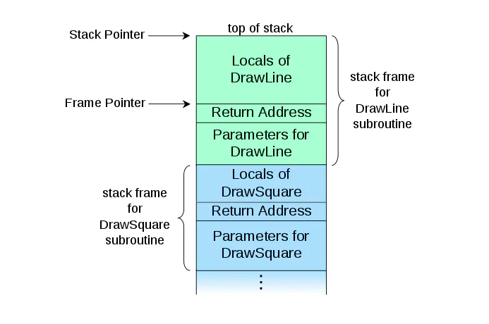
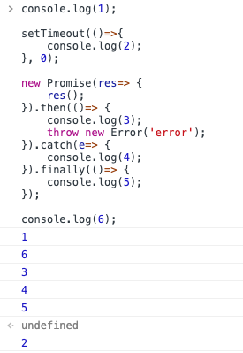
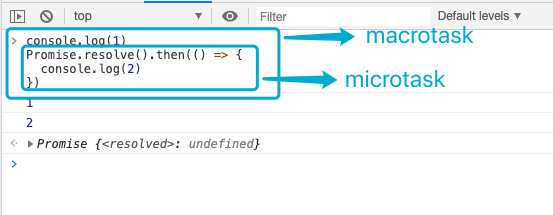
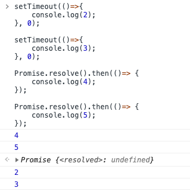
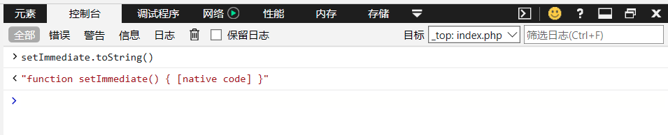
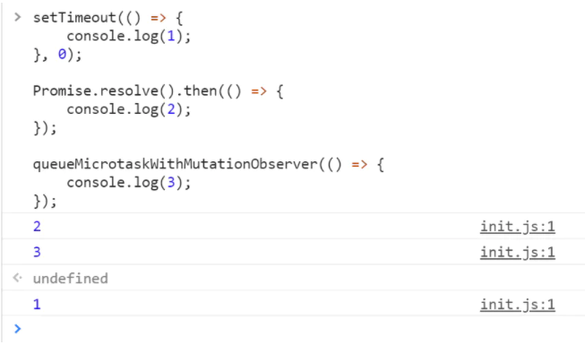
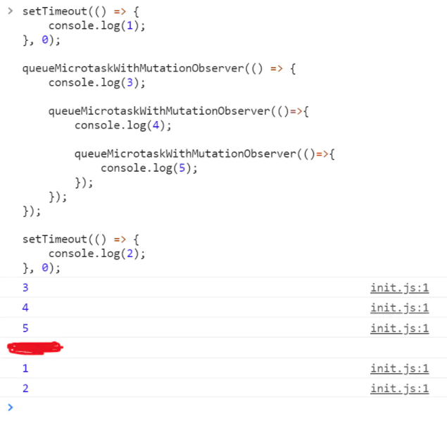

[摘抄至 掘金鲨叔](https://juejin.im/post/5ea7a122e51d454d9c3f774b?utm_source=gold_browser_extension)

> 温馨提示：如无特殊交代，本文所给出的示例代码的执行环境均为浏览器 chrome v81.0.4044.129

<br/>
<br/>
<br/>

## 前言

在这个言必称 `single threaded`，`event loop`，`microtask`，`macrotask` `......` 的 `javascript` 时代，相对深入地去了解这些概念和概念背后实现的运行机制是十分有必要的。

<br/>

2014 年的时候，Philip Roberts 先后在 Scotlan JS 大会和 JSConfEU 大会发表了关于 event loop 的优秀演讲，[演讲地址](https://www.youtube.com/watch?v=8aGhZQkoFbQ&feature=youtu.be)。

<br/>

[JavaScript 运行机制详解：再谈 Event Loop](http://www.ruanyifeng.com/blog/2014/10/event-loop.html)

<br/>

随着 mutiple-processor 计算机普及和前端作业越来越繁杂，javascript 的并发编程越来越被重视。而[javascript 的并发模型是基于 event loop 机制的](https://developer.mozilla.org/en-US/docs/Web/JavaScript/EventLoop)。所以，理解好 event loop 的实现机制能够帮助我们在并发编程的大背景下，更好地优化和架构我们的代码。

<br/>
<br/>
<br/>

## 正文

术语

需要反复强调的是，概念是人类有效沟通交流的基础，更确切地说，将同一个（概念）“名”理解为同一个“实”，即概念理解的一致性是人类有效沟通交流的基础。概念落实到某个相关领域就称之为“术语”。鉴于无论是官方文档还是业内技术文章在使用术语的不一致性，我们有必要梳理一下阐述 event loop 过程中所涉及的术语，如下：

<br/>
<br/>
<br/>

## task

在 MDN 的诸多阐述 event loop 相关的文档中，都使用了这个术语。在[这篇文档](https://developer.mozilla.org/en-US/docs/Web/API/HTML_DOM_API/Microtask_guide)中，task 的定义是这么下的：

> A task is any JavaScript code which is scheduled to be run by the standard mechanisms such as initially starting to run a program, an event callback being run, or an interval or timeout being fired.

这篇文档中说到：

> The tasks form a queue, so-called “macrotask queue” (v8 term)

可以看到，我们天天一口一个的 `macrotask`，比如：`setTimeout/setInterval` 等等的 `callback` 就是一个 `“task”`。

<br/>
<br/>
<br/>

## task queue

`task` 会被推入到一个队列当中，等待调度。这个队列就是 `task queue`。在 Philip Roberts 的演讲中，他提到了一个叫 `“callback queue”` 的术语，同时他也提到了，它就是 `“task queue”` 的别名。

<br/>
<br/>
<br/>

## macrotask

macrotask === task，这里就不赘述了。

<br/>
<br/>
<br/>

## macrotask queue

macrotask queue === task queue === callback queue，这里也不赘述了。

<br/>
<br/>
<br/>

## messsage

[这篇 MDN 文档](https://developer.mozilla.org/en-US/docs/Web/JavaScript/EventLoop)，通篇下来都在用 `“message”` 这个术语，可以看得出，`这个message` 跟它对应的 `callback` 一起，两者可以统一称之为 `“task”`。那么里面所说的 `“message queue”` 就是 `“task queue”`。

<br/>
<br/>
<br/>

## microtask

> A microtask is a short function which is executed after the function or program which created it exits and only if the JavaScript execution stack is empty, but before returning control to the event loop being used by the user agent to drive the script's execution environment.

简单理解就是，`microtask` 是一个“小”函数（正好呼应了它的名字：`micro`）。这个函数仅在 `JavaScript` 执行栈为空，并且创建它的函数或程序退出后才会执行。但是，它会在将控制权返回给用户代理之前执行。“**控制权返回给用户代理之前**” 是什么意思呢，其实就是 “**下一个 event loop 之前**” 的意思。

<br/>
<br/>
<br/>

## microtask queue

跟 `macrotask queue` 一样，`microtask queue` 也是用于存放 `microtask` 的队列。

<br/>
<br/>
<br/>

## job

在 jake archibald 的[这篇技术文章](https://jakearchibald.com/2015/tasks-microtasks-queues-and-schedules/)中，他指出了 “job” 的概念来自于 ECMAScript 规范，它与 “microtask” 几乎等同，但是不完全等同。业界对两者区别的阐述一直处于含糊不清的状态。鉴于整篇文章下来，在他的阐述中，他已经把 “job” 等同于 “microtask” 了。所以，我也倾向于采用这种理解。

而另外一位同行 Daniel Chang 在他的技术文章 [Microtasks & Macrotasks — More On The Event Loop](https://abc.danch.me/microtasks-macrotasks-more-on-the-event-loop-881557d7af6f) 也秉持着同样的看法：

> In this write up I’ve been using the term task interchangeably between macrotask and microtask, much of the documentation out there refers to macrotasks as tasks and microtasks as job. Knowing this will make understanding documentation easier.

<br/>
<br/>
<br/>

## call stack/execution context stack

首先，我们先去维基百科上面看看有关于 call stack 的定义。

> 在计算机科学中，call stack 是一种存储计算机程序当前正在执行的子程序（subroutine）信息的栈结构......使用 call stack 的主要原因是保存一个用于追踪【当前子程序执行完毕后，程序控制权应该归还给谁】的指针.....一个 call stack 是由多个 stack frame 组成。每个 stack frame 对应于一个子程序调用。作为 stack frame，这个子程序此时应该还没有被 return 语句所终结。举个例子，我们有一个叫 DrawLine 的子程序正在运行。这个子程序又被另外一个叫做 DrawSquare 的子程序所调用，那么 call stack 中顶部的布局应该长成下面那样：



结合维基百科给出的定义和 Philip Roberts 的演讲，我们再来看看 MDN 的诸多文档通篇下来使用的 `“execution context stack”` 这个概念。顾名思义， `“execution context stack”` 当然是由 `“execution context”` 组成的，那 `“execution context”` 又是什么？不难理解，`“execution context”` 就是维基百科给出示意图中 `stack frame` 里面的 `“Locals of xxx”`，即函数执行所需要用到的上下文环境。
最后，我们可以看出，`“execution context stack”` 其实就是 `“call stack”` 的子集。因为在 `event loop` 语境下，我们不关心 `stack frame` 里面的其他 “成分”： `“parametres for xxx”` 和 `“return address”`。所以，两者可以等同起来理解。

<br/>
<br/>
<br/>

**小结**

有鉴于业内技术文章对这些术语的使用频率，在本文的阐述中，相比于 `“task”`，我会采用 `“macrotask”` 的叫法；相比于 `“job”`，我会采用 `“microtask”` 的叫法；相比于 `“execution context stack”`，我会采用 `“call stack”` 的叫法。

<br/>
<br/>
<br/>

## 什么是 event loop?

从广义上来说，event loop 就是一种【user agents 用于协调各种事件，用户交互，脚本执行，网络活动等执行时机的】调度机制。

实现 event loop 的 user agent 有好多个。比如说：

- window

- worker

  - dedicated worker

  - shared worker

  - service worker

- worklet

- nodejs

<br/>
<br/>

实现 event loop 的**通用算法**（注意，这是简单的，通用的算法）大概是这样的：

- 1、时刻监视 task queue, 当 task queue 不为空的时候:

  - 执行队列中入队时间最久的那个 task

- 2、休眠。直到等到有可执行的 task 出现，跳回 1。

<br/>

用代码来简单表示就是：

```javascript
while (queue.waitForTask()) {
  queue.processNextTask();
}
```

作为单线程的 javascript 就是通过 event loop 来实现了它的异步编程特性。

<br/>
<br/>
<br/>

## 浏览器中的 event loop

> 我这里为了通俗易懂，使用了 “浏览器中的 event loop” 这种描述方式。在后面，如何特殊交代，它都是特指 [规范文档](http://localhost:8080/notebook/javascript/other/event_loop/#%E6%B5%8F%E8%A7%88%E5%99%A8%E4%B8%AD%E7%9A%84-event-loop) 里面的 “window event loop”。

上面指出，我们将会统一使用 `“call stack”`，`“microtask”` 和 `“macrotask”` 等术语来阐述 `event loop`。

<br/>
<br/>
<br/>

## macrotask、microtask 的种类

在浏览器这个上下文中

<br/>

**macrotask 有以下的种类：**

- 当外部或内部 `<script>` 标签所对应的脚本加载完成之后，执行这些脚本就是一个 macrotask。

- 当用户点击页面上的按钮，那么分发 `click` 事件后的对 `handler` 的执行就是一个 macrotask。

- 调用 `setTimeout` 或者 `setInterval` 时传入的 `callback` 的执行，就是一个 macrotask。

- 非标准全局方法 `setImmediate()` 调用时传入的 `callback` 的执行，就是一个 macrotask。

- `requestAnimationFrame` 调用时传入的 `callback` 的执行，就是一个 macrotask。

- .......

<br/>

**microtask 的种类有以下几种：**

- 在 `promise` 对象调用 `then/catch/finally` 的时候传入的 `callback` 的执行，就是一个 microtask。

- 显式地调用 `queueMicrotask(fn)` 来入队一个 `microtask` 时候，那么对这个 `fn` 函数的执行就是一个 microtask。

- `new MutationObserver()` 传入 `callback` 的执行就是一个 microtask。

- `Object.observe()` 传入 `callback` 的执行就是一个 microtask。

<br/>
<br/>
<br/>

### 处理模型图

以 Chrome 浏览器为例，event loop 的处理模型图大概是下面这样：


上图中，需要事先交代两点：

- ( 1 )，( 2 )，( 3 ) 表示的是 “一次 loop 中，不同类型队列被检查是否为空的顺序;

- render callback queue 可能无法对应到具体的实现，但是从心智模型的角度来说，引入它，有助于推演 event loop。

<br/>

**下面我们解释一下这个处理模型图。**

1. 当浏览器遇到一个有代码的 `<script>` 标签的时候，那么浏览器就进入了一个以`（window）event loop` 为驱动的执行流中。`外部 <script>` 与 `内部 <script>` 不同的一点是多了网络加载过程，不管怎样，我们的执行流从代码可执行的那一刻开始讲起。首先，浏览器会把整段脚本的执行当作像 `C语言` 里面的 `"main" 函数` 去执行。这个时候，`"main" 函数` 推入到 `call stack`，成为了第一个 `call frame`。`"main" 函数` 的执行就是从上到到下，遇到同步代码的调用，就往 `call stack` 增加一个 `call frame`，遇到异步代码，就把它交给 `web API` 来处理。一方面，同步代码调用完成后（ 比如说遇到 `return语句` ），它所对应的 `call frame` 就会从 `call stack` 中 `pop` 走，以此类推，直到 `call stack` 为空，程序就把控制权交回给 `event loop`。另一方面，到了相关的时间点，`web API` 就会把一个 `callback` 封装成一个 `task`，把它推入到它所属的队列中。比如，从上到下执行 `"main" 函数` 的时候，遇到了以下代码：

<br/>

```javascript
setTimeout(() => {
  console.log("time out");
});
```

<br/>

那么浏览器就会把这个 `setTimeout` 调用交给 `web API`，然后把它从 `call stack` 中 `pop` 出来。`web API` 接收到个 `setTimeout` 调用后，它会在自己的线程里面启动一个定时器，因为在这段代码里面，没有传递 `time out` 时间，那么就是默认的 0。接着，`web API` 没有丝毫犹豫，它就把 `setTimeout` 的 `callback` 推入到它所属的 `macrotask queue` 里面。假如是遇到在 `promise` 对象身上调用`then/catch/finally` 方法，那么它们的 `callback` 最终会被 web API 推入到 `microtask queue` 中；假如遇到的是界面更新的 DOM 操作，那么这些 DOM 操作就会被封装成一个 `render callback`，推入到 `render callback queue` 中。这些 `callback` 经过封装后成为一个 `task`，静静地躺在各自的队列中，等待调度。等待谁的调度呢？当然是等待 `event loop` 的调度。

<br/>
<br/>
<br/>

2. `event loop` 负责监视 `call stack`，一旦 `call stack` 处于清空状态，那么它首先会去看看 `microtask queue` 是否有 `task`。有的话，它就取出队列中入队时间最长的 `task`。

> 注意，从标准规范的角度来看，“取出队列中入队时间最长的 task” 这种表述是不正确的，详见 [规范文档](https://html.spec.whatwg.org/multipage/webappapis.html#task-queue)。但是至于在 V8 的内部，具体实现是如何的呢，目前就不得而知了。为了易于理解和帮助推演，本文姑且采用这种表述方式。

然后把它推入到 `call stack` 去执行。跟 `macrotask queue` 和 `render callback queue` 不同的，一旦第一个 `microtask` 在 `call stack` 执行完之后，第二个 `microtask` 就会紧跟着推入到 `call stack` 去执行，而不是等到下一次的 `event loop` 才会执行。也就是说，`microtask queue` 中的所有 `micrtask` 会被一次性执行完毕。

<br/>
<br/>
<br/>

3. 当 `call stack` 再次为空的时候，这时候就轮到 `render callback queue` 了。`render callback` 主要是处理 UI 渲染相关的事务。当 `call stack` 为空后，浏览器就会去 `render callback` 推入大 `call stack` 中，UI 渲染完成后，`render callback` 也就从 `call stack` 弹走，`call stack` 再次为空。这样子，一个 `loop` 就结束了。当一段新的代码片段需要执行或者某个 UI 事件触发了，那么浏览器就会进入下一个 `loop`。

<br/>
<br/>
<br/>
<br/>
<br/>
<br/>

🌰🌰🌰：

```javascript
console.log(1);

setTimeout(() => {
  console.log(2);
}, 0);

new Promise(res => {
  res();
})
  .then(() => {
    console.log(3);
    throw new Error("error");
  })
  .catch(e => {
    console.log(4);
  })
  .finally(() => {
    console.log(5);
  });

console.log(6);
```

<br/>
<br/>

就像上面所说的那样，对 `<script>` 标签所包裹的代码的执行是一个 `macrotask`。为了方面描述，我们可以把这段代码的初始执行理解为 `C语言中“main函数”`。

- `event loop` 首先执行 `macrotask`，所以，`“main()” 调用` 推入到 `call stack` 中。这个时候，遇到同步代码的 `console.log()`,那么就推入 `call stack`，在浏览器控制台打印 1 之后，`console.log()` 就会被 `pop` 出 `call stack`。

- 接着下来，`call stack` 会执行 `setTimeout()`, `call stack` 马上把它交给 `web API`，然后把它从 `call stack` 中弹走。因为 `web API` 的实现并不在 `js engine（特指V8）里面`，而是另外一个线程里面，所以 `js engine` 的执行跟 `web API` 的执行可以是并行的。在 `call stack` 继续往下执行的同时，`web API` 会检查 `setTimeout` 调用时传入的表示需要延迟的 `time out`，发现它为默认的 0，于是乎就马上把相应的 `callback` 推入到 `macrotask` 中。

- 与此同时，`call stack` 执行到了 `new Promise().then().catch().finally()` 语句。值得注意的是，这段语句回分两步执行：

```javascript
// 1
const temp = new Promise(executor);

// 2
temp
  .then()
  .catch()
  .finally();
```

- 第一句 `promise` 实例的构造调用是属于同步代码，会在 `call stack` 中执行。对构造好 `promise` 实例的 `then/catch/finally` 方法的调用，都会交给 `web API`, `web API` 会在 `promise` 被 `reslove` 的时候，把这些方法所对应的 `callback` 推入的 `microtask queue` 中。因为在这里，`promise` 会被马上 `reslove` 掉，因而 `then/catch/finally` 这三个方法的 `callback` 因此会马上被推入到 `microtask queue` 中。

- 到了这里，如果我们只关注 `macrotask queue` 和 `microtask queue` 的话，并且为了描述简单起见，我们用需要打印的数字来代表相应的 `task`，那么两个队列的应该是长下面这个样子：

```
macrotask queue：
---------------------------
|   2   |                 |
---------------------------

microtask queue；
---------------------------
|   3   |    4    |   5   |
---------------------------
```

- 好，我们继续往下看，现在 `call stack` 依然有着 `“main()”` 占据着，并不处于清空状态。因为我们还要一句 `“console.log(6)”` 没执行。好吧，执行它，在浏览器打印出“6”，然后把它从 `call stack` 中 `pop` 走。到了这里，我们已经到达了 `“main”函数` 的底部，`“main”函数` 调用完毕，于是它也从 `call stack` 中 `pop` 走。此时 `call stack` 终于处于清空状态了。

- 好了，一直处于欲睡未睡状态的 `event loop` 看到 `call stack` 为空，它马上就打起十二分精神了。因为 `“main”函数` 调用本身就是一个 `macrotask`。轮完 `macrotask`，那么这次得轮到 `microtask queue` 了。一人一次,相当的公平，是吧？就想我们上面所说的，`microtask queue` 中所有的 `microtask` 是会被依次被推入到 `call stack`，整个队列会被一次性执行完并清空的。所以，浏览器控制台会依次打印“3”，“4”和“5”。打印完毕后，`call stack` 重新回到清空状态。

- 这一次， 轮到 `render callback queue` 了。因为我们这段代码中并没有操作界面的东西，所以 `render callback queue` 是空的。

- `event loop` 看到这个队列中为空，心中大喜，想着这一次的 `event loop` 结束后，自己终于可以休息了。但是可怜的 `event loop` 是劳碌命，它被浏览器逼迫着进入了下一个 `loop` 中去了。

- 在下一个 `loop` 中，老规矩，我们还是会先检查 `macrotask queue`。这个时候，它发现有一个 `macrotask` 在里面，于是它二话不说，把它推入到 `call stack` 去执行，最终在浏览器控制台打印出“2”，`call stack` 处于清空状态。

- `event loop` 接着看 `microtask queue` 和 `render callback queue`，发现这个两个队列都是为空。最终的最终，`event loop`可以歇着了，它如愿以偿地进入休眠状态。

<br/>
<br/>
<br/>

**执行如下：**



<br/>
<br/>
<br/>

## macrotask、microtask 的不同

`macrotask` 和 `microtask` 虽然都会被入队到队列中，都会最终能推入到 `call stack` 去执行，但是两者的不同的还是挺明显的，并且对于理解整个 `event loop` 的运行机制还是挺重要的。它们两个之间主要有两个不同点：

- 在同一个 `event loop` 中，执行次序不同。一个 `event loop` 一旦开始了，总是先执行 `macrotask`，后执行 `microtask`。

- 同一个队列中，相邻任务的相对执行时机不同。对于 `macrotask queue` 而言，相邻的任务会分散不同批次的 `event loop` 去执行；而对于 `microtask queue` 而言，相邻的任务会在同一批次的 `event loop` 执行完，并且是连续性地，依次地执行完。

<br/>
<br/>

先说一下第一个不同点。无论是 script 标签内部的 js 代码片段还是通过外部加载进来的 js 代码文件，浏览器都会将对它的执行视为一个 macrotask，这也是驱动 js 代码执行流的第一个 `macrotask`。从这个角度来看，`microtask` 总是从 `macrotask` 衍生而来的，那我们凭什么能说 **“在同一个 event loop 中，microtask 会比 macrotask 先执行呢？”**。这道理就好像，妈妈把儿子生下来之后，儿子长大后，指着妈妈说：“我长得比你高，我比你先来到这个世界”。你不觉得不符合逻辑吗？不过，话说回来，要想通过浏览器控制台的打印顺序来正面证明
`macrotask` 比 `microtask` 先执行还是挺难的。不过我们可以反向证明一下。

<br/>



<br/>

假设 js 引擎扫描代码后并没有把整个 js 代码片段/文件作为 `macrotask` 来执行，而是把 `“console.log(1)”` 和 `promise` 的代码分别入队到 `macrotask queue` 和 `microtask` 中。当 js 引擎准备执行代码的时候，假若它是先执行 `microtask`，后执行 `macrotask` 的话，那么，控制台会先打印“2”，后打印“1”。实际上，这段代码无论你执行多少次，结果都是一样的：会先打印“1”，后打印“2”。

这就反向证明了两点：

1. **代码片段和代码文件的执行本身就是一个 macrotask**。

2. **从源头上说，microtask 是作为 macrotask 的一个执行结果而存在的，或者说，macrotask 衍生了 microtask**。

所以，从表象上说，肯定是先执行 macrotask，再执行 microtask。

<br/>

这里再次强调，第一点理解 **“代码片段和代码文件的执行本身就是一个 macrotask”** 是十分重要的。因为一旦你看不到它的话，那么你就会下错结论。请看下面这个简单图示：

```
基于 event loop 的执行流：
======================================================================
|| macrotask || microtask || macrotask || microtask || .....
======================================================================
^            ^
|            |
|            |
|            |
观察点1      观察点2
```

因为 `macrtask queue` 和 `microtask queue` 是交替式地得到一次推入 `call stack` 的机会的。那么，如图，如果你忽略了 **“代码片段和代码文件的执行本身就是一个 macrotask，并且是驱动执行流的第一个 macrotask”** 这个实现上的事实后，光从控制台的打印结果去做简单判断的话的话，那么实际上你是站在了 “观察点 2” 上。这个时候，你会觉得先执行 `microtask`，后执行 `macrotask` 的。然而，这并不是事实。

综上所说，`macrotask` 是先于 `microtask` 先执行的。

第二个不同点，倒是可以通过简单地在浏览器控制台运行代码来验证。

<br/>
<br/>

首先，我们先来验证一下，**同一个 event loop 中，microtask 是批量地，依次地执行的，而 macrotask 是单个执行的**：

🌰🌰🌰：

```javascript
setTimeout(() => {
  console.log(2);
}, 0);

setTimeout(() => {
  console.log(3);
}, 0);

Promise.resolve().then(() => {
  console.log(4);
});

Promise.resolve().then(() => {
  console.log(5);
});
```

<br/>

初始 `macrotask` 执行后，`macrotask queue` 和 `microtask queue` 应该是长这样的（跟上面阐述一样，同样是用【所需要打印的数字】来标志这个任务）：

```
macrotask queue：
---------------------------
|   2    |    3   |
---------------------------

microtask queue；
 --------------------------
|   4   |    5    |
---------------------------
```

<br/>

如果，单个 `macrotask` 跟单个 `microtask` 是交替执行的话，那么打印结果将会是：

```
4
2
5
3
```

<br/>

但是实际上打印结果是：



看这个结果，你可能会说，我是看到 `microtask` 是批量执行了，但是 `macrotask` 不也是 “批量执行” 吗？。实际上，不是这样的。那是因为进入第二次 `event loop` 之后，执行完（2）之后，`microtask queue` 中并没有任务的任务可执行，于是乎又进入了第三次 `event loop`，这个时候，才执行了（3）。

<br/>

下面我们在第一个 `setTimeout` 的 `callback` 入队一个 `microtask`（为了简便起见，这里用全局方法 `queueMicrotask` ）来试试看：

```javascript
setTimeout(() => {
  console.log(2);
  queueMicrotask(() => {
    console.log(2.5);
  });
}, 0);

setTimeout(() => {
  console.log(3);
}, 0);

Promise.resolve().then(() => {
  console.log(4);
});

Promise.resolve().then(() => {
  console.log(5);
});
```

<br/>

如果 macrotask 也是批量执行的话，那么打印结果将会是：

```
4
5
2
3
2.5
```

<br/>

但是实际打印结果是什么呢？实际如下：


这是为什么呢？这是因为，浏览器在走完第二次的 `event loop` 的 `macrotask` 之后，代码使用 `queueMicrotask` 入队了一个 `microtask（2.5）`。上面说过，一旦执行完一个 `macrotask`，接下来就会去检查 `microtask queue` 是否有任务等待执行。此时，正好有一个 `microtask（2.5）` 在里面，所以，`event loop` 就把它推入到 `call stack` 执行了，然后打印出 “2.5”。再然后才进入第三次的 `event loop`,这才有了 `macrotask（3）`的执行。

<br/>
<br/>
<br/>

**上面，基本上是在验证 microtask 执行的 “批量性，依次性”。**

<br/>

**那下面来验证，microtask 执行的 “连续性”。**

> **简单来说，如果一个 microtask 在 `call stack` 上执行的过程中导致了一个新的 `microtask` 入队，而这个新的 `microtask` 在 `call stack` 执行过程中又导致了一个更新的 `microtask` 入队，如此类推.....的话，那么这些连续产生的 `microtask` 都会在同一次 `event loop` 中被连续地执行完，中间不会去执行 `macrotask queue` 或者 `render callback queue` 里面的任务。**

:::warning
注意，这里强调的是 **“导致了一个新的 microtask 入队”** 的意思是指，浏览器以几乎可以忽略的时间差，真正地把一个 `microtask` 入队到 `microtask queue` 中。比如，下面的代码就不是 **“导致了一个新的 microtask 入队”**
:::

<br/>

```javascript
Promise.resolve().then(() => {
  setTimeout(function macrotask2() {
    queueMicrotask(() => {
      console.log(4.5);
    });
  }, 0);
});
```

因为只有当 `“macrotask2”` 这个 `macrotask` 被推入到 `call stack` 去执行的时候，（4.5）这个 `microtask` 才会真正入队。

<br/>

去掉 setTimeout 的包裹，才是真正的“导致了一个新的 microtask 入队”：

```javascript
Promise.resolve().then(() => {
  queueMicrotask(() => {
    console.log(4.5);
  });
});
```

<br/>
<br/>

以上这两种情况对执行流有啥影响呢？我们下面看看各种的打印结果的差异。

<br/>

**1. 有 setTimeout 这层 wrapper：**

```javascript
setTimeout(() => {
  console.log(2);
  queueMicrotask(() => {
    console.log(2.5);
  });
}, 0);

setTimeout(() => {
  console.log(3);
}, 0);

Promise.resolve().then(() => {
  console.log(4);
  setTimeout(() => {
    queueMicrotask(() => {
      console.log(4.5);
    });
  }, 0);
});

Promise.resolve().then(() => {
  console.log(5);
});

// 打印结果如下：
4;
5;
2;
2.5;
3;
4.5;
```

<br/>

**2. 把 setTimeout 这层 wrapper 去掉后：**

```javascript
setTimeout(() => {
  console.log(2);
  queueMicrotask(() => {
    console.log(2.5);
  });
}, 0);

setTimeout(() => {
  console.log(3);
}, 0);

Promise.resolve().then(() => {
  console.log(4);
  queueMicrotask(() => {
    console.log(4.5);
  });
});

Promise.resolve().then(() => {
  console.log(5);
});

// 打印结果如下：
4;
5;
4.5;
2;
2.5;
3;
```

<br/>

从打印结果来看，你可以看到两者执行流的差别吗？

一个是 4.5 放在最后打印了，一个是接着前面两个的 `microtask` 的尾巴，连续打印了。说了这么多，我就是想说，我这里所说的 **“microtask 执行的连续性”** 是指第二种情况。下面我们把这个例子放大来看：

<br/>

```javascript
setTimeout(() => {
  console.log(1);
}, 0);

Promise.resolve().then(() => {
  console.log(2);
  queueMicrotask(() => {
    console.log(3);
    queueMicrotask(() => {
      console.log(4);
      queueMicrotask(() => {
        console.log(5);
        queueMicrotask(() => {
          console.log(6);
        });
      });
    });
  });
});
```

你猜猜打印结果如何？

<br/>
<br/>
<br/>

你猜对了吗？到这里，不知道你看清楚所谓的 `“microtask执行的连续性”` 是啥没？

它的具象化理解其实就是 **“连续入队的 microtask 会被依次，连续地推入到 call stack 去执行，中间不会调度其他的任务（ macrotask 后者 render callback ）去打断这种连续性”**。

实际上 `microtask` 这种连续性，在使用不当（比如说入队过多，递归入队）的时候，就会长期占用 `call stack`，本质上造成了浏览器运行的阻塞。MDN 在文档里面也给出了相关的警告：

> Warning: Since microtasks can themselves enqueue more microtasks, and the event loop continues processing microtasks until the queue is empty, there's a real risk of getting the event loop endlessly processing microtasks. Be cautious with how you go about recursively adding microtasks.

<br/>

对于 `microtask` 跟 `macrotask` 的不同点，到这里已经阐述得差不多了。还有一个值得强调的是，要想理解 `event loop` 的运行机制，理解 `microtask/macrotask` 的入队时机也是十分重要，并且需要额外注意的一点。`microtask/macrotask` 的入队时机是掌握在 web API 手上的。关于这一点，Philip Roberts 在他的演讲中有提到过。在这里，会给出一个示例：

```javascript
const timeout1 = 0;
const timeout2 = 0;
const timeout3 = 0;

// 代码块（1）
setTimeout(() => {
  console.log(1);
}, timeout1);

// 代码块（2）
new Promise(resolve => {
  setTimeout(() => {
    resolve("finished");
  }, timeout2);

  // 可以尝试把setTimeout wrapper去掉
  // resolve('finished');
})
  .then(() => {
    console.log(2);
    throw new Error("error");
  })
  .catch(e => {
    console.log(3);
  })
  .finally(() => {
    console.log(4);
  });

// 代码块（3）
setTimeout(() => {
  console.log(5);
}, timeout3);
```

你可以通过以下一种或者多种结合的方式来观察一下入队时机是如何影响执行流的：

1. 任意修改变量 `timeoutxxx` 的值；

2. 切换同步 `resolve promise` 或异步 `resolve`；

3. 调整代码块的书写顺序；

> 提示 1：记得，这个时候，一定要想起 web API 这个扫地僧啊。

> 提示 2：构造 promise 实例的代码是同步代码。

<br/>
<br/>
<br/>

## setImmediate

首先，我们来聊聊 `setImmediate`。在 [MDN](https://developer.mozilla.org/en-US/docs/Web/API/Window/setImmediate) 上，开门见山了指出这个方法并不是标准规范要求实现的方法：

> This feature is non-standard and is not on a standards track. Do not use it on production sites facing the Web: it will not work for every user. There may also be large incompatibilities between implementations and the behavior may change in the future.

> This method is not expected to become standard, and is only implemented by recent builds of Internet Explorer and Node.js 0.10+. It meets resistance both from Gecko (Firefox) and Webkit (Google/Apple).

<br/>

也就是说，这个特性当前不是标准方法，它的发展也不在可以标准化的方向上。当前只有最新的（相对于 Feb 22, 2020）IE 版本和 Node.js 0.10+上实现了它。 它的标准化进程受到了 Gecko (Firefox) 和 Webkit (Google/Apple)的抵制。故而，请不要在生产环境中使用它。

> 题外话：当我在掘金域名下的页面的控制台输入“set....”的时候，它竟然提示有这个“setImmediate”API，并且也是能执行的。我当时就懵掉了，难道在最新版本的 chrome 中，它实现了这个方法？后面经过摸索（就简单地用“setImmediate.toString()”来看看，原来它并不是原生方法，应该是掘金自己引入了外部的 polyfill。

<br/>

虽然它不是标准方法，但是考虑到 nodejs 有这个方法，并且有个别面试官的“丧心病狂”,我们不妨看看这个方法到底是怎么一个回事。

MDN 上对它的介绍是这样的：

> This method is used to break up long running operations and run a callback function immediately after the browser has completed other operations such as events and display updates.

<br/>


在这段介绍里面，我们没有看到这里面有提到 setImmediate 跟（window）event loop 的关系。我们只看到了，它会在“event callback”和 UI 更新等操作后面执行。为了弄清楚调用它的时候传入的 function 到底是入队到哪个队列中，我们来看看市面上各种 setImmediate polyfill 是如何解读它的。


<br/>

我们挑一个 star 最多的,也就是第一个“YuzuJS/setImmediate”来看看，只见它的 readme 里面是这么写的：

> The setImmediate API, as specified, gives you access to the environment's task queue, sometimes known as its "macrotask" queue. This is crucially different from the microtask queue used by web features such as MutationObserver, language features such as promises and Object.observe, and Node.js features such as process.nextTick.

第一句话就很明确地指出，它所入队的队列是 macrotask queue。同样，在[stackoverflow 上面的这个问题](https://stackoverflow.com/questions/25915634/difference-between-microtask-and-macrotask-within-an-event-loop-context)的一个高分答主也秉持同样的观点：


<br/>
<br/>

鉴于，在我的电脑上只有 Microsoft Edge（v44.18362.329.0），并且它原生实现了 setImmediate 方法：



<br/>

那么我们就在上面把示例代码跑起来看看,先来个简单版：

```javascript
setTimeout(() => {
  console.log("setTimeout");
});

setImmediate(() => {
  console.log("setImmediate");
});

Promise.resolve().then(() => {
  console.log("Promise");
});

// 打印如下：
// Promise
// setImmediate
// setTimeout
```

<br/>


从这一次的运行结果来看，setImmediate 入队的任务要么是追加到 microtask queue 的后面，要么就插队到 macrotask queue 的最前面了。这两者都有可能。但是随着深入试验，我有个惊奇的发现。先卖个关子，我们先看看下面两个代码运行结果截图：

<br/>


<br/>


从这个运行结果来看，我们还是无法 判断 setImmediate 入队的任务到底归属于那个任务队列。但是我们可以有一个结论，那就是：**（1）多个 setImmediate 的入队顺序还是按照它们在代码书写期的顺序来入队的，它没有后来者居上的插队表现。** 但是，从下面这运行结果我们就可以大概看出个端倪来：

<br/>


<br/>


首先，我们姑且把同样代码会有不同的执行结果这个发现放在一边。我们可以看到，两次的 setTimeout 竟然在两次 setImmediate 前面打印出来了。这就证明了：**（2）setImmediate 入队的任务是归属于 macrotask queue 的。** 为什么呢？因为假如 setImmediate 入队的任务是归属于 microtask queue 的话，那么这段代码无论执行多少次都不会出现第二张截图所显示的运行结果。第二张截图所显示的运行结果证明了 setImmediate 入队的任务肯定是归属于 macrotask queue 的，但是综合两次运行结果来看，我们基本可以判断：**（3）setImmediate 和 setTimeout 的入队顺序无法得到保证。不过绝大部分的情况下，都是 setImmediate 入队在先。** 我们伟大的扎叔在他的[技术博客](https://humanwhocodes.com/blog/2011/09/19/script-yielding-with-setimmediate/)里面也提到过：

<br/>


> Another advantage is that the specified function executes after a much smaller delay, without a need to wait for the next timer tick. That means the entire process completes much faster than with using setTimeout(fn, 0).

<br/>


这种不一致表现，好像有点似曾相识，好像哪里见过，是吧？对的，就是我们亲爱的 nodejs。nodejs 在自己的官方文档[setImmediate() vs setTimeout()](https://nodejs.org/en/docs/guides/event-loop-timers-and-nexttick/#setimmediate-vs-settimeout)中对于这种不确定性如是说道：

<br/>


> The order in which the timers are executed will vary depending on the context in which they are called. If both are called from within the main module, then timing will be bound by the performance of the process (which can be impacted by other applications running on the machine).

所以，我们不妨做个大胆的推测：**（4）Microsoft Edge 对 setImmediate 的实现机制跟 nodejs 对 setImmediate 实现机制是大致相仿的。**

<br/>
<br/>

最后，我们来看最后一个例子：


从个示例代码的运行结果来看， **（5）虽然 setImmediate()和 setTimeout()所入队的任务都在一个 macrotask 里面，但是无论书写代码的顺序如何，两者都不会交叉入队。** 也就是说，使用同一个方法入队的多个任务，要么不执行，要么就一起执行。

<br/>

网上对于（浏览器环境下的）非标准的 setImmediate 的研究资料和技术文章着实少。相对权威点的资料我查到三个：

1. [w3c 的 API 标准文档](https://w3c.github.io/setImmediate/)
2. [解释为什么在浏览器实现这个 API 的原因](https://testdrive-archive.azurewebsites.net/Performance/setImmediateSorting/Default.html)：兼顾 callback 的执行频率和电耗性能；
3. [扎叔的技术文章](https://humanwhocodes.com/blog/2011/09/19/script-yielding-with-setimmediate/)

<br/>
<br/>
<br/>

## MutationObserver

通过 MutationObserver 接口我们能够去监听 DOM 树的各种更改。引入该特性是为了替代 DOM3 事件规范的 Mutation Event3 特性。[MDN 文档](https://developer.mozilla.org/en-US/docs/Web/API/MutationObserver)中如是说。

关于 MutationObserver 接口的语法以及如何在监听 DOM 树更改领域的应用，本文不打算深入讲解。本文只是探索通过它来入队的任务是如何参与到 event loop 中去的。为了此目标，我们不妨基于它来封装这样的一个方法：

```javascript
function queueMicrotaskWithMutationObserver(callback) {
  const div = document.createElement("div");
  let count = 0;
  const observer = new MutationObserver(() => {
    callback && typeof callback === "function" && callback.call(null);
  });

  observer.observe(div, { attributes: true });
  div.setAttribute("count", ++count);
}
```

好的，有了它，我们就可以愉快地玩耍了。我们来看看下面这个示例：



基本上可以，确定通过MutationObserver来入队的任务是属于microtask。这与网上盛传的说法是一致的。为了进一步验证，我们再看看复杂一点示例：



我们可以通过各种更加复杂的示例来观察过 MutationObserver 在 event loop 中的表现。我们会发现，它并不具备比其他接口更高的优先级，它跟 Promise 和 queueMicrotask 等接口在入队方面的表现完全一样的。通过它来入队的 microtask 的执行方式一样具有 “批量性和连续性”。

<br/>
<br/>
<br/>

### 总结


<br/>
<br/>
<br/>


### 参考资料

[Event loop: microtasks and macrotasks；](https://javascript.info/event-loop)

[Concurrency model and the event loop；](https://developer.mozilla.org/en-US/docs/Web/JavaScript/EventLoop)

[tasks-microtasks-queues-and-schedules](https://jakearchibald.com/2015/tasks-microtasks-queues-and-schedules/)

[event-loop-processing-model;](https://html.spec.whatwg.org/multipage/webappapis.html#event-loop-processing-model)

[In depth: Microtasks and the JavaScript runtime environment](https://developer.mozilla.org/en-US/docs/Web/API/HTML_DOM_API/Microtask_guide/In_depth)

[General asynchronous programming concepts;](https://developer.mozilla.org/en-US/docs/Learn/JavaScript/Asynchronous/Concepts)

[Using microtasks in JavaScript with queueMicrotask();](https://developer.mozilla.org/en-US/docs/Web/API/HTML_DOM_API/Microtask_guide)

[Does async/await blocks event loop?;](https://stackoverflow.com/questions/51583483/does-async-await-blocks-event-loop)

[通杀 Event Loop 面试题；](https://juejin.im/post/5d50d2e3e51d4561ea1a941f)

[Explore the Magic Behind Google Chrome。](https://medium.com/@zicodeng/explore-the-magic-behind-google-chrome-c3563dbd2739)

