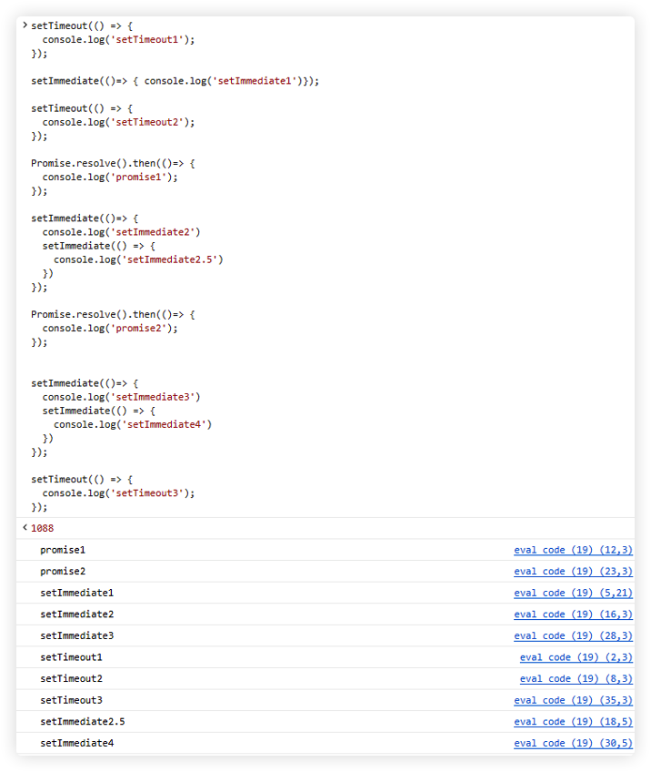
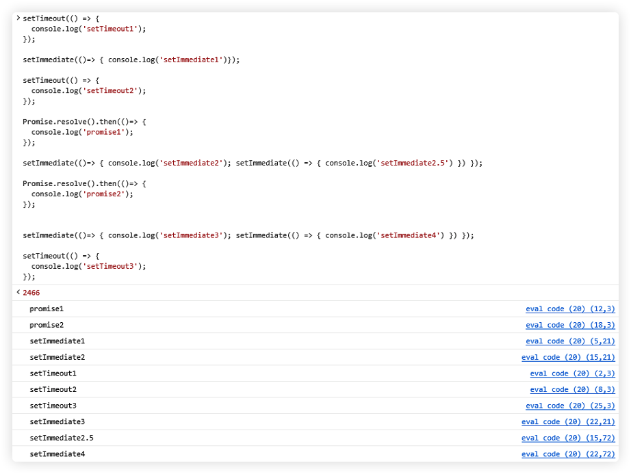
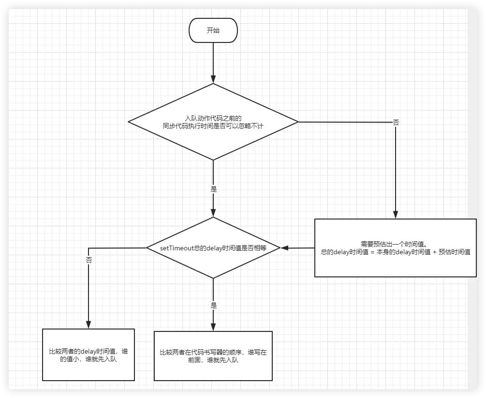
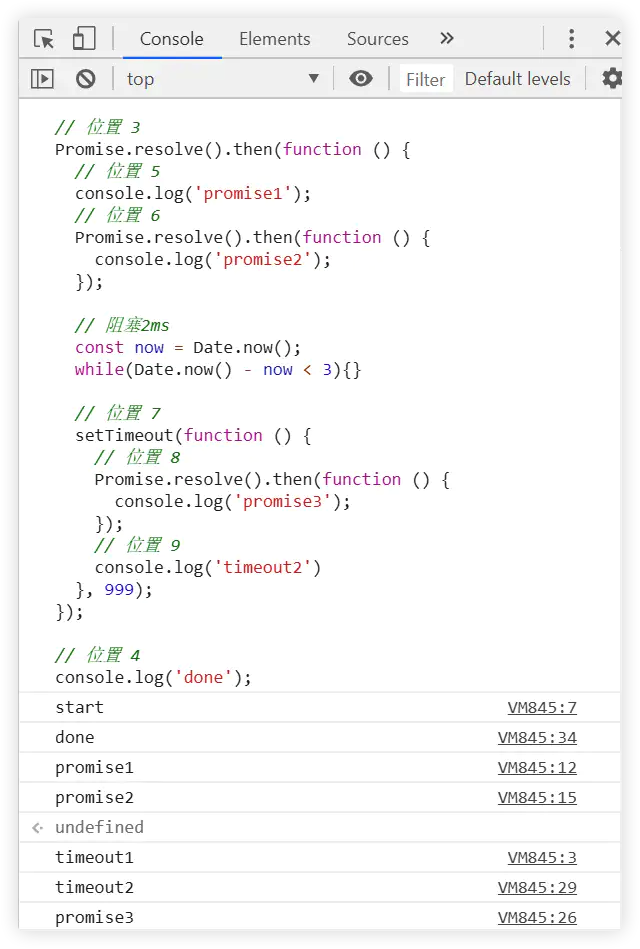

## 前言

JavaScript 是一个单线程、非阻塞、异步、解释性脚本语言。

事件循环 `Event Loop`，这是目前 **浏览器** 和 **NodeJS** 处理 JavaScript 代码的一种机制，而这种机制存在的背后，就因为 JavaScript 是一门单线程的语言。

简单来说，单线程的运行环境，它且只有一个调用栈，它每次只能够做一件事，这是单线程的意思，程序每次只可以运行一段代码。

<br/>

> 引用 Philip Roberts 的一段演讲，来简单了解下 V8

- **我**：“javascript，你是谁？”。
- **javascript**：“我？我是一门单线程，可并发的编程语言啊”。
- **我**：“哦，算你狠（作无语状）”。
- **javascript**：“好吧，我说得更具体点吧。我有一个 `call stack`，一个 `event loop`，一个 `callback queue` 和其它的一些 API 之类的东西”。
- **我喃喃自语**：“叼，我又不是学 CS(computer sciense)的，鬼知道你说的这些术语是什么。”

后来，我听闻了 v8，并且也知道，除了 v8 和 chrome，外界还有其它各种 javascript 的运行时和浏览器。我就跑去问v8了。

- **我**：“v8，v8，你是不是有一个 `call stack`，一个 `event loop`，一个 `callback queue` 和其它的一些 API 之类的东西”。
- **v8**:"我有一个 `call stack` 和一个 heap，你说的其它那些东西我就不知道了。"
- **我**：“乜你甘得意噶”。

<br/>


上图是一个 JavaScript 的运行环境示意图。堆记录了内存的分配。然后是调用栈，这是帧这类东西的所在之处，但是如果你克隆了 V8 的代码，然后，搜索 `setTimeout`、`DOM`、`HTTP` 请求这类东西，它们并不在里面。它们不存在于 V8 引擎，我对此大吃一惊，当你想要异步编程的时候，这些是你首先需要考虑要使用的东西。如下图，这些都是浏览器提供的。

<br/>


首先是 V8 运行环境，然后是浏览器提供的其他东西，被称之为 web APIs，DOM，AJAX，setTimeout 之类的东西，在然后是神秘的事件循环和回调队列。

<br/>
<br/>
<br/>

## [可视化例子](http://latentflip.com/loupe/?code=ZnVuY3Rpb24gbXVsdGlwbHkoYSxiKXsKICAgIHJldHVybiBhICogYjsKfQoKZnVuY3Rpb24gc3F1YXJlKG4pIHsKICAgIHJldHVybiBtdWx0aXBseShuLG4pOwp9CgpmdW5jdGlvbiBwcmludFNxdWFyZShuKSB7CiAgICB2YXIgc3F1YXJlZCA9IHNxdWFyZShuKTsKICAgIGNvbnNvbGUubG9nKHNxdWFyZWQpOwp9CgpwcmludFNxdWFyZSg0KTsK!!!PGJ1dHRvbj5DbGljayBtZSE8L2J1dHRvbj4%3D)

<br/>


可以通过这个[例子](http://latentflip.com/loupe/?code=ZnVuY3Rpb24gbXVsdGlwbHkoYSxiKXsKICAgIHJldHVybiBhICogYjsKfQoKZnVuY3Rpb24gc3F1YXJlKG4pIHsKICAgIHJldHVybiBtdWx0aXBseShuLG4pOwp9CgpmdW5jdGlvbiBwcmludFNxdWFyZShuKSB7CiAgICB2YXIgc3F1YXJlZCA9IHNxdWFyZShuKTsKICAgIGNvbnNvbGUubG9nKHNxdWFyZWQpOwp9CgpwcmludFNxdWFyZSg0KTsK!!!PGJ1dHRvbj5DbGljayBtZSE8L2J1dHRvbj4%3D)，来对 `call stack` 的执行有初步了解

<br/>
<br/>
<br/>

## 任务队列

单线程就意味着，所有任务需要排队，前一个任务结束，才会执行后一个任务。如果前一个任务耗时很长，后一个任务就不得不一直等着。

如果排队是因为计算量大，CPU忙不过来，倒也算了，但是很多时候CPU是闲着的，因为IO设备（输入输出设备）很慢（比如Ajax操作从网络读取数据），不得不等着结果出来，再往下执行。

JavaScript语言的设计者意识到，这时主线程完全可以不管IO设备，挂起处于等待中的任务，先运行排在后面的任务。等到IO设备返回了结果，再回过头，把挂起的任务继续执行下去。

<br/>

于是，任务可以分成两种：

- **同步任务**
  > 同步任务指的是，在主线程上排队执行的任务，只有前一个任务执行完毕，才能执行后一个任务
- **异步任务**
  > 异步任务指的是，不进入"主线程"（call stack）、而进入"任务队列"（task queue）的任务，只有"任务队列"通知主线程，某个异步任务可以执行了，该任务才会进入主线程执行。
  - 宏任务（macrotask）
  - 微任务（microtask）

对于队列而言，它符合 **先进先出（FIFO，First in First Out）** 原则。

<br/>

**任务入队**

这里还有一个知识点，就是关于任务入队。

任务进入任务队列，其实会利用到浏览器的其他线程。虽然说 JavaScript 是单线程语言，但是浏览器不是单线程的。而不同的线程就会对不同的事件进行处理，当对应事件可以执行的时候，对应线程就会将其放入任务队列。

- **js引擎线程**：用于解释执行js代码、用户输入、网络请求等；
- **GUI渲染线程**：绘制用户界面，与JS主线程互斥(因为js可以操作DOM，进而会影响到GUI的渲染结果)
- **http异步网络请求线程**：处理用户的get、post等请求，等返回结果后将回调函数推入到队列；
- **定时触发器线程**：setInterval、setTimeout等待时间结束后，会把执行函数推入队列中；
- **浏览器事件处理线程**：将click、mouse等UI交互事件发生后，将要执行的回调函数推入到队列中。

<br/>

**宏任务（macrotask）**

- 当外部或内部 `<script>` 标签所对应的脚本加载完成之后，执行这些脚本就是一个 macrotask。
- 当用户点击页面上的按钮，那么分发 `click` 事件后的对 `handler` 的执行就是一个 macrotask。
- 调用 `setTimeout` 或者 `setInterval` 时传入的 `callback` 的执行，就是一个 macrotask。
- 非标准全局方法 `setImmediate()` 调用时传入的 `callback` 的执行，就是一个 macrotask。
- `requestAnimationFrame` 调用时传入的 `callback` 的执行，就是一个 macrotask
  - 注意，因为 `requestAnimationFrame` 入队的 `callback` 绘制动画，所以，它的优先级要比 `setTimeout/setInterval` 要高，即排在 `setTimeout/setInterval` 的前面（ 但不能每次都保证 ）
- .......

<br/>

**微任务（microtask）**

- 在 `promise` 对象调用 `then/catch/finally` 的时候传入的 `callback` 的执行，就是一个 microtask。
- 显式地调用 `queueMicrotask(fn)` 来入队一个 `microtask` 时候，那么对这个 `fn` 函数的执行就是一个 microtask。
- `new MutationObserver()` 传入 `callback` 的执行就是一个 microtask。
- `Object.observe()` 传入 `callback` 的执行就是一个 microtask。

<br/>
<br/>
<br/>

## event loop 概括

事件循环的具体流程如下：

- 从宏任务队列中，按照入队顺序，找到第一个执行的宏任务，放入调用栈，开始执行；
- 执行完该宏任务下所有同步任务后，即调用栈清空后，该宏任务被推出宏任务队列，然后微任务队列开始按照入队顺序，依次执行其中的微任务，直至微任务队列清空为止；
- 当微任务队列清空后，一个事件循环结束；
- 接着从宏任务队列中，找到下一个执行的宏任务，开始第二个事件循环，直至宏任务队列清空为止。

这里有几个重点：

1. 当我们第一次执行的时候，解释器会将整体代码 script 放入宏任务队列中，因此事件循环是从第一个宏任务开始的；
2. 微任务的执行是批量性、连续性的执行完，执行期间是不会执行其他任务的。且如果在执行微任务的过程中，产生新的微任务入队，那么，它也会一起被执行掉。

:::tip
到此，如果不在深究内容，可以跳过下面内容
:::

<br/>
<br/>
<br/>

## event loop 详解

> 这里为了通俗易懂，使用了 “浏览器中的 event loop” 这种描述方式。在后面，如无特殊交代，它都是特指[规范文档](https://html.spec.whatwg.org/multipage/webappapis.html#definitions-3)里面的 “window event loop”。

上面指出，我们将会统一使用 `“call stack”`，`“microtask”` 和 `“macrotask”` 等术语来阐述 `event loop`。

<br/>

**处理模型图**

以Chrome浏览器为例，event loop的处理模型图大概是下面这样：


上图中，需要事先交代两点：

- (1)，(2)，(3) 表示的是 “一次loop中，不同类型队列被检查是否为空的顺序“;
- render callback queue 可能无法对应到具体的实现，但是从心智模型的角度来说，引入它，有助于推演 event loop。

<br/>
<br/>
<br/>

下面我们解释一下这个处理模型图。

> 第一步

当浏览器遇到一个有代码的 `<script> 标签` 的时候，那么浏览器就进入了一个以 `(window) event loop` 为驱动的执行流中。`外部 <script>` 与 `内部<script>` 不同的一点是多了网络加载过程，不管怎样，我们的执行流从代码可执行的那一刻开始讲起。首先，浏览器会把整段脚本的执行当作像 C语言 里面的 “main” 函数去执行。这个时候，“main” 函数推入到 `call stack`，成为了第一个 `call frame`。“main” 函数的执行就是从上到到下，遇到同步代码的调用，就往 `call stack` 增加一个 `call frame`，遇到异步代码，就把它交给 web API 来处理。

  - 一方面，同步代码调用完成后（比如说遇到return语句），它所对应的 `call frame` 就会从 `call stack` 中 pop 走，以此类推，直到 `call stack` 为空，程序就把控制权交回给 event loop。

  - 另一方面，到了相关的时间点，web API 就会把一个 `callback` 封装成一个 `task`，把它推入到它所属的队列中。比如，从上到下执行 “main” 函数的时候，遇到了以下代码：
    - ```javascript
      setTimeout(()=> {
      console.log('time out');
      });
      ```
    - 那么浏览器就会把这个 `setTimeout` 调用交给 web API，然后把它从 `call stack` 中pop出来。web API 接收到个 `setTimeout` 调用后，它会在自己的线程里面启动一个定时器，因为在这段代码里面，没有传递 time out 时间，那么就是默认的 0。接着，web API 没有丝毫犹豫，它就把 `setTimeout` 的 `callback` 推入到它所属的 `macrotask queue` 里面。
    - 假如是遇到在 `promise` 对象身上调用 `then/catch/finally` 方法，那么它们的 callback 最终会被 web API 推入到 `microtask queue` 中；
    - 假如遇到的是界面更新的 DOM 操作，那么这些 DOM 操作就会被封装成一个 `render callback`，推入到 `render callback queue` 中。这些 `callback` 经过封装后成为一个 `task`，静静地躺在各自的队列中，等待调度。
    - 等待谁的调度呢？当然是 **等待 event loop 的调度**。

<br/>

> 第二步

`event loop` 仅做一件事：监视 `call stack`，一旦 `call stack` 处于清空状态，然后去看看 `microtask queue` 是否有 `task`，有的话，就推入 `call stack`。

与 `macrotask queue` 和 `render callback queue` 不同的，一旦第一个 `microtask` 在 `call stack` 执行完之后，第二个 `microtask` 就会紧跟着推入到 `call stack` 去执行，而不是等到下一次的 `event loop` 才会执行。也就是说，`microtask queue` 中的所有 `microtask` 会被一次性执行完毕。

**如果在执行微任务的过程中，产生新的微任务入队，那么，它也会一起被执行掉**

<br/>

> 第三步

当 `call stack` 再次为空的时候，这时候就轮到 `render callback queue` 了。`render callback` 主要是处理 UI 渲染相关的事务。当 `call stack` 为空后，浏览器就会去 `render callback` 推入大 `call stack` 中，UI 渲染完成后，`render callback` 也就从 `call stack` 弹走，`call stack` 再次为空。这样子，一个 loop 就结束了。当一段新的代码片段需要执行或者某个 UI 事件触发了，那么浏览器就会进入下一个 loop。

<br/>
<br/>
<br/>

以上是理论表述，下面结合实际代码来验证并理解上面的话。

```javascript
console.log(1);

setTimeout(() => {
  console.log(2)
}, 0);

new Promise(res => {
  res()
}).then(() => {
  console.log(3)
  throw new Error('error');
}).catch(e => {
  console.log(4)
}).finally(() => {
  console.log(5)
});

console.log(6)
```

- 就像上面所说的那样，对 `<script> 标签` 所包裹的代码的执行是一个 `macrotask`。为了方面描述，我们可以把这段代码的初始执行理解为 C语言 中 “main函数”。`event loop` 首先执行 `macrotask`，所以，“main()” 调用推入到 `call stack` 中。
- 这个时候，遇到同步代码的 `console.log()`，那么就推入 `call stack`。**在浏览器控制台打印 1 之后**，`console.log()` 就会被 pop 出 `call stack`。
- 接着下来，`call stack` 会执行 `setTimeout()`，`call stack` 马上把它交给 web API，然后把它从 `call stack` 中弹走。因为 web API 的实现并不在 js engine（特指V8）里面，而是另外一个线程里面，所以 js engine 的执行跟 web API 的执行可以是并行的。
- 在 `call stack` 继续往下执行的同时，web API 会检查 `setTimeout` 调用时传入的表示需要延迟的 time out，发现它为默认的 0，于是乎就马上把相应的 `callback` 推入到 macrotask 中。
- 与此同时，`call stack` 执行到了 `new Promise().then().catch().finally()` 语句。值得注意的是，这段语句回分两步执行
  ```javascript
  const temp = new Promise(executor); // (1)
  temp.then().catch().finally();      // (2)
  ```
  - 第一句，对 `promise` 实例的构造调用是属于同步代码，会在 `call stack` 中执行。
  - 第二句，对构造好 `promise` 实例的 `then/catch/finally` 方法的调用，都会交给 web API
  - web API 会在 `promise` 被 `reslove` 的时候，把这些方法所对应的 `callback` 推入的 `microtask queue` 中。因为在这里，`promise` 会被马上 `reslove` 掉，因而 `then/catch/finally` 这三个方法的 `callback` 因此会马上被推入到 `microtask queue` 中。

<br/>

到了这里，如果我们只关注 `macrotask queue` 和 `microtask queue` 的话，并且为了描述简单起见，我们用需要打印的数字来代表相应的 `task`，那么两个队列的应该是长下面这个样子：

```shell
macrotask queue：
---------------------------
|   2    |                 |
---------------------------

microtask queue；
 ---------------------------
|   3    |    4    |   5   |
---------------------------
```

- 继续往下看，现在 `call stack` 依然有着 “main()” 占据着，并不处于清空状态。因为我们还要一句 `“console.log(6)”` 没执行。好吧，执行它，在浏览器打印出 `“6”`，然后把它从 `call stack` 中 pop 走。到了这里，我们已经到达了 “main” 函数的底部，“main” 函数调用完毕，于是它也从 `call stack` 中 pop 走。此时 `call stack` 终于处于清空状态了。

- 一直处于欲睡未睡状态的 `event loop` 看到 `call stack` 为空，它马上就打起十二分精神了。因为 “main” 函数调用本身就是一个 `macrotask`。轮完 `macrotask`，那么这次得轮到 `microtask queue` 了。一人一次，相当的公平，是吧？就想我们上面所说的，`microtask queue` 中所有的 `microtask` 是会被依次被推入到 `call stack`，整个队列会被一次性执行完并清空的。所以，浏览器控制台会依次打印 `“3”`，`“4”` 和 `“5”`。打印完毕后，`call stack` 重新回到清空状态。这一次， 轮到 `render callback queue` 了。因为我们这段代码中并没有操作界面的东西，所以 `render callback queue` 是空的。`event loop` 看到这个队列中为空，心中大喜，想着这一次的 `event loop` 结束后，自己终于可以休息了。但是可怜的 `event loop` 是劳碌命，它被浏览器逼迫着进入了下一个 loop 中去了。

- 在下一个 loop 中，老规矩，我们还是会先检查 `macrotask queue`。这个时候，它发现有一个 `macrotask` 在里面，于是它二话不说，把它推入到 `call stack` 去执行，最终在浏览器控制台打印出 `“2”`，`call stack` 处于清空状态。`event loop` 接着看 `microtask queue` 和 `render callback queue`，发现这个两个队列都是为空。最终的最终，`event loop` 可以歇着了，它如愿以偿地进入休眠状态。

<br/>
<br/>
<br/>

## macrotask 跟 microtask 的不同点

`macrotask` 和 `microtask` 虽然都会被入队到队列中，都会最终能推入到 `call stack` 去执行，但是两者的不同的还是挺明显的，并且对于理解整个 `event loop` 的运行机制还是挺重要的。它们两个之间主要有两个不同点：

- 在同一个 `event loop` 中，执行次序不同。一个 `event loop` 一旦开始了，总是先执行 `macrotask`，后执行 `microtask`。
- 同一个队列中，相邻任务的相对执行时机不同。对于 `macrotask queue` 而言，相邻的任务会分散不同批次的 `event loop` 去执行；而对于 `microtask queue` 而言，相邻的任务会在同一批次的 `event loop` 执行完，并且是连续性地，依次地执行完。


<br/>

**1. 验证 macrotask 是先于 microtask 先执行**

无论是 script 标签内部的 js 代码片段还是通过外部加载进来的 js 代码文件，浏览器都会将对它的执行视为一个 `macrotask`，这也是驱动 js 代码执行流的第一个 `macrotask`。从这个角度来看，`microtask` 总是从 `macrotask` 衍生而来的，那我们凭什么能说“在同一个`event loop` 中，`microtask` 会比 `macrotask` 先执行呢？”。这道理就好像，妈妈把儿子生下来之后，儿子长大后，指着妈妈说：“我长得比你高，我比你先来到这个世界”。你不觉得不符合逻辑吗？不过，话说回来，要想通过浏览器控制台的打印顺序来正面证明
`macrotask` 比 `microtask` 先执行还是挺难的。不过我们可以反向证明一下。

<br/>


<br/>

假设 js 引擎扫描代码后并没有把整个 js 代码片段/文件作为 `macrotask` 来执行，而是把 `“console.log(1)”` 和 `promise` 的代码分别入队到 `macrotask queue` 和 `microtask queue` 中。当 js 引擎准备执行代码的时候，假若它是先执行 `microtask`，后执行 `macrotask` 的话，那么，控制台会先打印 `“2”`，后打印 `“1”`。实际上，这段代码无论你执行多少次，结果都是一样的：会先打印 `“1”`，后打印 `“2”`。这就反向证明了两点：

- 1）代码片段和代码文件的执行本身就是一个 `macrotask`；
- 2）从源头上说，`microtask` 是作为 `macrotask` 的一个执行结果而存在的，或者说，`macrotask` 衍生了 `microtask`。

所以，从表象上说，肯定是先执行 `macrotask`，再执行 `microtask`。

这里再次强调，第一点理解 “代码片段和代码文件的执行本身就是一个 `macrotask`” 是十分重要的。因为一旦你看不到它的话，那么你就会下错结论。请看下面这个简单图示：

```shell
基于event loop的执行流：
======================================================================
|| macrotask || microtask || macrotask || microtask || .....
======================================================================
^            ^
|            |
|            |
|            |
观察点1      观察点2
```

因为 `macrotask queue` 和 `microtask queue` 是交替式地得到一次推 `入call stack` 的机会的。那么，如图，如果你忽略了 “代码片段和代码文件的执行本身就是一个 `macrotask`，并且是驱动执行流的第一个 `macrotask`” 这个实现上的事实后，光从控制台的打印结果去做简单判断的话的话，那么实际上你是站在了 “观察点2” 上。这个时候，你会觉得先执行 `microtask`，后执行 `macrotask` 的。然而，这并不是事实。

<br/>

**2. 验证相邻任务的相对执行时机**

验证下，同一个 `event loop` 中，`microtask` 是批量地，依次地执行的，而 `macrotask` 是单个执行的：

```javascript
setTimeout(()=>{
  console.log(2);
}, 0);

setTimeout(()=>{
  console.log(3);
}, 0);

Promise.resolve().then(()=> {
  console.log(4);
});

Promise.resolve().then(()=> {
  console.log(5);
});
```

<br/>

初始 `macrotask` 执行后，`macrotask queue` 和 `microtask queue` 应该是长这样的（跟上面阐述一样，同样是用【所需要打印的数字】来标志这个任务）：

```shell
macrotask queue:
---------------------------
|   2    |    3   |
---------------------------

microtask queue；
 --------------------------
|   4   |    5    |
---------------------------
```

```shell
如果，单个macrotask跟单个microtask是交替执行的话，那么打印结果将会是：
4 -> 2 -> 5 -> 3

但是实际上打印结果是：
4 -> 5 -> 2 -> 3
```

看这个结果，你可能会说，我是看到 `microtask` 是批量执行了，但是 `macrotask` 不也是“批量执行”吗？。实际上，不是这样的。那是因为进入第二次 `event loop` 之后，执行完（2）之后， `microtask queue` 中并没有任务的任务可执行，于是乎又进入了第三次 `event loop`，这个时候，才执行了（3）。

<br/>

下面我们在第一个 `setTimeout` 的 `callback` 入队一个 `microtask` （为了简便起见，这里用全局方法 `queueMicrotask`）来试试看：

```javascript
setTimeout(()=>{
  console.log(2);
  queueMicrotask(()=> {
    console.log(2.5);
  });
}, 0);

setTimeout(()=>{
  console.log(3);
}, 0);

Promise.resolve().then(()=> {
  console.log(4);
});

Promise.resolve().then(()=> {
  console.log(5);
});
```


```shell
如果 macrotask 也是批量执行的话，那么打印结果将会是：
4 -> 5 -> 2 -> 3 -> 2.5

实际的打印结果是：
4 -> 5 -> 2 -> 2.5 -> 3
```

这是为什么呢？这是因为，浏览器在走完第二次的 `event loop` 的 `macrotask` 之后，代码使用 `queueMicrotask` 入队了一个 `microtask（2.5）`。上面说过，一旦执行完一个 `macrotask`，接下来就会去检查 `microtask queue` 是否有任务等待执行。此时，正好有一个 `microtask（2.5）`在里面，所以，`event loop` 就把它推入到 `call stack` 执行了，然后打印出 `“2.5”`。再然后才进入第三次的 `event loop`，这才有了 `macrotask`（3）的执行。

<br/>

上面，基本上是在验证 `microtask` 执行的“批量性，依次性”。那下面来验证，`microtask` 执行的“连续性”。简单来说，如果一个 `microtask` 在 `call stack` 上执行的过程中导致了一个新的 `microtask` 入队，而这个新的 `microtask` 在 `call stack` 执行过程中又导致了一个更新的 `microtask` 入队，如此类推.....的话，那么这些连续产生的 `microtask` 都会在同一次 `event loop` 中被连续地执行完，中间不会去执行 `macrotask queue` 或者 `render callback queue` 里面的任务。注意，这里强调的是“导致了一个新的 `microtask` 入队”的意思是指，浏览器以几乎可以忽略的时间差，真正地把一个 `microtask` 入队到 `microtask queue` 中。比如，下面的代码就不是 “导致了一个新的 `microtask` 入队”：

```javascript
Promise.resolve().then(()=> {
  setTimeout(function macrotask2() {
    queueMicrotask(()=> {
      console.log(4.5);
    });
  }, 0)
});
```

因为只有当 `“macrotask2”` 这个 `macrotask` 被推入到 `call stack` 去执行的时候，（4.5）这个 `microtask` 才会真正入队。

去掉 `setTimeout` 的包裹，才是真正的 “导致了一个新的 `microtask` 入队”：

```javascript
Promise.resolve().then(()=> {
 queueMicrotask(()=> {
    console.log(4.5);
  });
});
```

<br/>

以上这两种情况对执行流有啥影响呢？我们下面看看各种的打印结果的差异。

（1）有 `setTimeout` 这层 wrapper：

```javascript
setTimeout(()=>{
    console.log(2);
    queueMicrotask(()=> {
        console.log(2.5);
    });
}, 0);

setTimeout(()=>{
    console.log(3);
}, 0);

Promise.resolve().then(()=> {
    console.log(4);
    setTimeout(()=> {
        queueMicrotask(()=> {
            console.log(4.5);
        });
    }, 0)
});

Promise.resolve().then(()=> {
    console.log(5);
});

// 打印结果是：
4
5
2
2.5
3
4.5
```

（2）把 `setTimeout` 这层 wrapper 去掉后：

```javascript
setTimeout(()=>{
    console.log(2);
    queueMicrotask(()=> {
        console.log(2.5);
    });
}, 0);

setTimeout(()=>{
    console.log(3);
}, 0);

Promise.resolve().then(()=> {
    console.log(4);
    queueMicrotask(()=> {
        console.log(4.5);
    });
});

Promise.resolve().then(()=> {
    console.log(5);
});

// 打印结果是：
4
5
4.5
2
2.5
3
```

从打印结果来看，你可以看到两者执行流的差别吗？一个是 `4.5` 放在最后打印了，一个是接着前面两个的 `microtask` 的尾巴，连续打印了。说了这么多，我就是想说，我这里所说的 “`microtask` 执行的连续性” 是指第二种情况。下面我们把这个例子放大来看：

```javascript
setTimeout(()=>{
  console.log(1);
}, 0);

Promise.resolve().then(()=> {
  console.log(2);
  queueMicrotask(()=> {
    console.log(3);
    queueMicrotask(()=> {
      console.log(4);
      queueMicrotask(()=> {
        console.log(5);
        queueMicrotask(()=> {
          console.log(6);
        });
      });
    });
  });
});
```

你猜猜打印结果如何？

```shell
2
3
4
5
6
1
```

到这里，不知道你看清楚所谓的 “`microtask` 执行的连续性” 是啥没？它的具象化理解其实就是 “连续入队的 `microtask` 会被依次，连续地推入到 `call stack` 去执行，中间不会调度其他的任务（ `macrotask` 后者 `render callback`）去打断这种连续性”。
实际上 `microtask` 这种连续性，在使用不当（比如说入队过多，递归入队）的时候，就会长期占用 `call stack`，本质上造成了浏览器运行的阻塞。MDN 在文档里面也给出了相关的警告：

:::warning
Warning: Since microtasks can themselves enqueue more microtasks, and the event loop continues processing microtasks until the queue is empty, there's a real risk of getting the event loop endlessly processing microtasks. Be cautious with how you go about recursively adding microtasks.
:::

<br/>

对于 `microtask` 跟 `macrotask` 的不同点，到这里已经阐述得差不多了。还有一个值得强调的是，要想理解 `event loop` 的运行机制，理解 `microtask/macrotask` 的入队时机也是十分重要，并且需要额外注意的一点。`microtask/macrotask` 的入队时机是掌握在 web API 手上的。关于这一点，Philip Roberts 在他的演讲中有提到过。在这里，会给出一个示例：

```javascript
const timeout1 = 0;
const timeout2 = 0;
const timeout3 = 0;

// 代码块（1）
setTimeout(() => {
  console.log(1)
}, timeout1)

// 代码块（2）
new Promise(resolve => {
  setTimeout(() => {
    resolve('finished')
  }, timeout2)

  // 可以尝试把setTimeout wrapper去掉
  // resolve('finished');
})
  .then(() => {
    console.log(2)
    throw new Error("error")
  })
  .catch((e) => {
    console.log(3)
  })
  .finally(() => {
    console.log(4)
  })

// 代码块（3）
setTimeout(() => {
  console.log(5)
}, timeout3)
```

你可以通过以下一种或者多种结合的方式来观察一下入队时机是如何影响执行流的：

- 任意修改变量 timeoutxxx 的值；
- 切换同步 resolve promise 或异步 resolve；
- 调整代码块的书写顺序；

> 提示1：记得，这个时候，一定要想起web API这个扫地僧啊。

> 提示2：构造promise实例的代码是同步代码。

<br/>
<br/>
<br/>

## setImmediate

首先，我们来聊聊 `setImmediate`。在 [MDN](https://developer.mozilla.org/en-US/docs/Web/API/Window/setImmediate) 上，开门见山了指出这个方法并不是标准规范要求实现的方法

> This feature is non-standard and is not on a standards track. Do not use it on production sites facing the Web: it will not work for every user. There may also be large incompatibilities between implementations and the behavior may change in the future.

> This method is not expected to become standard, and is only implemented by recent builds of Internet Explorer and Node.js 0.10+. It meets resistance both from Gecko (Firefox) and Webkit (Google/Apple).

也就是说，这个特性当前不是标准方法，它的发展也不在可以标准化的方向上。当前只有最新的（相对于Feb 22, 2020）IE版本和 Node.js 0.10+ 上实现了它。 它的标准化进程受到了Gecko (Firefox) 和 Webkit (Google/Apple) 的抵制。故而，请不要在生产环境中使用它。

<br/>

> 题外话：当我在掘金域名下的页面的控制台输入 “set....” 的时候，它竟然提示有这个 “setImmediate” API，并且也是能执行的。我当时就懵掉了，难道在最新版本的 chrome 中，它实现了这个方法？后面经过摸索（就简单地用 “setImmediate.toString()” 来看看，原来它并不是原生方法，应该是掘金自己引入了外部的 polyfill。

<br/>

虽然它不是标准方法，但是考虑到 nodejs 有这个方法，并且有个别面试官的 “丧心病狂”,我们不妨看看这个方法到底是怎么一个回事。

MDN上对它的介绍是这样的：

> This method is used to break up long running operations and run a callback function immediately after the browser has completed other operations such as events and display updates.

在这段介绍里面，我们没有看到这里面有提到 `setImmediate` 跟 `（window）event loop` 的关系。我们只看到了，它会在 “event callback” 和 UI 更新等操作后面执行。

<br/>

为了弄清楚调用它的时候传入的 function 到底是入队到哪个队列中，我们来看看市面上各种 setImmediate polyfill 是如何解读它的。


我们挑一个 star 最多的,也就是第一个 “YuzuJS/setImmediate” 来看看，只见它的 readme 里面是这么写的：

> The setImmediate API, as specified, gives you access to the environment's task queue, sometimes known as its "macrotask" queue. This is crucially different from the microtask queue used by web features such as MutationObserver, language features such as promises and Object.observe, and Node.js features such as process.nextTick.

第一句话就很明确地指出，它所入队的队列是 `macrotask queue`。同样，在 [stackoverflow 上面的这个问题](https://stackoverflow.com/questions/25915634/difference-between-microtask-and-macrotask-within-an-event-loop-context) 的一个高分答主也秉持同样的观点：


<br/>

鉴于，在我的电脑上只有 Microsoft Edge（v44.18362.329.0），并且它原生实现了 `setImmediate` 方法：


那么我们就在上面把示例代码跑起来看看，先来个简单版：

```javascript
setTimeout(() => {
    console.log('setTimeout');
});

setImmediate(()=> { console.log('setImmediate')});

Promise.resolve().then(()=> {
 console.log('Promise');
});

//output:
Promise
setImmediate
setTimeout
```

<br/>

从这一次的运行结果来看，setImmediate 入队的任务要么是追加到 microtask queue 的后面，要么就插队到 macrotask queue 的最前面了。这两者都有可能。但是随着深入试验，我有个惊奇的发现。先卖个关子，我们先看看下面两个代码运行结果截图：

<br/>


<br/>

从这个运行结果来看，我们还是无法 判断 setImmediate 入队的任务到底归属于那个任务队列。但是我们可以有一个结论，那就是：**（1）多个 setImmediate 的入队顺序还是按照它们在代码书写期的顺序来入队的，它没有后来者居上的插队表现。** 但是，从下面这运行结果我们就可以大概看出个端倪来：

<br/>


<br/>


首先，我们姑且把同样代码会有不同的执行结果这个发现放在一边。我们可以看到，两次的 setTimeout 竟然在两次 setImmediate 前面打印出来了。这就证明了：**（2）setImmediate 入队的任务是归属于 macrotask queue 的。** 为什么呢？因为假如 setImmediate 入队的任务是归属于 microtask queue 的话，那么这段代码无论执行多少次都不会出现第二张截图所显示的运行结果。第二张截图所显示的运行结果证明了 setImmediate 入队的任务肯定是归属于 macrotask queue 的，但是综合两次运行结果来看，我们基本可以判断：**（3）setImmediate 和 setTimeout 的入队顺序无法得到保证。不过绝大部分的情况下，都是 setImmediate 入队在先。** 我们伟大的扎叔在他的[技术博客](https://humanwhocodes.com/blog/2011/09/19/script-yielding-with-setimmediate/)里面也提到过：

<br/>


> Another advantage is that the specified function executes after a much smaller delay, without a need to wait for the next timer tick. That means the entire process completes much faster than with using setTimeout(fn, 0).

<br/>


这种不一致表现，好像有点似曾相识，好像哪里见过，是吧？对的，就是我们亲爱的 nodejs。nodejs 在自己的官方文档[setImmediate() vs setTimeout()](https://nodejs.org/en/docs/guides/event-loop-timers-and-nexttick/#setimmediate-vs-settimeout)中对于这种不确定性如是说道：

<br/>


> The order in which the timers are executed will vary depending on the context in which they are called. If both are called from within the main module, then timing will be bound by the performance of the process (which can be impacted by other applications running on the machine).

所以，我们不妨做个大胆的推测：**（4）Microsoft Edge 对 setImmediate 的实现机制跟 nodejs 对 setImmediate 实现机制是大致相仿的。**

<br/>
<br/>

最后，我们来看最后一个例子：


从个示例代码的运行结果来看， **（5）虽然 setImmediate()和 setTimeout()所入队的任务都在一个 macrotask 里面，但是无论书写代码的顺序如何，两者都不会交叉入队。** 也就是说，使用同一个方法入队的多个任务，要么不执行，要么就一起执行。

<br/>

网上对于（浏览器环境下的）非标准的 setImmediate 的研究资料和技术文章着实少。相对权威点的资料我查到三个：

1. [w3c 的 API 标准文档](https://w3c.github.io/setImmediate/)
2. [解释为什么在浏览器实现这个 API 的原因](https://testdrive-archive.azurewebsites.net/Performance/setImmediateSorting/Default.html)：兼顾 callback 的执行频率和电耗性能；
3. [扎叔的技术文章](https://humanwhocodes.com/blog/2011/09/19/script-yielding-with-setimmediate/)

好了，对非标准的 `setImmediate` 在 event loop 中的表现的探索到此为止，有空可继续深入。





:::warning
好吧，已经不可控了 ~

最后只能得出一个结论，那就是 `setImmediate` 入队的任务是归属于 `macrotask queue` 的。
:::

<br/>
<br/>
<br/>

## MutationObserver

通过 MutationObserver 接口我们能够去监听 DOM 树的各种更改。引入该特性是为了替代 DOM3 事件规范的 Mutation Event3 特性。[MDN 文档](https://developer.mozilla.org/en-US/docs/Web/API/MutationObserver) 中是说。

关于 MutationObserver 接口的语法以及如何在监听 DOM 树更改领域的应用，本文不打算深入讲解。本文只是探索通过它来入队的任务是如何参与到 event loop 中去的。为了此目标，我们不妨基于它来封装这样的一个方法：

```javascript
function queueMicrotaskWithMutationObserver(callback) {
  const div = document.createElement("div");
  let count = 0;
  const observer = new MutationObserver(() => {
    callback && typeof callback === "function" && callback.call(null);
  });

  observer.observe(div, { attributes: true });
  div.setAttribute("count", ++count);
}
```

<br/>

好的，有了它，我们就可以愉快地玩耍了。我们来看看下面这个示例：


基本上可以，确定通过MutationObserver来入队的任务是属于microtask。这与网上盛传的说法是一致的。

<br/>

为了进一步验证，我们再看看复杂一点示例：


我们可以通过各种更加复杂的示例来观察过 MutationObserver 在 event loop 中的表现。我们会发现，它并不具备比其他接口更高的优先级，它跟 Promise 和 queueMicrotask 等接口在入队方面的表现完全一样的。通过它来入队的 microtask 的执行方式一样具有 “批量性和连续性”。

<br/>
<br/>
<br/>

## async...await

<br/>
<br/>
<br/>

## event loop 的应用

虽然业务型的前端开发中很少需要用到event loop机制，但是还是有不少场景还真的十分需要它。下面列举一下。

### 1. 需要把某些代码延迟到同步代码执行之后再执行

某种情况下，有些框架/类库虽然提供异步的 API，但是却没有提供回调给我们 hook 进去，这个时候就需要祭出我们的杀手锏了：setTimeout。

比如说，早期版本的 react 的 setState 方法，并没有提供一个 callback 让我们 hook 进去，来获取更新后的 state 值。但是由于 event handler 里面的代码是在一个批量更新的事务中，这就导致了这种情况下，setState 的执行是“异步”（相对原生的异步行为，这种异步是伪异步）的。这个时候，如果你把获取更新 state 值的代码写在 setState() 后面的话，那么你是无法获取到更新后的 state 值的。比如下面：

```javascript
import React from 'react';

const Count = React.createClass({
  getInitialState() {
    return {
      count: 0
    }
  },

  render() {
    return <button onClick={() => {

      this.setState({ count: this.state.count + 1 });

      console.log(this.state.count);

    }}>{this.state.count}</button>
  },

  componentDidMount() {
  }
})

export default Count;
```

<br/>

按理说，你要想获取更新后的 state 值的话，你应该在生命周期函数 componentDidUpdate 里面去获取。但是，假如我们非要通过写在 `this.setState({count: this.state.count + 1});` 之后的代码去获取呢？我们有什么办法呢？办法还是有的。就是用 setTimeout 来包裹一下就好：

```javascript
render() {
  return <button onClick={() => {
    this.setState({ count: this.state.count + 1 });

    setTimeout(() => {
      console.log(this.state.count);
    }, 0);

  }}>{this.state.count}</button>
}
```

<br/>

原理是什么呢？原理有二：

- setState 方法的异步执行只是“伪异步”，或者说只是 react 这个类库层面的异步，并不是真正的异步代码（进入过 microtask queue/macrotask queue 的才是真正的异步代码）。它还是在 react 应用代码的同步的执行流里面。
- 使用 setTimeout 能够把获取更新后 state 值的这个动作变成了一个 macrotask，也就是真正的异步代码。而异步代码相比 call stack 里面的同步代码，总是后执行的。所有的 react 同步代码执行完之后，state 值必定是更新的了，所以这个时候再去执行异步代的话，我们是能够获取到组件最新的状态值。

这里需要强调的是，只提 setTimeout 只是为了抛砖引玉。在这种场景下，任何把 `() => { console.log(this.state.count) }` 入队到 microtask queue/macrotask queue 的方法都是可行的。比如说，setInterval，promise，queueMicrotask 等等 API 都是可行的。在这个需求之下，入队到 microtask queue 还是入队到 macrotask queue，其实区别都不打，我们只需要使之变为异步代码即可。

这里拿 react 的 setState 方法举例子也只是抛砖引玉，所有有这种需求的场景，我们都可以用这种方法实现我们的需求。

<br/>
<br/>

### 2. 对一些耗时，阻塞主线程（call stack）的任务进行切片

在不借助web worker的情况，我们如何在主线程去执行一些原本耗时，阻塞主线程的任务（比如CPU-hungry task）呢。答案是基于event loop的运行机制去做任务切片。至于什么是阻塞主线程，阻塞主线程会有什么后果？

:::tip
简单来说

没有严格的定义说什么是阻塞，什么不阻塞。仅仅是指代码运行得很慢，导致无法及时响应反馈用户的操作。

比如说，console.log 不慢，遍历从从 1 到 10 亿很慢，网络请求很慢，下载图片也很慢。反正在栈里表现很慢的东西都加阻塞。

如果一个方法不断调用自身，会造成内存泄漏，导致整个调用栈崩溃。
:::

<br/>

首先我们来看看下面这个（示例1）：

```html
<body>
  <input type="text" placeholder="我是input，试一试点击我" style="width: 100%;"/>
</body>

<script>
  window.onload = function () {
    let i = 0;
    let start = Date.now();

    function count() {
      // do a heavy job
      for (let j = 0; j < 1e9; j++) {
        i++;
      }
      console.log("Done in " + (Date.now() - start) + 'ms');
    }

    count();
  }
</script>
```

把这个页面代码运起来之后，你会发现，在控制台打印结果出来之前，页面上的 input 框是点不动（无法获取焦点）的。这是因为 count() 的执行一直在占用 call stack，导致 render callback 无法放到 call stack 去执行。这就是所谓的 “阻塞主线程”。

<br/>

现在我们使用 setTimeout 来对 count() 这个大任务进行切片（示例2）：

```html
<body>
  <input type="text" placeholder="我是input，试一试点击我" style="width: 100%;"/>
</body>

<script>
  window.onload = function () {
    let i = 0;
    let start = Date.now();

    function count() {
      do {
        i++;
      } while (i % 1e6 != 0);

      if (i == 1e9) {
        console.log("Done in " + (Date.now() - start) + 'ms');
      } else {
        setTimeout(count); // schedule the new call
      }
    }

    count();
  }
</script>
```

经过切片后，这段代码的执行流是这样的：

- 执行 1~1000000 的累加。在 i === 1000000 的时候，把下一轮 (1000001 ~ 2000000) 的累加推入到 macrotask queue 中；
- event loop 去 render callback queue 中 pop 一个渲染任务出来执行，以此响应用户的交互；
- 执行 1000001 ~ 2000000 的累加。在 i === 2000000 的时候，把下一轮 (2000001 ~ 3000000) 的累加推入到 macrotask queue 中；
- event loop 去 render callback queue 中 pop 一个渲染任务出来执行，以此响应用户的交互；
- ......以此类推，直到累加到 1e9。

其本质就是通过 macrotask 和 render callback 的交替执行来防止这个耗时的大任务来阻塞 call stack。虽然切片之后，累加到 1e9 的所用的总时间变长了，但是我们保证了界面的可交互性，所以，这一点时间代价不值一提。

<br/>

如果你想基于（示例2）去继续优化，想要它既不阻塞 call stack，有能够尽量地缩短它的执行时长，方法也是有的。下面，我们来看看（示例3）：

```html
<body>
  <input type="text" placeholder="我是input，试一试点击我" style="width: 100%;"/>
</body>

<script>
  window.onload = function(){
    let i = 0;

    let start = Date.now();

    function count() {
      if(i < 1e9 - 1e6){
        setTimeout(count); // schedule the new call
      }

      do {
        i++;
      } while (i % 1e6 != 0);

      if (i == 1e9) {
        console.log("Done in " + (Date.now() - start) + 'ms');
      }
    }

    count();
  }
</script>
```

在这个示例中，我们入队动作放在累计之前，通过这样做，我们能把任务的耗时减少。这是为什么呢？

这是因为，虽然我们 setTimeout() 调用没有传递 time out 时间，即为默认值 0。但是 HTML5 规范要求，嵌套执行的 setTimeout 的最小延迟时间为 4ms，即使我们显式设置为 0 也不行。大部分浏览器也是这么实现的。当我们把入队的动作放在最前面的时候，在每一轮累加中，我们就能省掉 4 毫秒。1e9/1e6 = 1000(轮)，所以我们能省掉的时间大概为 1000 * 4 = 4000（ms）。这也是跟我 们的实际执行结果相吻合的。至于，把入队的动作放在最前面之后，为什么每轮可以省掉 4 毫秒呢？你大可依据上面给出 的event loop 处理模型图来进行推断，这个练习就留给你自己了。

<br/>
<br/>

### 3. 保证代码在不同的情况下，保持一致的执行顺序

这种场景一般是特指在不同的条件分支里面，一个分支用了异步代码，一个分支没用异步代码，从而导致在不同的情况下，代码的执行顺序没法保持一致。请看下面这个例子：

```javascript
customElement.prototype.getData = url => {
  if (this.cache[url]) {
    this.data = this.cache[url];
    this.dispatchEvent(new Event("load"));
  } else {
    fetch(url)
      .then(result => result.arrayBuffer())
      .then(data => {
        this.cache[url] = data;
        this.data = data;
        this.dispatchEvent(new Event("load"));
      });
  }
};

element.addEventListener("load", () => console.log("Loaded data"));
console.log("Fetching data...");
element.getData();
console.log("Data fetched");
```

在这里，假设我们是想对特定的接口做数据缓存。当你第一次执行的时候，程序会执行第二个条件分支，打印结果是这样的:

```shell
Fetching data
Data fetched
Loaded data
```

当你第二次执行的时候，程序会执行第一个条件分支，打印结果将会这样：

```shell
Fetching data
Loaded data
Data fetched
```

因为代码的执行次序无法得到保证，这就会增加了代码运行的不可预测性，从而理解和维护成本变得更高。为了解决这个问题，我们可以使得两个条件分支的都是异步代码即可：

```javascript
customElement.prototype.getData = url => {
  if (this.cache[url]) {
    queueMicrotask(() => {
      this.data = this.cache[url];
      this.dispatchEvent(new Event("load"));
    });
  } else {
    fetch(url)
      .then(result => result.arrayBuffer())
      .then(data => {
        this.cache[url] = data;
        this.data = data;
        this.dispatchEvent(new Event("load"));
      });
  }
};
```

其实，这种解决方案对所有的条件语句都适用，不一定是 `if...else`。具体使用的 API，也不一定是 queueMicrotask 和 promise...then，只要保证两个条件分支的代码都编排成同种类型的 task 即可。

<br/>
<br/>

### 4. 合并请求，批量执行任务

有时候我们需要批量作业，即将多次连续的操作请求合并为一次的操作请走，最终实际执行一次操作。我们来看看下面的代码：

```javascript
const messageQueue = [];

let sendMessage = message => {
  messageQueue.push(message);

  if (messageQueue.length === 1) {
    queueMicrotask(() => {
      const json = JSON.stringify(messageQueue);
      messageQueue.length = 0;
      // 这里用console.log来模拟实际的操作
      console.log('最终要操作的数据的json序列是：', json)
    });
  }
};


sendMessage(1);
sendMessage(2);
sendMessage(3);
sendMessage(4);
sendMessage(5);

// output:
// 最终要操作的数据的json序列是： [1,2,3,4,5]
```

**这里的原理就是：`event loop` 和 闭包**。

在多次连续的 sendMessage() 调用中，我们通过判断来确保在第一次调用的时候就把一个函数编排为 microtask，并入队到 microtask queue 中（此处,不一定用 “messageQueue.length === 1” 这种判断条件，我们也可以用标志位来实现）。此时，我们已经把变量 messageQueue 保存在函数闭包中了。在后续的 sendMessage() 调用，我们其实就是操作这个闭包中的变量（闭包变量会相对地常驻内存）。就像上面所说的那样，代码片段的初始执行本身就是一个 macrotask，当这个 macrotask 在 call stack 执行完毕后（即 call stack 处于清空状态），此时 event loop 发现 microtask queue 上有一个 microtask，于是乎就把它推入到 call stack 去执行。在执行 microtask 之前，messageQueue 变量的值其实已经是数组类型的 [1,2,3,4,5]，那么最后在 microtask 操作数据的时候肯定没问题了。其实上面的调用代码就等同于：

```javascript
const messageQueue = [];
messageQueue.push(1);
messageQueue.push(2);
messageQueue.push(3);
messageQueue.push(4);
messageQueue.push(5);
const json = JSON.stringify(messageQueue);
messageQueue.length = 0;
console.log('最终要操作的数据的json序列是：', json)
```

<br/>

我们可以借鉴这里的思想，模仿实现原生 react 中 setState 方法的行为表现：异步和批量：

```javascript
const componentInstance = {
  state: null,
  _pendingState: null,
  _stateList: [],

  render() {
    console.log('reconciling...');
  },

  setState(partialState) {
    this._stateList.push(partialState);

    if (this._stateList.length === 1) {
      queueMicrotask(() => {
        if (this.state !== null) {
          this._stateList.unshift(this.state);
        }

        const finalState = this._stateList.reduceRight((prev, curr) => {
          return Object.assign(curr, prev);
        }, {})

        this._pendingState = finalState;

        console.log('reconciliation start...')

        this.render();

        console.log('reconciliation end...')

        this.state = this._pendingState;
        this._pendingState = null;
        this._stateList.length = 0;
      });
    }
  }
}
```

首先，我们来考察上面实现的异步表现：

```javascript
componentInstance.state = {count: 1};
componentInstance.setState({count: componentInstance.state.count + 1});

// 能拿到更新后的state值吗？
// 打印结果：state: 1,所以答案是：不能。
console.log('state:', componentInstance.state);

// 能拿到更新后的state值吗？
// 打印结果：state: 2,所以答案是：能。
setTimeout(() => {
  console.log('state:', componentInstance.state);
}, 0);
```

然后，我们在来考察上面实现的批量更新表现：

```javascript
componentInstance.state = {count: 1};
componentInstance.setState({count: componentInstance.state.count + 1});
componentInstance.setState({count: componentInstance.state.count + 1});
componentInstance.setState({count: componentInstance.state.count + 1});

// output: state: 2,证明是批量更新
setTimeout(() => {
  console.log('state:', componentInstance.state);
}, 0);
```

event loop 在 javascript 异步编程领域下，应该还要很多的应用场景，期待有更多的发掘。

<br/>
<br/>
<br/>

## event loop 的面试题

面试题难度的几个层级：

- 比较生冷的考法，比如考你以此几点：
  - macrotask，microtask 和 render callback 执行的前提是 call stack 为空；
  - 三个队列执行的优先级：microtask > render callback > macrotask;
- 理解macrotask与microtask执行的先后顺序；
- 理解microtask执行的批量性，连续性；
- 理解入队时机对执行流的影响，理解promise对象的构造代码是同步执行的。
- 掌握比较冷僻的，setImmediate,async...await和mutationObserver;

好下面，我们来看看市面上面试题:

<br/>

**问题1：** 以下的三个场景的执行结果会是怎样？为什么？

```javascript
// 场景1：
function foo() {
  setTimeout(foo, 0);
};
foo();

// 场景2：
function foo() {
  return Promise.resolve().then(foo);
};
foo();

// 场景3：
function foo() {
  foo()
};
foo();
```

<br/>

**解析：**

- **场景1** 会无限递归执行，js 引擎不会报 “maximum call stack size exceeded”，同时界面能够响应用户的交互；因为， macrotask 与 microtask 执行的前提是 call stack 为空。call stack 同一时间里面只有一个 call frame；界面之所以能够响应用户交互是因为用户通过交互产生的各种 render callback 的优先级比 macrotask 的优先级要高，意思是优先响应 UI。
- **场景2** 也会无限递归执行，js 引擎不会报 “maximum call stack size exceeded”，但是界面不能够响应用户的交互；不能报 “maximum call stack size exceeded” 的原因跟 **场景1** 是一样的。界面不能够响应用户交互是因为 microtask 的优先级比 render callback 的优先要高，这样子的话，连续，无限的 microtask 执行就长期占用了 call stack，使得 render callback 无法得到执行的机会，界面也就没法重新渲染了(为了验证这个场景的执行结果，把当前的 render process 搞崩了好几次)。
- **场景3** 无法递归执行，js 引擎会报 “maximum call stack size exceeded”。这是同步代码，每递归一次，就会增加一个 call frame，所以必定会引起 call stack 长度溢出。

<br/>
<br/>

**问题2：** 以下的打印顺序结果会是怎样的呢？

```javascript
setTimeout(function () {
  console.log(1)
}, 0);

new Promise(function executor(resolve) {

  console.log(2);

  for (var i = 0; i < 10000; i++) {
    i == 9999 && resolve();
  }

  console.log(3);
})
  .then(function () {
    console.log(4);
  });

console.log(5);
```

**解析：** 打印结果是：

```shell
2
3
5
4
1
```

考点有：

- event loop 的基本处理模型
- promise 的 executor 是属于同步代码，即归属于 js 引擎初始化后的第一个 macrotask。
- 题中的 for 循环一直在占用 call stack，所以，后面的 “console.log(5);” 也没法执行。
- promise 一旦 resolve 掉，相应的 callback 才能入队到 microtask 中。

<br/>
<br/>

**问题3：** 以下的打印顺序结果会是怎样的呢？

```javascript
// 位置 1
setTimeout(function () {
  console.log('timeout1');
}, 1000);

// 位置 2
console.log('start');

// 位置 3
Promise
  .resolve()
  .then(function () {
    // 位置 5
    console.log('promise1');

    // 位置 6
    Promise.resolve().then(function () {
      console.log('promise2');
    });

    // 位置 7
    setTimeout(function () {

      // 位置 8
      Promise.resolve().then(function () {
        console.log('promise3');
      });

      // 位置 9
      console.log('timeout2')
    }, 0);
  });

// 位置 4
console.log('done');
```

**解析：** 打印结果是

```shell
start
done
promise1
promise2
timeout2
promise3
timeout1
```

这里有好几个考点。首先在考你：

- 位置1 和 位置7 到底谁先入队 macrotask queue？
- 位置6 和 位置7 几乎同时分别入队到 microtask 和 macrotask 中，当前的 microtask 执行完，call stack 为空的时候，到底先执行谁？


针对考点1，其实就是考你同一个类型的任务，入队时机的问题。这种问题得具体问题具体分析。不过一般是看以下几点：

- setTime 调用时传入的 delay 时间值（单位为毫秒）；
- promise 被 resolve 的时机（因为这会影响到后面 then 方法 callback 的入队时机）；
- 当两个 setTime 的 delay 时间值一样的时候，我们就看它们在代码书写期的先后顺序，不相等的时候（并且前面代码的执行耗时几乎可以忽略不计），那么我们就比较它们时间值得大小。越小越早入队。
- 要是当前入队动作发生前时候有同步代码阻塞 call stack，注意评估该同步代码的执行时间。

拿 setTimeout 这个入队动作举个例子，两个 setTimeout 的入队顺序算法如下：



promise 也是一样的，只不过它所对应的 delay 时间是由 resolve 方法执行的时间点来决定的。

回归到本示例，因为 位置7 前面的同步代码的执行时间几乎忽略不计，而 位置1 总的 delay 时间则为 1000 毫秒。所以，最先入队的是 位置7。假如，我们把 位置7 的 delay 时间改为 1001ms 的话，那么打印结果将会是这样的：

```shell
start
done
promise1
promise2
timeout1
timeout2
promise3
```

可以看出，“timeout1” 在前面，“timeout2” 在后面。具体的执行结果截图就不给出，大家可以自行去验证。

<br/>

为了测试我们算法的准确性，那我们再来测试一下在 delay 时间相等的情况：

```javascript
// 位置 1
setTimeout(function () {
  console.log('timeout1');
}, 1000);

// 位置 2
console.log('start');

// 位置 3
Promise.resolve().then(function () {
  // ....

  setTimeout(function () {
    // 位置 8
    Promise.resolve().then(function () {
      console.log('promise3');
    });
    // 位置 9
    console.log('timeout2')
  }, 1000);
});

// 位置 4
console.log('done');
```

那么打印结果将会是：“timeout1” 在前面，“timeout2” 在后面。如果我们调换一下两者的书写顺序：

```javascript
// 位置 2
// 位置 2
console.log('start');

setTimeout(function () {
  // 位置 8
  Promise.resolve().then(function () {
    console.log('promise3');
  });
  // 位置 9
  console.log('timeout2')
}, 1000);

// 位置 1
setTimeout(function () {
  console.log('timeout1');
}, 1000);

// 位置 4
console.log('done');
```

那么打印结果将会：“timeout2” 在前面，“timeout1” 在后面。为了证明我们算法的准确性，我们最后来验证一下 “同步代码的执行时间不能忽略不计的情况”。我们有以下代码：

```javascript
// 位置 1
setTimeout(function () {
  console.log('timeout1');
}, 1000);

// 位置 2
console.log('start');

// 位置 3
Promise.resolve().then(function () {
  // 位置 5
  console.log('promise1');
  // 位置 6
  Promise.resolve().then(function () {
    console.log('promise2');
  });

  // 阻塞2ms
  const now = Date.now();
  while (Date.now() - now < 3) {
  }

  // 位置 7
  setTimeout(function () {
    // 位置 8
    Promise.resolve().then(function () {
      console.log('promise3');
    });
    // 位置 9
    console.log('timeout2')
  }, 999);
});

// 位置 4
console.log('done');
```

以上代码中，虽然 位置7 本身的 delay 时间比 位置1 的 delay 时间少了1毫秒，但是 位置7 前面在 call stack 上阻塞了 2ms，那么 位置7 的入队所用总时间 = 999 + 2  = 1001（ms）。1000 < 1001，所以，位置1 先入队。最终打印结果将会：“timeout1” 在前面，“timeout2” 在后面。执行结果截图为证：



对于 promise 而言，只要把 delay 之间改为 resolve 所需要的时间即可，在这里就不多加讨论了。一般而言，面试不会出一些那么牛角尖的题目，但是如果我们自己提前深入到这一点话，那么我们就能够应付得了一些丧心病狂的面试题。

针对考点1已经解释完了，那么看看考点2。哎，其实考点2也没有啥好说的，就是在考 microtask 的连续性。换句话说，要是同时入队两个任务，一个是 macrotask，一个 microtask，那么接下来要执行的肯定是 microtask。

针对同一个示例，我们可以根据上面给出的面试题考点来触类旁通地改造它，然后在浏览器的控制台运行起来，看看代码的执行结果跟自己推演的结果是否一致就可以。多加练习，相信你会越来越有信心，对（window）event loop 的理解也会更加深入的。

<br/>
<br/>
<br/>

## 总结


<br/>
<br/>
<br/>

[摘抄至 鲨叔](https://juejin.cn/post/6844904147427278861)

### 参考资料

[Philip Roberts 演讲视频](https://youtu.be/8aGhZQkoFbQ)

[Event loop: microtasks and macrotasks；](../../../learn_javascript_asdiasdkc/two/iopiopqwez/03/README.md)

[Concurrency model and the event loop；](https://developer.mozilla.org/en-US/docs/Web/JavaScript/EventLoop)

[tasks-microtasks-queues-and-schedules](https://jakearchibald.com/2015/tasks-microtasks-queues-and-schedules/)

[event-loop-processing-model;](https://html.spec.whatwg.org/multipage/webappapis.html#event-loop-processing-model)

[In depth: Microtasks and the JavaScript runtime environment](https://developer.mozilla.org/en-US/docs/Web/API/HTML_DOM_API/Microtask_guide/In_depth)

[General asynchronous programming concepts;](https://developer.mozilla.org/en-US/docs/Learn/JavaScript/Asynchronous/Concepts)

[Using microtasks in JavaScript with queueMicrotask();](https://developer.mozilla.org/en-US/docs/Web/API/HTML_DOM_API/Microtask_guide)

[Does async/await blocks event loop?;](https://stackoverflow.com/questions/51583483/does-async-await-blocks-event-loop)

[通杀 Event Loop 面试题；](https://juejin.im/post/5d50d2e3e51d4561ea1a941f)

[Explore the Magic Behind Google Chrome。](https://medium.com/@zicodeng/explore-the-magic-behind-google-chrome-c3563dbd2739)
