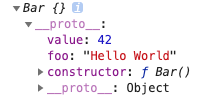
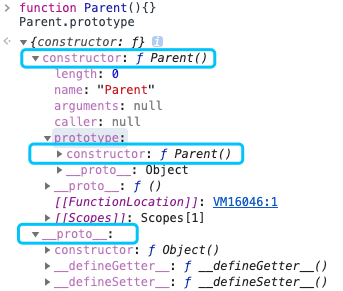
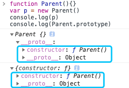
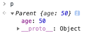

**Q：**
- 构造函数？
- 原型？
- 原型链？
- `Symbol` 是不是构造函数？
- `constructor` 是否只读？
- `prototype`、`[[Prototype]]` 和 `__proto__` 的区别？

## 构造函数

> `constructor` 返回创建实例对象时构造函数的引用。此属性的值是对函数本身的引用，而不是一个包含函数名称的字符串。

```javascript
function Parent(age) {
  this.age = age;
}

var p = new Parent(18);
p.constructor === Parent; // true
p.constructor === Object; // false
```

**构造函数本身就是一个函数**，与普通函数没有任何区别，不过为了规范一般将其首字母大写。

**构造函数** 和 **普通函数** 的区别在于：

- 使用 `new` 生成实例的函数就是 **构造函数**
- 直接调用的就是 **普通函数**

<br/>

普通函数创建的实例有 `constructor` 吗？ **不一定**

```javascript
// 普通函数
function parent2(age) {
    this.age = age;
}
var p2 = parent2(50);
// undefined

// 普通函数
function parent3(age) {
    return {
        age: age
    }
}
var p3 = parent3(50);
p3.constructor === Object; // true
```

<br/>
<br/>
<br/>

## Symbol 是构造函数吗

`symbol` 是一种基本数据类型（ [primitive data type](https://developer.mozilla.org/zh-CN/docs/Glossary/Primitive) ）。`Symbol()` 函数会返回 **symbol** 类型的值，该类型具有 **静态属性** 和 **静态方法**。它的静态方法会暴露全局的 `symbol` 注册，且类似于内建对象类，但作为构造函数来说它并不完整，因为它不支持语法：`new Symbol()`。

```javascript
new Symbol(123); // Symbol is not a constructor

Symbol(123); // Symbol(123)
```

<br/>

虽然是基本数据类型，但 `Symbol(123)` 实例可以获取 `constructor` 属性值。它来自 `Symbol` 原型上，即 `Symbol.prototype.constructor` ，它返回创建实例原型的函数。 默认为 Symbol 函数。

```javascript
var sym = Symbol(123);
console.log(sym); // Symbol(123)

console.log(sym.constructor); // ƒ Symbol() { [native code] }

```

<br/>
<br/>
<br/>

## constructor 值只读吗

- 引用类型：`constructor` 属性值是可以修改的。

- 基本类型：`constructor` 是只读的

<br/>

**1. 引用类型**：( 可以修改 )

- 如原型链继承方案中，就需要对 `constructor` 重新赋值进行修正。

```javascript
function Foo() {
  this.value = 42;
}

Foo.prototype = {
  method:function() { }
}

function Bar() { }

// 设置 Bar 的 prototype 属性为 Foo 的实例对象
Bar.prototype = new Foo();
Bar.prototype.foo = 'Hello World';

Bar.prototype.constructor === Object; // true

// 修正 Bar.prototype.constructor 为 Bar 本身
Bar.prototype.constructor = Bar;

var test = new Bar(); // 创建一个 Bar 的新实例
console.log(test);
```



<br/>

**2. 基本类型**：( 是只读 )

- 如 `1`、`'123''`、`true`、`Symbol`

- `null` 和 `undefined` 是没有 `constructor` 属性的。

```javascript
function Type() { }

var	types = [1, "123", true, Symbol(123)];

for(var i = 0; i < types.length; i++) {
	types[i].constructor = Type;
	types[i] = [
      types[i].constructor,
      types[i] instanceof Type,
      types[i].toString()
    ];
};

console.log( types.join("\n") );
// function Number() { [native code] }, false, 1
// function String() { [native code] }, false, muyiy
// function Boolean() { [native code] }, false, true
// function Symbol() { [native code] }, false, Symbol(123)
```

创建他们的是只读的原生构造函数（ `native constructors` ），也说明了依赖一个对象的 `constructor` 并不安全。


<br/>
<br/>
<br/>

## 原型（ prototype ）

`JavaScript` 是一种基于原型的语言（ prototype-based language ）,这个和 `Java` 等基于类的语言不一样。

:::tip
每个对象拥有一个 **原型对象**，对象以其原型为模板，从原型继承方法和属性，这些属性和方法定义在对象的构造函数的 `prototype` 属性上，而非对象实例本身。
:::



从上面这张图可以发现，`Parent` 对象有一个原型对象 `Parent.prototype`，其上有两个属性：

- `constructor`

- `__proto__`（ 已被废弃 ）

<br/>

构造函数 (`Parent`) 有一个指向原型的指针。

原型 `Parent.prototype` 有一个指向构造函数的指针 `Parent.prototype.constructor`, 如上图，其实就是一个循环引用。


<br/>
<br/>

**`__protp__`**

>  发音 `dunder proto`，最先被 Firefox 使用，后在 ES6 中被列为 Javascript 的标准内建属性。

上图可以看到 `Parent` 原型（ `Parent.prototype` ）上有 `__proto__` 属性，这是一个 **访问器属性**：

- 一个 `getter` 函数

- 一个 `setter` 函数

暴露了通过它访问的对象的内部 `[[Prototype]]`（ 一个 `对象` 或 `null` ）。

`[[Prototype]]` 是对象的一个内部属性，外部代码无法直接访问。


<br/>



- `p.__proto__`：获取对象的原型，`__proto__` 是每个实例上都有的属性。

- `prototype`：是构造函数的属性。

这两个并不一样，但 `p.prototype` 和 `Parent.prototype` 指向同一个对象

```javascript
function Parent() {}
var p = new Parent();

p.__proto__ === Parent.prototype; // true
```

<br/>

所以构造函数 `Parent`、`Parent.prototype` 和 `p` 的关系如下图。


<br/>

:::warning
遵循ECMAScript标准，`someObject.[[Prototype]]` 符号是用于指向 `someObject` 的原型。从 ECMAScript 6 开始，`[[Prototype]]` 可以通过 `Object.getPrototypeOf()` 和 `Object.setPrototypeOf()` 访问器来访问。这个等同于 JavaScript 的非标准但许多浏览器实现的属性 `__proto__` —— [MDN](https://developer.mozilla.org/zh-CN/docs/Web/JavaScript/Inheritance_and_the_prototype_chain)。
:::

:::warning
通过改变一个对象的 `[[Prototype]]` 属性来改变和继承属性会对性能造成非常严重的影响，并且性能消耗的时间也不是简单的花费在 `obj.__proto__ = ...` 语句上, 它还会影响到所有继承自该 `[[Prototype]]` 的对象，如果你关心性能，你就不应该修改一个对象的 `[[Prototype]]`。
:::

<br/>

如果要读取或修改对象的 `[[Prototype]]` 属性，建议使用如下方案，但是此时设置对象的 `[[Prototype]]` 依旧是一个缓慢的操作，如果性能是一个问题，就要避免这种操作。

```javascript
// 获取
Object.getPrototypeOf();
Reflect.getPrototypeOf();

// 修改
Object.setPrototypeOf();
Reflect.setPrototypeOf();
```

<br/>

如果要创建一个新对象，同时继承另一个对象的 `[[Prototype]]` ，推荐使用 `Object.create()`。

```javascript
function Parent() {
    age: 50;
}
var p = new Parent();
var child = Object.create(p);
```

这里 child 是一个新的空对象，有一个指向对象 p 的指针 __proto__。

<br/>
<br/>
<br/>

## 原型链

每个对象拥有一个原型对象，通过 `__proto__` 指针指向上一个原型，并从中 **继承** 方法和属性，同事原型对象也可能拥有原型，这样一层一层，最终指向 `null`。 这种关系被称为**原型链（ prototype chain ）**，通过原型链上一个对象会拥有定义在其他对象中的属性和方法。

<br/>

🌰

```javascript
function Parent(age) {
  this.age = age;
}

var p = new Parent(18);
p.constructor === Parent; // true
```

这里 `p.constructor` 指向 `Parent`，那是不是意味着 `p` 实例存在 `constructor` 属性呢？**并不是**。

<br/>

**打印下 `p` 值就知道了**。



可以看到实例对象 `p` 本身没有 `constructor` 属性，是通过原型链向上查找 `__proto__` ，最终查找到 `constructor` 属性，该属性指向 `Parent`。

```javascript
function Parent(age) {
  this.age = age;
}

var p = new Parent(18);

p; // Parent {age: 50}
p.__proto__ === Parent.prototype; // true
p.__proto__.__proto__ === Object.prototype; // true
p.__proto__.__proto__.__proto__ === null; // true
```

<br/>

**原型链的运行机制：**


<br/>
<br/>
<br/>

## 小结

- **构造函数**

  - _什么是构造函数 ？_

  - _Symbol 是构造函数吗 ？_

    - `Symbol` 作为构造函数来说并不完整，因为不支持语法 `new Symbol()`，但其原型上拥有 `constructor` 属性，即 `Symbol.prototype.constructor` 。

  - _constructor 值只读吗 ？_

    - 引用类型：是可以修改的。

    - 基本类型：是只读的。

    - null 和 undefined 没有 constructor 属性。

- **原型**

  - _prototype_

  - _\_\_proto___

  - _注意点_

    - `__proto__` 是每个实例上都有的属性，`prototype` 是构造函数的属性，这两个并不一样，但 `p.__proto__` 和 `Parent.prototype` 指向同一个对象。

    - `__proto__` 属性在 ES6 时被标准化，但因为性能问题并不推荐使用，推荐使用 `Object.getPrototypeOf()` 和 `Object.setPrototypeOf()` 访问器来访问`[[Prototype]]` 。

    - 如果你关心性能，你就不应该修改一个对象的 `[[Prototype]]`。


- **原型链**

  - _什么是原型链？_

    - 每个对象拥有一个原型对象，通过 `__proto__` 指针指向上一个原型，并从中 **继承** 方法和属性，同时原型对象也可能拥有原型，这样一层一层，最终指向 `null`，这就是原型链。

<br/>
<br/>
<br/>


> [对象原型](https://developer.mozilla.org/zh-CN/docs/Learn)
>
> [Object.prototype.constructor](https://developer.mozilla.org/zh-CN/docs/Web/JavaScript/Reference/Global_Objects/Object/constructor)
>
> [Object.prototype.__proto__](https://developer.mozilla.org/zh-CN/docs/Web/JavaScript/Reference/Global_Objects/Object/proto)
>
> [Symbol](https://developer.mozilla.org/zh-CN/docs/Web/JavaScript/Reference/Global_Objects/Symbol)
>
> [原型](https://bonsaiden.github.io/JavaScript-Garden/zh/#object.prototype)
