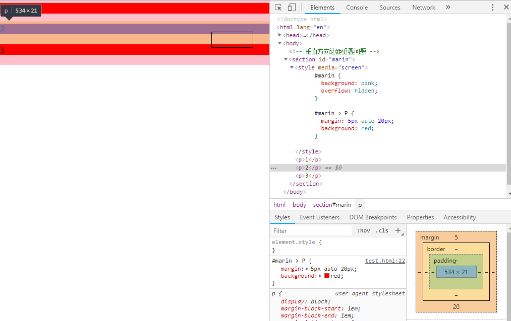
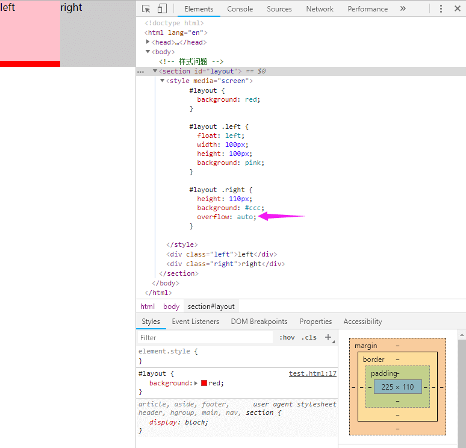
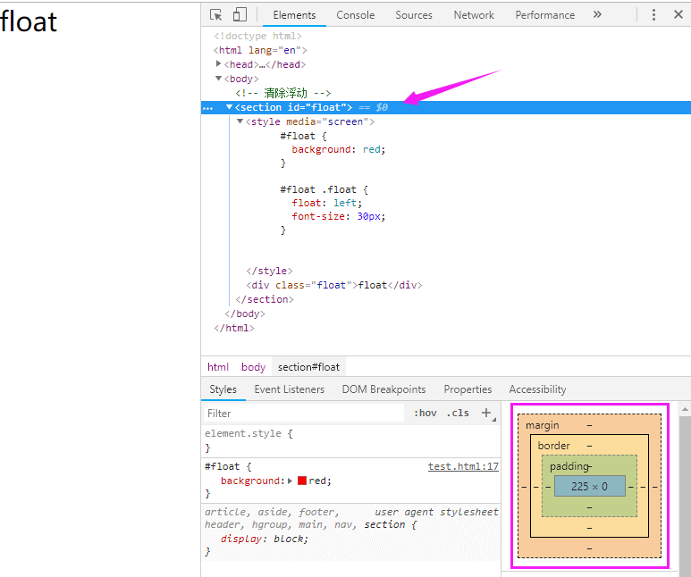
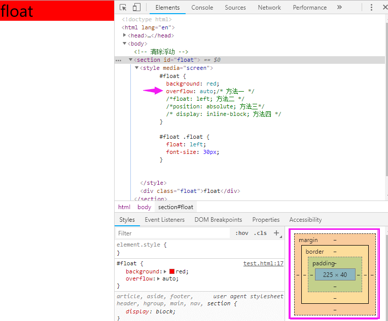

## CSS 盒模型
- 盒模型组成，由里向外 content, padding, border, margin。
- 盒模型有两种标准：标准模型 + IE模型

 

两者的区别就是在于宽和高的计算方式不同

>   标准模型：宽高是指的 content 的区域
  
>   IE模型：宽高是指 content + padding + border 的区域

<br/>

## CSS 设置类型
```css
/* 标准模型, 浏览器默认 */
.box {
  box-sizing: content-box;
}

 /*IE模型*/
.box {
  box-sizing: border-box;
}
```

## JS 获取宽高
``` js
// 获取DOM节点内联样式的宽高，style标签中，外联的CSS文件中都是获取不到的
DOM.style.width/height 

// 获取的是及时运行的宽高，也就是说支持所有样式的引入，但是只支持 IE
DOM.currentStyle.width/height 

// 这种方式的原理和2是一样的，这个可以兼容更多的浏览器，通用性好一些。
window.getComputedStyle(DOM).width/height 

// 这种方式是根据元素在视窗中的绝对位置来获取宽高的
DOM.getBoundingClientRect().width/height 

// 这个就没什么好说的了，最常用的，也是兼容最好的。
DOM.offsetWidth/offsetHeight
```


<br/>
<br/>
<br/>

::: warning
边距重叠通常在布局中会遇到
:::
-  父子元素边距重叠
-  兄弟元素边距重叠（取兄弟元素间相遇重叠的最大margin值）
-  空元素边距重叠（取兄弟元素间相遇重叠的最大margin值）
- ...

<br/>
<br/>
<br/>

::: tip
通常可以用 BFC（块格式化上下） 来解决
:::

## BFC 渲染规则
- 在 BFC 中的垂直方向的边距会发生重叠
- BFC 的区域不会与浮动元素的 box 重叠，常用来清除浮动
- BFC 在页面时是个独立的容器，外面的元素不会影响内部元素，反之，也一样
- 计算 BFC 高度的时候，浮动元素也会参与计算


## BFC 的创建使用

> 满足之一即可

- `float` 属性不为none
- `position` 为absolute或fixed
- `display` 为inline-block, table-cell, table-caption, flex, inline-flex
- `overflow` 不为visible

<br/>
<br/>
<br/>

### 栗子一 :（垂直方向边距重叠问题）


::: warning
可以看到，垂直方向的边距重叠了，只需要给某个元素创建一个BFC，即可
:::


<br/>
<br/>
<br/>

### 栗子二 :（样式问题）


::: warning
很明显right 侵入了 left，我们不希望它这样，很简单，给right 创建一个BFC，这样就不会与float元素重叠
:::



<br/>
<br/>
<br/>

### 栗子三 :（浮动问题）


::: warning
这里是因为子元素是浮动元素，父元素高度计算时，不会计算float元素，这里还是创建一个BFC即可
:::



