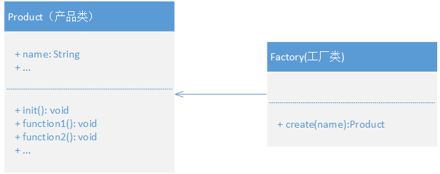
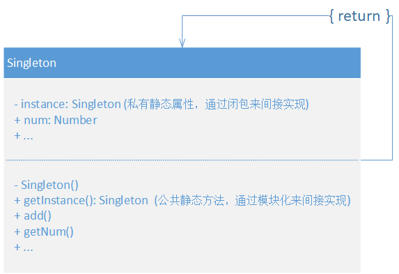

## UML 类图
:::tip
用 UML 类图可以展示出设计模式的表现形式，其中定义的关系主要有以下六种
:::

- 泛化
  - 在程序中通过“继承”来实现，也可以认为就是继承。
  - **空心三角形 + 实线**来表示，子类指向父类。
  
  
  
- 关联
  - 比依赖的关系更强，类A使用类B的实例作为自己本身的一个成员变量，类似引用。
  - **实线箭头**来表示，关联可以是双、单向。双向的关联可以有两个箭头或者没有箭头，单向的关联有一个箭头，指向被使用者。
  
  

  
- 实现
  - 是一种类与接口的关系，表示类是接口所有特征和行为的实现。
  - **空心三角形 + 虚线**来表示，从实现类指向接口
  
  
  
- 聚合
  - 是一种更强的关联关系，关联关系的特例。
  - 体现了整体与部分、拥有的关系，即“has-a”的关系，此时整体与部分之间可分离，它们可以具有各自的生命周期。注意：此时二者不是同级别的。
  - 例如车子和轮胎就是整体与部分的关系，轮胎离开车仍然可以存在，没那么强的约束关系。
  - **空心菱形 + 实线**来表示，范围小的指向范围大的（整体）。
  
  

  
- 组合
  - 也是关联关系的一种特例。
  - 也是整体与部分的关系，但是部分不能离开整体而存在，有共同的生命周期。即“contains-a”关系。
  - 例如公司和部门的关系，没有公司就不会有部门，关联更强。
  - **实心菱形 + 实线**来表示， 范围小的指向范围大的（整体）。

  
  

- 依赖
  - 是一种“使用”关系，即一个类（A）的实现需要用到另一个类（B），尽量不要使用双向的互相依赖。
  - 一般表现为类A中的方法需要类B的实例作为其参数或变量，但是类A本身并不需要引用类B的实例作为其成员变量。
  - **虚线箭头**来表示，使用者指向被使用者。
  
  
  
::: warning
Js 没有强类型语言的特性，虽说有 Ts，但最后还是要编译成 js。对于前端来说，设计模式相对于一些强类型语言就简单的多。
:::

<br/>

## 工厂模式
- 思路
  - 将 new 操作单独封装。
  - 明确地计划不同条件下创建不同实例时。
  - 统一在工厂类集中了所有对象的创建，操作。

- 优点

  - 使用者仅需使用产品，不需知道具体实现。
  - 扩展性高，如果想增加一个产品，只要扩展就可以。

- 缺点
  - 每次新扩展时，都会在一定程度上增加代码复杂度

- 栗子
  - 在饭店点菜时，只需要把菜名告诉服务员，坐等就好。而不用去关心用什么做，怎么做。

<br/>

> **UML**

  

<br/>

> **A simple example**

```js
class Product {
  constructor ({ name }) {
    this.name = name
  }
  init () {}
  fn1 () {}
  fn2 () {}
  
  // code ...
}

class Factory {
  create ({ name }) {
    // code ...
    return new Product(name)
  }
  
  // code ...
}


let creator = new Factory()
let test = creator.create('test')
test.init()
```

<br/>
<br/>
<br/>

## 单例模式
- 思路
  - 系统中被唯一使用
  - 只能有一个实例

- 优点
  - 减少性能开销，避免了频繁的创建和销毁实例
  - 避免对资源的多重占用

- 缺点
  - 不能继承

- 栗子
  - 购物车
  - Windows 是多进程多线程的，当在删除一个文件时，发现文件被其他应用所使用，系统会弹窗告诉你 xxx，无法删除。

<br/>

> **UML**




<br/>
<br/>

> **A simple example**


::: tip
java 实现：在类的内部 `私有化其构造函数` ，达到只能通过该类中的一个静态方法来使用该类的唯一实例，而不能通过外部 `new` 直接实例化。

js 实现：js 中想 `new` 几次随你，但可以通过模块化来间接实现。
:::


`Singleton.js`

```js
class Singleton {
  constructor () {
    this.num = 0
  }
  
  add () {
    this.num++
  }
  
  getNum () {
    console.log(`this.num is ：${this.num} `)
  }
}

// 不对外暴露 Singleton，而通过导出一个自执行闭包，来实现单例
let getInstance = (() => {
  let singleton
  
  return () => {
    if (!singleton) {
      singleton = new Singleton()
    }
    return singleton
  }
})()

export default getInstance
```

`test.js`

```js
import Singleton from './Singleton'

// 怎么开心怎么玩
let a = new Singleton()
let b = new Singleton()
let c = Singleton()

a.add()
a.getNum()

b.add()
b.getNum()

c.add()
c.getNum()

console.log('a === b ：', a === b);
console.log('b === c ：', b === c);
console.log('a === c ：', a === c);


// 这里可以看到，说明 a b c 都是指向上面所创建出来的单例
// this.num is ：1 
// this.num is ：2 
// this.num is ：3 
// a === b ： true
// b === c ： true
// a === c ： true
```
