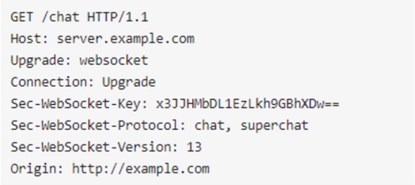
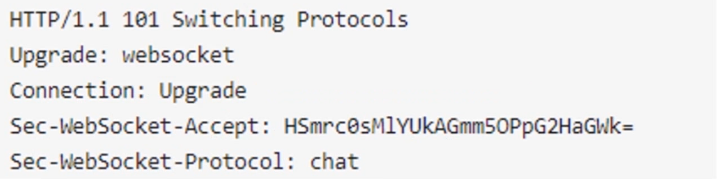
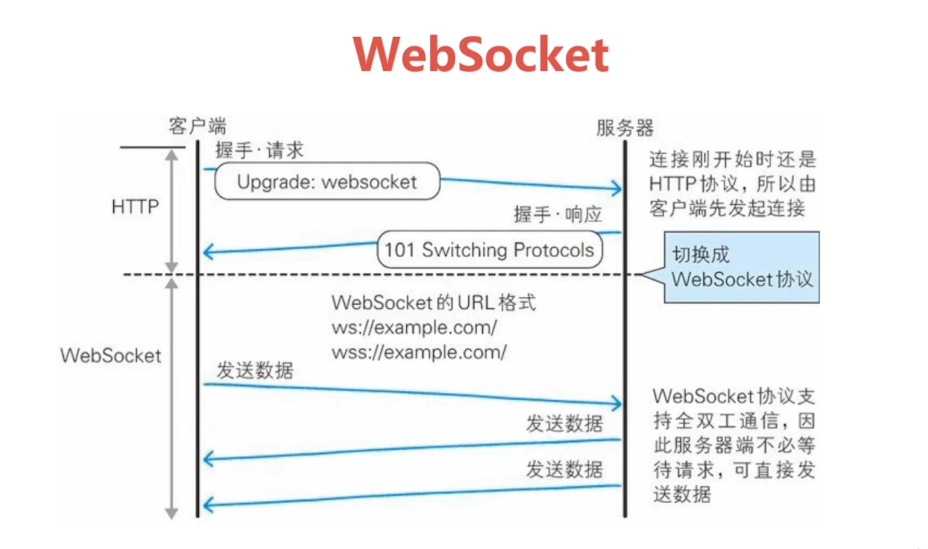
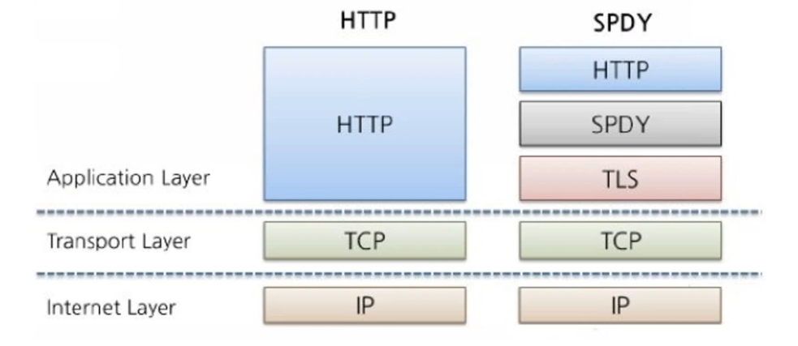
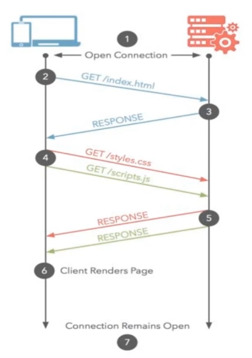
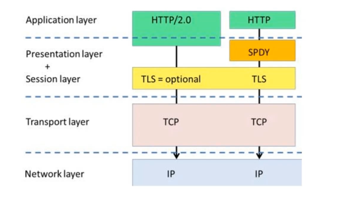

## HTTP协议的瓶颈

虽然 HTTP 协议既简单又快捷，但是随着时代的发展，它在功能使用上捉襟见肘的疲态已经凸显出来了。

伴随着计算机网络和浏览器的诞生，HTTP 也随之而来，出于计算机网络中的应用层，HTTP 协议是建立在 TCP 之上的，所以 HTTP 协议的瓶颈以及它的相关优化技巧都是基于 TCP 协议本身的特性。

 - TCP 建立连接的三次握手
 - 断开连接的四次挥手
 - 每次建立连接带来的 RTT 延迟时间。

 
 

早在 HTTP 成立之初，主要就是为了将 HTML 从 WEB 服务器传送到客户端的浏览器，也就是说，对于前端来说，我们所写的 HTML 页面将要放在我们的 WEB 服务器上，用户端通过浏览器访问一个简单的 URL 地址，来获取到网页，来显示内容，从 WEB 2.0 之后，我们的页面变得越来越复杂，不仅仅像是最早一样，是单纯一些简单文字，图片，现在还有了 css ，javascript 丰富了我们的页面展现形式，当 ajax 这种在前端来交互后端来请求这种方式出现，又多了一种请求方式，无论 ajax，http 请求，都是基于 HTTP 的。

 
 
 

**影响 HTTP 网络请求的因素**

 - 宽带

   - 现在不是问题了。

 - 延迟

   - **浏览器阻塞**：浏览器对于一个域名同时可请求的连接有限制。（ 不同浏览器内核不同 ）

   - **DNS 查询**：可使用 DNS 缓存进行优化。

   - **建立连接**：是基于 TCP 协议的，浏览器最快也只能在第三次握手的时候，才能捎带 HTTP 请求的报文，达到真正的建立连接。但是这些连接无法复用，会导致每次请求都要经历 **三次握手** 和 **慢启动**。

     - **三次握手**：在高延迟的场景下的影响是特别明显的。

     - **慢启动**：对文件类大请求影响较大。

 
 
 

**HTTP协议的瓶颈**

 - 一条连接上只可以发送**一个**请求。
 - 请求只能**从客户端开始**。客户端不能介绍除响应以外的指令。
 - 请求/响应头部**不经压缩**就发送。
 - 每次互相发送**相同**的头部造成的浪费较多。
 - 非强制压缩发送。

 
 
 

## 双工通信的WebSocket

**WebSocket 的 "握手"**

 
 
 

**服务器返回**

 
 
 

**客户端**：我要建立 WebSocket 协议，需要的服务：chat，WebSocket 协议版本：17

**服务端**：OK，已升级为 WebSocket 协议。

**客户端**：麻烦你有消息的时候推送给我吧。

**服务端**：OK，有消息的时候会告诉你的。

...

...

...

**服务端**：来了新消息。

...

...

...

**服务端**：又来了新消息。

 
 
 

 - 相对于传统的 HTTP ，每次请求应答都需要**客户端**与**服务端**建立连接的模式。

 - WebSocket 是类似 Socket 的 TCP 长连接通信模式，一旦 WebSocket 建立通信连接之后，后续的数据都以帧序列的模式传输，在客户端断开 WebSocket 连接，或者服务器端中断连接之前，不需要在发起什么连接服务了。

 
 
 

**WebSocket 的特点**

 - 真正的 **全双工方式**
 - 减少 **通信量**

 
 
 

## 探索式的实践-SPDY

> Google 提出的 SPDY

在 TLS 和 HTTP 之间，增加了 SPDY 会话层。

 
 
 

**HTTP 的缺陷**

 - 单路连接 请求低效

   - 每个 TCP 连接只能对应一个 HTTP 请求，也就是每个 HTTP 请求只能请求一个资源。

   - 浏览器只能创建多个连接，来解决这个低效的问题，此外在 HTTP 中对请求是严格的，先入先出，如果中间某个请求处理时间比较长的话，就会阻塞后面的请求。

 - HTTP 只允许由客户端主动发起请求

 - HTTP 头部冗余

   - 在同一会话中，它是反复来传输的，这中间有很多不需要重复发送的信息。

 
 
 

**SPDY 的改进**

  - 多路复用 请求优化

    - SPDY 规定，一个 SPDY 连接内，可以有无限个并行的请求。也就是说，它允许多个并发的 HTTP 请求共用一个 TCP 会话

    - 这样 SPDY 通过复用在单个 TCP 连接上的多次请求，而非为每个请求单独开放连接，这样只需要建立一个 TCP 连接，就能获取到一个网页上的所有资源，不仅仅可以减少消息交互往返的时间，还可以避免不断多次创建新连接造成的延迟，使 TCP 连接的效率发挥到最好。

    - SPDY 多路复用，可以设置优先级，而非传统 HTTP 一样，严格按照先进先出，一个一个处理请求。可以避免让非关键资源占用网络通道的问题。

 - 支持服务器推送技术

   - 服务器可以主动向客户端发起通信、推送数据，这用预加载可以使用户一直保持一个快速的网络

   - 例如，在我们的网页中有一个 css，叫 style.css。然后在客户端收到 style.css 的同时，服务端将会把这个
style.js 也推送到客户端，这个时候客户端还没有去请求 style.js，当客户端真的需要 style.js 的时候，就可以直接从本地存储中获取到了，不用再发请求了，对用户第一次访问网站会有特别大的提升。这个推送和 WebSocket 的推送不一样，这个是资源类的推送。

 - SPDY 压缩了 HTTP 头

   - 舍弃了一起不必要的 head 信息，可以节省多余数据传输带来的等待时间、占据的带宽、...

 - 强制使用 SSL 传输协议

 
 
 

**SPDY 的意义**

对于**普通用户**来说：对于浏览器、APP、HTTP 请求的终端使用者来说，隐藏在浏览器之下的 SPDY，相对于 HTTP 来说，其实根本感受不到任何区别，但是能感受到的是网页刷新访问的速度异常的变快了，尤其对于我们从来没有访问过的网站来说，速度也变得非常快，也无需担心数据的安全性。

对于**前端人员**来说：提升网页效率是一个非常非常重要的事，例如使用 CSSsprite （ 雪碧图 ），css 压缩等等一些方法来优化网站，因为页面加载图片、图标的时候，都请求一个连接，甚至采用在不同页面引用不同的图片来减低同一个页面内请求的数量，现在 SPDY 可以将请求资源的顺序进行编排，这样可以在很大的程度上缓解了我们页面加载时图片请求带来的一些影响。例如访问淘宝、微博，一旦网速稍微慢点，就会出现页面加载异常。又如 苹果的AppStore 中图标刷新非常缓慢。这些都可以交给 SPDY 的多路复用、优先级顺序来最大程度的搞定。

对于**运维人员**来说：SPDY 在降低连接数的同时，还使得服务器上每个客户端占用的资源也减少了，从而释放更多的内存和CPU，SPDY 综合一起，可以将访问速度提升一倍（ Google 实验，提升 64%，还未推广开，就已经被 HTTP 2.0 取代了，Google 也放弃的 SPDY，加入了 HTTP 2.0 的建设 ）。

 
 
 

## HTTP2.0

 
 
 

**HTTP2.0 性能增强的核心：二进制分帧**

**二进制分帧**：

  - 这是它和 HTTP1.0、SPDY 完全不一样的地方。

  - 这也是 HTTP2.0 最大最大的特点。

  - 在不会改变改动 HTTP 的语义、方法、状态码、URI、首部字段、... 核心概念的情况下，做出了一个突破 HTTP1.1 标准的性能限制，改进传输性能，实现这种低延迟、高吞吐量。

  - 所以新增了一个 **二进制分帧层**，既要保证这个 HTTP 各种动词、动作、方法、首部都不受影响。这就需要在 **应用层（ HTTP2.0 ）** 和 **传输层（ TCP ）** 之间，增加 **二进制分帧层**。

  - 在二进制分帧层上，HTTP2.0 会将所有的传输信息分割成更小的消息和帧，并且对它们采用这种二进制格式的编码。

    - HTTP1.0 它里面的首部消息，会被封装到 HEADERS frame（ headers 帧 ）

    - HTTP1.1 request body（ `{ "msg": "hello" } `），会被封装到 DATA frame（ data 帧 ）

    - HTTP2.0 都在一个链接上完成，这个链接可以承接任意数量的双向数据流，每个数据流都以消息的形式发送，而消息由一个、多个帧组成。这些帧可以乱序发送，然后在根据每个帧首部的流标识符重新组装。

 
 
 

> 但是所有的二进制帧都会带上 Headers 帧，这是多大的数据冗余，难道性能不会变差吗？？？？？？

HTTP2.0 在客户端和服务端使用一种**首部表**，来跟踪和存储之前发送的键值对，对于相同的数据不在通过每次请求和响应发送，通信期间几乎不会改变通用的键值对。事实上，如果请求中不包含首部，那么首部的开销就是0字节，此时就会使用之前发送所使用的首部。

如图，Request1 和 Request2 同样的请求，我们在发送 Request2 的时候发现，很多都是相同的键值对，只有 path 变化了，所以在我们首部发生变化的时候，只需要发送这种变化的数据在 headers 帧里面，新增或者修改首部帧会被在追加到一个首部表里面，就是图中，上右方的首部表中，它会不断的更新，它在 HTTP2.0 的连接存续期内是始终存在的。由客户端和服务端共同渐进的去更新。

**HTTP1.1**： head 里面带有大量的信息，而且每次都要重复发送。

**HTTP2.0**： 使用压缩的方式来减少需要传输的 Head 大小，通讯双方各自存储一份首部表，既避免的 Head 的重复传输，又减小了需要传输的大小。这样即使有很多的请求，也不会因 Head 的原因，影响到性能。

 
 
 

> 对于类似的雪碧图在 HTTP2.0 中能带来多大的提升呢？？？？？？

**HTTP2.0 多路复用**

HTTP2.0 中的所用通信，都在一个 TCP 连接上完成，HTTP2.0 把 HTTP 协议通信的基本单位缩小为一个一个的帧，这些帧对着逻辑流中的信息。并行的在同一个 TCP 连接上，双向交换信息。

例如，我请求一个页面，叫 http://www.baidu.com ，页面上所有的资源请求，都是客户端和服务器上的一条 TCP 上，请求和响应的。我们也知道 HTTP 性能提升的关键

  1. **带宽**，现在都是高带宽，所以带宽问题也已经不存在了。
  2. **延迟**，而在于低延迟，大多数的 HTTP 连接的时间都很短，而且是突发性的。但是 TCP 只在长时间传输连接的时候，传输大块数据的时候，效率才是最高的，HTTP2.0 就通过这种让所有数据流共用一个 TCP 连接，可以更有效的使用 TCP 连接。让高带宽也能真正的服务于 HTTP 的性能提升。

 
 
 

**单链接多资源的又优势**

 - 可以减少**服务链接压力**，内存占用少了，连接吞吐量大了。

 - 由于 TCP 连接减少而使**网络拥塞状况**得以改观。

 - 慢启动时间减少，**拥塞**和**丢包**恢复速度更快。

 

:::tip

对于 HTTP2.0 来说，**资源合并减少请求**的手段，是没有什么效果的，只会增大无用的工作量而已。

:::

 
 
 
 
 
 

- 在HTTP2.0上，客户端和服务器可以把HTTP 消息分解为互不依赖的帧，然后乱序发送，最后再在另一端把它们重新组合起来。

- 注意，同一链接上有多个不同方向的数据流在传输。客户端可以一边乱序发送stream，也可以一边接收服务器的响应，而服务器那端同理。

- 把 HTTP 消息分解为独立的帧，交错发送，然后在另一端重新组装是 HTTP 2.0 最 重要的一项增强。事实上，这个机制会在整个 Web 技术栈中引发一系列连锁反应，从而带来巨大的性能提升。

  - 可以并行交错地发送**请求**，请求之间**互不影响**;

  - 可以并行交错地发送**响应**，响应之间**互不干扰**;

  - 只使用一个连接即可**并行发送**多个请求和响应;

  - 消除不必要的延迟，从而减少页面加载的时间;

**也就是说“域名分区”这种优化手段对于HTTP2.0是无用的，因为资源都是并行交错发送，且没有限制，不需要额外的多域名并行下载。**

 
 
 

> 既然所有的资源都是并行交错的发送，那么会不会出现 "浏览器明明在等关键的 CSS 和 JS，服务器还在发送图片" 呢？？？？？？

**请求优先级**

 - 高优先级的流都应该优先发送

 - 优先级不是绝对的

 - 不同优先级混合也是必须的

 
 
 

**服务器推送**

毕竟 HTTP2.0 的核心还是从 SPDY 的基础上衍生而来。

服务器可以对一个客户端请求，发送多个响应，话句话说，除了对最初请求的响应之外，服务器还可以额外向客户端推送其他资源，而无需客户端明确的请求。所以当浏览器请求 HTML 的时候，服务器其实大概知道，你接下来要请求资源了，而不需要等待浏览器等到 HTML 之后，解析页面，在发送资源请求，有了 HTTP2.0 服务器推送呢，使用我们服务器推送资源的方式就更加高效了，因为我们客户端可以缓存起来，甚至可以由不同的页面共享。

 
 
 
