## HTTP与HTTPS

**HTTP**

 - http 协议（ 超文本传输协议 ），位于 TCP/IP 四层模型当中的应用层，然后 http 通过请求响应的方式在客户端和服务端之间进行通信。

 - http 协议什么都好，就是不够安全。因为 http 协议的传输，完全是以明文的方式，不做任何加密，相当于在网络上裸奔。

 
 
 

**例子一**

1、男孩对女孩说：我喜欢你。

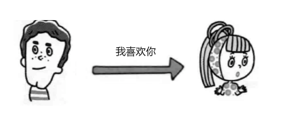

2、由于是明文发送，如果中间被人拦截，他不仅可以看，还可以篡改（ 这就是中间人攻击 ）。

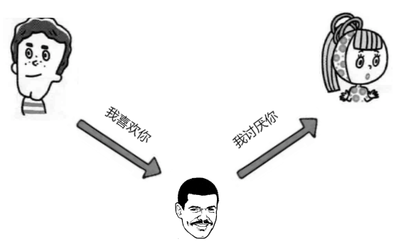

3、... 凉凉。

 
 
 

**例子二（ 对称加密 ）**

或许，我们可以使用加密的方式，进行聊天。
 - 1、**对称加密:**（ 也叫秘钥加密 ），就是指加、解密使用的都是相同的秘钥。
 - 2、**非对称加密:**（ 也叫公钥加密 ），就是指加、解密使用的不是相同的秘钥。

 
 
 

1、男孩先发送聊天请求，女孩回复给男孩一个秘钥。之后的发送消息钱都用秘钥加密一下。

  事先两人约定一个加密方式，并随机生成一个加密的秘钥。
  - 发送方，使用秘钥加密。
  - 接受方，使用秘钥解密。

 

2、加密后，其他人就看不懂了。

 

3、如果说，**第一次约定加密方式** 和 **约定加密方式之后的秘钥** 的通信，依然还是明文。依然可以被中间人拿到。

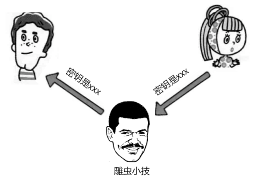

 

4、... 凉凉。

 
 
 

**例子三（ 非对称加密 ）**

非对称加密的秘钥中，包括一个公钥和一个秘钥

 - 明文既可以使用公钥加密，私钥解密。
 - 也可以使用是要加密，公钥解密。

 
 
 

1、在两人建立通信的时候，女孩会先把自己的公钥（ KEY1 ）给到男孩。

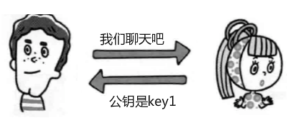

 

2、男孩收到公钥（ KEY1 ）后，男孩自己生成了一个用于对称加密的秘钥（ KEY2 ），然后呢，这个秘钥是为了后续聊天加密来用的，就是上次别中间人发现的秘钥，为了安全，我们不在直接明文约定发送，而是用刚才接收到的公钥（ KEY1 ）对这个 KEY2 进行加密，然后得到了 VA3，把这个发送给女孩。

 

3、女孩就可以用自己的非对称加密的私钥，来解开公钥（ KEY1 ）的加密，获得了 KEY2 的内容，从此以后呢，两个人就能用 KEY2 进行对称加密通信。

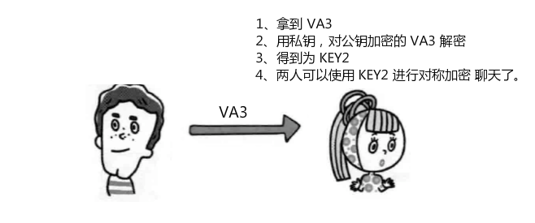

 

4、终于可以进行聊天了？？？即使，中间人，从一开始就拦截到 KEY1，由于没有对应的私钥，也是无用的？？？

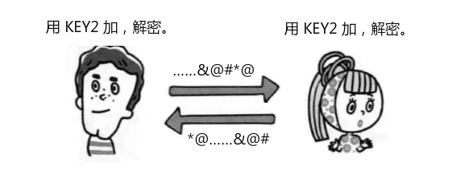

 

5、！！！！！！！！！！！！！ 如果中间人把原本的 KEY1 给掉包，换成自己的 KEY3  ！！！！！！！！！！！！！

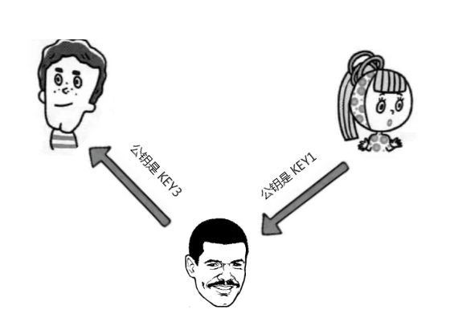

 

6、！！！！！！！！！！！！！ emmmmmmmmmm  ！！！！！！！！！！！！！

  - 这样，中间人依然可以捣乱，而男孩和女孩对此并不知情。

 

7、 ... 凉凉。

 
 
 

**这个时候，就只能依赖于一些权威的三方证书机构了。**

1、女孩先把自己的公钥 KEY1 发给证书颁发机构。由证书颁发机构去申请证书。证书颁发机构自己也有一对公钥和私钥，机构利用自己的私钥来加密 KEY1，并且通过服务器网址信息生成一个证书签名，证书签名同样的经过了机构的私钥加密，这样就制作了一个证书，最后给到女孩。

 

2、当后续，两人在进行通信的时候，女孩就不在给男孩返回公钥了 KEY1 了，而是把自己申请的证书返回给男孩。

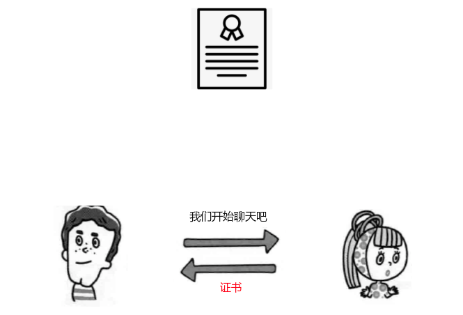

 

3、男孩收到证书后

  - 第一件事情就是去验证证书的真伪（ 各大浏览器和操作系统已经维护了所有权威证书机构的名称和公钥 ）
  - 所以男孩只需要知道是哪个机构颁布的证书，就可以从本地找到对应的机构公钥，解密出证书的签名
  - 接下来，男孩就可以按照同样的签名规则，自己也生成一个证书签名，如果两个签名是一致的，说明证书是有效的
  - 验证成功以后，男孩就可以放心的再次利用机构的公钥解密出女孩的公钥 KEY1
  - 然后就和之前一样了，小峰生成对应自己对称加密的秘钥 KEY2，并且用女孩给的 KEY1 加密 KEY2，生成加密结果 VA3

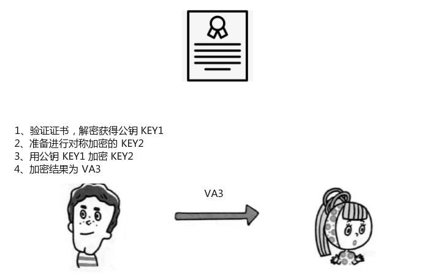

 

4、女孩收到后，用自己的私钥进行解密

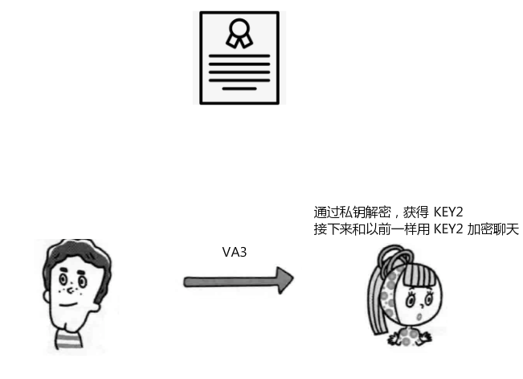

 

5、获取 KEY2，使用 KEY2 进行加密聊天。

 

6、中间人是否还有使坏的空间呢？

  - 如果中间人自己也申请一个证书，并且把女孩准备给男孩的证书偷偷换成自己的证书？

  - 由于证书的签名是有服务端的网址、...、等等信息，一起生成的，并且通过了机构的私钥加密，中间人也是没办法篡改的，所以中间人将自己的证书给到男孩，最后男孩验证的时候也是无法通过的。

:::tip
简单来说，HTTPS是在HTTP的基础上，增加了一个安全层，这一系列的认证，加密的流程都是在安全层进行完成的。
:::

 
 
 

## HTTPS协议概述

**HTTPS（ 可以认为是 HTTP + TLS ）**

  - TLS 是传输层加密协议，它的前身是 SSL 协议。

    -  应用数据层协议
    -  握手协议
    -  报警协议
    -  加密确认消息协议
    -  心跳协议

  - 位于传输层和应用层之间，TLS 实际上是 TCP 之上建立了一个加密通道

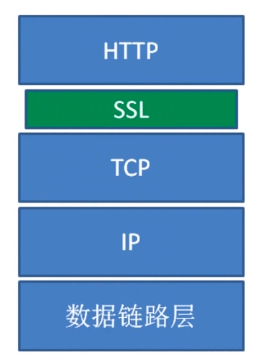

 
 

**HTTPS功能**

  - 内容加密

    - 非对称秘钥交换

    - 对称内容加密

    HTTP 本身是明文传输的，没有经过任何的安全处理，例如我们在百度搜索了一个关键字，比如关键字是苹果手机，中间人完全能查看这个消息，并且有可能打电话过来骚扰客户，也有一些用户投诉百度的时候，发现在使用百度的过程中，首页或者结果页悬浮着一条很长很大的广告，这也是中间者插的广告，如果劫持技术还比较低劣的话，用户甚至没有办法访问百度，直接就别劫持走了，更有前面说过的，中间人不仅仅能窃听你的通信内容，甚至可以去篡改内容，这里提到的中间者，主要是一些网络节点，是用户数据在浏览器和百度服务器中间传输必须要经过的节点（ WIFI热点、路由器、防火墙、反向代理、缓存服务器、... ），这也就是为什么一直有这么一个消息，就是说让我们不要乱用公共场合的 WIFI，很容易别中间人攻击，在这种情况下，中间人和容易去嗅探用户的信息，窃取隐式，篡改网页，篡改消息。所有了 HTTPS。

  - 身份认证

    - 数字证书

    由于证书的存在，保证用户想访问的服务就是自己想访问的服务，例如想访问百度，那么 HTTPS 能保证你此时访问的是百度，即使被 DNS 劫持到了第三方站点，也会提醒用户当前没有访问百度服务，有可能被劫持，这么一些提示信息。

  - 数据完整性

    - 防止我们的内容被第三方冒充、篡改

 
 
 

## HTTPS使用成本

1、证书费用以及更新维护

2、HTTPS 降低用户访问速度，但可优化

3、消耗 CPU 资源，需要增加大量机器，非对称秘钥交换是消耗 CPU 的大头，对称的加解密也需要 CPU 的计算。

 
 
 

## HTTPS对性能的影响

1、协议交互所增加的网络 RTT（ Round-Trip Time：往返时延 ），是指数据从**发送端发送数据开始**，到 **发送端收到来自接受端的收到确认** 的时延。

  - 发送时延
  - 传播时延
  - 排队时延
  - 处理时延

2、加解密相关的计算耗时

 
 
 

忽略了 DNS 主域名的解析时间。

**HTTP**

  - 用户只需要完成 TCP 三次握手，建立 TCP 连接，就能直接发送 HTTP 请求，获取应用层的数据。

 

**HTTPS**

相比于 HTTP，***可能会多增加 7 个 RTT***。

  - 三次握手，建立 TCP 连接，耗时一个 ***RTT***。

  - HTTP GET 请求，服务端返回 302 ，跳转到 HTTPS ，耗时一个 RTT 和 302 的跳转延迟。（ 用户一般都是输入 baidu.com，而不是 https://www.baidu.com ）

  - 跳转后，端口都发生变化，需要重新进行三次握手，建立 TCP 连接，耗时一个 ***RTT***。

  - TLS 完全握手阶段1，主要完成加密套件的协商、证书的身份确认，耗时一个 ***RTT***。

    - 服务端和浏览器会协商出来相同的 秘钥交换、对称加密、内容一致性校验、证书签名算法、...

    - 浏览器收到证书后，也需要校验证书的有效性，比如证书是否过期、撤销、...

    - 接下来，浏览器获取证书里的 CA 证书域名，如果 CA 域名没有命中缓存的话，浏览器需要解析 CA 域名的 DNS，这个 DNS 域名解析，至少耗时一个 ***RTT***。

    - DNS 解析拿到 IP 后，需要完成三次握手，建立 CA 站点的 TCP 连接，这又耗时一个 ***RTT***。

    - 在接着浏览器发送 Ocsp 请求（ Online Certificate Status Protocol 在线证书状态协议 ），获取响应，耗时一个 ***RTT***。

  - TLS 完全握手阶段2，主要是进行的秘钥协商，耗时一个 ***RTT*** 和 计算时间。

  - 最后在进行应用层的数据传输。

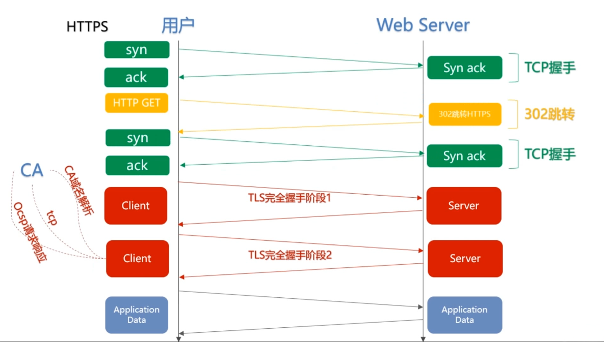

 

:::warning
这也仅仅是光描述了 HTTPS 关键路径上，必须消耗的纯网络耗时，没有包括非常消耗 CPU 资源的浏览器、服务器计算耗时。
:::

 
 
 
