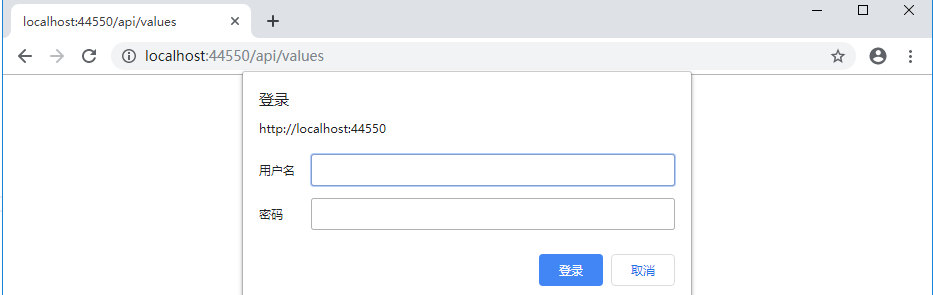
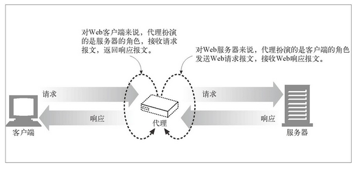
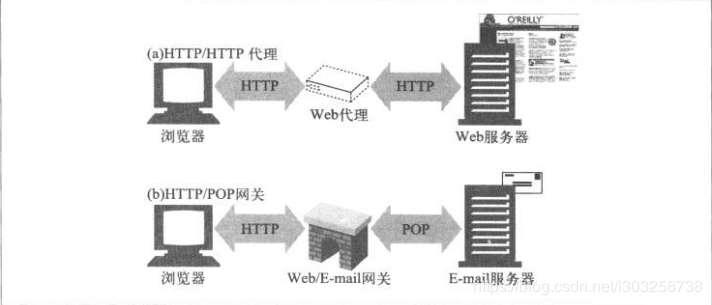
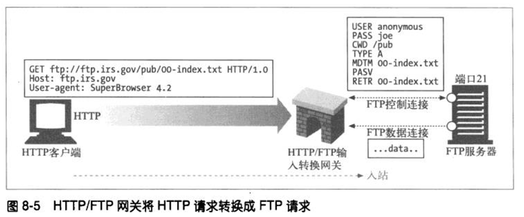
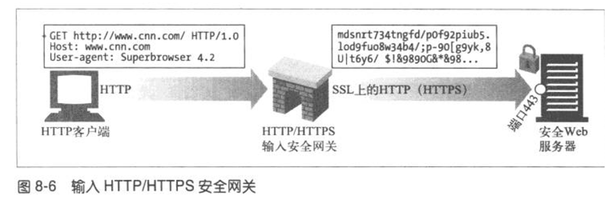
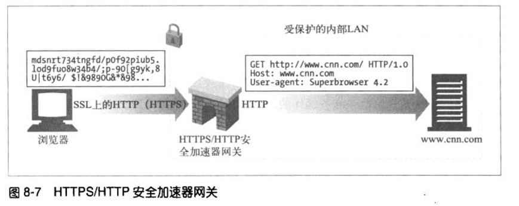
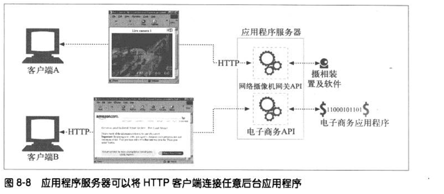

## HTTP协议中的编码和解码
- 什么是编码？
    - 编码是信息从一种形式或格式转换为另一种形式的过程，也称为计算机编程语言的代码简称编码。

- 为什么需要编码？
    - 实际上计算机是一个二进制系统，只认识的就只有 0 和 1，所有的操作最终都是二进制序列，所以我们需要统一的编码转换格式。

    - 所以计算机解析的是一堆0101的二进制，而我们希望展示成看得懂的母语（字符），为了把它显示成字符，国际组织就指定了一套编码规范，使用不同的二进制数来表示不同的字符，这样电脑就能根据不同的二进制数显示不同的字符，我们通常称之为 xx编码，xx字符集。

    - 所以我们应该见过 GBK 的编码规范，根据该规范，计算机能将中文字符与二进制字符之间来回转换，这是其中的一种。

    - 一套完整的编码规范，会有三个子概念，一套编码规范，不一定包含世界上所有的字符，每套编码规范都有自己使用的场景。

        - 字符表：存储编码规范中能显示的所有字符，计算机就是根据二进制数从字库表里找到对应的字符。

        - 字符集：在一个字库表里，每一个字符都有一个对应的二进制地址，而字符集就是这些地址的集合。（例如 ASCII 编码字符集中），字母 A 的序号，它的地址是 65 ，所以 65 的二进制就是 01000001，我们可以说编码字符集就是用来存储这些二进制数的，而这个二进制数就是编码字符集中的一个元素，同时它也是字库表中字母 A 的地址，我们根据这个地址就可以显示字母 A 。字库表和字符集是一一对应，相互转换的，这也是电脑识别字符的关键。

        - 编码方式：当我们知道字符表和字符集以后，我们就可以直接使用二进制的地址来得到字符了，但直接使用字符对应的二进制地址来显示文字，显然是十分麻烦，而且浪费的，因为它很长，于是就制定了一套算法来节省空间，而每种不同的算法都被成为一种编码方式，一套编码规范可以有多种不同的编码方式，不同的编码方式有不同的适用场景。（例如 UTF-8 编码方式，而它所对应的编码规范叫做 Unicode，Unicode 是一种编码规范，除了 UTF-8，还有 UTF-16,UTF-32, 不同的编码方式所节约的空间不一样，总而言之就是一个较短的二进制数通过一种编码方式转化成编码字符集中对应的地址，然后在字库表中找到一个对应的字符，最终显示出来）

常见的编码规范 ASCLL码、GBK、ISO-8859-1、Unicode。

- 什么时候会出现乱码？

    - 解码过程：一串二进制字符数 使用一种编码方式 转换成了字符，这个过程，我们称之为解码，就像解开密码一样，程序猿可以选用任意的编码方式来进行解码，但往往只有一种方式可以解开密码，但是我们及时每种编码方式都可以将这串二进制字符数解开，只不过会产生不合理的字符。

    - 编码过程：一串已经解码后的字符，我们也可以选用任意一类型的编码格式重新转换成一串二进制字符数，我们称之为编码，也可以理解为加密，无论任何的编码方式进行编码，最终都是产生成计算机可识别的二进制数，但是编码规范的字库表里不包含目标字符，那就无法在字符集中找到对应的二进制数，这就导致不可逆的乱码。（例如 ISO-8859-1 的字库表里不包含中文，哪怕将中文用该方式编码，在使用该方法解码是无法还原原来的中文了）

    所以，乱码就是 编码和解码所使用的编码方式不一致，或者编码的时候它的字库表里不包含对应的字符所导致的结果。

 
 
 

URL 的编码与解码

- URL 是采用 ASCII 字符集进行编码的，所以如果 URL 中含有非 ASCII 字符集中的字符，要对其进行编码。

- URL 中一些保留字符，如 '&' 表示参数分隔符，如果想要在 URL 中使用这些保留字，那就需要编码。

- '%编码' 规范

- 对 URL 中属于 ASCII 字符集的非保留字不做编码；对 URL 中的保留字需要取其 ASCLL 内码，然后加上 '%' 前缀将该字符进行编码；对于 URL 中的非 ASCII 字符需要取其 Unicode 内码，然后加上 '%' 前缀将该字符进行编码。

 
 
 

## HTTP协议之基本认证

- HTTP 协议之身份认证
    - 密码
    - 动态令牌
    - 数字证书
    - 生物认证
    - IC 卡...

 
 

- 常见认证方式
    - BASIC 认证（基本认证）

         

        

         

        Basic认证是一种较为简单的HTTP认证方式，客户端通过明文（Base64编码格式）传输用户名和密码到服务端进行认证，通常需要配合HTTPS来保证信息传输的安全。

         

        

         

        **缺陷**

        - 1.用户名和密码明文（Base64）传输，需要配合HTTPS来保证信息传输的安全。
        - 2.即使密码被强加密，第三方仍可通过加密后的用户名和密码进行重放攻击。
        - 3.没有提供任何针对代理和中间节点的防护措施。
        - 4.假冒服务器很容易骗过认证，诱导用户输入用户名和密码。

         

    - DIGEST 认证（摘要认证）

         

        Digest认证是为了修复基本认证协议的严重缺陷而设计的，秉承“绝不通过明文在网络发送密码”的原则，通过“密码摘要”进行认证，大大提高了安全性。

        

         

        - 相对于基本认证，主要有如下改进：
            - 绝不通过明文在网络上发送密码
            - 可以有效防止恶意用户进行重放攻击
            - 可以有选择的防止对报文内容的篡改

    - SSL 客户端认证

        - SSL 客户端认证是借由 HTTPS 的客户端证书完成认证的方式。凭借客户端证书认证，服务器可确认访问是否来自己登录的客户端。

    - FormBase 认证（基于表单认证，使用最广泛，主流认证）

        - 基于表单的认证方法并不是在 HTTP 协议中定义的。
        - 使用有 Web 应用程序各自实现基于表单的认证方式。
        - 通过 cookie 和 session 的方式来保持用户的状态。

 
 
 

## HTTP中长连接与短连接

长链接：就好比一条连同 A 、B 两地的地铁，不间断的为许多人进行服务（持久连接、连接不断开、连续用这个通道传输数据）。
短连接：就好比一锤子买卖

 
 

1、HTTP 协议是基于请求/响应模式的，因此只要服务器给了响应，本次 HTTP 请求就结束了。

  - HTTP 请求结束后，就断开，根本谈不上长短链接这一说。
  - 但是 HTTP 协议是属于应用层协议，在传输层使用的是 TCP 协议（主要解决的就是，如何在 IP 层之上可靠的传递数据包，使在网络上的另一端能收到发端发出的所有包，并且顺序与发出顺序一致），在网络层是 IP 协议（主要解决的是网络路由、寻址、...）。
  - 由此可知 HTTP 的长链接和短连接本质上是 TCP 长连接和短连接

2、HTTP 的长链接和短连接本质上是 TCP 长连接和短连接

  - TCP 链接是一个双向通道，它是可以保持一段时间不关闭的，因此 TCP 才有长连接、短连接之说。

3、HTTP/1.0 中，默认使用的是短链接。也就是说，浏览器和服务器每进行一次 HTTP 操作，就建立一次连接，结束就中断。

4、HTTP/1.1 起，默认使用长连接，用以保持链接特性。

  - 如果在 Response Headers 中 Connection: keep-alive 的话，简单地说，当一个网页打开完成后，客户端和服务器之间用于传输 HTTP 数据的 TCP 连接不会关闭，如果客户端再次访问这个服务器上的网页，会继续使用这一条已经建立的 TCP 连接。但是 Keep-Alive 不会永久保持连接，它有一个保持时间，可以在不同的服务器软件中设定这个时间。

 
 
 

- 短连接
  建立连接--数据传输--关闭链接 ... 建立链接--数据传输--关闭连接( 一般由 Client 主动关闭 )

- 长连接
  建立连接--数据传输 ... ( 保持链接 ) ... 数据传输--关闭连接( 一般由 Server 主动关闭 )

 
 
 

## HTTP中介之代理

- 抓包
- FQ

  - VPN 看起来和代理很像，实际上原理完全不一样。
  - 对于 VPN 来说，隧道技术是一个关键技术，实现两个节点间（VPN网关之间，或VPN网关与VPN远程能过户之间）的安全通信，使数据包在公共网络上的专用隧道内出传输。隧道技术的实质是用一种网络层的协议来传输另一种网络层协议，其基本功能是封装和加密，主要利用网络隧道来实现。 [隧道协议](https://blog.csdn.net/killmice/article/details/53022976?utm_source=blogxgwz1)
- 匿名访问
- 过滤器

 
 
 

## HTTP中介之网关

 

 

- 网关可以作为某种翻译器使用，它抽象出了一种能够到达资源的方法。网关是资源和应用程序之间的粘合剂。

- 网关扮演的是 “协议转换器” 角色

网关和代理很相似，但是它们又是完全不同的实现。
- 代理（连接的是两个或多个使用相同协议的应用程序）
- 网关（连接的是两个或多个使用不相同协议的端点，扮演的是 “协议转换器” 角色，网关可以向数据库发送查询数据、发邮件、生成动态内容），大家都知道，从一个房间走到另一个房间，必然要经过一扇门（进来一个请求，出来一个相应）。同样，从一个网络向另一个网络发送信网关网关息，也必须经过一道“关口”，这道关口就是网关。顾名思义，网关（Gateway）[1] 就是一个网络连接到另一个网络的“关口”。也就是网络关卡。

  - 通过它可以访问外网.
  - 一般设定方式是,在局域网内有一台机器,可以直接访问外网,那么局域网内的其他机器,就把这台机器的IP作为他们的网关,自己在设置不同的IP地址,就都可以上网了.
  - 它将两个使用不同协议的网络段连接在一起的设备。
  - 它的作用就是对两个网络段中使用不同传输协议的数据进行互相的翻译转换。网关可以是硬件，如路由器、服务器等，也可以是软件。

 
 

**WEB 网关**

- Web 网关在一侧使用 HTTP 协议，在另一侧使用另一种协议。

  <客户端协议> / <服务器端协议>

  - （HTTP/） 服务器端网关：通过 HTTP 协议与客户端对话，通过其他协议与服务器通信。

  - （/HTTP） 客户端网关：通过其他协议与客户端对话，通过 HTTP 协议与服务器端通信。

 
 

**常见的网关类型**

- 1、（HTTP/*） 服务器端 Web 网关
  - 请求流入原始服务器时，服务器端 Web 网关会将客户端 HTTP 请求转换为其他协议。

  

  在图中，网关收到了一条对FTP资源的HTTP请求：

  网关会打开一条道原始服务器FTP端口（端口21）的FTP连接，通过FTP协议获取对象。网关会做下列事情：

  （1）、发送USER和PASS命令登录到服务器上去；

  （2）、发布CWD命令，转移到服务器上合适的目录中去；

  （3）、将下载类型设置为ASCII；

  （4）、用MDTM获取文档的最后修改时间；

  （5）、用PASV告诉服务器将有被动数据获取请求到达；

  （6）、用RETR请求进行对象获取；

  （7）、打开到FTP服务器的数据连接，服务器端口由控制信道返回；一旦数据通信打开了就将对象内容回送给网关

 

- 2、（HTTP/HTTPS） 服务器端安全网关
  - 一个组织可以通过网关对所有的输入 Web 请求加密，以提供额外的隐私和安全性保护。客户端可以用普通的 HTTP 浏览 Web 内容，但网关会自动加密用户的对话。

  

- 3、（HTTPS/HTTP） 客户端安全加速器网关

  - 将HTTPS/HTTP网关作为安全加速器使用的情况是越来越多了。这些HTTPS/HTTP网关位于Web服务器之前，通常作为不可见的拦截网关或反向代理使用。它们接收安全的HTTPS流量，对安全流量进行解密，并向Web服务器发送普通的http请求

  

   - 这些网关中通常包含专用的解密硬件，以比原始服务器有效得多的方式来解密安全流量，以减轻原始服务器的负荷。这些网关在网关和原始服务器之间发送的是未加密的流量，所以，要谨慎使用，确保网关和原始服务器之间的网络是安全的。

- 4、资源网关
  - 但最常见的网关，应用程序服务器，会将目标服务器与网关结合在一个服务器中实现。应用程序服务器是服务器端网关，与客户端通过 HTTP 进行通信，并与服务器端的应用程序相连。

  

  在图中，两个客户端是通过HTTP连接到应用程序服务器的。但应用程序服务器并没有回送文件，而是将请求通过一个网关应用编程接口（Application Programming Interface）发送给运行在服务器上的应用程序。

  （1）、收到客户端A的请求，根据URL将其通过API发送给一个数码摄像机应用程序。将得到的图片绑定到一条HTTP响应报文中，再回送给客户端，在客户端的浏览器中显示。

  （2）、客户端B的URL请求的是一个电子商务应用程序。客户端B的请求是通过服务器网关API发送给电子商务软件的，结果会被回送给浏览器。电子商务软件与客户端进行交互，应道用户通过一系列HTML页面来完成购物的。

  第一个流行的应用程序网关API就是通用网关接口（Common Gateway Interface，CGI）。CGI是一个标准接口集，Web服务器可以用它来装载程序以响应对特定URL的HTTP请求，并收集程序的输出数据，将其放在HTTP响应中回送。商业的web服务器提供了一些更复杂的接口，以便将Web服务器连接到应用程序上。

  请求需要使用网关的资源时，服务器会请辅助应用程序来处理请求。服务器会将辅助应用程序所需的数据传送给它。通常就是整条请求，或者用户想在数据库上运行的请求（来自URL的请求字符串）之类的东西。

  然后它会向服务器返回一条响应或响应数据，服务器会将其转发给客户端。服务器和网关是相互独立的应用程序，因此，它们的责任是分得很清楚的。图8-9显示了服务器与网关应用程序之间交互的基本运行机制。

  

  （1）、CGI

  CGI是第一个得到最广泛应用的服务器扩展。在Web上广泛用于动态HTML、信用卡处理以及数据库查询等任务。

  CGI应用程序是独立于服务器的，所以，几乎可以用任意语言来实现。CGI很简单，几乎所有的HTTP服务器都支持它。

  CGI的处理对用户来说是不可见的。从客户端的角度来看，就像发起一个普通请求一样。它完全不清楚服务器和CGI应用程序之间的转接过程。URL中出现字符CGI和可能出现的“？”是客户端发现使用了CGI应用程序的唯一线索。

  （2）、服务器扩展API

  CGI协议外部翻译器与现有的HTTP服务器提供了一种简洁的接口方式，但如果想要改变服务器自身的行为，或者只是想提升从服务器上获得的性能呢？服务器开发者为这两种需求提供了几种服务器扩展API，为Web开发者提供了强大的接口，以便他们将自己的模块与HTTP服务器直接连接。扩展API允许程序员将自己的代码嫁接到服务器上，或者用自己的代码将服务器的一个组件完整的替换出来。

 
 
 

**就如，一个中国人 和 一个外国人聊天，于是就请了一个翻译，让翻译在我们之间将我们说的话转换成对方听的懂的语言。**

 
 
 

## HTTP缓存

为啥要缓存呢？

节省资源，节省流量，节省时间，也就是所谓的优化。

- 程序猿：清缓存了吗？
- 测试：我清缓存了，还是不行~
- 运维：这次迭代不会有缓存问题吧！

 

HTTP 缓存头部字段

- Cache-Control（请求/响应头，缓存控制字段，控制 HTTP 缓存的控制指令，缓存不缓存都是它说的算）
  - no-store: 所有内容都不缓存。
  - no-cache: 缓存，但是浏览器使用缓存前，都会请求服务器判断缓存资源是否是最新。
  - max-age=x(单位秒): 请求缓存后的X秒不再发起请求。
  - s-maxage=x(单位秒): 代理服务器请求源站缓存后的X秒不再发起请求，只对 CDN 缓存有效。
  - public: 客户端和代理服务器（CDN）都可以缓存。
  - private: 只有客户端可以缓存。

- Expires
  响应头，代表资源过期时间，由服务器返回提供，是 http1.0 的属性，在与 max-age 共存的情况下，优先级要低。

- Last-Modified
  响应头，资源最新修改时间，有服务器告诉浏览器。

- if-Modified-Since
  请求头，资源最新修改时间，由浏览器告诉服务器，和 Last-Modified 是一对，它两会进行对比。

- Etag
  响应头，资源标识，由服务器告诉浏览器

- if-None-Match
  请求头，缓存资源标识，由浏览器告诉服务器（其实就是上次服务器给的 Etag ），和 ETag 是一对，它两会进行对比。

 
 
 

**场景一：让服务器与浏览器约定一个文件过期时间 —— Expires**

浏览器： 服务器，我现在需要一个 a.js 文件，帮我找找，然后给我
服务器： 次次都找我要，烦不烦，文件给你可以，我们约定个时间（Expires），时间没到别来烦我了，返回了 a.js 以及过期时间 Expires

要是过期时间到了，a.js 还是没变呢？

 

**场景二：让服务器与浏览器在约定文件过期时间的基础上，再加一个文件最新修改时间的对比 —— Last-Modified 与 if-Modified-Since**

浏览器：服务器，我现在需要一个 a.js，你找到了给我，顺便在给我一个过期时间，时间没到我保证不烦你！
服务器：行，过期时间我给你，另外再给你一个文件最新修改时间 Last-Modified，到时候文件过期了，咱们核对文件修改时间，对得上你就别再烦我，返回 a.js + Expires + Last-Modified，在响应头中返回。
  - **情况一**：还没过期，浏览器时候缓存
  - **情况二**：过期，浏览器带上文件最新修改时间，请求头中加上 if-Modified-Since（也就是上次服务器返回的 Last-Modified），此时，服务器会将请求头中的 if-Modified-Since 和服务器上文件最新的修改 Last-Modified 对比
    - 不一样，查找，并返回（a.js + Expires + Last-Modified）
    - 相等，返回 304，文件没改过，还是用缓存吧

  缺点：

  - 1、浏览器中是可以随意修改 Expires 的

  - 2、在极端情况下，Last-Modified 只能精确到秒，假设文件时在一秒内变动的，Last-Modified 是无法感知的，当然这种情况很罕见，但是在一个大型的购物商城，这种情况就不足为奇了。

 

**场景三：让服务器与浏览器在过期时间 Expires + Last + Modified 的基础上，增加一个文件内容唯一对比标记 —— Etag 与 If-None-Match。Expires 不稳定，再加入一个 max-age 来加以代替**

浏览器：服务器，我要什么你最懂得。
服务器：我不懂！f.js 我给你，过期时间我也给你，在给你一个 max-age=60（http1.1 单位秒）,Last-Modified 你也给我收好，在加一个文件内容唯一标识符 Etag。

  - 接下来的 max-age（优先级高于  Expires） 秒后，我不在发起请求，直接用缓存。
  - max-age 秒后，浏览器带上了 if-Modified-Since（上一次服务器返回的 Last-Modified） + If-None-Match（上一次服务器返回的 Etag），又因为 Etag 的优先级高于 Last-Modified，此时，服务器仅会对比 Etag 和 If-None-Match

    - 一致，返回 304 ，告诉浏览器继续使用缓存
    - 不一样，查找，并返回

 

其实，以上的方案都存在一个缺陷，（max-age 或 Expires）不过期，服务器的文件变动了，浏览器是无法感知到。

缓存改进方案：

- md5/hash 缓存

    - 通过不缓存 HTML，为静态文件添加 MD5 或者 hash 标识，解决浏览器无法跳过缓存过期时间主动感知文件变化的问题。
    - 之前的策略都是建立在两者文件路径在相同的情况下，文件标识、时间对比。因此会有问题

- CDN 缓存

    - CDN 是构建在网络之上的内容分发网络，依靠部署在各地的边缘服务器，通过中心平台的负载均衡、内容分发、调度等功能模块，使用户就近获取所需内容，降低网络拥塞，提高用户访问响应速度和命中率。

        - 浏览器（第一次请求）：服务器，我想要...
        - 服务器：文件我给我小弟 CDN 了，以后你要这个找 CDN，别找我了。成功返回 f.js 给 CDN，CDN 进行缓存，同时 CDN 返回给浏览器，浏览器自己也进行缓存
        - 浏览器（后续请求）：服务器，我存储时间到了，感觉给我对比下文件，看看要不要重新返回给我
        - 服务器：不说话
        - CDN：打住，叫唤啥呢，我大哥在忙，文件给我看看

            - CDN 节点自身的缓存的文件还没过期，返回 304 给浏览器，拦截本次浏览器请求
            - CDN 发现自己的缓存的文件，过期了，于是发送请求给服务器获取最新，然后在给浏览器
            - CDN 其实和 HTTP 缓存是一样的，CDN 缓存时间不过期，浏览器始终会被拦截，无法拿到最新文件，但是我们回归到 HTTP 缓存问题本身，缓存就是为了解决对于更新频率不高的静态文件，其次 CDN 缓存提供了分流、访问加速、以及其他的一些服务，而 CDN 和 HTTP 缓存不一样的是，它类似一个平台，是可以登录手动更新缓存的，其实也是变相的解决了浏览器缓存无法手动控制的问题。

 

浏览器操作对 HTTP 缓存的影响

用户操作 | Expires/Cache-Control | Last-Modified/Etag
---- | --- | ---
地址栏回车 | 有效 | 有效
页面链接跳转 | 有效 | 有效
新开窗口 | 有效 | 有效
前进、后退 | 有效 | 有效
F5刷新 | 无效 | 有效
Ctrl+F5刷新 | 无效 | 无效

 
 
 

## HTTP内容协商机制

例如访问google，同一个地址，不同地域登录，都是不同地域的母语，这是为何？因为网络问题？当我我们拿着自己在国内使用的电脑去国外，访问谷歌，它却还是中文？？？

这就是**内容协商机制**

指客户端和服务器就响应的资源内容进行交涉，然后提供给客户端最合适的资源。内容协商会以响应资源的语言，字符集，编码方式等作为皮判断的基准。

 

内容协商方式

  - 客户端驱动（客户端发送请求，服务器发送可选项列表，客户端作出选择后在发送第二次请求。）

    - 优点：比较容易实现

    - 缺点：增加了时延，至少要发送两次请求，第一次请求获取资源列表，第二次获取选择的副本。

  - 服务器驱动（服务器检查客户端的请求头部集并决定提供哪个版本的页面。）

    - 优点：比客户端驱动的协商要快。HTTP提供了q机制，允许服务器近似匹配，还提供了vary首部供服务器告知下游的设备（如代理服务器）如何对请求估值。

    - 缺点：首部集不匹配，服务器要做猜测

  - 透明协商（某个中间设备（通常是缓存戴丽丽）代表客户端进行协商。）

    - 优点：免除了web服务器的协商开销，比客户端驱动的协商要快。

    - 缺点：HTTP并没有提供相应的规范

**其中，服务器驱动的解决方案应用的较为广泛。**

 

服务器驱动内容协商

请求头字段 | 说明 | 响应头字段
---- | --- | ---
Accept | 告知服务器发送何种媒体类型 | Content-type
Accept-Language | 告知服务器发送何种语言 | Content-Language
Accept-Charset | 告知服务器发送何种字符集 | Content-type
Accept-Encoding | 告知服务器采用何种编码 | Content-Encoding

 

HTTP 提供的q机制

假设客户端的Accept-Language指定的是西班牙语，但是服务端只有英语与法语版本，这个客户端希望在没有西班牙语的时候优先返回英语。这就意味着，我们需要一种HTTP机制更详细的描述偏好。这种机制就是质量值（q值）。示例如下：

Accept-Language: en;q=0.5, fr;q=0.0, nl;q=1.0, tr;q=0.0

这个首部表示：用户最愿意接受荷兰语（nl），英文也行（en）,就是不愿意接受法语（fr）或者土耳其语(tr)

q值的范围从0.0~1.0（1.0优先级最高）

即使你没有上传任何偏好，服务器也会给你设置一个默认值

 
 
 

## HTTP的断点续传与多线程下载

HTTP 是通过在 Header 里面两个参数实现的，客户端发请求时对应的是 Range，服务器端响应时对应的是 Content-Range.

- 续传成功返回206
- 文件有变动，返回200和新文件内容

**Range**

用于请求头中，指定第一个字节的位置和最后一个字节的位置，一般格式：

Range:(unit=first byte pos)-[last byte pos]

- 这个数据区间是个闭合区间，起始值是0，所以“Range: bytes=0-1”这样一个请求实际上是在请求开头的2个字节。

- “Range: bytes=-200”，它不是表示请求文件开始位置的201个字节，而是表示要请求文件结尾处的200个字节。

- 如果last byte pos小于first byte pos，那么这个Range请求就是无效请求，server需要忽略这个Range请求，然后回应一个200，把整个文件发给client。

- 如果last byte pos大于等于文件长度，那么这个Range请求被认为是不能满足的，server需要回应一个416，Requested range not satisfiable。

 

Range: bytes=0-499    表示第 0-499 字节范围的内容 

Range: bytes=500-999 表示第 500-999 字节范围的内容 

Range: bytes=-500   表示最后 500 字节的内容 

Range: bytes=500-   表示从第 500 字节开始到文件结束部分的内容 

Range: bytes=0-0,-1 表示第一个和最后一个字节 

Range: bytes=500-600,601-999 同时指定几个范围

 
 

**Content-Range**

用于响应头中，在发出带 Range 的请求后，服务器会在 Content-Range 头部返回当前接受的范围和文件总大小。一般格式：

Content-Range: bytes (unit first byte pos) - [last byte pos]/[entity legth]

而在响应完成后，返回的响应头内容也不同

- HTTP/1.1 200 Ok（不使用断点续传方式）
- HTTP/1.1 206 Partial Content（使用断点续传方式）

 
 
 

下载过程

1.客户端下载一个1024K的文件，已经下载了其中512K

2. 网络中断，客户端请求续传，因此需要在HTTP头中申明本次需要续传的片段：

    Range:bytes=512000-

    这个头通知服务端从文件的512K位置开始传输文件

3. 服务端收到断点续传请求，从文件的512K位置开始传输，并且在HTTP头中增加：

    Content-Range:bytes 512000-/1024000

    并且此时服务端返回的HTTP状态码应该是206，而不是200。

 

但是在实际场景中，会出现一种情况，即在终端发起续传请求时，URL对应的文件内容在服务端已经发生变化，此时续传的数据肯定是错误的。如何解决这个问题了？显然此时我们需要有一个标识文件唯一性的方法。在RFC2616中也有相应的定义，比如实现Last-Modified来标识文件的最后修改时间，这样即可判断出续传文件时是否已经发生过改动。同时RFC2616中还定义有一个ETag的头，可以使用ETag头来放置文件的唯一标识，比如文件的MD5值。

 

终端在发起续传请求时应该在HTTP头中申明If-Match 或者If-Modified-Since 字段，帮助服务端判别文件变化。 

 

另外RFC2616中同时定义有一个If-Range头，终端如果在续传是使用If-Range。If-Range中的内容可以为最初收到的ETag头或者是Last-Modfied中的最后修改时候。服务端在收到续传请求时，通过If-Range中的内容进行校验，校验一致时返回206的续传回应，不一致时服务端则返回200回应，回应的内容为新的文件的全部数据。

