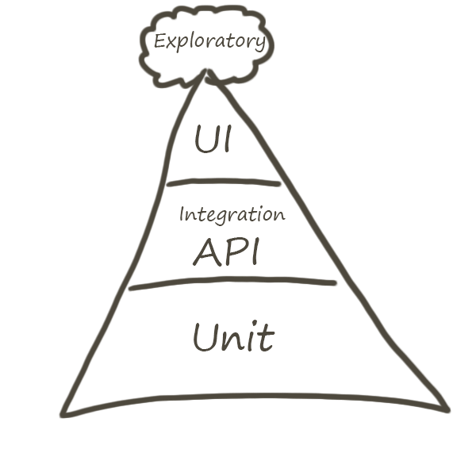
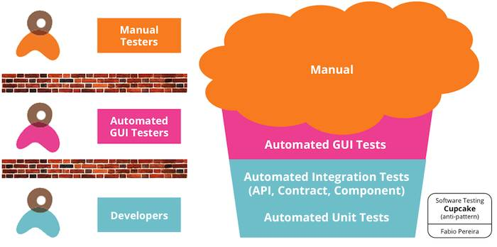

> ~~本人代码非常严谨，怎么可能有 BUG，不需要测试，不接受任何反驳。~~

> 一波骚操作之后，Why is that? Is this BUG?
 
 
  

 
 
 

## 自动化金字塔（敏捷测试）

> 自上而下，我们的测试也是逐步从面向业务过渡到面向技术。
- Exploratory （手工测试）
- UI
- service （API测试，或者集成测试等）
- Unit （单元测试）

 

在使用一些框架的脚手架时，会询问我们是否需要一下测试
  - Unit 
    - 站在程序员的角度测试
    - 把代码看成是一个个的组件。从而实现每一个组件的单独测试，测试内容主要是组件内每一个函数的返回结果是不是和期望值一样。
    
  - e2e 
    - 站在用户角度的测试
    - e2e测试是把我们的程序堪称是一个黑盒子，我不懂你内部是怎么实现的，我只负责打开浏览器，把测试内容在页面上输入一遍，看是不是我想要得到的结果。

> `unit`：是程序员写好自己的逻辑后可以很容易的测试自己的逻辑返回的是不是都正确。
> `e2e`：是测试所有的需求是不是都可以正确的完成，而且最终要的是在代码重构，js改动很多之后，需要对需求进行测试的时候测试代码是不需要改变的，你也不用担心在重构后不能达到客户的需求。

 

## 蛋筒冰激凌模式（反模式）

事与愿违，而我呢！则是下图这个模式

> **全是手工测试，其他测试 Sorry, No.**
- 庞大的手工测试，也看出自己对于自动化测试投资的不足。
- 为了能尽快产出效果，就采取了一些短平快的措施。
- 从最容易上手的用户界面开始，通过手工测试来完成其业务的测试，评测产品的质量。

**当然手工归手工，测多了，麻木了，不知道自己在干嘛，算了，不测了，没问题。**

 

## 纸杯蛋糕模式（反模式）
之前看文章，也看见一种情况，如下。

三个团队:
  - 开发团队编写单元测试、集成测试和组件测试用例

  - 自动化测试团队编写UI自动化测试用例

  - 手工测试团队编写手工运行的测试用例，以系统集成测试/业务场景测试为主

不同团队分属不同部门，之间自然哟厚厚的部门墙。从团队协作的角度上来讲，因为墙的存在，这些团队都各自为政，彼此间并不能很有效地协作。在测试的级别/类型/场景划分上，这三个团队是彼此没有协同的。这样就必然导致某些重复工作，有些用例被反复地进行自动化；而另一方面，质量拼图不完整也是不完整的，存在缝隙和漏洞，结果必然是1+1+1<3。

## ...
