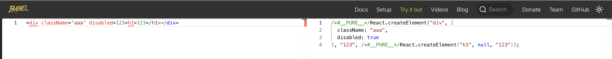

在搭建环境前，应该先了解一些概念问题

- [DOM](./#dom)
- [虚拟 DOM](./#虚拟-dom)
- [JSX](./#jsx)
- [React 和 ReactDOM 职责划分](./#react-和-reactdom-职责划分)

<br/>
<br/>

### DOM

#### DOM 是什么？

在 MDN 官方文档中，有这么一段解释：

> The Document Object Model (DOM) is a programming interface for web documents. [原文链接](https://developer.mozilla.org/en-US/docs/Web/API/Document_Object_Model/Introduction)

DOM（Document Object Model）是编程接口，是什么的编程接口呢？是 Web 文档的编程接口。那什么是 Web 文档呢？一般来说 Web 文档是指 XML 或 HTML 文档，也就是说 **DOM 是 XML 和 HTML 文档的编程接口**。

<br/>

#### DOM 的作用？

在 MDN 官方文档中，有这么一段解释：

> It represents the page so that programs can change the document structure, style, and content. The DOM represents the document as nodes and objects; that way, programming languages can interact with the page. [原文链接](https://developer.mozilla.org/en-US/docs/Web/API/Document_Object_Model/Introduction)

通过 DOM 来表示页面，能够方便程序对文档结构、样式、内容的改变。DOM 以节点和对象的方式来表示文档，这样，程序语言就能够和页面进行交互。

看了官方文档感觉还是很抽象~

<br/>

#### DOM 具备两层含义###

- DOM 是一种编程规范
- DOM 是对文档（HTML、XML）的对象化描述

可以举个 🌰

```html
<div id="root" style="color: red;"><div>Hello Simple React</div></div>
```

我们在浏览器的控制台下获取这个 DOM 节点：

```js
document.getElementById("root");
```

会发现直接将对应的 html 标签打印出来了，这是由于浏览器做了处理，直接将 DOM 对象转化成了 html 标签，因此我们将代码做一些调整：

```js
let element = document.getElementById("root");
let obj = {};
for (let key in element) {
  obj[key] = element[key];
}
console.log(obj);
```

会发现是一个由很多 key value 值组成的对象。这其实就是我们的 DOM 对象。

上面几个步骤，我们可以这样描述：通过`document.getElementById('root')`这样一个函数调用，得到了 id 为 root 的 html 节点的对象表示。而函数`getElementById('root')`并不是 Javascript 语言的提供的能力，只是调用了浏览器平台下暴露的接口，可以理解为我们调用了一个独立的程序，而这个独立的程序实现了 DOM 规范，当调用函数`getElementById('root')`时候，该独立程序返回了 id 为 root 的 html 节点的对象表示。至于我们调用的这个独立的程序，不管是用 Javascript 还是用 Java、C++、Python 等等都是可以的。

<br/>

因此 DOM 只是一种编程规范，而这种规范是和具体编程语言无关的，可以通过很多语言来实现。只不过在浏览器环境下，我们可以通过 JavaScript 来调用这个独立的程序。


刚才在控制台执行这样的代码：

```js
let element = document.getElementById("root");
let obj = {};
for (let key in element) {
  obj[key] = element[key];
}
console.log(obj);
```

直观的感受到了，dom 对象是一个成本很高的，属性数量非常之多。对前端程序而言, 当对大量 dom 进行操作的时候（当然这里的操作是指，对 DOM 属性、节点的增删改查），性能会成为一个压力。

<br/>
<br/>
<br/>

### 虚拟 DOM

由于操作 DOM 对象的成本很高，因此引入了虚拟 DOM，那虚拟 DOM 究竟是什么呢？简单的讲，虚拟 DOM 就是用于描述 DOM 对象的对象，与 DOM 对象不同的是，虚拟 DOM 只包括程序中所需要的属性，以刚才我们看到的 DOM 属性为例，一般来说其中绝大部份属性，在 JavaScript 程序中都是非必须的。以 React 为例，我们打印一个 react 元素，其对 DOM 进行描述的 **虚拟 DOM** 大概有如下字段：

```js
const element = {
  $$typeof: Symbol("react.element"),
  type,
  key,
  ref,
  props,
  _owner: owner,
};
```

这里可以不深究这些字段的含义，比如一个 div 标签`<div></div>`，其标签类型`div`可以用 type 表示，props 会包含该标签的 style、class 等属性，总之这简单的几个字段已经包括了程序执行所必须的信息，单从字段数量来看，和 **DOM** 相比，可以说就已经差别相当大了。

虚拟 DOM 是如何发挥作用呢？如果是一个普通的 HTML 静态页面，页面是不会发生任何变化，虚拟 DOM 则没有任何存在的必要，但是随着 Web 页面有了越来越复杂的交互性，我们的页面往往会随着时间或者事件的触发动态发生变化，这就意味着需要频繁的对 DOM 进行操作，就像我们这张图所示：


如果没有引入虚拟 DOM，那就只能通过直接操作 DOM 来进行页面的变化，而页面 A 到页面 B，到底有多少变化，需要我们遍历 DOM 树，进行对比，才能知道如何变化,如果不这样对比就只能重新渲染整个页面，用户体验会非常糟糕。然而操作 DOM 对象的成本是很高的，很多的 DOM 对象，只是遍历属性就是很重的负担，这时候虚拟 DOM 就派上了用场。

就如图片所展示的，虚拟 DOM 是 DOM 对象的进一步抽象，代表了该 DOM 对象的关键信息，成本很低，利用低成本的虚拟 DOM 来计算需要更新哪些 DOM 对象，最后再根据计算的结果来操作真实的 DOM 对象。虚拟 DOM 的引入，大幅度的降低了计算成本。这里提到的对虚拟 DOM 进行计算操作，至于怎么对虚拟 DOM 进行计算怎么操作这里也暂不深究。

<br/>
<br/>
<br/>

### JSX

React 官方文档上面这样解释：[JSX is a syntax extension to JavaScript](https://react.dev/learn/writing-markup-with-jsx)

**JSX 是 JavaScript 的一种语法扩展**。所谓语法扩展，就意味着 JavaScript 语法本身是不支持 JSX 的。比如我们在普通的 JavaScript 程序中编写类似于下面的代码：

```js
const elment = <div>Simple React App</div>;
```

程序是会报错的。那 JSX 既不是 html 也不是 JavaScript 的一部分。那究竟是什么呢？我们可以知道在 React 程序中，JSX 最终呈现出来的结果就是普通的 Javascript 代码。那这里 JSX 到普通 Javascript 的代码的转化是谁来完成的呢？一般来说，通常使用的是 babel 来完成这个转译的过程，之所以说是通常，就意味着不是绝对，哪怕我们自己写个程序也可以实现这个过程（实现、维护过程通常会耗费大量成本），对于一般情况下是没必要的，因为 [babel](https://babeljs.io/) 或其他工具已经做得很成熟了。

<br/>

可以直接在 bable 官网中的 [try it out](https://babeljs.io/repl) 中进行调试。



<br/>
<br/>
<br/>

### React 和 ReactDOM 职责划分

React 代码是如何提供给开发者使用的呢？

我们需要先了解 React18 原版源码中最关键的三个包


- **react** 包，专注于组件相关核心 API 的暴露，这部分内容是跨平台的，不管是服务端渲染，客户端渲染，甚至是 react-native，就组件本身的 api 而言都是一致的
- **react-dom** 包，与 react 包配套使用，专注于将编写好的组件渲染到某个平台中去，比如 web 端，或者服务端。也就是解决了将组件渲染到哪里去的问题，这个观点可以从官方文档[ReactDOM api](https://reactjs.org/docs/react-dom.html)中暴露的 api 中得到印证
- **react-reconciler** 包，渲染相关的基础公用逻辑，这部分也可以理解是跨平台的。正如 react-reconciler 这个包中 README.md 提到了：这个包用于创建自定义的 React 渲染器。我们可以认为 react-dom 就是利用这个 react-reconciler 包创建了一个符合自己特定场景的渲染器。

关于 react18 源码基本情况的更多内容，可以参阅 [官方文档](https://reactjs.org/docs/codebase-overview.html)
