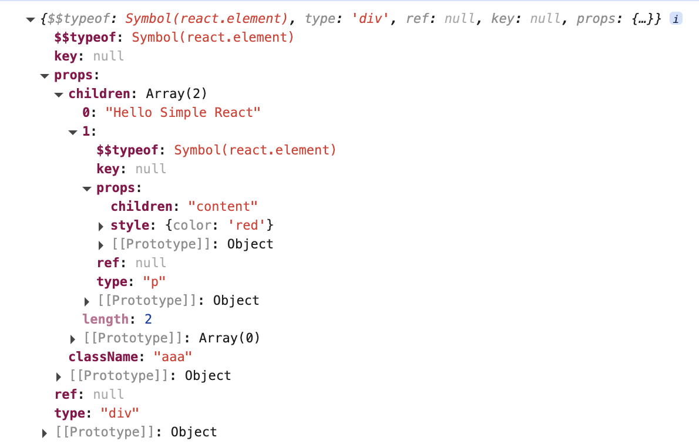

🌰：简易实现代码，将 JSX 渲染到 HTML 中

> 简单来说 Babel 会编译 [JSX](../01/#jsx) 调用 [React.createElement()](./#react-createelement)，通过 [ReactDOM.render()](./#reactdom-render) 渲染。

```jsx
import React from "./react";
import ReactDOM from "./react-dom";

const dom = (
  <div className="aaa">
    Hello Simple React
    <p style={{ color: "red" }}>content</p>
  </div>
);

ReactDOM.render(dom, document.getElementById("root"));

console.log(dom);
```

### React.createElement

`constant.js`

```js
export const REACT_ELEMENT = Symbol("react.element");
```

<br/>

`react.js`

```js
import { REACT_ELEMENT } from "./constant";

function createElement(type, properties = {}, children) {
  let ref = properties.ref || null;
  let key = properties.key || null;

  // 移除一些 babel 转换后的不影响目前实现的属性
  ["ref", "key", "__self", "__source"].forEach((key) => {
    delete properties[key];
  });

  let props = { ...properties };

  if (arguments.length > 3) {
    // 多个子元素
    props.children = Array.prototype.slice.call(arguments, 2);
  } else {
    // 单个子元素
    props.children = children;
  }

  return {
    $$typeof: REACT_ELEMENT, // 代表着这是 React 元素
    type, // 虚拟 DOM 的元素类型
    ref,
    key,
    props,
  };
}

const React = {
  createElement,
};

export default React;
```

<br/>

`React.createElement(dom)` 的返回的虚拟 DOM 结构如下图，接下来将其给到 `ReactDOM.render` 渲染到页面



<br/>
<br/>
<br/>

### ReactDOM.render

`react-dom.js`

```js
import { REACT_ELEMENT } from "./constant";

/**
 * 1、将虚拟 DOM 转换为真实 DOM
 * 2、将得到的真实 DOM 挂载到 containerDOM 中
 */
function render(VNode, containerDOM) {
  mount(VNode, containerDOM);
}

function mount(VNode, containerDOM) {
  let newDom = createDOM(VNode);
  newDom && containerDOM.appendChild(newDom);
}

/**
 * 1、创建元素
 * 2、处理子元素
 * 3、处理属性值
 */
function createDOM(VNode) {
  const { type, props } = VNode;

  let dom;

  // 1、创建元素
  if (type && VNode.$$typeof === REACT_ELEMENT) {
    dom = document.createElement(type);
  }

  // 2、处理子元素
  if (props) {
    if (
      Object.prototype.toString.call(props.children) === "[object Object]" &&
      props.children.type
    ) {
      // 单个虚拟 DOM
      mount(props.children, dom);
    } else if (Array.isArray(props.children)) {
      // 多个虚拟 DOM
      mountArray(props.children, dom);
    } else if (typeof props.children === "string") {
      // 文本节点
      dom.appendChild(document.createTextNode(props.children));
    }
  }

  return dom;
}

function mountArray(children, parent) {
  if (!Array.isArray(children)) return;

  for (let i = 0; i < children.length; i++) {
    if (typeof children[i] === "string") {
      // 文本节点
      parent.appendChild(document.createTextNode(children[i]));
    } else {
      mount(children[i], parent);
    }
  }
}

function setPropsForDOM(dom, VNodeProps = {}) {
  if (!dom) return;
  for (const key in VNodeProps) {
    if (
      !Object.prototype.hasOwnProperty.call(VNodeProps, key) ||
      key === "children"
    )
      continue;

    if (/^on[A-Z].*/.test(key)) {
      // 事件处理
    } else if (key === "style") {
      Object.keys(VNodeProps[key]).forEach((styleName) => {
        dom.style[styleName] = VNodeProps[key][styleName];
      });
    } else {
      dom[key] = VNodeProps[key];
    }
  }
}

const ReactDom = { render };
export default ReactDom;
```

<br/>

- `ReactDOM.render` 接受两个参数：① 虚拟 DOM ② 挂载的节点

  - `mount` 进行挂载

    - `createDOM`

      - 根据 type 创建对应节点
      - 处理子元素
        - 单个子元素，递归调用 `mount`
        - 多个子元素，递归调用 `mountArray`
        - 文本元素，直接创建 `document.createTextNode`
      - 解析、处理节点上的属性
        - 事件
        - 样式
        - 自定义属性
      - 返回 创建的对应节点

    - `dom.appendChild`：拿到 `createDOM` 返回的节点添加到 HTML

<br/>

到这里，就可以将 JSX 渲染到 HTML 上了


