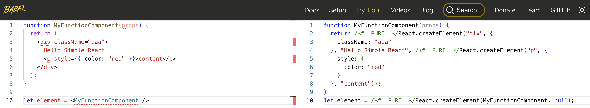
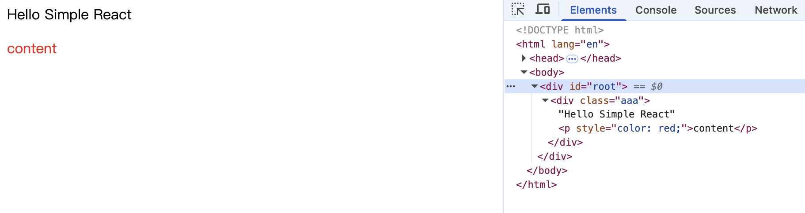

还是老样子，在 [Try it out](https://babeljs.io/repl) 中，看看 Babel 会将 JSX 如何转换

可以看到，函数组件本质上还是调用 `React.createElement` 创建虚拟 DOM。

<br />
<br />

### 强化一下 React.render 中 createDOM 的实现

`react-dom.js`

```js
function createDOM(VNode) {
  const { type, props } = VNode;

  let dom;

  // 处理函数组件
  if (typeof type === "function" && VNode.$$typeof === REACT_ELEMENT) {
    return getDomByFunctionComponent(VNode);
  }

  if (type && VNode.$$typeof === REACT_ELEMENT) {
    dom = document.createElement(type);
  }

  // ...
  // ...
  // ...

  return dom;
}

/**
 * 根据函数组件生成 DOM
 */
function getDomByFunctionComponent(VNode) {
  let { type, props } = VNode;

  // let element = /*#__PURE__*/React.createElement(MyFunctionComponent, null);
  // 可以看出，createElement 接受的 type 就是函数的引用。
  let renderVNode = type(props);

  if (!renderVNode) return null;

  return createDOM(renderVNode);
}
```

<br/>

将 `type` 函数执行，拿到返回的 VNode 。再通过 `createDOM` 执行，最终函数组件成功渲染


