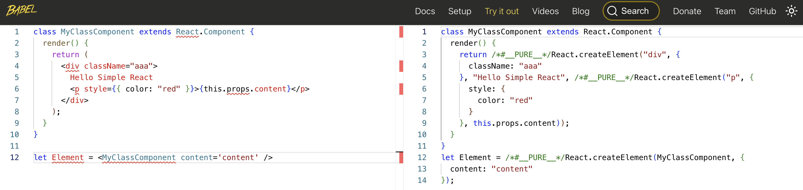

还是老样子，在 [Try it out](https://babeljs.io/repl) 中，看看 Babel 会将 JSX 如何转换

可以看到，类组件本质上还是调用 `React.createElement` 创建虚拟 DOM。但这里需要继承 `React.Component` 基类

<br/>
<br/>

### React.Component

`Component.js`

```js
export class Component {
  // 标识为类组件
  static IS_CLASS_COMPONENT = true;

  constructor(props) {
    this.props = props;
  }
}
```

<br/>
<br/>
<br/>

### React

`react.js`

```js
import { Component } from "./Component";

// ...
// ...
// ...

const React = {
  // ...
  Component,
};

export default React;
```

<br/>
<br/>
<br/>

### ReactDOM

模仿函数组件的相关处理逻辑

`react-dom.js`

```js
function createDOM(VNode) {
  // 1、创建元素 2、处理子元素 3、处理属性值
  const { type, props } = VNode;

  let dom;

  // 处理类组件
  if (
    typeof type === "function" &&
    VNode.$$typeof === REACT_ELEMENT &&
    type.IS_CLASS_COMPONENT
  ) {
    return getDomByClassComponent(VNode);
  }

  // ...
  // ...
  // ...
}

/**
 * 根据类组件生成 DOM
 */
function getDomByClassComponent(VNode) {
  let { type, props } = VNode;
  // let Element = /*#__PURE__*/React.createElement(MyClassComponent, null);
  // type 就是一个类
  let instance = new type(props);
  let renderVNode = instance.render();

  if (!renderVNode) return null;

  return createDOM(renderVNode);
}
```

<br/>

将 type 实例化，调用 `.render` 拿到返回的 VNode 。再通过 `createDOM` 执行，最终类组件成功渲染。


