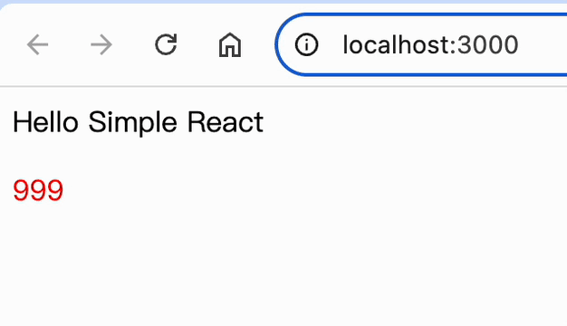

前面已经把类组件进行简单渲染，但是其的返回结果只是一个静态的，最后都是返回了一个 Element（也就是虚拟 DOM），本质上和直接编写一个 Element 渲染到页面没什么区别，就像这段代码：

```js
let Element = /*#__PURE__*/ React.createElement(MyClassComponent, null);
```

Component 相对于 Element 而言，可视其为一个动态系统，它可以根据不同的条件和逻辑变更数据，进而更新视图。

<br/>

目前业界典型的有两种常见方案，一种是监听数据的方式来触发更新（如 Vue），一种是手动通知的方式触发更新（如 React）。不同方式各有优点，如果我们能找到更优的方式来进行触发，那么可能会诞生一个爆火的前端框架。

这其实给到我一个启示，要造一款比市面轮子更好的轮子，需在其核心实现上有质的改变，进而对其大幅度的优化。

> 类组件中，手动通知更新最常见的方式就是 `setState` 方法，下面就实现简易版 `setState`

<br/>

### 实现 setState

`Component.js`

```js
import { Updater } from "./Updater";
import { findDomByVNode, updateDomTree } from "./react-dom";

export class Component {
  static IS_CLASS_COMPONENT = true;

  constructor(props) {
    this.updater = new Updater(this); // 管理状态的类，如批量更新
    this.state = {};
    this.props = props;
  }

  /**
   * 1.合并属性
   * 2.重新渲染并进行更新
   */
+ setState() {
+   this.updater.addState(partialState);
+ }

  /**
   * 1.获取重新执行 render 函数后的新虚拟 DOM
   * 2.根据新虚拟 DOM 生成新的真实 DOM
   * 3.将真实 DOM 挂载到页面
   */
+ update() {
+   let oldVNode = this.oldVNode; // 在 getDomByClassComponent 中，已给实例赋值
+   let oldDom = findDomByVNode(oldVNode);
+   let newVNode = this.render();
+
+   updateDomTree(oldDom, newVNode);
+
+   this.oldVNode = newVNode;
+ }
}
```

<br/>
<br/>
<br/>

### 验证 setState

```js
import React from "./react";
import ReactDOM from "./react-dom";

class MyClassComponent extends React.Component {
  constructor(props) {
    super(props);
    this.state = { aaa: "999" };

    // TODO：调试代码 start
    setTimeout(() => {
      this.setState({ aaa: "666" });
    }, 5000);
    // TODO：调试代码 end
  }

  render() {
    return (
      <div className="aaa">
        Hello Simple React
        <p style={{ color: "red" }}>{this.state.aaa}</p>
      </div>
    );
  }
}

ReactDOM.render(<MyClassComponent />, document.getElementById("root"));
```

最后实现效果如下



**大致思路**

- 首先扩展了 Component 类
  - 新增类属性
    - `state`：类组件状态
    - `updater`：用于管理类组件状态的 Updater 类
  - 新增类方法
    - `setState`
      - 1、合并属性
      - 2、重新渲染并进行更新
    - `update`：（部分细节暂未实现）
      - 1、获取重新执行 render 函数后的新虚拟 DOM
      - 2、根据新虚拟 DOM 生成新的真实 DOM
      - 3、将真实 DOM 挂载到页面

> 到这里，就能了解大概的更新流程了，外部调用 `this.setState`，`instance.setState` 会更新状态，然后调用 `instance.update` 触发页面更新

如不关心细节，后面内容就可忽略了

<br/>
<br/>
<br/>
<br/>
<br/>
<br/>

### 一些更细节的实现

部分细节暂未实现，是个大概思路

- Updater 类

  - `constructor`
    - 属性：ClassComponentInstance（所管理的类组件实例）
    - 属性：pendingState（待处理的 state）
  - `addState`
    - 将状态保存起来
    - 进入预更新 preHandleForUpdate
  - `preHandleForUpdate`：是否批量执行（部分细节暂未实现）
    - 是：更新队列
    - 否：启动更新 launchUpdate
  - `launchUpdate`
    - 把待更新的状态，用 reduce 依次覆盖更新
    - 清空待更新的状态
    - 调用类组件实例的更新方法

- updateQueue：暂时先用个变量，管理 updaters
  - isBatch：是否批量更新（也就是同一个函数下，多次调用 this.setState）
  - updaters：管理 Updater 的队列

`react.js`

```js
function createDOM(VNode) {
  // ...
  // 3、处理属性值
  setPropsForDOM(dom, props);

+ VNode.dom = dom;

  return dom;
}

function getDomByClassComponent(VNode) {
  let { type, props } = VNode;
  let instance = new type(props);
  let renderVNode = instance.render();
+ instance.oldVNode = renderVNode;

  if (!renderVNode) return null;

  return createDOM(renderVNode);
}

// 根据 虚拟DOM 找到 虚拟DOM对应的节点
+ export function findDomByVNode(VNode) {
+  if (!VNode) return;
+  if (VNode.dom) return VNode.dom;
+ }

+ export function updateDomTree(oldDom, newVNode) {
+  let parentNode = oldDom.parentNode;
+  // 把旧节点从父节点上移除 oldDom.remove()
+  parentNode.removeChild(oldDom);
+  // 重新追加新的DOM节点
+  parentNode.appendChild(createDOM(newVNode));
+ }

```

`Updater.js`：**「新增」** 管理状态的类

```js
// 管理 Updater 的队列
export let updateQueue = {
  isBatch: false,
  updaters: new Set(),
};

// 重置队列状态
export function flushUpdaterQueue() {
  updateQueue.isBatch = false;
  for (const updater of updateQueue.updaters) {
    updater.launchUpdate();
  }
  updateQueue.updaters.clear();
}

// 管理类组件 state 的类
export class Updater {
  constructor(ClassComponentInstance) {
    // 所管理的类组件实例
    this.ClassComponentInstance = ClassComponentInstance;
    // 待处理的 state
    this.pendingState = [];
  }

  // 添加 state
  addState(partialState) {
    this.pendingState.push(partialState);
    this.preHandleForUpdate();
  }

  // 更新预处理，判断是否是批量执行
  preHandleForUpdate() {
    if (updateQueue.isBatch) {
      // updaters 是个 Set，新 updater 会覆盖旧 updater
      updateQueue.updaters.add(this);
    } else {
      this.launchUpdate();
    }
  }

  // 启动更新
  launchUpdate() {
    const { ClassComponentInstance, pendingState } = this;

    if (pendingState.length === 0) return;

    ClassComponentInstance.state = this.pendingState.reduce(
      (preState, newState) => {
        return { ...preState, ...newState };
      },
      ClassComponentInstance.state
    );

    this.pendingState.length = 0;

    ClassComponentInstance.update();
  }
}
```

<br/>
<br/>
<br/>
