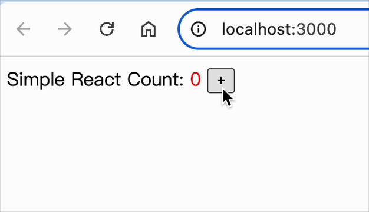

### react-dom.js

完善之前空缺的事件处理

```diff
+ import { addEvent } from "./event";

// ...
// ...
// ...

function setPropsForDOM(dom, VNodeProps = {}) {
  if (!dom) return;
  for (const key in VNodeProps) {
    if (
      !Object.prototype.hasOwnProperty.call(VNodeProps, key) ||
      key === "children"
    )
      continue;

    if (/^on[A-Z].*/.test(key)) {
      // 事件处理
+      addEvent(dom, key.toLowerCase(), VNodeProps[key]);
    } else if (key === "style") {
      Object.keys(VNodeProps[key]).forEach((styleName) => {
        dom.style[styleName] = VNodeProps[key][styleName];
      });
    } else {
      dom[key] = VNodeProps[key];
    }
  }
}


// ...
// ...
```

<br/>
<br/>
<br/>

### event.js

新增文件，实现事件合成机制

event 的大致逻辑：绑定关联、事件委托 -> 节点被点击 -> 处理浏览器兼容问题，返回 合成的事件对象 -> 触发事件 -> 冒泡执行

- `addEvent`
  - 绑定关联，把方法（如节点上的 onClick 方法）存到 dom 属性上
  - 事件合成机制核心点 1/2：事件委托给 document，等待用户触发（事件执行逻辑：`dispatchEvent`）
- `dispatchEvent`：被触发时
  - 开启 updateQueue 批量更新的标识
  - 事件合成机制核心点 2/2：兼容浏览器的一些差异（`createSyntheticEvent`）
  - while 循环模拟冒泡，层层往上执行对应事件
  - 刷新 updateQueue 状态
- `createSyntheticEvent`：创建并返回 合成事件对象
  - 把原生的事件对象处理下，方法绑定 this（防止调用时，this 指向有误），属性直接复制一份
  - 在扩展下 默认行为、冒泡行为、...
  - 将它们合并，并返回这个 合成事件对象

```js
import { flushUpdaterQueue, updateQueue } from "./Updater";

/**
 * 添加事件
 *  dom：元素
 *  eventName: 事件名称 'click' | ...
 *  eventFunction: 事件方法
 */
export function addEvent(dom, eventName, eventFunction) {
  // 将事件关联到 dom 属性上
  dom.attach = dom.attach || {};
  dom.attach[eventName] = eventFunction;

  // 事件合成机制核心点 1/2：事件委托
  if (document[eventName]) return;
  document[eventName] = dispatchEvent;
}

/**
 * 将处理函数单独抽离出来
 */
function dispatchEvent(nativeEvent) {
  // 开启批量更新，防止函数中同步调用多次 this.setState
  updateQueue.isBatch = true;

  // 事件合成机制核心点 1/2：兼容处理
  let syntheticEvent = createSyntheticEvent(nativeEvent);
  let target = nativeEvent.target; // 原生属性：触发事件的元素

  /**
   * while 循环是为了处理冒泡，冒泡阶段是从内而外，层层线上
   * 简单来讲，就是子找父，父找它父，层层往上找，依次执行相对应的事件（如 onClick）
   */
  while (target) {
    // 原生属性：绑定事件的元素，这里给重新赋值
    syntheticEvent.currentTarget = target;

    let eventName = `on${nativeEvent.type}`;
    let bindFunction = target.attach && target.attach[eventName];

    bindFunction && bindFunction(syntheticEvent);

    // 阻止冒泡
    if (syntheticEvent.isPropagationStopped) break;
    // 往上找父元素
    target = target.parentNode;
  }

  flushUpdaterQueue();
}

/**
 * 创建合成事件对象
 */
function createSyntheticEvent(nativeEvent) {
  let nativeEventKeyValues = {};

  for (const key in nativeEvent) {
    // 遍历 原生事件对象，方法绑定 this（防止调用时，this 指向有误），属性直接复制一份
    nativeEventKeyValues[key] =
      typeof nativeEvent[key] === "function"
        ? nativeEvent[key].bind(nativeEvent)
        : nativeEvent[key];
  }

  let syntheticEvent = Object.assign(nativeEventKeyValues, {
    isDefaultPrevented: false, // 是否阻止默认行为
    isPropagationStopped: false, // 是否阻止冒泡行为

    // 兼容 浏览器-默认行为
    preventDefault: function () {
      this.isDefaultPrevented = true;
      if (this.nativeEvent.preventDefault) {
        this.nativeEvent.preventDefault();
      } else {
        this.nativeEvent.returnValue = false;
      }
    },

    // 兼容 浏览器-冒泡行为
    stopPropagation: function () {
      this.isPropagationStopped = true;

      if (this.nativeEvent.stopPropagation) {
        this.nativeEvent.stopPropagation();
      } else {
        this.nativeEvent.cancelBubble = true;
      }
    },
  });

  return syntheticEvent;
}
```

<br/>
<br/>
<br/>

### index.js 执行

```js
import React from "./react";
import ReactDOM from "./react-dom";

class MyClassComponent extends React.Component {
  constructor(props) {
    super(props);
    this.state = { count: 0 };
  }

  addCount() {
    this.setState({
      count: this.state.count + 1,
    });
  }

  render() {
    return (
      <div>
        Simple React Count:
        <span style={{ color: "red" }}>{` ${this.state.count} `}</span>
        <button onClick={this.addCount.bind(this)}>+</button>
      </div>
    );
  }
}

ReactDOM.render(<MyClassComponent />, document.getElementById("root"));
```

效果如下


