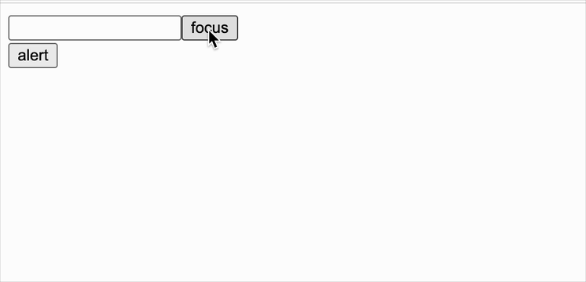

React 是基于数据驱动视图，但在其目前体系下，有些功能是无法实现的（如 聚焦、媒体播放、...），就需要一种解决方案，那就是 ref。官方也提到 ref 是 escape hatch（安全舱口），可以理解为是一种应急方案，实属无奈之举，官方也提示到不要滥用

[关于 ref 的说明](https://reactjs.org/docs/refs-and-the-dom.html)：

- Refs provide a way to access DOM nodes or React elements created in the render method.
  > In the typical React dataflow, props are the only way that parent components interact with their children. To modify a child, you re-render it with new props. However, there are a few cases where you need to imperatively modify a child outside of the typical dataflow. The child to be modified could be an instance of a React component, or it could be a DOM element. For both of these cases, React provides an escape hatch.
- There are a few good use cases for refs:

  Managing focus, text selection, or media playback.Triggering imperative animations. Integrating with third-party DOM libraries.

- Don’t Overuse Refs

<br/>
<br/>
<br/>

实际上，原生组件、类组件的 ref，就是对自身的引用，具体代码如下

### react.js

```js
//...

function createRef() {
  return {
    current: null,
  };
}

const React = {
  Component,
  createElement,
  createRef,
};

export default React;
```

<br/>
<br/>
<br/>

### react-dom.js

```js
//...

function createDOM(VNode) {
  const { type, props, ref } = VNode;

  //...

  // 给原生标签添加 ref
  ref && (ref.current = dom);

  return dom;
}

//...

function getDomByClassComponent(VNode) {
  let { type, props, ref } = VNode;

  //...

  // 给类组件添加 ref
  ref && (ref.current = instance);
  if (!renderVNode) return null;
  //...
}
```

<br/>
<br/>
<br/>

### 验证

```js
import React from "./react";
import ReactDOM from "./react-dom";

class AlertComponent extends React.Component {
  alert() {
    window.alert("AlertComponent");
  }

  render() {
    return <div></div>;
  }
}

class MyClassComponent extends React.Component {
  constructor(props) {
    super(props);

    this.input = React.createRef();
    this.componentRef = React.createRef();
  }

  focusInput = () => {
    this.input.current.focus();
  };

  alert = () => {
    this.componentRef.current.alert();
  };

  render() {
    return (
      <div>
        <input ref={this.input} />
        <input type="button" value="focus" onClick={this.focusInput} />

        <AlertComponent ref={this.componentRef} />
        <input type="button" value="alert" onClick={this.alert} />
      </div>
    );
  }
}

ReactDOM.render(<MyClassComponent />, document.getElementById("root"));
```

效果如下


