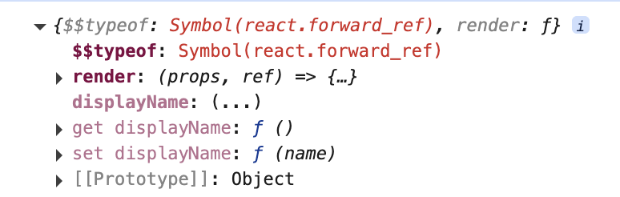
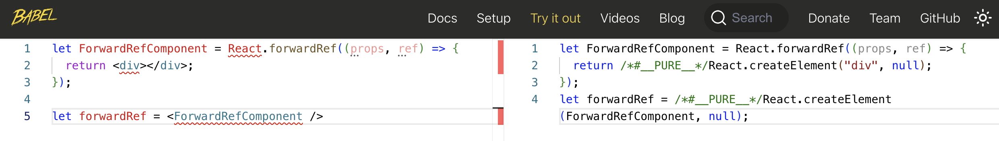

为何函数组件不能和类组件的 ref 一样实现呢？

> [官方文档](https://reactjs.org/docs/refs-and-the-dom.html) 提到过：By default, you may not use the ref attribute on function components because they don’t have instances

也提供了解决方案

> If you want to allow people to take a ref to your function component, you can use `forwardRef` (possibly in conjunction with useImperativeHandle), or you can convert the component to a class.

<br/>

函数组件和类组件不同，没有对应的实例可以直接关联，所以官方提供了 `forwardRef` 用于在组件间传递 `ref` 引用。其核心作用是将父组件传递的 `ref` 转发到子组件或 DOM 元素，从而允许外部通过 `ref.current` 直接访问子组件或 DOM 元素。

<br/>
<br/>
<br/>

### 观察

使用原版 React，看下 `React.forwardRef` 返回内容是什么？

```js
import React from "react";

let ForwardRefComponent = React.forwardRef((props, ref) => {
  return <div ref={ref}></div>;
});

console.log(ForwardRefComponent);
```



<br/>

Babel 是如何解析的呢？



<br/>

可以看到 `forwardRef` 返回的虚拟节点中，其被标识为 `Symbol("react.forward_ref")`，然后给到 `createElement` 进行处理，那么可在创建真实 DOM 阶段，将 `ref` 传递到对应函数内部中（至于函数内部如何使用 ref，这暂不关心），最后渲染

<br/>
<br/>
<br/>

### constant.js

```js
// ...
export const REACT_FORWARD_REF = Symbol("react.forward_ref");
```

<br/>
<br/>
<br/>

### react.js

```js
import { REACT_ELEMENT, REACT_FORWARD_REF } from "./constant";

// ...

function forwardRef(render) {
  return {
    $$typeof: REACT_FORWARD_REF,
    render,
  };
}

const React = {
  // ...
  forwardRef,
};

export default React;
```

<br/>
<br/>
<br/>

### react-dom.js

```js
function createDOM(VNode) {
  // 1、创建元素 2、处理子元素 3、处理属性值
  const { type, props, ref } = VNode;

  let dom;

  // forwardRef
  if (type && type.$$typeof === REACT_FORWARD_REF) {
    return getDomByForwardRefFunction(VNode);
  }

  // ...
}

// 根据 ref 函数组件生成 DOM
function getDomByForwardRefFunction(VNode) {
  let { type, props, ref } = VNode;
  let renderVNode = type.render(props, ref);
  if (!renderVNode) return null;
  return createDOM(renderVNode);
}
```

<br/>
<br/>
<br/>

### 调试

```js
import React from "./react";
import ReactDOM from "./react-dom";

let ForwardRefComponent = React.forwardRef((props, ref) => {
  return <input ref={ref} />;
});

class MyClassComponent extends React.Component {
  constructor(props) {
    super(props);
    this.functionComponentRef = React.createRef();
  }

  focus = () => {
    this.functionComponentRef.current.focus();
  };

  render() {
    return (
      <div>
        <ForwardRefComponent ref={this.functionComponentRef} />
        <input type="button" value="focus" onClick={this.focus} />
      </div>
    );
  }
}

ReactDOM.render(<MyClassComponent />, document.getElementById("root"));
```

效果如下:


