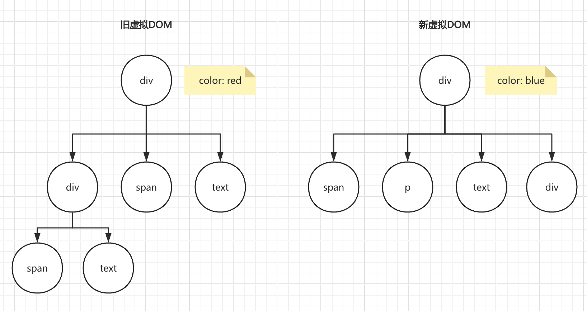
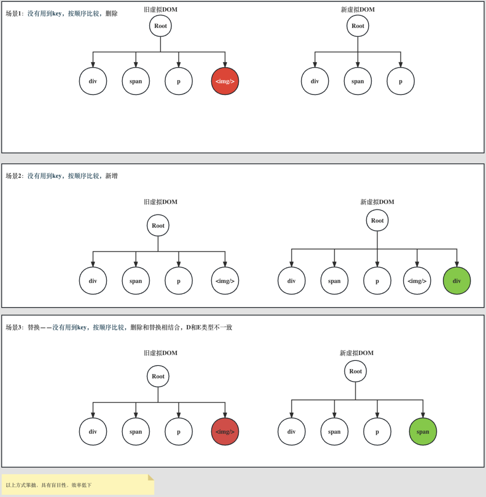

在 React 中，渲染一个页面大致可以分为三个阶段：

- 生成虚拟 DOM
- 将虚拟 DOM 转换为真实 DOM
- 将真实 DOM 挂载到页面上

而现在，要对页面进行重新渲染，本质上也是这三大阶段，毕竟从根本上来说就是一次渲染过程，但基于对性能的考量，是否可以在三阶段做优化呢？

- 生成虚拟 DOM（数据变了必然导致虚拟 DOM 发生变化，较难优化）
- 将虚拟 DOM 转换为真实 DOM（**是否可以对比新旧虚拟 DOM 不同，只让真实 DOM 进行必要操作**）
- 将真实 DOM 挂载到页面上

 

React 的 Diff 算法本质是以空间换时间，以 O(n) 时间复杂度完成树结构的比较，以达到在大多数场景下实现接近最优的更新效率

分层遍历：React 仅对虚拟 DOM 树的同一层级进行比较，避免跨层级递归带来的性能损耗，若同层类型不匹配，直接销毁重新创建，反之递归子节点

简单来说，算法基于两个核心假设

- **类型差异假设**：不同类型的元素会生成不同的树结构，直接替换整个子树
- **Key 稳定性假设**：通过 key 标识相同层级的元素是否可复用

 
 
 

### 情况一（无 Key）

- 第一步，两颗树同层对比，div 和 div 比较，类型相同，属性不同，可复用节点，仅修改属性即可
- 第二步，开始对比子节点，从这步开始，如何比较呢？在没有探索到更好的办法之前，只能使用笨办法，按序比较
  - 1、旧 div 和新 span 不同，删 div，新建 span 放第一个
  - 2、依旧不一样，删，增
  - 3、一样，不动
  - 4、增

 
 
 

### 情况二（无 Key）

 
 
 

### 情况三（有 Key）

