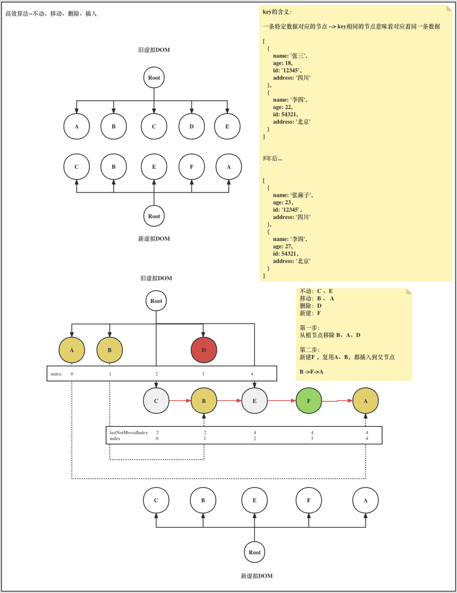
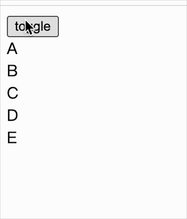
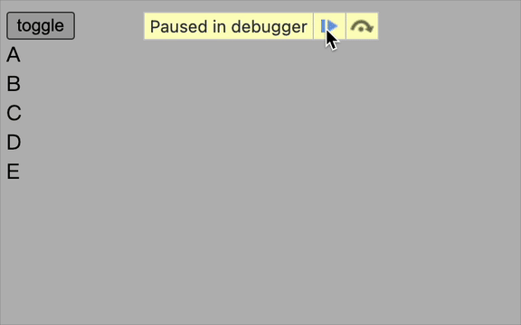

### constant.js

```js
// ...
// 文本节点
export const REACT_TEXT = Symbol("react.text");

// 创建 DOM
export const CREATE = Symbol("react.dom.diff.create");
// 移动 DOM
export const MOVE = Symbol("react.dom.diff.move");
```

<br>
<br>
<br>

### utils.js

```js
// 将字符串、数字转换成虚拟DOM
export const toVNode = (node) => {
  return typeof node === "string" || typeof node === "number"
    ? {
        type: REACT_TEXT,
        props: { text: node },
      }
    : node;
};
```

<br>
<br>
<br>

### react.js

```js
import { toVNode } from "./utils";

// ...

function createElement(type, properties, children) {
  // ...

  // 创建虚拟 DOM 对象时，将字符串、数字 标记为 文本类型的虚拟 DOM。为后续 diff 铺垫
  if (arguments.length > 3) {
    props.children = Array.prototype.slice.call(arguments, 2).map(toVNode);
  } else {
    props.children = toVNode(children);
  }

  // ...
}

// ...
```

<br>
<br>
<br>

### Component.js

update 就是触发真实节点更新的入口，也是 diff 算法的入口

```js
// ...
export class Component {
  // ...

  update() {
    let oldVNode = this.oldVNode;
    let oldDom = findDomByVNode(oldVNode); // 根据旧虚拟DOM找到它对应的真实DOM节点

    let newVNode = this.render();
    updateDomTree(oldVNode, newVNode, oldDom); // 旧虚拟DOM和新虚拟DOM比较，操作旧的真实节点（复用）
    this.oldVNode = newVNode;
  }
}
```

<br>
<br>
<br>

### react-dom.js

```js
import {
  // ...
  REACT_TEXT,
  CREATE,
  MOVE,
} from "./constant";

function createDOM(VNode) {
  // ...

  // 处理函数组件
  if (typeof type === "function" && VNode.$$typeof === REACT_ELEMENT) {
    return getDomByFunctionComponent(VNode);
  }

  // 处理文本节点
+ if (type === REACT_TEXT) {
+   dom = document.createTextNode(props.text);
+ }

  // 1、创建元素
  if (type && VNode.$$typeof === REACT_ELEMENT) {
    dom = document.createElement(type);
  }

  // 2、处理子元素
  if (props) {
    if (
      Object.prototype.toString.call(props.children) === "[object Object]" &&
      props.children.type
    ) {
      // 单个虚拟 DOM
      mount(props.children, dom);
    } else if (Array.isArray(props.children)) {
      // 多个虚拟 DOM
      mountArray(props.children, dom);
    }
-   //  else if (typeof props.children === "string") {
-   //   // 文本节点
-   //   dom.appendChild(document.createTextNode(props.children));
-   // }
  }
  // ...
}

// ...

function mountArray(children, parent) {
  if (!Array.isArray(children)) return;

  for (let i = 0; i < children.length; i++) {
-   // if (typeof children[i] === "string") {
-   //   // 文本节点
-   //   parent.appendChild(document.createTextNode(children[i]));
-   // } else {
-   //   mount(children[i], parent);
-   // }

+   // 提供给 DOM DIFF 消费
+   children[i].index = i;
+   mount(children[i], parent);
  }
}


- // export function updateDomTree(oldDom, newVNode) {
- //   let parentNode = oldDom.parentNode;
- //   // 把旧节点从父节点上移除 oldDom.remove()
- //   parentNode.removeChild(oldDom);
- //   // 重新追加新的DOM节点
- //   parentNode.appendChild(createDOM(newVNode));
- // }
```

这里依旧是 `react-dom.js`，方便查看（具体的 diff 细节），接上面的代码片段

```js
/**
 * 这里就是 DIFF 的起点
 *
 * - 新节点、旧节点都不存在
 * - 新节点存在，旧节点不存在
 * - 新节点不存在，旧节点存在
 * - 新节点存在，旧节点也存在，但类型不一致
 * - 新节点存在，旧节点也存在，类型也一致 ---> 值得进行深入比较，探索复用相关节点的方案
 */
export function updateDomTree(oldVNode, newVNode, oldDom) {
  const typeMap = {
    // 不操作：新节点、旧节点都不存在
    NO_OPERATE: !oldVNode && !newVNode,
    // 新增：新节点存在，旧节点不存在
    ADD: !oldVNode && newVNode,
    // 删除：新节点不存在，旧节点存在
    DELETE: oldVNode && !newVNode,
    // 替换：新节点存在，旧节点也存在，但类型不一致
    REPLACE: oldVNode && newVNode && oldVNode.type !== newVNode.type,
    // 未匹配到：新节点存在，旧节点也存在，类型也一致 ---> 值得进行深入比较，探索复用相关节点的方案
  };

  const UPDATE_TYPE = Object.keys(typeMap).find((key) => typeMap[key]);

  // 操作方式
  switch (UPDATE_TYPE) {
    case "NO_OPERATE":
      // 什么都不做
      break;

    case "DELETE":
      // 删
      removeVNode(oldVNode);
      break;

    case "ADD":
      // 增
      oldDom.parentNode.appendChild(createDOM(newVNode));
      break;

    case "REPLACE":
      // 先删
      removeVNode(oldVNode);
      // 后增
      oldDom.parentNode.appendChild(createDOM(newVNode));
      break;

    default:
      // 深度 dom diff（新节点存在，旧节点也存在，类型也一致）
      deepDOMDiff(oldVNode, newVNode);
      break;
  }
}

// 之前在旧虚拟 DOM 对象上存过真实 DOM，这里拿到它，删掉
function removeVNode(VNode) {
  const currentDom = findDomByVNode(VNode);
  if (currentDom) currentDom.remove();
}
```

分段，方便查看

```js
function deepDOMDiff(oldVNode, newVNode) {
  const diffTypeMap = {
    // 原生节点
    ORIGIN_NODE: typeof oldVNode.type === "string",
    // 类组件
    CLASS_COMPONENT:
      typeof oldVNode.type === "function" && oldVNode.type.IS_CLASS_COMPONENT,
    // 函数组件
    FUNCTION_COMPONENT: typeof oldVNode.type === "function",
    // 文本节点
    TEXT: oldVNode.type === REACT_TEXT,
  };

  const DIFF_TYPE = Object.keys(diffTypeMap).find((key) => diffTypeMap[key]);

  switch (DIFF_TYPE) {
    case "ORIGIN_NODE":
      // 做两件事：① 更新属性，② 更新子节点。（除了文本节点比较特殊，无论类组件、函数组件最终都是原生节点）

      // 这里将旧虚拟DOM上的真实节点，关联到新虚拟DOM上，就是为了复用
      let currentDOM = (newVNode.dom = findDomByVNode(oldVNode));
      setPropsForDOM(currentDOM, newVNode.props);

      // 这里可以算是 diff 核心（为何只有这个阶段有 updateChildren，其他阶段没有？因为不管是什么组件，最终落脚点都是原生节点）
      updateChildren(
        currentDOM,
        oldVNode.props.children,
        newVNode.props.children
      );
      break;

    case "CLASS_COMPONENT":
      updateClassComponent(oldVNode, newVNode);
      break;

    case "FUNCTION_COMPONENT":
      updateFunctionComponent(oldVNode, newVNode);
      break;

    case "TEXT":
      // 文本节点，直接复用旧虚拟DOM上关联的真实节点
      newVNode.dom = findDomByVNode(oldVNode);
      // 修改文本内容即可
      newVNode.dom.textContent = newVNode.props.text;
      break;

    default:
      break;
  }
}

function updateClassComponent(oldVNode, newVNode) {
  // 同理，这里将实例引用给关联到新虚拟DOM上
  const classInstance = (newVNode.classInstance = oldVNode.classInstance);
  // 触发更新，触发渲染，其内部进入 diff
  classInstance.updater.launchUpdate();
}

function updateFunctionComponent(oldVNode, newVNode) {
  const oldDom = findDomByVNode(oldVNode);
  if (!oldDom) return;

  const { type, props } = newVNode;
  let newRenderVNode = type(props);

  // 函数组件最终返回的就是虚拟DOM，旧虚拟DOM（如果存在）和新虚拟DOM比较，操作旧的真实节点（复用）
  updateDomTree(oldVNode.oldRenderVNode, newRenderVNode, oldDom);
  // 将其关联起来，比较阶段拿出来比较
  newVNode.oldRenderVNode = newRenderVNode;
}
```

分段

```js
/**
 * diff 核心逻辑
 *
 * 如入参: oldVNodeChildren: [A, B, C, D, E]
 *        newVNodeChildren: [C, B, E, F, A]
 */
function updateChildren(parentDOM, oldVNodeChildren, newVNodeChildren) {
  oldVNodeChildren = Array.isArray(oldVNodeChildren)
    ? oldVNodeChildren
    : [oldVNodeChildren].filter(Boolean);

  newVNodeChildren = Array.isArray(newVNodeChildren)
    ? newVNodeChildren
    : [newVNodeChildren].filter(Boolean);

  // 上次未更改索引，上次未移动元素的索引，怎么理解呢？末尾有图解
  let lastNotChangedIndex = -1;

  //  利用Map数据结构为旧的虚拟DOM数组找到key和节点的关系，为后续根据key查找是否有可复用的虚拟DOM创造条件
  //  => { A: VNode, B: VNode, C: VNode, D: VNode, E: VNode }
  let oldKeyChildMap = {};

  oldVNodeChildren.forEach((oldVNode, index) => {
    // 但找不到 key 时，只能按序比较，如果说节点比较错了，效率低，那这是难以避免的
    // 所以推荐在列表、或者循环出来的内容，可以添加 key
    let oldKey = oldVNode && oldVNode.key ? oldVNode.key : index;
    oldKeyChildMap[oldKey] = oldVNode;
  });

  // 遍历新子虚拟DOM数组，记录可复用但需移动（先将其从父节点上移除关系，在插到对应位置）、需新建、需删除的节点操作，剩下的就是可复用且不移动的节点
  let actions = [];

  newVNodeChildren.forEach((newVNode, index) => {
    // 新节点所在的位置
    newVNode.index = index;
    let newKey = newVNode.key ? newVNode.key : index;
    // 新 key 是否找到对应的老 key，找得到，那就复用
    let oldVNode = oldKeyChildMap[newKey];

    if (oldVNode) {
      // 进来，说明同层级类型相同，那么其子元素深度比较
      deepDOMDiff(oldVNode, newVNode);

      // lastNotChangedIndex 默认值是 -1，首次一定不会命中
      if (oldVNode.index < lastNotChangedIndex) {
        actions.push({
          type: MOVE,
          oldVNode,
          newVNode,
          index,
        });
      }

      // 说明，该节点已经被复用了，从 Map 中移除
      delete oldKeyChildMap[newKey];

      lastNotChangedIndex = Math.max(lastNotChangedIndex, oldVNode.index);
    } else {
      // 找不到，说明之前没有同 key 的虚拟DOM，创建
      actions.push({
        type: CREATE,
        newVNode,
        index,
      });
    }
  });

  const VNodeToMove = actions
    .filter((action) => action.type === MOVE)
    .map((action) => action.oldVNode);
  const VNodeToDelete = Object.values(oldKeyChildMap);
  // 可以复用但需要移动位置的节点，以及用不上需要删除的节点，都从父节点上移除
  VNodeToMove.concat(VNodeToDelete).forEach((oldVNode) => {
    // 根据旧虚拟DOM找到对应真实节点
    let currentDOM = findDomByVNode(oldVNode);
    currentDOM.remove();
  });

  // 对需要移动以及需要新创建的节点统一插入到正确的位置
  actions.forEach((action) => {
    let { type, oldVNode, newVNode, index } = action;

    // 上面删除后，剩下的就是不用动的节点
    let childNodes = parentDOM.childNodes;
    // 需要操作的节点上，记录着它们的索引位置，看看对应索引是否有节点，有就在它前面插入，那么原本的元素索引就变成index+1，如果不存在，直接在末尾插入
    let childNode = childNodes[index];

    const getDomForInsert = () => {
      if (type === CREATE) {
        return createDOM(newVNode);
      }
      if (type === MOVE) {
        // 移动，就拿到旧的返回
        return findDomByVNode(oldVNode);
      }
    };

    if (childNode) {
      // 如果说，当前索引已经被占用了，那么就将自身插入到这个节点前面
      parentDOM.insertBefore(getDomForInsert(), childNode);
    } else {
      // 反之，直接在末尾插入
      parentDOM.appendChild(getDomForInsert());
    }
  });
}
```

- `updateChildren`
  - 第一步：新旧对比，找出旧虚拟 DOM 列表中 可复用且要移动的，找出需要 新增的
  - 第二步：oldKeyChildMap 中剩下的（就是没被复用的）+可复用且要移动的，都从旧节点列表上删掉
  - 第三步：根据 actions 上的元素操作，对旧节点列表操作，从而变成更新后的新节点列表



<br/>
<br/>
<br/>

### 验证

```js
import React from "./react";
import ReactDOM from "./react-dom";

class MyClassComponent extends React.Component {
  isReset = false;
  oldArr = ["A", "B", "C", "D", "E"];
  newArr = ["C", "B", "E", "F", "A"];

  constructor(props) {
    super(props);
    this.state = { arr: this.oldArr };
  }

  toggle = () => {
    this.setState({
      arr: this.isReset ? this.oldArr : this.newArr,
    });
    this.isReset = !this.isReset;
  };

  render() {
    return (
      <div>
        <input type="button" value="toggle" onClick={this.toggle} />

        <div>
          {this.state.arr.map((item) => (
            <div key={item}>{item}</div>
          ))}
        </div>
      </div>
    );
  }
}

ReactDOM.render(<MyClassComponent />, document.getElementById("root"));
```

效果如下：



<br>

断点调试：



<br>
<br>
<br>

### 思考：还有优化空间吗？

优化空间的前提是不够优化，那就要找出不足的地方

目前复用的机制，是以哪一个节点作为基准线开始，是由新节点的顺序决定的，如下图为例子

- 第一个节点 C（发现存在于老节点中，可以服用，那就不动，以它为基准）
- 第二个节点 B（可复用，但需移动。正因为 C 是基准，C 不动，所以 B 要动）
- 第三个节点 E（可复用，E 在 C 后面，所以 E 不动，这里将基准更新为 E）
- 第四个节点 F（不存在于老节点中，需要创建）
- 第五个节点 A（可复用，但需移动。正因为 E 是基准，E 不动，所以 A 要动）


<br>

在很多场景下，是没有问题的，但有些情况下，如下图。

所有 key 都存在，也就说所有可复用，但按照之前的解法，根据新节点顺序来看，那么 E 不动，后面 A、B、C、D 都需移动操作，显然不合适，最优解是将 E 移动到最前面即可


这里也有种思路：[最长递增序列](https://en.wikipedia.org/wiki/Longest_increasing_subsequence)

|                            | 元素 1 | 元素 2 | 元素 3 | 元素 4 | 元素 5 |
| -------------------------- | ------ | ------ | ------ | ------ | ------ |
| **旧节点的索引**           | 0      | 1      | 2      | 3      | 4      |
| **新节点对应旧节点的索引** | 4      | **0**  | **1**  | **2**  | **3**  |

那么可得出最长递增的序列为：`0、1、2、3`，也就是说这四个元素位置不动，操作其他元素可达到最优解
