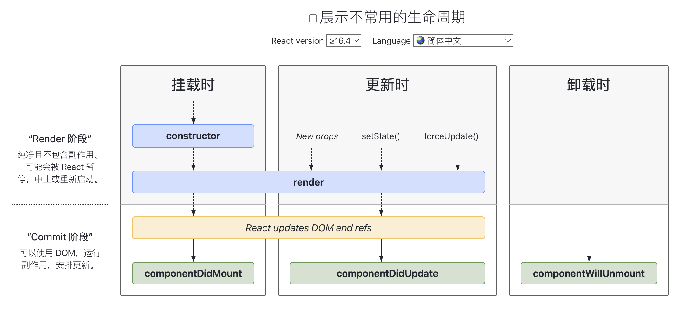
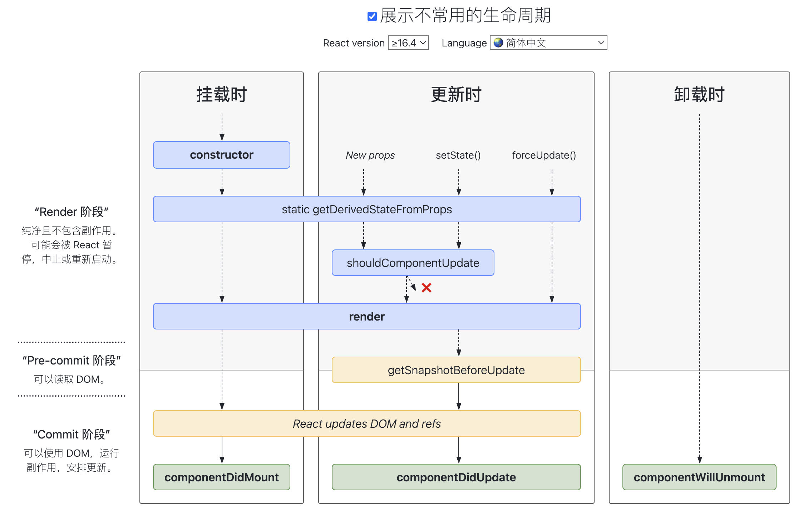

百度百科对生命周期有这样的解释：生命周期就是指一个对象的生老病死。

在 React 的世界里，生命周期就是指组件的生老病死。也就是从虚拟 DOM 到真实 DOM 的初始化以及中途到更新到最后组件的销毁。而生命周期函数，就是某些特定时期执行特定函数。其本质就是回调

```js
function startALifetime(life) {}

//本质：回调
startALifetime({
  born: () => {},
  school: () => {},
  work: () => {},
  marry: () => {},
  //.....
  detroy: () => {},
});
```

这里有些阶段是必经的，有些阶段是不同人情况不一样的，有些阶段只经历一次，有些阶段要经历多次，但本质上都是在特定阶段需要执行的操作。其实不仅是 React，在 Vue，在 Android、iOS 等程序等等编程领域都有生命周期的概念。

<br>
<br>
<br>

### [生命周期图](https://projects.wojtekmaj.pl/react-lifecycle-methods-diagram/)



上图已将 `>=16.4` 的不常用生命周期函数隐藏，剩下加粗标记的就是常用生命周期函数

- **`constructor`**
- **`render`**
- **`componentDidMount`**
- **`componentDidUpdate`**
- **`componentWillUnmount`**

> 在实现组件生命周期函数时，参照官方文档提供的生命周期时序图中各阶段的触发时机进行代码编写。这种对照实现方式能够确保生命周期回调的执行顺序和实际效果与框架设计意图保持高度一致。

<br>
<br>



上图已将 `>=16.4` 的不常用生命周期函数展示，多了三个不常用生命周期函数

- `static getDerivedStateFromProps`
- `shouldComponentUpdate`
- `getSnapshotBeforeUpdate`

<br>
<br>

总体上从纵向维度阶段出发，大致分为 初始化、更新、卸载 三个阶段

- **Render 阶段**
- **Pre-commit 阶段**
- **Commit phase 阶段**

<br>
<br>

::: warning 至于官方不推荐的生命周期，就不具体看了

[链接](https://reactjs.org/blog/2018/03/27/update-on-async-rendering.html)

- componentWillMount
- componentWillReceiveProps
- componentWillUpdate

:::
