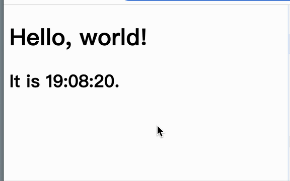

### componentDidMount

`react-dom.js`

```js
// ...

function mount(VNode, containerDOM) {
  let newDom = createDOM(VNode);
  newDom && containerDOM.appendChild(newDom);

  // 理论上，应该在这里执行（dom创建完，且已经 dom 挂载到页面后 触发），但为了降低代码复杂度，增加可读性，
  // 就放在 getDomByClassComponent（dom创建完，但未挂载到页面之前 就触发了）中执行，虽然有些微小时间差
  // xx.componentDidMount()
}

// ...

function getDomByClassComponent(VNode) {
  let { type, props, ref } = VNode;
  let instance = new type(props);
  let renderVNode = instance.render();
  instance.oldVNode = renderVNode;

  // 给类组件添加 ref
  ref && (ref.current = instance);
  if (!renderVNode) return null;

-  // return createDOM(renderVNode);
+ let dom = createDOM(renderVNode);
+
+ // 这里偷个懒，也为更好的可读性
+ if (instance.componentDidMount) {
+   instance.componentDidMount();
+ }
+
+ return dom;
}
```

<br/>
<br/>
<br/>

### componentDidUpdate

`Component.js`

```js
//...

export class Component {
  //...

  update() {
    // ...

    // 更新后触发，forceUpdate
    if (this.componentDidUpdate) {
      this.componentDidUpdate(this.props, this.state);
    }
  }
}
```

<br/>
<br/>
<br/>

### componentWillUnmount

`react-dom.j`

```js
function removeVNode(VNode) {
  const currentDom = findDomByVNode(VNode);
  if (currentDom) currentDom.remove();
+ if (VNode.classInstance && updateDomTree.classInstance.componentWillUnMount) {
+   updateDomTree.classInstance.componentWillUnMount();
+ }
}

```

<br/>
<br/>
<br/>

### 调试

[官网例子](https://reactjs.org/docs/state-and-lifecycle.html#adding-lifecycle-methods-to-a-class)

```js
import React from "./react";
import ReactDOM from "./react-dom";

class Clock extends React.Component {
  constructor(props) {
    super(props);
    this.state = { date: new Date() };
  }

  /**
   * https://reactjs.org/docs/react-component.html#componentdidmount
   */
  componentDidMount() {
    this.timerID = setInterval(() => this.tick(), 1000);
  }

  /**
   * https://reactjs.org/docs/react-component.html#componentdidupdate
   */
  componentDidUpdate(prevProps, prevState, snapshot) {}

  /**
   * https://reactjs.org/docs/react-component.html#componentwillunmount
   */
  componentWillUnmount() {
    clearInterval(this.timerID);
  }

  tick = () => {
    this.setState({
      date: new Date(),
    });
  };

  render() {
    return (
      <div>
        <h1>Hello, world!</h1>
        <h2>It is {this.state.date.toLocaleTimeString()}.</h2>
      </div>
    );
  }
}
ReactDOM.render(<Clock />, document.getElementById("root"));
```

效果如下


