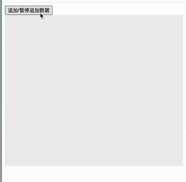

[getSnapshotBeforeUpdate](https://reactjs.org/docs/react-component.html#getsnapshotbeforeupdate)

- 该函数在 render 函数执行完成生成真实 DOM 后，DOM 挂载到页面前执行
- 该函数使得组件在 DOM 发生变化之前可以获取一些信息
- 该函数返回的任何值都会作为 componentDidUpdate 的第三个参数传入
- 该生命周期函数并不常用，仅仅在一些特定 UI 变化的场景才会用到

<br/>

从前面的生命周期示例图上可以看到，是在 updating 阶段触发，那么要到 Component.update 调用 render 之前执行

<br/>
<br/>
<br/>

### Component.js

```js
// ...

export class Component {
  // ...

- update() {
+ update(prevProps, prevState) {
    // ...
    if (this.constructor.getDerivedStateFromProps) {
      let newState =
        this.constructor.getDerivedStateFromProps(this.props, this.state) || {};
      this.state = { ...this.state, ...newState };
    }

+   let snapshot =
+     this.getSnapshotBeforeUpdate &&
+     this.getSnapshotBeforeUpdate(prevProps, prevState); // 如何获取之前的数据 prevProps、prevState？找到调用 update 的地方，也就是 Updater 类中

    let newVNode = this.render();
    // ...

    if (this.componentDidUpdate) {
-     this.componentDidUpdate(this.props, this.state);
+     this.componentDidUpdate(this.props, this.state, snapshot); // snapshot 传递给 componentDidUpdate
    }
  }
}
```

<br/>
<br/>
<br/>

### Updater.js

```js
+ import { deepClone } from "./utils";

export class Updater {
  // ...

  launchUpdate(nextProps) {
    // ...

    if (pendingState.length === 0 && !nextProps) return;

    // 需要深拷贝，不能直接引用
+   const prevProps = deepClone(ClassComponentInstance.props);
+   const prevState = deepClone(ClassComponentInstance.state);

    // ...

    if (nextProps) ClassComponentInstance.props = nextProps;
-   if (isShouldUpdate) ClassComponentInstance.update();
+   if (isShouldUpdate) ClassComponentInstance.update(prevProps, prevState); // 传递给 update
  }
}
```

<br/>
<br/>
<br/>

### util.js

```js
// ...

export const deepClone = (data) => {
  const type = getType(data);
  let resultValue;

  if (type !== "array" && type !== "object") return data;

  if (type === "array") {
    resultValue = [];
    data.forEach((item) => {
      resultValue.push(deepClone(item));
    });
    return resultValue;
  }

  if (type === "object") {
    resultValue = {};
    for (const key in data) {
      if (data.hasOwnProperty(key)) {
        resultValue[key] = deepClone(data[key]);
      }
    }
    return resultValue;
  }
};

function getType(obj) {
  const typeMap = {
    "[object Boolean]": "boolean",
    "[object Number]": "number",
    "[object String]": "string",
    "[object Function]": "function",
    "[object Array]": "array",
    "[object Date]": "date",
    "[object RegExp]": "regExp",
    "[object Undefined]": "undefined",
    "[object Null]": "null",
    "[object Object]": "object",
  };

  return typeMap[Object.prototype.toString.call(obj)];
}
```

<br/>
<br/>
<br/>

### 调试

```js
import React from "./react";
import ReactDOM from "./react-dom";

class ScrollingList extends React.Component {
  counter = 0;
  isAppend = true;
  intervalId = 0;

  constructor(props) {
    super(props);
    this.listRef = React.createRef();
    this.state = { list: [] };
  }

  getSnapshotBeforeUpdate(prevProps, prevState) {
    // Are we adding new items to the list?
    // Capture the scroll position so we can adjust scroll later.
    if (prevState.list.length < this.state.list.length) {
      const list = this.listRef.current;
      return list.scrollHeight - list.scrollTop;
    }
    return null;
  }

  componentDidUpdate(prevProps, prevState, snapshot) {
    // If we have a snapshot value, we've just added new items.
    // Adjust scroll so these new items don't push the old ones out of view.
    // (snapshot here is the value returned from getSnapshotBeforeUpdate)
    if (snapshot !== null) {
      const list = this.listRef.current;
      list.scrollTop = list.scrollHeight - snapshot;
    }
  }

  componentWillUnmount() {
    clearInterval(this.intervalId);
  }

  appendData = () => {
    if (this.isAppend) {
      this.intervalId = setInterval(() => {
        this.setState({
          list: [...this.state.list, this.counter++],
        });
      }, 1000);
    } else {
      clearInterval(this.intervalId);
    }
    this.isAppend = !this.isAppend;
  };

  render() {
    return (
      <div>
        <input
          type="button"
          value="追加/暂停追加数据"
          onClick={() => this.appendData()}
        />

        <div
          ref={this.listRef}
          style={{ overflow: "auto", height: "400px", background: "#efefef" }}
        >
          {this.state.list.map((item) => (
            <div
              key={item}
              style={{
                height: "60px",
                padding: "10px",
                marginTop: "10px",
                border: "1px solid blue",
                borderRadius: "6px",
              }}
            >
              {item}
            </div>
          ))}
        </div>
      </div>
    );
  }
}

ReactDOM.render(<ScrollingList />, document.getElementById("root"));
```

效果如下


