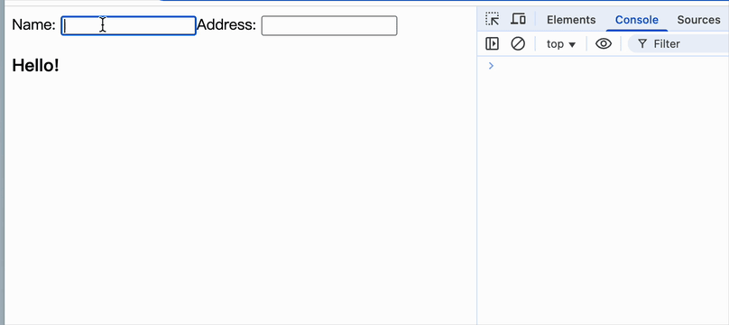

[PureComponent](https://react.dev/reference/react/PureComponent) 会跳过相同（浅比较） props 和 state 的重新渲染

<br/>

### react.js

```js
import {
  // ...
  shallowEqual,
} from "./utils";

// ...

class PureComponent extends Component {
  shouldComponentUpdate(nextProps, nextState) {
    return (
      !shallowEqual(this.props, nextProps) ||
      !shallowEqual(this.state, nextState)
    );
  }
}

// ...

const React = {
  // ...
  PureComponent,
};

export default React;
```

<br/>
<br/>
<br/>

### utils.js

```js
// ...

// 仅比较对象
export const shallowEqual = (obj1, obj2) => {
  // 同个引用
  if (obj1 === obj2) return true;

  if (getType(obj1) !== "object" || getType(obj2) !== "object") return false;

  const keys1 = Object.keys(obj1);
  const keys2 = Object.keys(obj2);

  if (keys1.length !== keys2.length) return false;

  for (let key of keys1) {
    if (!obj2.hasOwnProperty(key) || obj1[key] !== obj2[key]) {
      return false;
    }
  }

  return true;
};
```

<br/>
<br/>
<br/>

### 验证

```js
import React from "./react";
import ReactDOM from "./react-dom";

class Greeting extends React.PureComponent {
  render() {
    console.log("render");

    return (
      <h3>
        Hello{this.props.name && ", "}
        {this.props.name}!
      </h3>
    );
  }
}

class MyApp extends React.Component {
  constructor(props) {
    super(props);
    this.state = { name: "", address: "" };
  }

  setName = (newName) => {
    this.setState({ name: newName });
  };

  setAddress = (newAddress) => {
    this.setState({ address: newAddress });
  };

  render() {
    return (
      <div>
        <label>
          Name{": "}
          <input
            onInput={(e) => {
              this.setName(e.target.value);
            }}
          />
        </label>
        <label>
          Address{": "}
          <input
            onInput={(e) => {
              this.setAddress(e.target.value);
            }}
          />
        </label>
        <Greeting name={this.state.name} />
      </div>
    );
  }
}

ReactDOM.render(<MyApp />, document.getElementById("root"));
```

效果如下


