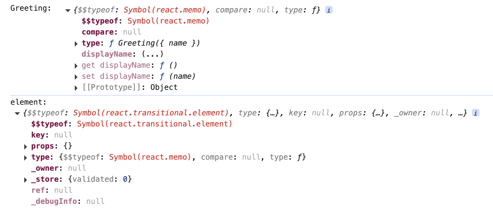
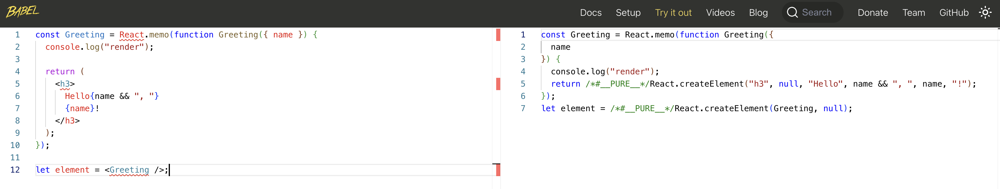

[memo](https://react.dev/reference/react/memo#memo) 包裹的函数，props 没有改变（浅比较），组件就不会重新渲染

<br/>

```js
import React from "react";

const Greeting = React.memo(function Greeting({ name }) {
  console.log("render");

  return (
    <h3>
      Hello{name && ", "}
      {name}!
    </h3>
  );
});

let element = <Greeting />;

console.log("Greeting: ", Greeting);
console.log("element: ", element);
```

打印结果如下：



<br/>

Babel 转换后：



<br/>
<br/>
<br/>

### constant.js

```js
// ...
export const REACT_MEMO = Symbol("react.memo");
// ...
```

<br/>
<br/>
<br/>

### react.js

根据上面的 memo 的打印值，输出对应的结构

```js
// ...

import {
  // ...
  REACT_MEMO,
  // ...
} from "./utils";

// ...

// 给个默认的 shallowEqual 浅比较函数
function memo(type, compare = shallowEqual) {
  return {
    $$typeof: REACT_MEMO,
    type,
    compare,
  };
}

const React = {
  // ...
  memo,
};

export default React;
```

<br/>
<br/>
<br/>

### react-dom.js

```js
import {
  // ...
+ REACT_MEMO,
  // ...
} from "./utils";

// ...

function createDOM(VNode) {
  // ...

  let dom;

  // memo
+ if (type && type.$$typeof === REACT_MEMO) {
+   return getDomByMemoFunctionComponent(VNode);
+ }

  // ...
}

// 根据函数组件生成 DOM
function getDomByFunctionComponent(VNode) {
  // ...

  if (!renderVNode) return null;

  // 这里关联 dom，调试节点发现有问题
+ const dom = (VNode.dom = createDOM(renderVNode));
+ return dom;
}

// 根据 memo 组件生成 DOM
+ function getDomByMemoFunctionComponent(VNode) {
+   const { type, props } = VNode;
+   const renderVNode = type.type(props);
+   if (!renderVNode) return null;
+   VNode.oldRenderVNode = renderVNode;
+   return createDOM(renderVNode);
+}

function deepDOMDiff(oldVNode, newVNode) {
  const diffTypeMap = {
    // ...
    // memo 组件
+   MEMO: oldVNode.type.$$typeof === REACT_MEMO,
    // ...
  };

  switch (DIFF_TYPE) {
    //...

+   case "MEMO":
+     updateMemoFunctionComponent(oldVNode, newVNode);
+     break;

    default:
      break;
  }
}

function updateFunctionComponent(oldVNode, newVNode) {
  // 这里关联 dom，调试节点发现有问题
+ const oldDom = (newVNode.dom = findDomByVNode(oldVNode));
  if (!oldDom) return;
  // ...
}

+function updateMemoFunctionComponent(oldVNode, newVNode) {
+  const { type } = oldVNode;
+  if (!type.compare(oldVNode.props, newVNode.props)) {
+   const oldDom = findDomByVNode(oldVNode);
+   const renderVNode = newVNode.type.type(newVNode.props);
+   updateDomTree(oldVNode.oldRenderVNode, renderVNode, oldDom);
+   newVNode.oldRenderVNode = renderVNode;
+ } else {
+   // 直接复用
+   newVNode.oldRenderVNode = oldVNode.oldRenderVNode;
+ }
+}
```

<br/>
<br/>
<br/>

### 调试

```js
import React from "./react";
import ReactDOM from "./react-dom";

const Greeting = React.memo(function Greeting({ name }) {
  console.log("render");

  return (
    <h3>
      Hello{name && ", "}
      {name}!
    </h3>
  );
});

class MyApp extends React.Component {
  constructor(props) {
    super(props);
    this.state = { name: "", address: "" };
  }

  setName = (newName) => {
    this.setState({ name: newName });
  };

  setAddress = (newAddress) => {
    this.setState({ address: newAddress });
  };

  render() {
    return (
      <div>
        <label>
          Name{": "}
          <input
            onInput={(e) => {
              this.setName(e.target.value);
            }}
          />
        </label>
        <label>
          Address{": "}
          <input
            onInput={(e) => {
              this.setAddress(e.target.value);
            }}
          />
        </label>
        <Greeting name={this.state.name} />
      </div>
    );
  }
}

ReactDOM.render(<MyApp />, document.getElementById("root"));
```

效果如下：


