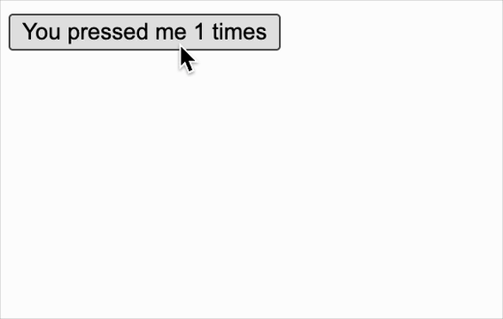

[useState](https://react.dev/reference/react/useState) 允许在函数组件中添加状态（state）

<br/>

### hooks.js

```js
import { emitUpdateForHooks } from "./react-dom";

let states = [];
let hookIndex = 0;

// 每次更新都从根组件开始，组件中的 hooks 也是按顺序依次执行，需将 hookIndex 重置。
// 这也就是为什么 Hooks 必须在顶层调用且不可条件化的根本原因。
export function resetHookIndex() {
  hookIndex = 0;
}

export function useState(initialValue) {
  states[hookIndex] = states[hookIndex] || initialValue;

  // 利用闭包机制，把执行时的顺序索引 currentIndex 给存起来。
  // 因为当 setState 被外部调用时，hookIndex 可能已不是当初执行时的顺序索引了
  const currentIndex = hookIndex;

  function setState(newState) {
    // 1、修改
    states[currentIndex] = newState;
    // 2、更新
    emitUpdateForHooks();
  }

  return [states[hookIndex++], setState];
}
```

<br/>
<br/>
<br/>

### react-dom.js

```js
// ...
+ import { resetHookIndex } from "./hooks";

+ export let emitUpdateForHooks;

function render(VNode, containerDOM) {
  mount(VNode, containerDOM);

+ emitUpdateForHooks = () => {
+   // 重置索引值
+   resetHookIndex();
+   // 更新
+   updateDomTree(VNode, VNode, findDomByVNode(VNode));
+ };
}


// 根据函数组件生成 DOM
function getDomByFunctionComponent(VNode) {
  // ...

  if (!renderVNode) return null;
+ VNode.oldRenderVNode = renderVNode;
  const dom = (VNode.dom = createDOM(renderVNode));
  return dom;
}
```

<br/>
<br/>
<br/>

### react.js

```js
// ...

export * from "./hooks";

// ...
```

<br/>
<br/>
<br/>

### 调试

```js
import React, { useState } from "./react";
import ReactDOM from "./react-dom";

export default function Counter() {
  const [count, setCount] = useState(0);

  function handleClick() {
    setCount(count + 1);
  }

  return <button onClick={handleClick}>You pressed me {count} times</button>;
}

ReactDOM.render(<Counter />, document.getElementById("root"));
```

效果如下


