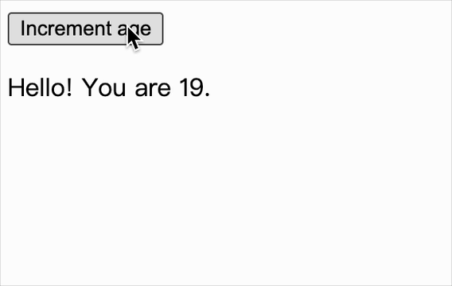

[useReducer](https://react.dev/reference/react/useReduce) 允许通过 reducer 函数的方式来管理组件的内部状态。相比于直接使用 useState，useReducer 可以让逻辑更加复杂和集中的状态管理变得更加清晰和易于理解。

<br/>

### hooks.js

```js
// ...

// 逻辑与 useState 非常相似
export function useReducer(reducer, initialValue) {
  states[hookIndex] = states[hookIndex] || initialValue;
  const currentIndex = hookIndex;

  function dispatch(action) {
    states[currentIndex] = reducer(states[currentIndex], action);
    emitUpdateForHooks();
  }

  return [states[hookIndex++], dispatch];
}
```

<br/>
<br/>
<br/>

### 调试

```js
import React, { useReducer } from "./react";
import ReactDOM from "./react-dom";

function reducer(state, action) {
  if (action.type === "incremented_age") {
    return {
      age: state.age + 1,
    };
  }
  throw Error("Unknown action.");
}

function Counter() {
  const [state, dispatch] = useReducer(reducer, { age: 18 });

  return (
    <div>
      <button
        onClick={() => {
          dispatch({ type: "incremented_age" });
        }}
      >
        Increment age
      </button>

      <p>Hello! You are {state.age}.</p>
    </div>
  );
}

ReactDOM.render(<Counter />, document.getElementById("root"));
```

效果如下


