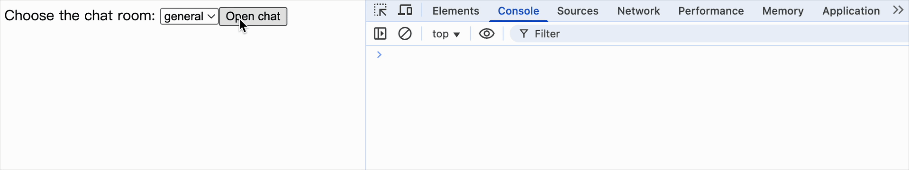

[useEffect](https://react.dev/reference/react/useEffect) 允许你在函数组件中执行副作用操作。

<br>
<br>

### hooks.js

```js
/**
 * - componentDidMount (已实现)
 * - componentDidUpdate (已实现)
 * - componentWillUnMount（未实现，代码量较大，首先要找到组件中有多少 useEffect、useLayoutEffect 已经对应的状态记录下来，然后操作）
 */
export function useEffect(effectFunction, deps = []) {
  const currentIndex = hookIndex;
  const [destroyFunction, preDeps] = states[hookIndex] || [null, null];

  if (
    !states[hookIndex] ||
    deps.some((item, index) => item !== preDeps[index])
  ) {
    // 宏任务，能保证挂载之后执行
    setTimeout(() => {
      // 销毁函数
      destroyFunction && destroyFunction();
      states[currentIndex] = [effectFunction(), deps];
    });
  }

  hookIndex++;
}
```

<br>
<br>
<br>

### 验证

```js
import React, { useState, useEffect } from "./react";
import ReactDOM from "./react-dom";

export function createConnection(serverUrl, roomId) {
  // A real implementation would actually connect to the server
  return {
    connect() {
      console.log(
        '✅ Connecting to "' + roomId + '" room at ' + serverUrl + "..."
      );
    },
    disconnect() {
      console.log('❌ Disconnected from "' + roomId + '" room at ' + serverUrl);
    },
  };
}

function ChatRoom({ roomId }) {
  const [serverUrl, setServerUrl] = useState("https://localhost:1234");

  useEffect(() => {
    const connection = createConnection(serverUrl, roomId);
    connection.connect();
    return () => {
      connection.disconnect();
    };
  }, [roomId, serverUrl]);

  return (
    <div>
      <label>
        Server URL:{" "}
        <input
          value={serverUrl}
          onChange={(e) => setServerUrl(e.target.value)}
        />
      </label>
      <h1>Welcome to the {roomId} room!</h1>
    </div>
  );
}

export default function App() {
  const [roomId, setRoomId] = useState("general");
  const [show, setShow] = useState(false);

  return (
    <div>
      <label>
        Choose the chat room:{" "}
        <select value={roomId} onChange={(e) => setRoomId(e.target.value)}>
          <option value="general">general</option>
          <option value="travel">travel</option>
          <option value="music">music</option>
        </select>
      </label>
      <button onClick={() => setShow(!show)}>
        {show ? "Close chat" : "Open chat"}
      </button>
      {show && <hr />}
      {show && <ChatRoom roomId={roomId} />}
    </div>
  );
}

ReactDOM.render(<App />, document.getElementById("root"));
```

效果如下


