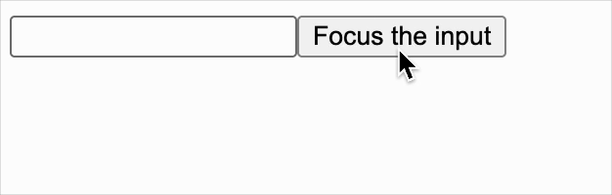

[useRef](https://react.dev/reference/react/useRef) 与 ref 是一样的，允许你在组件的整个生命周期内保持对一个元素的引用，而不会触发组件的重新渲染。

<br/>

### hooks

```js
export function useRef(initialValue) {
  states[hookIndex] = states[hookIndex] || { current: initialValue };
  return states[hookIndex++];
}
```

<br/>
<br/>
<br/>

### 验证

```js
import React, { useRef } from "./react";
import ReactDOM from "./react-dom";

export default function Form() {
  const inputRef = useRef(null);

  function handleClick() {
    inputRef.current.focus();
  }

  return (
    <div>
      <input ref={inputRef} />
      <button onClick={handleClick}>Focus the input</button>
    </div>
  );
}

ReactDOM.render(<Form />, document.getElementById("root"));
```

效果如下


