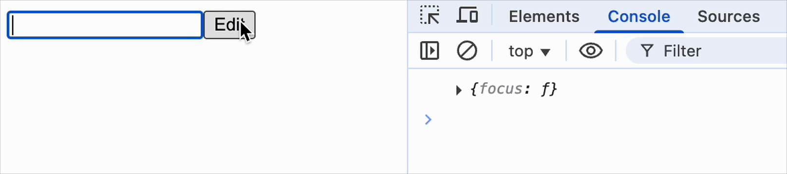

[useImperativeHandle](https://react.dev/reference/react/useImperativeHandle) 主要用于在子组件中暴露特定方法或属性给父组件，同时避免直接暴露整个组件实例。

<br/>
<br/>

### hooks.js

```js
export function useImperativeHandle(ref, createHandle) {
  ref.current = createHandle();
}
```

<br/>
<br/>
<br/>

```js
import React, { useRef, useImperativeHandle } from "./react";
import ReactDOM from "./react-dom";

const MyInput = React.forwardRef((props, ref) => {
  const inputRef = useRef(null);

  useImperativeHandle(ref, () => ({
    focus() {
      inputRef.current.focus();
    },
  }));

  return <input {...props} ref={inputRef} />;
});

export default function Form() {
  const ref = useRef(null);

  function handleClick() {
    ref.current.focus();
    console.log(ref.current);
  }

  return (
    <form>
      <MyInput label="Enter your name:" ref={ref} />
      <button type="button" onClick={handleClick}>
        Edit
      </button>
    </form>
  );
}

ReactDOM.render(<Form />, document.getElementById("root"));
```

效果如下


