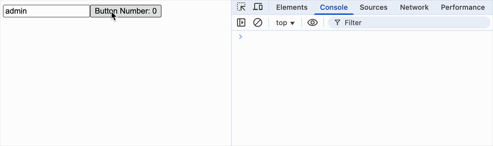

[‌useMemo](https://react.dev/reference/react/useMemo) 主要用于缓存复杂计算结果、保持引用稳定性和优化组件渲染性能。
[useCallback](https://react.dev/reference/react/useCallback) 主要用于缓存函数引用，避免因组件重新渲染或依赖项变化导致不必要的函数创建。

它们都是关于性能优化的 Hooks，其实现都很类似。

<br/>
<br/>

### hooks.js

```js
export function useMemo(calculateValue, dependencies = []) {
  const [prevData, prevDeps] = states[hookIndex] || [null, null];

  if (
    !states[hookIndex] ||
    dependencies.some((item, index) => item !== prevDeps[index])
  ) {
    let newData = calculateValue();
    states[hookIndex++] = [newData, dependencies];
    return newData;
  }

  hookIndex++;
  return prevData;
}

export function useCallback(fn, dependencies) {
  const [prevFn, prevDeps] = states[hookIndex] || [null, null];

  if (
    !states[hookIndex] ||
    dependencies.some((item, index) => item !== prevDeps[index])
  ) {
    states[hookIndex++] = [fn, dependencies];
    return fn;
  }

  hookIndex++;
  return prevFn;
}
```

<br/>
<br/>
<br/>

### 调试

```js
import React, { useState, useMemo, useCallback } from "./react";
import ReactDOM from "./react-dom";

function Child({ data, handleClick }) {
  console.log("render Child");

  return <button onClick={handleClick}>Button Number: {data.number}</button>;
}

const MemoChild = React.memo(Child);

function App() {
  console.log("render App");

  const [name, setName] = useState("admin");
  const [number, setNumber] = useState(0);

  const data = useMemo(() => ({ number }), [number]);
  const handleClick = useCallback(() => setNumber(number + 1), [number]);

  return (
    <div>
      <input
        type="text"
        value={name}
        onInput={(event) => setName(event.target.value)}
      />

      <MemoChild data={data} handleClick={handleClick} />
    </div>
  );
}

ReactDOM.render(<App />, document.getElementById("root"));
```

效果如下


