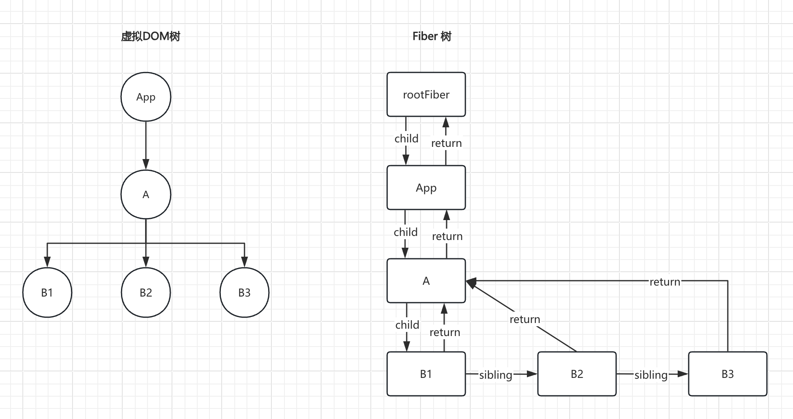

### Fiber 架构是什么

> Fiber 架构是 React 为了解决性能问题和提升调度能力而引入的一种新的内部实现机制。它主要通过重新组织渲染过程，使 React 可以更有效地执行渲染任务。

Fiber 架构是如何进行工作的呢，其工作流程是什么样子的呢？回答这个问题并不容易，尽量用流程图展示其流程：

```
+------------------------------------------------------------------------------+
|                             Reconciliation Phase                             |
+------------------------------------------------------------------------------+
                                      |
                                      v
+------------------------------------------------------------------------------+
|                   Initialize/Update Fiber Tree                               |
|       - Create Root Fiber                                                    |
|       - Clone Fibers for Updates                                             |
|       - Link Old and New Fibers                                              |
|       - Handle Offscreen and Hidden Components                               |
|       - Process Legacy Context API                                           |
|       - Assign Return Pointer and Child Pointer                              |
|       - Calculate Update Priority based on Lane Strategy                     |
|       - Handle Strict Mode Warnings and DevTool Integrations                 |
+------------------------------------------------------------------------------+
                                      |
                                      v
+------------------------------------------------------------------------------+
|                             Begin Work                                       |
|       - Render Component                                                     |
|       - Determine Changes                                                    |
|       - Schedule Updates                                                     |
|       - Handle Context Providers                                             |
|       - Handle Error Boundaries                                              |
|       - Handle Suspense and Lazy Loading                                     |
|       - Process useMemo and useCallback                                      |
|       - Detect Concurrent Mode and Update Priority                           |
|       - Handle Event Handlers in Concurrent Mode                             |
|       - Process useContext Hook                                              |
|       - Process useReducer Hook                                              |
|       - Handle useImperativeHandle Callbacks                                 |
+------------------------------------------------------------------------------+
                                      |
                                      v
+------------------------------------------------------------------------------+
|                             Complete Work                                    |
|       - Create Work In Progress Tree                                         |
|       - Process Side-Effects                                                 |
|       - Merge New Fibers with Old Fibers                                     |
|       - Check for Interrupted Work                                           |
|       - Update Memoized State and Props                                      |
|       - Compute Expiration Time for Updates                                  |
|       - Handle Profiler Component and Timing Metrics                         |
|       - Process useTransition Hook                                           |
|       - Process useDeferredValue Hook                                        |
+------------------------------------------------------------------------------+
                                      |
                                      v
+------------------------------------------------------------------------------+
|                             Task Splitting                                   |
|       - Prioritize Tasks                                                     |
|       - Defer Low Priority Tasks                                             |
|       - Yield to High Priority Tasks                                         |
|       - Utilize Browser Idle Time                                            |
|       - Check for Uncommitted Updates                                        |
|       - Use Lane Strategy for Scheduling and Prioritization                  |
|       - Handle Time Slicing in Concurrent Mode                               |
+------------------------------------------------------------------------------+
                                      |
                                      v
+------------------------------------------------------------------------------+
|                               Commit Phase                                   |
+------------------------------------------------------------------------------+
                                      |
                                      v
+------------------------------------------------------------------------------+
|                           Before Mutation Phase                              |
|       - Snapshot Lifecycle                                                   |
|       - getSnapshotBeforeUpdate                                              |
|       - Call getDerivedStateFromProps                                        |
|       - Call static getDerivedStateFromError in Error Boundaries             |
|       - Process Strict Mode Double Render                                    |
+------------------------------------------------------------------------------+
                                      |
                                      v
+------------------------------------------------------------------------------+
|                           Mutation Phase                                     |
|       - Execute Side-Effects                                                 |
|       - Insert/Update/Delete DOM Elements                                    |
|       - Process Ref Updates                                                  |
|       - Handle Forward Refs                                                  |
|       - Handle Passive Effects                                               |
|       - Commit Hydration for Server-Rendered Components                      |
|       - Invoke componentDidCatch in Error Boundaries                         |
|       - Process useMutableSource Hook Updates                                |
+------------------------------------------------------------------------------+
                                      |
                                      v
+------------------------------------------------------------------------------+
|                           Layout Phase                                       |
|       - componentDidUpdate                                                   |
|       - componentDidMount                                                    |
|       - FLIP Animation Techniques                                            |
|       - Apply Accessibility Changes                                          |
|       - Apply Directionality Changes                                         |
|       - Handle ResizeObserver Callbacks                                      |
|       - Apply CSS Variables and Custom Properties                            |
|       - Handle IntersectionObserver Callbacks                                |
|       - Process useLayoutEffect Callbacks                                    |
+------------------------------------------------------------------------------+
                                        |
                                        v
+------------------------------------------------------------------------------+
|                           Passive Phase                                      |
| - useEffect callbacks                                                        |
| - Clean up Previous Effects                                                  |
| - Interact with External Libraries and APIs                                  |
| - Schedule Passive Effect Cleanup                                            |
| - Handle Batched Updates                                                     |
| - Manage Custom React Renderers                                              |
| - Perform Profiler Data Collection                                           |
| - Integrate with React DevTools                                              |
+------------------------------------------------------------------------------+
```

当然，仅凭一个流程图，不理解是很正常的，学习复杂事物采用分层的办法，先宏观，再中观，再微观（对于复杂的事物，切忌不要一开始就深入细节，就好像身处大山，就只能看见花草树木，很难看见自己所处的位置，进而迷路）

<br/>
<br/>
<br/>

### Fiber 是什么

Fiber 代表的是一种数据结构，在代码中体现为一个对象，对象包括很多属性，其中特别值得注意的有：

- **type**：组件的类型，可以是函数组件、类组件或原生 DOM 元素。
- **key**：组件的唯一标识符，用于在组件树中区分兄弟节点。
- **props**：组件的属性。
- **stateNode**：对于类组件，这是组件实例。对于原生 DOM 元素，这是实际的 DOM 节点。
- **return**：指向父 Fiber 节点的指针。
- **child**：指向第一个子 Fiber 节点的指针。
- **sibling**：指向兄弟 Fiber 节点的指针。
- **flags**：描述 Fiber 节点需要执行的副作用类型（如插入、更新或删除）。
- **alternate**：指向当前 Fiber 节点的替代 Fiber 节点，这是双缓存技术的关键部分。

非 Fiber 架构下，渲染过程是 `虚拟 DOM` -> `真实 DOM` -> `挂载页面` <br/>
在 Fiber 架构下，渲染过程是 `虚拟 DOM` -> `Fiber` -> `真实 DOM` -> `挂载页面`

<br>
<br>

用个例子来演示下虚拟 DOM 树和 Fiber 树的大体结构

```jsx
function App() {
  return (
    <div key="A">
      <div key="B1"></div>
      <div key="B2"></div>
      <div key="B3"></div>
    </div>
  );
}

const root = createRoot(document.getElementById("root"));
root.render(<App />);
```


