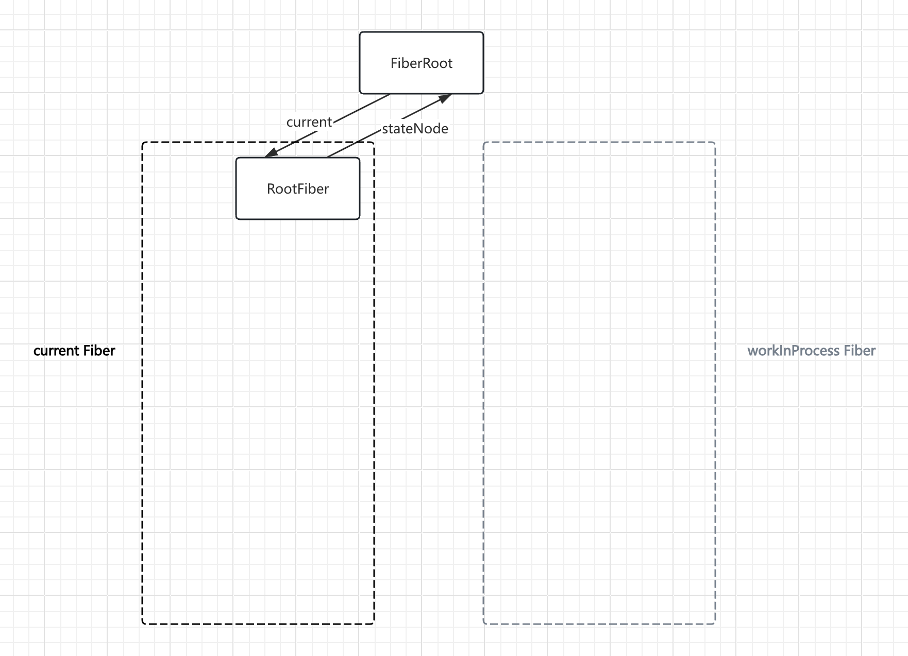
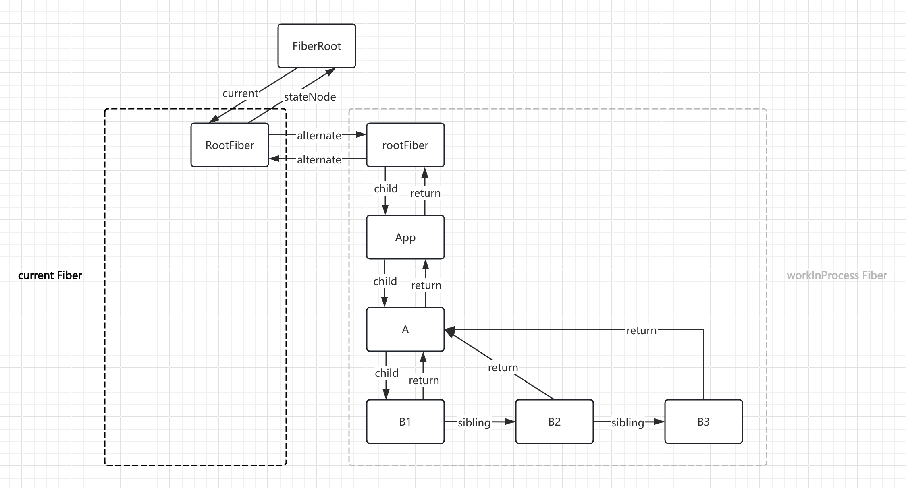

其实双缓冲策略主要用于计算机图形渲染，如幻灯片，是由一帧帧组成。

双缓冲策略也类似，一棵树是**当前渲染树**（**`current`** 当前正在展示的画面）。另一颗树是**工作进程树**（**`workInProcess`** 正在后台工作的画面），等工作结束就**提交**（两棵树身份调换），循环往复处理。

<br>
<br>

模拟下双缓冲策略：

```jsx
function App() {
  return (
    <div key="A">
      <div key="B1"></div>
      <div key="B2"></div>
      <div key="B3"></div>
    </div>
  );
}

const root = createRoot(document.getElementById("root"));
root.render(<App />);
```

<br/>
<br/>

**初始化 mount 时**，也就是 `createRoot` 执行时



代码体现

```js
export function createFiberRoot(containerInfo) {
  const root = new FiberRootNode(containerInfo);
  const uninitializedFiber = createHostRootFiber();
  root.current = uninitializedFiber;
  uninitializedFiber.stateNode = root;
  // ...
  return root;
}
```

<br/>
<br/>

**开始渲染**，也就是 `root.render` 执行时，会根据虚拟 DOM 生成对应的 Fiber 树，Fiber 树再生成对应真实 DOM 渲染，此时两颗树的身份互换，循环往复


