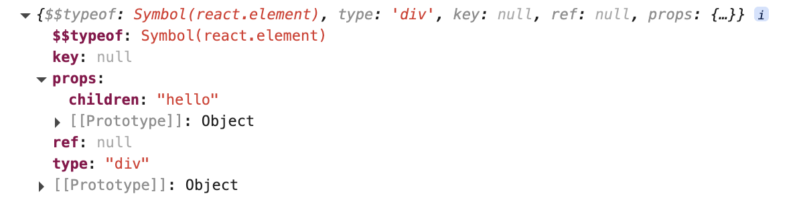

### package/shared/hasOwnProperty.js

```js
const hasOwnProperty = Object.prototype.hasOwnProperty;
export default hasOwnProperty;
```

<br/>
<br/>
<br/>

### package/shared/ReactSymbols.js

```js
export const REACT_ELEMENT_TYPE = Symbol.for("react.element");
```

<br/>
<br/>
<br/>

### package/react/jsx-runtime.js

```js
import { jsxDev } from "./src/jsx/ReactJSXElement";
export { jsxDev as jsx, jsxDev as jsxs };
```

<br/>
<br/>
<br/>

### package/react/src/jsx/ReactJSXElement.js

```js
import hasOwnProperty from "shared/hasOwnProperty";
import { REACT_ELEMENT_TYPE } from "shared/ReactSymbols";

const RESERVED_PROPS = {
  key: true,
  ref: true,
  __self: true,
  __source: true,
};

function hasValidKey(config) {
  return config.key !== undefined;
}

function hasValidRef(config) {
  return config.ref !== undefined;
}

/**
 * 创建一个 React 元素（虚拟DOM）
 */
function ReactElement(type, key, ref, props) {
  return {
    $$typeof: REACT_ELEMENT_TYPE,
    type,
    key,
    ref,
    props,
  };
}

export function jsxDev(type, config, maybeKey) {
  const props = {};
  let key = null;
  let ref = null;

  if (maybeKey !== undefined) {
    key = maybeKey;
  }

  // 极少极少数情况下，config 中才会存在 key
  // 目前不会触发这个逻辑，仅因为源码中有这段逻辑
  if (hasValidKey(config)) {
    key = "" + config.key;
  }

  if (hasValidRef(config)) {
    ref = config.ref;
  }

  for (const propName in config) {
    if (
      hasOwnProperty.call(config, propName) &&
      !RESERVED_PROPS.hasOwnProperty(propName)
    ) {
      props[propName] = config[propName];
    }
  }

  return ReactElement(type, key, ref, props);
}
```

<br/>
<br/>
<br/>

### 调试

```js
const element = <div>hello</div>;

console.log(element);
```

效果如下：


