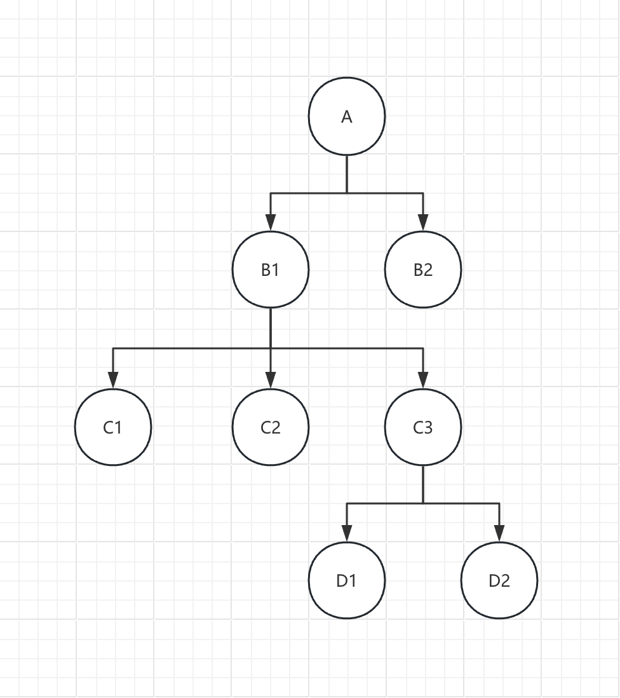
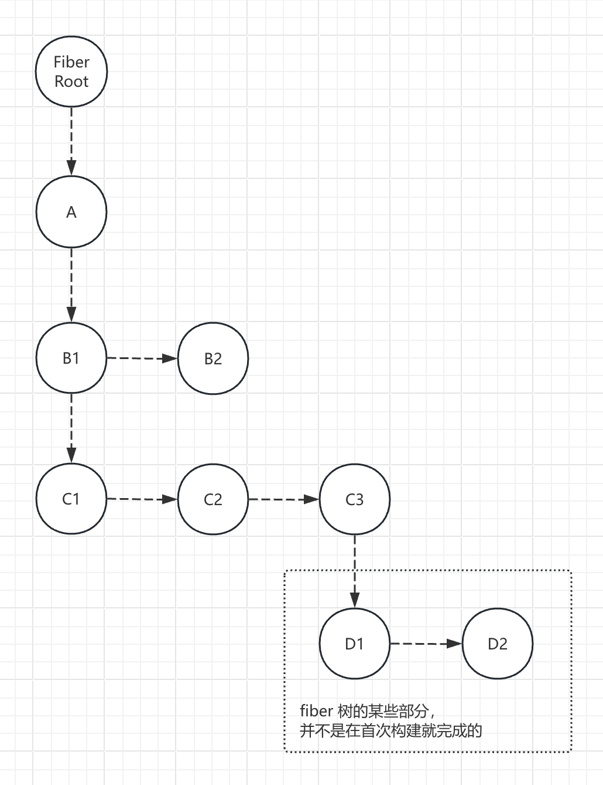

Fiber 架构下，其转换过程是：**虚拟 DOM** -> **Fiber 树** -> **真实 DOM**，与之前版本多了一层 **Fiber 树**。

简单来说，render 函数大致分为：

- **渲染阶段**
  - **虚拟 DOM** -> **Fiber 树**：是 `beginWork` 完成的
  - **Fiber 树** -> **真实 DOM**：是 `completeWork` 完成的
- **提交阶段**
  - **真实 DOM** -> **挂载**：是 `commitWork` 完成的

<br/>

React 执行任务可以中断、恢复都是基于 Fiber 架构的，将任务拆分成一个一个小任务，有序规律的进行。但仅仅是 **虚拟 DOM** -> **Fiber 树** -> **真实 DOM** 过程可以，当真实 DOM 挂载到页面这个过程是不可以中断的。也就是说渲染阶段可以中断恢复，提交阶段不可以。

<br/>
<br/>
<br/>

```jsx
import { createRoot } from "react-dom/src/client/ReactDOMRoot";

const element = (
  <div key="A">
    <div key="B1">
      <div key="C1"></div>
      <div key="C2"></div>
      <div key="C3">
        <div key="D1"></div>
        <div key="D2"></div>
      </div>
    </div>
    <div key="B2"></div>
  </div>
);

const root = createRoot(document.getElementById("root"));
root.render(element);
```

虚拟 DOM 结构：



<br>

Fiber 树结构：



Fiber 树的构建顺序比较巧妙，并非一开始就把整颗 fiber 树构建完成，再构建真实 DOM。或是边构建 fiber，同时创建真实 DOM。而是基于链表结构，交替进行。

- `beginWork`：构建子 fiber 的链表关联，`子 1 -> 子 2 -> 子 3`，并返回第一个子元素
  - 执行完后，是否有 **子节点**？
  - 有，就将 workInProgress 指向第一个子节点，子节点进行下一轮 `beginWork`
  - 无，自己就执行 `completeWork`
- `completeWork`：创建自己对应的真实 DOM，看看是否有子元素需要加到自身，设置属性、样式，将子元素、子子元素上的 flags 同步到自己的 fiber.subtreeFlags
  - 执行完后，是否有 **兄弟节点**？
  - 有，将 workInProgress 指向兄弟节点，开启 `beginWork`
  - 无，将 completedWork、workInProgress 指向自己的父 fiber，此时处于 `do {} while (completedWork !== null)` 中，只要能找到父节点并且父节点无兄弟节点，就会一直执行 `completeWork`

<br/>

最后的执行顺序是：

1. 【**FiberRoot**】`beginWork`
2. 【**A**】`beginWork`
3. 【**B1**】`beginWork`
4. 【**C1**】`beginWork`
5. 【**C1**】`completeWork`
6. 【**C2**】`beginWork`
7. 【**C2**】`completeWork`
8. 【**C3**】`beginWork`
9. 【**D1**】`beginWork`
10. 【**D1**】`completeWork`
11. 【**D2**】`beginWork`
12. 【**D2**】`completeWork`
13. 【**C3**】`completeWork`
14. 【**B1**】`completeWork`
15. 【**B2**】`beginWork`
16. 【**B2**】`completeWork`
17. 【**A**】`completeWork`
18. 【**FiberRoot**】`completeWork`
