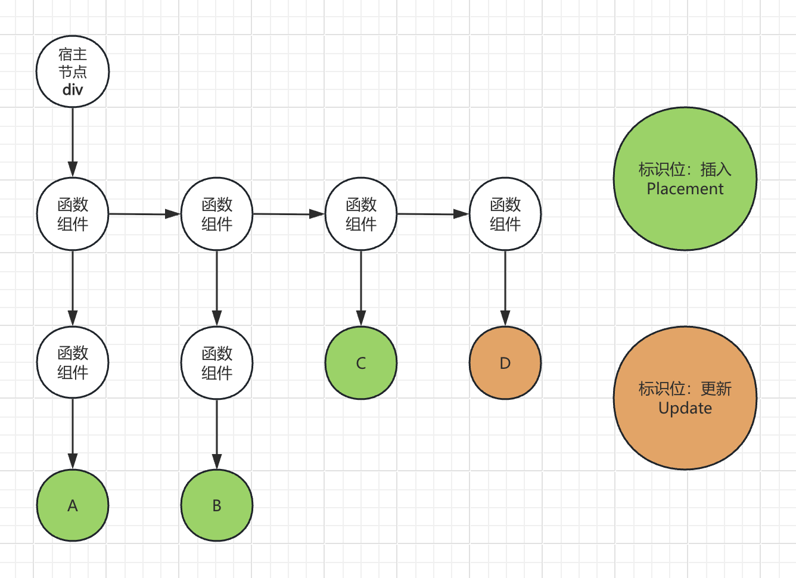

commitWork 中的 `getHostSibling` 函数比较难以理解，这里以图例展示：

 

**getHostSibling 获取宿主兄弟节点，为何要这样操作呢？**

函数组件是没有真实 DOM 的，是无法挂载真实 DOM 元素的，所以需要找到可以挂载的**已存在的宿主兄弟节点**，这就会遇到两种情况：

- 找不到：这种情况，就按照顺序插入到父节点上就好了，A，B，C，D
- 找到了：这种情况，就要找到 D（参照点），插入到其前面，保证顺序。如何直接追加到 div 上，A 就在 D 后面，顺序就不对了

 

- 所以这里 A 的查找顺序：`A -> ... -> B -> ... -> C -> ... -> D`（找到了，将 A 插入 D 前面）
- B 同理，其查找顺序：`B -> ... -> C -> ... -> D`（找到了，将 B 插入 D 前面）
- C 同理，其查找顺序：`C -> ... -> D`（找到了，将 C 插入 D 前面）
