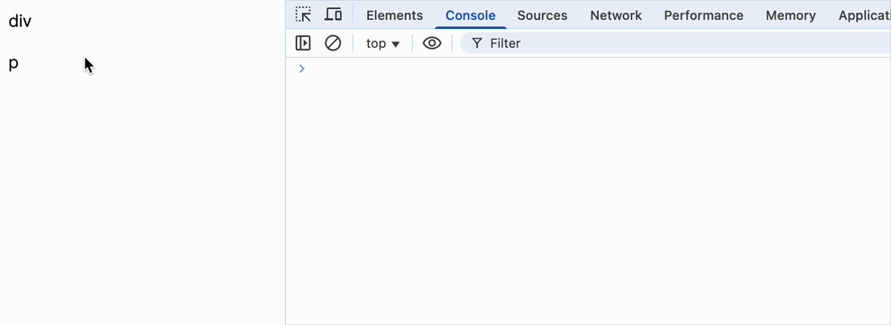

### packages/react-dom-bindings/src/events/DOMPluginEventSystem.js

```js
// ...

/**
 * 处理分发队列
 *
 * @param {Array} dispatchQueue 分发队列
 * @param {number} eventSystemFlags 事件系统标记
 */
function processDispatchQueue(dispatchQueue, eventSystemFlags) {
  // 判断是否在捕获阶段
  const isCapturePhase = (eventSystemFlags & IS_CAPTURE_PHASE) !== 0;
  for (let i = 0; i < dispatchQueue.length; i++) {
    // 因为事件冒泡，listeners 是个数组，里面可能存放这 当前元素click，父元素click，父父元素click，...
    const { event, listeners } = dispatchQueue[i];
    // 按顺序处理分发队列中的项目
    processDispatchQueueItemsInOrder(event, listeners, isCapturePhase);
  }
}

/**
 * 按顺序处理分发队列中的项目
 *
 * @param {Event} event 事件
 * @param {Array} dispatchListeners 分发监听器列表
 * @param {boolean} isCapturePhase 是否在捕获阶段
 */
function processDispatchQueueItemsInOrder(
  event,
  dispatchListeners,
  isCapturePhase
) {
  if (isCapturePhase) {
    // 捕获阶段，从最后一个执行到第一个，也就是从外到内执行
    for (let i = dispatchListeners.length - 1; i >= 0; i--) {
      const { listener, currentTarget } = dispatchListeners[i];
      if (event.isPropagationStopped()) {
        return;
      }
      executeDispatch(event, listener, currentTarget);
    }
  } else {
    // 冒泡阶段，按顺执行，从内到外执行
    for (let i = 0; i < dispatchListeners.length; i++) {
      const { listener, currentTarget } = dispatchListeners[i];
      if (event.isPropagationStopped()) {
        return;
      }
      executeDispatch(event, listener, currentTarget);
    }
  }
}

/**
 * 执行分发
 *
 * @param {Event} event 事件
 * @param {Function} listener 监听器函数
 * @param {Element} currentTarget 当前目标元素
 */
function executeDispatch(event, listener, currentTarget) {
  event.currentTarget = currentTarget;
  listener(event);
}
```

<br/>
<br/>
<br/>

### packages/react-dom/src/client/ReactDOMRoot.js

```diff
import { listenToAllSupportedEvents } from "react-dom-bindings/src/events/DOMPluginEventSystem";

// ...

/**
 * 创建 Fiber 根节点并封装为 ReactDOMRoot 对象的工厂函数
 *
 * @param {HTMLElement} container - React 组件需要渲染到的 DOM 元素
 * @returns {ReactDOMRoot} - 封装 Fiber 根节点的 ReactDOMRoot 对象
 */
export function createRoot(container) {
  // 基于 Fiber 架构，createContainer 创建就要交给 Fiber 相关代码创建
  const root = createContainer(container);
+ // 注册了事件监听函数，只有真正点击时，在捕获阶段拿到节点上的监听函数，进行事件合成和派发
+ listenToAllSupportedEvents(container);
  return new ReactDOMRoot(root);
}
```

<br/>
<br/>
<br/>

### 验证

```jsx
import { createRoot } from "react-dom/src/client/ReactDOMRoot";

function FunctionComponent() {
  return (
    <div
      onClick={(event) => {
        console.log("ParentBubble");
      }}
      onClickCapture={(event) => {
        console.log("ParentCapture");
        // event.stopPropagation();
      }}
    >
      div
      <p
        onClick={(event) => {
          console.log("ChildBubble");
        }}
        onClickCapture={(event) => {
          console.log("ChildCapture");
          // event.stopPropagation();
        }}
      >
        p
      </p>
    </div>
  );
}

const root = createRoot(document.getElementById("root"));
root.render(<FunctionComponent />);
```

效果如下


