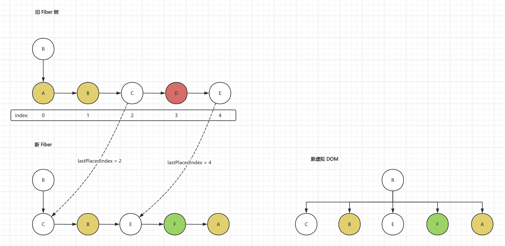

### packages/react-reconsiler/src/ReactChildFiber.js

```js
/**
 * 设置子fiber节点的位置，并在必要的时候添加Placement标志
 *
 * @param {Object} newFiber 新的子fiber节点
 * @param {number} lastPlacedIndex 最后一个被放置的节点的index
 * @param {number} newIdx 新节点的index
 * @return {number} 返回最后一个被放置的节点的index
 */
function placeChild(newFiber, lastPlacedIndex, newIdx) {
  newFiber.index = newIdx;
  if (!shouldTrackSideEffects) {
    return lastPlacedIndex;
  }

  const current = newFiber.alternate;
  if (current !== null) {
    // 复用
    const oldIndex = current.index;
    if (oldIndex < lastPlacedIndex) {
      newFiber.flags |= Placement;
      return lastPlacedIndex;
    } else {
      return oldIndex;
    }
  } else {
    // 没复用
    newFiber.flags |= Placement;
    return lastPlacedIndex;
  }
}
```

```diff
/**
 * 将新的子节点数组与旧的子Fiber进行比较，并返回新的子Fiber
 *
 * @param {Fiber} returnFiber - 新的父Fiber
 * @param {Fiber} currentFirstChild - 老fiber第一个子fiber
 * @param {Array} newChildren - 新的子节点数组
 * @return {Fiber} resultingFirstChild - 返回的新的子Fiber
 */
function reconcileChildrenArray(returnFiber, currentFirstChild, newChildren) {
  let resultingFirstChild = null;
  let previousNewFiber = null;
  // 这个索引单独定义出来，还有个原因是：这三套方案交替进行的
  let newIdx = 0;
  let oldFiber = currentFirstChild;
  let nextOldFiber = null;

  // 是老Fiber数组中，可复用，且不用移动的Fiber索引值-  复用节点的顺序和老节点当中的相对顺序是一致的，哪些节点是在这个起点后面
  let lastPlacedIndex = null;
  // 第一套方案：（按序比较，key 不同，立即中止）
  for (; oldFiber !== null && newIdx < newChildren.length; newIdx++) {
    nextOldFiber = oldFiber.sibling;
    // 尝试复用
    const newFiber = updateSlot(returnFiber, oldFiber, newChildren[newIdx]);
    if (newFiber === null) {
      break;
    }
    // 非初始化情况下
    if (shouldTrackSideEffects) {
      // 没有复用
      if (oldFiber && newFiber.alternate === null) {
        deleteChild(returnFiber, oldFiber);
      }
    }
+   lastPlacedIndex = placeChild(newFiber, lastPlacedIndex, newIdx);
    if (previousNewFiber === null) {
      resultingFirstChild = newFiber;
    } else {
      previousNewFiber.sibling = newFiber;
    }
    previousNewFiber = newFiber;
    oldFiber = nextOldFiber;
  }

  // 第二套方案：(经过第一套方案后，老节点已经没有了，剩下的新节点全部新创建)
  if (oldFiber === null) {
    for (; newIdx < newChildren.length; newIdx++) {
      const newFiber = createChild(returnFiber, newChildren[newIdx]);
      if (newFiber === null) continue;
+     lastPlacedIndex = placeChild(newFiber, lastPlacedIndex, newIdx);
      if (previousNewFiber === null) {
        resultingFirstChild = newFiber;
      } else {
        previousNewFiber.sibling = newFiber;
      }
      previousNewFiber = newFiber;
    }
  }

  // 第三套方案：（走到这里，说明新Fiber还没创建完 并且 剩下的老节点可能还存在复用）
  // 把所有旧Fiber给它建立个关联 => { [fiber.key|fiber.index]: fiber }
  const existingChildren = mapRemainingChildren(returnFiber, oldFiber);
  for (; newIdx < newChildren.length; newIdx++) {
    // 尝试复用
    const newFiber = updateFromMap(
      existingChildren,
      returnFiber,
      newIdx,
      newChildren[newIdx]
    );

    if (newFiber !== null) {
      if (shouldTrackSideEffects) {
        if (newFiber.alternate !== null) {
          // 尝试复用成功，从 map 中移除
          existingChildren.delete(
            newFiber.key === null ? newIdx : newFiber.key
          );
        }
      }
+     lastPlacedIndex = placeChild(newFiber, lastPlacedIndex, newIdx);
      if (previousNewFiber === null) {
        resultingFirstChild = newFiber;
      } else {
        previousNewFiber.sibling = newFiber;
      }
      previousNewFiber = newFiber;
    }
  }

  return resultingFirstChild;
}
```


