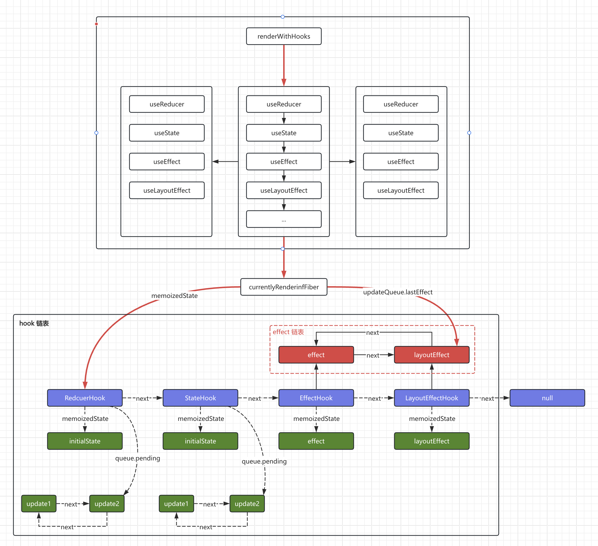

新版也好，老版本也罢，它们本质上可以说是一样的，虽然实现方式不一样。但使用方式、使用 API 是一样的，结果也是一样的，一个是在渲染完后的某个时机去执行，useEffect、useLayoutEffect 有些区别。对于 useState、useReducer 而言，是对数据的变化，导致组件的一些信息更新，页面也随之发生变化。

<br/>

例子：

```js
function getAge(state, action) {
  switch (action.type) {
    case "add":
      return state + action.value;
    default:
      return state;
  }
}

function FunctionComponent() {
  const [age, setAge] = React.useReducer(getAge, 18);
  const [num, setNum] = React.useState(88);

  React.useEffect(() => {
    console.log("create");
  });

  React.useLayoutEffect(() => {
    console.log("Layout create");
  });

  return <div />;
}
```

例子中 hooks 的大致关联如下：


