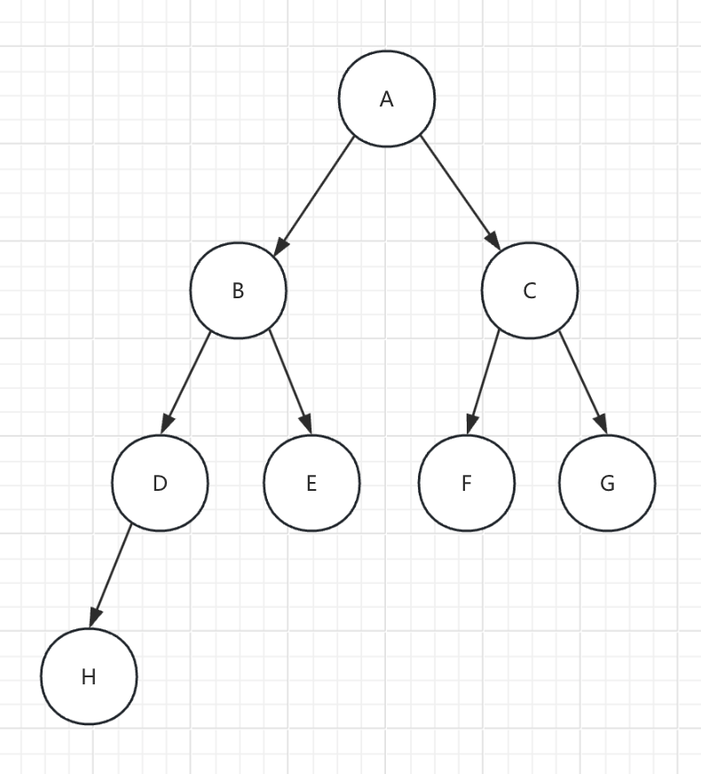

### 概念

**最小堆** 是一种基于 **完全二叉树** 结构的数据类型，其核心特性为任意非叶节点的值不大于左右子节点，根节点始终为堆内最小元素。数据通常以数组形式存储，时间复杂度均为 O(log n)。

**完全二叉树**：在完全二叉树中，除了最底层之外的所有层都被完全填满，最底层的节点从左到右填充。

**最小堆是一种非常实用的数据结构，适用于需要快速访问和删除最小元素的场景。**

<br/>
<br/>

数据结构如图：



```
// 可以用数组来表示其关系
[A, B, C, D, E, F, G, H];
[0, 1, 2, 3, 4, 5, 6, 7];


// 父节点索引对应子节点的索引：
leftChildIndex  = 2 * parentIndex + 1
rightChildIndex = 2 * parentIndex + 2


// 子节点索引对应父节点的索引：
parentIndex = (leftChildIndex - 1)  / 2
parentIndex = (rightChildIndex - 1) / 2
```
