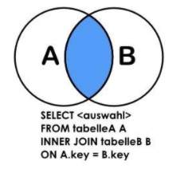
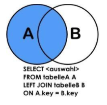
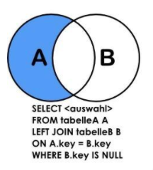
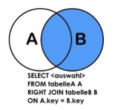
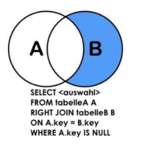

<auth-auth />

## 操作表


>  数据操作语句：DML（  Data Manipulation language ）


<br/>


- 新增表中的数据：insert into
- 删除表中的数据：delete
- 修改表中的数据：update
- 查询表中的数据：select


<br/>


## INSERT


## 向表中写入数据


`tbl_name` ：要插入的表名

`{VALUES | VALUE}`：要插入的值


在这两个属性后还可以提供要插入的表的清单，以及对应的要插入的值的清单，另外默认清空下，我们会在项目具有主键或者唯一索引的表中，插入数据时，如果出现主键或唯一索引的冲突，插入的操作可能就会别回滚。那么避免这种情况发生，我们可以在  `INSERT`  语句中，利用 `ON DUPLICATE KEY UPDATE` 来解决这个问题，来决定当出现主键或者唯一索引冲突的时候的操作行为，如我们可以指定像表中写入数据时，出现唯一索引冲突的话，则更新表中的某几列的值，为新的插入数据的值。


<br/>


编写 INSERT 语句的思路


- 确认要把数据插入到那个表中 `imc_class`
- 确认表的数据库结构，那些列不能为 NULL，哪些列可以为 NULL，对于不能为 NULL 的列是否有默认值。`class_name`
  -  通过 `SHOW CREATE TABLE imc_class` 来查看表结构。

- 确认对于插入列的插入值的清单 `values('MySQL'),('Redis')`


<br/>

在这个表中  `class_name`   是业务主键，它是不能重复的，但在之前建立表的时候，并没有在这一列上建立唯一索引，这里要使用  `CRTATE INDEX`  语句来建立唯一索引。


<br/>


在一次执行上面的插入语句（ `增加课程分类表的数据` ），就会出现一个错误 `1062 - Duplicate entry 'MySQL' for key 'imc_class.uqx_classname', Time: 0.002000s`;  这是这条语句并没有成功，表中的值依然没有改变，这个时候，如果想把数据写入的时间改为最新写入的时间，那么这个时候就使用 `ON DUPLICATE KEY UPDATE` 语句了。


<br/>

当出现索引约束重复的情况下，可能是唯一索引冲突，也可能是主键冲突违反这个约束的情况下，就会触发 `ON DUPLICATE KEY UPDATE`  事件，这时候我们就会把表中 `add_time`  的值更新为当前的时间。


当执行这条语句时，会提示两行数据收到影响。因为它的实际操作就是先要删除原来的值，并且把这个值替换成当前时间的值。因此可能是做了两次操作。


<br/>
<br/>
<br/>


## SELECT

## 查询表中的数据


> 这是最为频繁也是最为复杂的语句，从一定程度上，是否能用好 SELECT 语句是衡量掌握 SQL 语言能力的一个关键。


组成  `SELECT`  语句的从句、关键字一共有三个

- 一个是 `SELECT` 从句本身，甚至可以说 `SELECT` 从句就是  `SELECT`  语句中唯一必选的一个关键字，在  `SELECT`  语句之后，跟着的内容则是，我们希望在表中，所取的列，这个列表可以是表中所存在的列，也可以是几个列计算后所产生的一个列，或者干脆就是一个计算的表达式，如我们可以在   `SELECT`  语句中这样来执行。


<br/>


- `FROM`  子句：用于指定哪个数据库哪个表中查询数据，可以列出所要从中获取数据的表名，这个表可以是一个物理表，也可以是一个视图，或者是由其他的 `SELECT` 语句所产生的一个衍生表。


`SELECT *`：表中的所有列，但这不是一个很好的习惯，因为如果取出所有列，如果这些列中有些是我们不需要使用的，这个情况下，一方面会带来一些 IO 的消耗，另一方面，对于一些特殊的数据类型，如 text 这样的列，还会影响 `SELECT` 查询的性能，所以推荐只查询需要的列。


<br/>


- `WHERE` 子句


和表中的所有列一样，我们有时候也并不是需要表中的所有行，可以通过 `WHERE` 子句来过滤。


一般会这样来写一个 SQL

1、首先会确认所需的数据来自哪个表中，`FROM imc_course ` 。

2、如果对这个表的结构不熟悉，就可以先查看一下，然后就知道所需的数据来自哪一列中，`SELECT title`

3、这时候在写查询过滤的条件，查询  `title` 字符串中  `LIKE ( 比较运算符 )` 包含 `MYSQL` 的字符串的 `title`，`%` 作为通配符来使用，相当于正则表达式中的 `*`，  `WHERE title LIKE '%MYSQL%'`


<br/>


## 编写查询语句的思路


- 首先确定我们要获取的数据存在什么表中。( 确定 `FROM` 子句 )
- 其次是确定我们要取出表中的什么列。( 确定 `SELECT` 子句 )
- 确定是否需要对表中的数据进行过滤。( 确定 `WHERE` 子句  )


MySQL 的比较运算符


| 比较运算符                    | 说明                                             |
| :---------------------------- | ------------------------------------------------ |
| =   >   <   >=   <=   <>   != | `<>` 和 `!=` 都表示不等于                        |
| BETWEEN min AND max           | 在两值之间，列的值大于等于最小值，小于等于最大值 |
|                               | 上面的运输符都是无法与空值、`null`  值比较的     |
| IS NULL、IS NOT NULL          | 判断列的值是否为 `NULL`                          |
| LIKE、NOT LIKE                | `%` 代表任何数量的字符，`_` 代表任何一个字符     |
| IN、NOT IN                    | 判断列的值是否在指定的范围内                     |


<br/>
<br/>
<br/>


<other-mysql-three-1/>

<br/>

<br/>

<br/>


**如果合并 WHERE 子句中的多个过滤条件？**


> MySQL 逻辑运算符


| 逻辑运算符 | 说明                                                         |
| ---------- | ------------------------------------------------------------ |
| AND，&&    | `AND` 运算符两边的表达式都为真时，返回结果才为真。           |
| OR，\|\|   | `OR` 运算符两边的的表达式有一条为真，返回结果就是真。        |
| XOR        | `XOP` 运算符两边的表达式一真一假时返回真，两真两假时返回假。 |

<br/>
<br/>
<br/>


<other-mysql-three-2/>


:::warning

任何运算符和 NULL 值运算结果都为 NULL。我们在进行逻辑运算的时候，一定要注意表达式的列是不是可能有 NULL 值，那么逻辑表达式的结果就可能是不正确的。这就是在定义表时，都不允许为空的原因之一。

:::


<br/>

<br/>

<br/>


操作表


**如何从对个表中获取数据？**


- 表与表之间要存在一定的关联关系。

​      简单来说，就是要同时查询的这两个表，A 和 B 中，B 表中要存储 A 表的主键，或业务主键。而 B 表中存储 A 表中的这些键，还要一个学名（ 外键 ）。


<br/>

<br/>

<br/>


## 使用 JOIN 关联多个表


**JOIN**：对于关系查询，`MySQL` 支持两种不同的关联

- `INNER JOIN`：内连接



简单来说，以 A 、B 为例，两个表的内关联，就是找出这两个表中通过关联键关联之后，都存在的一些数据，从数学的角度讲就是求两个表的 **交集**。


- `OUTER JOIN`：外连接

  - `LEFT JOIN`：左外关联，左连接

    若 A、B 两个表进行左关联，那么结果集中将包含左表（ A表 ）的所有记录，即使这些记录在右表（ B表 ）中没有符合连接条件的查询，就意味着即使符合 `ON` 语句的数据在 B 表中的匹配是 0 行，那么连接操作，还是可以返回 A 表中的所有记录条数，只不过，这条记录中所有的信息都是来自 A 表中，而 B 表中的每一列值都为空，这意味着左外连接，会返回左表中的所有记录，和右表中匹配记录的组合，如果右表中没有匹配记录，那么来自右表中的所有列的值都为空。也就是求两个表A表和B表的 **交集外加左表剩下的数据**。


    从集合的观点上来看，**第一个左外关联**：取出来的是两个集合的并集，除此之外，外关联可以用于取出两个结果集的补集，也就是可以通过外关联获取出只属于集合 A，而不属于集合 B 的数据，那么这种查询一般用于查询不存在于某一个表中的数据，比如，当我们需要查询出所有没有章节信息的课程时，就可以使用这种外关联。


    **第二种左外关联**：查询出只存在于 A 表中，而不存在于 B 表中的数据，我们只需要在原有的左外关联基础上，在增加一个 `WHERE B.KEY IS NULL` 过滤条件，过滤出来所有 B 表中数据为空的数据就可以了。实际上就实现了 B 集合对于 A 集合的补集的查询，也就是实现了数据不存在于某一个表中的一种查询方式。

     


  - `RIGHT JOIN`：右关联

     右关联与左关联是类似的，只不过连接表的顺序刚好相反，如果 A 表右关联 B 表，那么右表 B 中的每一行的连接都至少出现一次，也就是所以右表的数据都会在结果中出现，如果 B 表的记录在左表 A 中被找到匹配的行，连接表中来源于 A 的列都会为空。

​       同样，右关联也可以查询出两个结果集的并集和补集，在查询并集的时候，使用关键字 `RIGHT JOIN` ,而在查询两个集合的补集时，则需要增加 `WHERE A.KEY IS NULL` 的过滤条件。

 


<br/>

<br/>


<other-mysql-three-3/>

<br/>

<br/>

<br/>


## GROUP BY、HAVING


<br/>

`GROUP BY...HAVING` 子句的作用

​    把结果集按某些列分成不同的组，并对分组后的数据进行聚合操作。


   🌰


> 课程列表

| 难度 | 课程名称 |
| ---- | -------- |
| 入门 | ...      |
| 初级 | ...      |
| 高级 | ...      |
| 中级 | ...      |
| 入门 | ...      |
| 中级 | ...      |
| 入门 | ...      |
| 初级 | ...      |
| 初级 | ... |


> 看每种难度的课程有多少门

| 难度 | 课程数量 |
| ---- | -------- |
| 入门 | 3        |
| 初级 | 3        |
| 中级 | 2        |
| 高级 | 1        |


>SQL

```mysql
-- GROUP BY 后面出现的列名，称之为分组键
-- 意思就是说要按照 level_name 的值，来进行分组，每个 level_name 值，在结果表中只会有一行记录。
-- 如上表所示
-- 分组键除了在 GROUP BY 中出现之外，也会在 SELECT 语句中出现，除此之外，还可以有一个或多个聚合函数，这里的 count，就是一个聚合函数
-- 有一点要特别注意：就是所有出现在 SELECT 语句中的非聚合函数的列，都应该同时出现在 GROUP BY 子句之后，因为 MYSQL 在这种宽松的 sql_mode 下，是可以支持 SELECT 子句中非聚合函数列同 GROUP BY 子句中的分组键不同的情况，但是这种情况下，查询的结果，可能并不正确。
SELECT
	level_name,
	count(*)
FROM
	imc_course a
	JOIN imc_level b ON b.level_id = a.level_id
GROUP BY
	level_name;


-- 查看当前 sql_mode
SHOW VARIABLES LIKE 'sql_mode';
```


<br/>

<br/>


> 就是所有出现在 SELECT 语句中的非聚合函数的列，都应该同时出现在 GROUP BY 子句之后

```mysql
-- 统计每个分类下不同难度的课程的数量
-- FROM：课程主表 和 课程分类表 通过 class_id 进行关联，课程主表 和 难度分类表 通过 level_id 进行关联
-- SELECT：查询 难度名称，分类名称
-- GROUP BY：所有出现在 SELECT 语句中的非聚合函数的列，都应该同时出现在 GROUP BY 子句之后，不然在非宽松模式下的 sql_mode 它将会报 1055，在宽松模式下，查询的数据不准确，完整的将 SELECT 后的非聚合列写在 GROUP BY 之后，查询结果正确。
SELECT level_name, class_name
FROM
	imc_course a
	JOIN imc_class b ON b.class_id = a.class_id
	JOIN imc_level c ON c.level_id = a.level_id
	GROUP BY level_name,class_name;
```


<br/>

<br/>

<br/>


**HAVING 子句**


- 可以通过可选的 HAVING 子句对聚合后的数据进行过滤


HAVING 子句在 GROUP BY 子句中的作用：可对分组聚合后的数据进行过滤，就同分组前 WHERE 子句类似，我们在 WHERE 子句中是无法使用聚合函数的。但是在 HAVING 子句中是可以的。


```mysql
-- 统计每个分类下课程大于 3 门的课程难度有哪些
-- 首先需要关联的表，课程数量要用到课程表,同时，每个分类下，大于 3 门的难度课程有哪些，有哪些分类下的难度是大于 3 门课程的，所以需要包括分类信息（分类表） imc_course a JOIN imc_class b ON b.class_id = a.class_id，难度信息是在难度表中，通过 level_id 进行两个表的关联 JOIN imc_level c ON c.level_id = a.level_id。
-- 需要查询什么：class_name，level_name，数量
-- 通过 level_name,class_name 进行分组，
-- WHERE 中是不支持聚合函数的
-- HAVING：则支持，且课程数量大于 3 门的，用 HAVING	count(*) > 3 进行过滤
SELECT
	class_name,
	level_name,
	COUNT(*)
FROM
	imc_course a
	JOIN imc_class b ON b.class_id = a.class_id
	JOIN imc_level c ON c.level_id = a.level_id
GROUP BY
	class_name,
	level_name
HAVING
	count(*) > 3;
```


<br/>


**GROUP BY 通常和 HAVING 一起使用**


<br/>

<br/>

<br/>


## 常用的聚合函数


| 聚合函数              | 说明                                   |
| --------------------- | -------------------------------------- |
| COUNT(*) / COUNT(col) | 计算符合条件的数据行数                 |
| SUM(col_name)         | 计算表中符合条件的数值列的合计值       |
| AVG(col_name)         | 计算表中符合条件的数值列的平均值       |
| MAX(col_name)         | 计算表中符合条件的任意列中数据的最大值 |
| MIN(col_name)         | 计算表中符合条件的任意列中数据的最小值 |


<br/>


> COUNT

```mysql
-- 统计课程表的总课程数
-- COUNT( * ) 代表所有列的行数
SELECT
	COUNT(*)
FROM
	imc_course;-- 统计课程表中某一列的数量

-- COUNT( 列名 ) 代表指定列的行数
SELECT
	COUNT( course_id )
FROM
	imc_course;

-- 去重，统计出课程表中有多少个不同的讲师
-- DISTINCT 去重表达式，去重列（ 讲师列，也就是 user_id ）
SELECT
	COUNT( course_id ),
	COUNT( DISTINCT user_id )
FROM
	imc_course;
```


<br/>


> SUM


```mysql
-- 统计出所有课程总的学习人数
SELECT
	SUM( study_cnt )
FROM
	imc_course;


-- 统计出不同难度课程的学习人数
-- 结合 GROUP BY 进行使用
SELECT
	level_name,
	SUM( study_cnt )
FROM
	imc_course a
	JOIN imc_level b ON b.level_id = a.level_id
GROUP BY
	level_name;
```


<br/>


> AVG

```mysql
-- 统计出每门课程的平均学习人数
-- 第一种方式：用 SUM 统计所有学习人数 / 课程数
-- 第二种方式：直接用 SVG 求平均值
SELECT
	SUM( study_cnt )/ COUNT(*),
	AVG( study_cnt )
FROM
	imc_course;


-- 利用课程评价表中的评分，更新课程表中课程的评分
--
-- 课程评价表是每个用户对每门课程的学习评分，所以先要通过聚合函数和分组按课程ID进行分组，求出来每个用户对每一门课程的平均打分是多少，然后在更新到表中，（ 更新操作先不实现 ）
-- FROM：所有信息都来自于学习评价表 imc_classvalue
-- SELECT：课程id ( course_id )，通过聚合函数 AVG() 计算出 content_score 的平均值，并起了一个别名 avg_content
-- GROUP BY：SELECT 后所有的非聚合函数都必须跟在 GROUP BY 后，按课程ID ( course_id ) 分组
SELECT
	course_id,
	AVG( content_score ) AS avg_content,
	AVG( level_score ) AS avg_level,
	AVG( logic_score ) AS avg_logic,
	AVG( score ) AS avg_score
FROM
	imc_classvalue
GROUP BY
	course_id;
```


<br/>


> MAX


```mysql
-- 查询出学习人数最多的课程
-- FROM：从课程表中
-- SELECT：查 title
-- WHERE：过滤条件是 study_cnt = 一个子查询（ 子查询查询出的是学习人数最多的一门课程人数 ）
SELECT
	title
FROM
	imc_course
WHERE
	study_cnt = ( SELECT MAX( study_cnt ) FROM imc_course )
```


子查询可以看做一个查询后的结果集，一个临时表来使用，子查询可以使用在 `SELECT` 、`FROM`、`WHERE` 从句中。后面会说到比子查询更好的查询。


<br/>

<br/>

<br/>


## ORDER BY


在进行以上的查询，我们所生产的结果集，都是无序的，如果希望查询结果是按某一列的顺序进行排列的，那就要     `ORDER BY` 了。


**使用 Order by 子句对查询结果进行排序**

- 使用 `ORDER BY` 子句是对查询结果进行排序的最安全方法。
  - 存储引擎不同，默认的排序也不同
- 列名后增加 `ASC` 关键字指定按该列的升序进行排序，或指定 `DESC` 关键字指定按该列的降序排列
- `ORDER BY`  子句也可以使用 `SELECT` 子句中未出现的列或是函数
  - 与 `GROUP BY` 不同，`ORDER BY` 是允许这样做的


<br/><br/>


```mysql
-- 查询出每门课程的学习人数并按学习人数从高到底排列
SELECT
	title,
	study_cnt
FROM
	imc_course
ORDER BY
	study_cnt DESC;
```


<br/>

<br/>

<br/>


## Limit

使用 Limit 子句限制返回结果集的行数


- 常用于数据列表分页
- 一定要和 `order by` 子句配合使用
- limit 起始偏移量，结果集的行数


<br/>


```mysql
-- 分页返回课程ID和课程名称，每页返回10行记录
-- FROM：所有数据来源于课程表
-- SELECT：查询 课程ID、课程名
-- ORDER BY：可以使用非 SELECT 语句未出现的列，按学习人数进行排序
-- LIMIT：返回行的位置，以及返回条数，要第 0 页，每页 10 条数据，是从 0 开始的
SELECT
	course_id,
	title
FROM
	imc_course
ORDER BY
	study_cnt DESC
	LIMIT 0,
	10;
```


<br/>

<br/>

<br/>


## 视图


 DDL 语句中遗漏的问题：视图


**创建视图**


视图是一个逻辑的存储结构，也可以看做是一个虚拟的表，我们可以像查询表一样，来查询视图，但是在视图中，并不存储任何的数据，所有的数据都存储在生成视图所定义的查询的物理表中的。


<br/>


```mysql
-- 定义视图的基础语法
-- CREATE VIEW：创建视图，并定义一个名词 view_name
-- AS：后面跟的就是我们所熟悉的查询语句了。这个查询语句就是定义了视图的结构和数据
CREATE VIEW view_name
AS
  SELECT
    [ALL | DISTINCT | DISTINCTROW ]
    select_expr [, select_expr ...]
    [FROM table_references
    [WHERE where_condition]
```


<br/>

<br/>

<br/>


🌰🌰🌰：


```mysql
-- 定义一个包括课程ID，课程名称，课程分类，课程方向以及课程难度的视图
-- FROM：需要查询的数据分别在不同的表中，那么需要对它们都进行关联
-- SELECT：需要查询 课程表中的 course_id，title，b 中的方向名，c 中的难度名，d 中的分类名
-- CREATE VIEW：最后定义一个视图，起个名，在加个 AS 关键字，就完成了视图的定义
CREATE VIEW vm_course AS SELECT
a.course_id,
a.title,
b.class_name,
c.level_name,
d.type_name
FROM
	imc_course a
	JOIN imc_class b ON b.class_id = a.class_id
	JOIN imc_level c ON c.level_id = a.level_id
	JOIN imc_type d ON d.type_id = a.type_id;
```


<br/>


```mysql
-- 接下来通过查询视图，就可以达到查询这四个表关联的 SQL 语句的一个效果。
SELECT
	*
FROM
	vm_course
```


<br/>

<br/>

<br/>


## DELETE


在工作中，除了写入数据和查询数据之外，我们有时候也需要对一些数据进行删除操作，如一些对于业务来说，重复的数据我们就需要删除它。


```mysql
DELETE
    FROM table_name
      [WHERE where_condition]
      [ORDER BY ...]
      [LIMIT row_count]
```


在删除数据前，同样要查找到需要删除的数据，`DELETE` 同样支持 `FROM、WHERE、ORDER BY、LIMIT` 这样的子句，并且这些子句的作用也同 `SELECT` 语句中是相同的。


<br/>

<br/>


**编写 DELETE 语句的思路**


- 确定要删除的数据存储在那张表中 ( `FROM 子句` )
  - 如果要删除的数据是存储在多张表中，需要多表关联才能确认要什么数据的话，在这里同样可以是用在 `JOIN` 来关联多表。
- 确认删除数据的过滤条件 ( `WHERE 子句` )
  - 如果要删除整张表，可以不带 `WHERE` 子句，但是更推荐使用 `truncate table`
- 确认是否只删除有限条数据 ( `ORDER BY ... LIMIT 子句` )
  - 可以指定要按照什么顺序去删除数据，但是要注意的是，这里的 `LIMIT` 子句只有一个参数，就是要删除数据的最大行数


<br/>

<br/>


🌰🌰🌰：

```mysql
-- 删除课程表中没有章节信息的课程
--
-- 1、查询在课程表中，但是没有在章节表中的信息，就可以得知需要删除的课程列
SELECT
	a.course_id,
	a.title
FROM
	imc_course a
	LEFT JOIN imc_chapter b ON b.course_id = a.course_id
WHERE
	b.chapter_id IS NULL;

-- 2、只需要把 SELECT 替换成 DELETE，并告诉它需要删除 a 表中的数据
DELETE a
FROM
	imc_course a
	LEFT JOIN imc_chapter b ON b.course_id = a.course_id
WHERE
	b.chapter_id IS NULL;
```


<br/>

<br/>

<br/>


要在表上创建一个唯一索引，首先要保证这个表中的这一列的数据是不能重复的，如果有了重复的数据，先要删除它，在建立唯一索引。

```mysql
-- 删除课程方向表中重复的课程方向，
-- 保留方向ID最小的一条，并在方向名称上增加唯一索引
--
-- 1、要在表上创建一个唯一索引，首先要保证这个表中的这一列的数据是不能重复的，如果有了重复的数据，先要删除它，在建立唯一索引。
-- 2、检查是否存在重复数据，通过 GROUP BY 进行分组，HAVING 过滤条件为出现次数大于一的，查出它的分类名以及出现次数

SELECT
	type_name,
	COUNT(*)
FROM
	imc_type
GROUP BY
	type_name
HAVING
	COUNT(*) > 1;

-- 3、查询 ID 最小的，也就是要保存下来的
SELECT type_name, MIN(type_id) AS min_type_id, COUNT(*)
FROM imc_type
GROUP BY type_name HAVING COUNT(*) > 1;

-- 4、删除
-- FROM：首先需要 imc_type a 关联 JOIN 一个子查询语句，也就是上面要保留下来的数据，将这个结果集当做一个虚拟表来使用，且起一个别名 b，关联关系就是结果集中的 name = a 表中的 name，并且 a type_id 要大于查询出来最小的 min_type_id
-- DELETE：删除
-- 建立唯一索引：创建 唯一 索引 名称 条件就是 imc_type 表上的 type_name 建立唯一索引

DELETE a
FROM imc_type a
JOIN (
		SELECT type_name, MIN(type_id) AS min_type_id, count(*)
		FROM imc_type
		GROUP BY type_name HAVING COUNT(*) > 1
		) b
		ON b.type_name = a.type_name AND a.type_id > min_type_id;
CREATE UNIQUE INDEX uqx_typename ON imc_type(type_name);
```


<br/>

<br/>

<br/>


## UPDATE


```mysql
-- 基础语法
-- UPDATE table_name：需要存储的表名，同样可以使用 JOIN 关联多表
-- SET：表示需要更新的一个或多个的列名、列值
-- WHERE：这个子句在 UPDATE 中是非常非常重要的，一定不能写错
-- ORDER BY LIMIT：在 UPDATE 中并不是很常用，作用域 DELETE 一样，是可以按照顺序更新指定行的数据，通常只会用在分批更新大批量数据的情况下，如更新 100W 行数据，则需要循环分段更新
UPDATE table_name
SET col_name1={expr1|DEFAULT}
    [, col_name2={expr2|DEFAULT}] ...
[WHERE where_condition]
[ORDER BY ...]
[LIMIT row_count]
```


<br/>

<br/>


**编写 UPDATE 语句的思路**


> 为了安全起见，在编写 UPDATE 语句时，先使用 SELECT 查，确认无误后，在替换成 UPDATE 语句


- 确定要更新的数据存储在那张表中 ( `UPDATE 子句` )
- 确定要更新的列及值 ( `SET 子句` )
- 确认更新数据的条件 ( `WHERE 子句` )


<br/>

<br/>

<br/>


🌰🌰🌰：


<other-mysql-three-one/>


<br/>

<br/>

<br/>


## 系统函数


## 常用的时间函数


| 函数名                             | 说明                                                         |
| ---------------------------------- | ------------------------------------------------------------ |
| CURDATE()/CURTIME()                | 返回当前日期/返回当前时间                                    |
| NOW()                              | 返回当前的日期和时间                                         |
| DATE_FORMAT(date, fmt)             | 按照 fmt 的格式，对日期 date 进行格式化                      |
| SEC_TO_TIME(seconds)               | 把秒数转换为（ 小时：分：秒 ）                               |
| TIME_TO_SEC(time)                  | 把时间(小时：分：秒)转换为秒数                               |
| DATEDIFF(date1, date2)             | 返回 date1 和 date2 两个日期相差的天数                       |
| DATE_ADD(date, INTERVAL expr unit) | 对给定的日期增加或减少指定的时间单位(unit：DAY天/HOER小时/MINUTES分钟/SECOND秒) |
| EXTRACT(unit FROM date)            | 返回日期 date 的指定部分                                     |
| UNIX_TIMESTAMP()                   | 返回 unix 时间戳                                             |
| FROM_UNIXTIME()                    | 把 Unix 时间戳转换为日期时间                                 |

<br/>

在日常工作中，经常能看到，为了可以按照一定的格式来显示时间数据，而把时间存储成字符串的格式，其实这是一种非常错误的方法，且不说字符串的存储空间会比时间类型大，就字符串无法对时间数据进行有效的检测，以及无法利用到时间函数，如果要安装一定的格式去输出数据，`MYSQL`  提供了  `DATE_FORMAT` 函数。


> DATE_FORMAT(date, fmt)


<br/>

<br/>


> SEC_TO_TIME(seconds) & TIME_TO_SEC(time)


```mysql
SELECT
	SEC_TO_TIME( 60 ),
	TIME_TO_SEC( '1:00:00' )

-- SEC_TO_TIME( 60 )        -> 00:01:00
-- TIME_TO_SEC( '1:00:00' ) -> 3600
```


<br/>

<br/>


>DATEDIFF(date1, date2)


```mysql
-- 计算每门课程，上线时间距当前时间的天数
-- ORDER BY 2 DESC：按照 SELECT 第二个参数倒排。或者给对比时间起个 AS 别名，使用别名进行倒排
SELECT
	title,
	DATEDIFF( NOW(), online_time )
FROM
	imc_course
ORDER BY
	2 DESC
```


<br/>

<br/>


> DATE_ADD(date, INTERVAL expr unit)


```mysql
SELECT
	NOW(),
	DATE_ADD( NOW(), INTERVAL 1 DAY ), -- 当前时间加一天
	DATE_ADD( NOW(), INTERVAL 1 YEAR ), -- 当前时间加一年
	DATE_ADD( NOW(), INTERVAL -1 DAY ), -- 当前时间减一天
	DATE_ADD( NOW(), INTERVAL '-1:30' HOUR_MINUTE ) -- 当前时间减1:30:00
```


<br/>

<br/>


> EXTRACT(unit FROM date)

```mysql
	SELECT NOW()
  ,EXTRACT(YEAR FROM NOW()) -- 提取当前时间的年份
	,EXTRACT(MONTH FROM NOW()) -- 提取当前时间的月份
	,EXTRACT(DAY FROM NOW()) -- 提取当前时间的天
```


<br/>

<br/>


> UNIX_TIMESTAMP() & FROM_UNIXTIME()


现在已经不建议使用 unix 时间戳来保存数据了，这里就不在给例子了。


<br/>

<br/>

<br/>


## 常用的字符串函数


| 函数名                             | -                                                     |
| ---------------------------------- | ----------------------------------------------------- |
| CONCAT(str1, str2, ...)            | 把字符串 str1，str2 连接成一个字符串                  |
| CONCAT_WS(sep, str1, str2, ...)    | 用指定的分隔符 sep 连接字符串                         |
| CHAR_LENGTH(str)                   | 返回字符串 str 的字符个数                             |
| LENGTH(str)                        | 返回字符串 str 的字节个数                             |
| FORMAT(X, D [,locale])             | 将数字 N 格式化，如 '#,###,###,##'，并舍入到 D 位小数 |
| LEFT(str/len)/RIGHT(str,len)       | 从字符串的左/右边起返回 len 长度的子字符串            |
| SUBSTRING(str,pos,[len])           | 从字符串 str 的 pos 位置起返回长度为 len 的子串       |
| SUBSTRING_INDEX(str, delim, count) | 返回字符串 str 按 delim 分割的钱 count 个子字符串     |
| LOCATE(substr, str)                | 在字符串 str 中返回子串 substr 第一次出现的位置       |
| TRIM([remstr FROM] str)            | 从字符串 str 两端删除不需要的字符串 remstr            |


<br/>

<br/>


> CONCAT(str1, str2, ...) & CONCAT_WS(sep, str1, str2, ...)

```mysql
-- 出于 SEO 优化的目的，我们需要合并显示课程分类名称和课程标题
-- 将 class_name 和 title 合并成一个字符串
SELECT
	CONCAT( class_name, title )
FROM
	imc_course a
	JOIN imc_class b ON b.class_id = a.class_id


-- 使用指定的字符串进行拼接
SELECT
	CONCAT_WS( '-', class_name, title )
FROM
	imc_course a
	JOIN imc_class b ON b.class_id = a.class_id

```


<br/>

<br/>


>CHAR_LENGTH(str) & LENGTH(str)


```mysql
-- CHAR_LENGTH：字符个数
-- LENGTH：字节个数
SELECT
	class_name,
	LENGTH( class_name ),
	CHAR_LENGTH( class_name )
FROM
	imc_class
```


<br/>

<br/>


> FORMAT(X, D [,locale])

```mysql
SELECT FORMAT( 1111123456.789, 4 )

-- 四位小数，不足补上
-- 1,111,123,456.7890
```


<br/>

<br/>


> LEFT(str/len)/RIGHT(str,len)

```mysql
SELECT LEFT('www.test.com', 3)
      ,RIGHT('www.test.com', 3)

-- left:  www
-- right: com
```


<br/>

<br/>


```mysql
SELECT SUBSTRING('www.test.com', 5)

-- test.com
```


<br/>

<br/>


> SUBSTRING_INDEX(str, delim, count)


```mysql
-- 按 delim 来截取 str，从第 count 开始; 正数从左开始，负数从右开始
SELECT
	SUBSTRING_INDEX( '192.168.0.100', '.', -2 );

-- 0.100
```


<br/>

<br/>


> LOCATE(substr, str)

```mysql
-- 截取课程标题里中横线之前的部分
-- 1、先定位 - 出现在什么位置
-- 2、截取 title，从第一位到 - 出现的地方
-- 3、截取 title，从第一位到 - 出现的地方，由于不需要 - ，所以减一位
-- 4。
SELECT
	title,
	LOCATE( '-', title ),
	SUBSTRING( title, 1, LOCATE( '-', title ) ),
	SUBSTRING( title, 1, LOCATE( '-', title )- 1 ),
	SUBSTRING_INDEX( title, '-', 1 )
FROM
	imc_course;
```


<br/>

<br/>


> TRIM([remstr FROM] str)

```mysql
-- 去除空格
-- 也可以去除指定的字符
SELECT
	TRIM( '  test   ' ),
	TRIM( 'x' FROM 'xxxxxxtestxxxxxx' );
```


<br/>

<br/>

<br/>


## 其他常用函数


| 函数名                                                       | -                                                       |
| ------------------------------------------------------------ | ------------------------------------------------------- |
| ROUND(X, D)                                                  | 对数值 X 进行四舍五入保留 D 位小数                      |
| RAND()                                                       | 返回一个在 0 和 1 之间的随机数                          |
| CASE WHEN [condition]<br/> THEN result<br/> [WHEN [condition] THEN <br/>result ...] [ELSE result] END | 用于实现其它语言中的 case ..when 功能，提供数据流控制。 |
| MD5(str)                                                     | 返回 str 的 MD5 值                                      |
|                                                              |                                                         |


<br/>

<br/>


>CASE WHEN ...

```mysql
-- 显示每个用户的昵称和性别
SELECT
	user_nick,
CASE
		WHEN sex = 1 THEN '男'
		WHEN sex = 0 THEN '女'
		ELSE '未知'
END AS '性别'
FROM
	imc_user;


-- 可以用在 WHERE 中，查询出所有等于男的用户
SELECT
	user_nick,
CASE WHEN sex = 1 THEN '男'
		 WHEN sex = 0 THEN '女'
		 ELSE '未知'
END AS '性别'
FROM
	imc_user
WHERE CASE WHEN sex = 1 THEN '男'
		       WHEN sex = 0 THEN '女'
		       ELSE '未知'
      END = '男';
```


<br/>

<br/>

<br/>


## SQL高级特性


之前在演示中，使用过一种叫做 **子查询** 的功能，所谓的 **子查询**就是存在其他查询中的查询，但是并没有着重介绍这种子查询，因为在 MYSQL8.0 中，有了一种比子查询更好的选择，就是下面的公共表表达式。


<br/>


## 公共表表达式CTE(Common Table Expressions)


- MySQL8.0 之后的版本才可以使用
- CTE 生成一个命名临时表，并且只在查询期间有效
- CTE 临时表在一个查询中可以多次引用及自引用


其性能以及可读性都优于子查询。


<br/>

<br/>


```mysql
-- 基础表达式
--
-- 以 WITH 表达句开头的，后面是一个可选的关键字 RECURSIVE
-- RECURSIVE：如果我们在使用公共表表达式的时候，指定了这个关键字，则说明这个公共表表达式，它是一个可以自引用的临时表，通常这种自引用的临时表都使用在递归查询的场景下
-- 前面说过了，公共表表达式它是一个命名的临时表，所以呢，下面呢就需要来定义这个临时表的表名了，以及可选列的列表。注意呢，这个列表一定要和下面我们查询结果中的列是一一对应的。接下来，使用 AS 关键字，来定义生成的公共临时表的查询，这个查询呢，就是一个 SELECT 的查询语句，这个语句的执行结果，就是我们生成的临时表中的数据，那么如果我们要在一个查询中，用多个公共表表达式的话，还可以呢，在下面继续，定义其他的公共表表达式，每一个公共表表达式之间要用 ' ，' 进行分割。
-- 那么在定义好公共表表达式之后，我们就可以在下面的 SELECT 或 UPDATE 、DELETE 、INSERT  语句中，来引用我们上面所定义的公共表表达式了
WITH [RECURSIVE]
cte_name [(column_list)] AS (
  query
)
[, cte_name [(column_list)] AS (
  query
)]
SELECT * FROM cte_name;
```


<br/>

<br/>

<br/>


```mysql
-- 1、先写出一个查询，查询出在课程表中，学习人数大于 2000 的课程名、学习人数、分类 id
-- 2、把这个查询加入到公共表表达式中，WITH cte AS () 括起来，这样就完成了一个公共表表达式的定义
-- 3、在查询中，引用公共表表达式，其查询结果就和公共表表达式中定义的查询结果是一样的，只有三列（ 课程名、学习人数、分类 id ）
WITH cte AS (
  SELECT title, study_cnt, class_id
  FROM imc_course
  WHERE study_cnt > 2000
)
SELECT *
FROM cte;
```


<br/>

<br/>


> 多次引用公共表表达式


```mysql
-- 1、可以在用 UNION ALL 引用一次，执行结果为所有课程都重复出现了两次
-- 子查询是不可以多次引用的，我们每引用一次子查询，都是要定义一次，这是公共表表达式和子查询最大的不同
WITH cte AS (
  SELECT title, study_cnt, class_id
  FROM imc_course
  WHERE study_cnt > 2000
)
SELECT * FROM cte
UNION ALL
SELECT * FROM cte;
```


<br/>

<br/>


> 使用公共表表达式生成自增的序列

```mysql
-- CTE 递归生成序列
-- 1、使用 RECURSIVE 关键字允许它自引用
-- 2、SELECT 1 起名叫 n
-- 3、使用 UNION ALL 来关联 它的自引用
-- 4、自引用是 2 + n 引用这里定义的公共表表达式，这就要做自引用，WHERE n < 10，不然就死循环了，
-- 第一行是 1，没回都在 1 的基础上加 2，这样就会生成一个自增的序列
--
-- SELECT 1 AS n -> 1
-- SELECT 2 + n FROM ttest WHERE n < 10 -> 3、5、7、9、11
WITH RECURSIVE ttest AS (
  SELECT 1 AS n
	UNION ALL
	SELECT 2 + n FROM ttest WHERE n < 10
)
SELECT *  FROM ttest;

-- 1、3、5、7、9、11
```


<br/>

<br/>

🌰🌰🌰

```mysql
-- 递归查询课程评论信息
-- 2、定义一个公共表表达式，可以自引用 RECURSIVE，表名为 replay
-- 4、指定公共表表达式的列表( quest_id, quest_title, user_id, replyid, path )
WITH RECURSIVE replay( quest_id, quest_title, user_id, replyid, path )
-- 5、AS 来定义公共表表达式
AS (
  -- 1、查询 imc_question 表中，条件为 course_id 为 59 的这么课程，并且还需要找出评论的根节点，就是 replyid = 0
	-- 3、查询出 问答评论id，问答评论标题，提交人的id，回答id，要生成一个树状的路径 CAST() 把 quest_id 转换成固定长度，命名为 path
	SELECT quest_id, quest_title, user_id, replyid, CAST( quest_id AS CHAR ( 200 ) ) AS path
	FROM imc_question
	WHERE course_id = 59 AND replyid = 0
	-- 6、前面找到了关于这么课程问答评论的第一条的评论信息，也就是没有回复的第一条 replyid = 0 的信息
	-- 7、关联后续回复的信息
	UNION ALL
	-- 9、同样需要查询出这些列来，这里的路径需要进行拼接
	SELECT a.quest_id, a.quest_title,a. user_id, a.replyid, CONCAT(b.path, '>>', a.quest_id) AS path
	-- 8、查询我们这个递归，内关联我们的公共表表达式，同样要获得评论id，评论标题，...，还是要通过 imc_question 表
	-- 关联 公共表表达式，关联条件 a 表的记录 是 b 表的回复
	FROM imc_question a
	JOIN replay b
	on a.replyid = b.quest_id
)
-- 10、最后查询公共表表达式
SELECT * FROM replay;
```


<br/>

<br/>

<br/>


## 窗口函数

> 一组记录，而窗口函数，指的是这一组记录上所执行的一组函数，那么符合条件的每一条记录，都会分别来执行这个窗口函数，并且窗口函数并不会改变记录集的行数。窗口函数的使用比其他函数要复杂些


<br/>


```mysql
-- 基本语法
--
-- 窗口函数有一些特有的函数，还有之前用过的聚合函数，都可以在这里使用
-- OVER：关键字，是窗口函数的重点，指定了这个窗口的范围，之前的聚合函数、刚才所说的特定函数，就是在这个关键字指定的范围内进行计算的
-- PARTITION BY：子句是用于查询返回的结果集进行分组的，也就是把查询的结果集分成不同大小的窗口，窗口函数在不同窗口上分别的执行
-- ORDER BY：子句是指按照哪些字段进行排序，窗口函数将按照排序后的记录来顺序的进行编号，可以和 PARTITION 组合使用，也可以单独使用
function_name([exp])
OVER(
  [PARTITION BY exp, [,...]]
  [ORDER BY exp [ASC[DESC] [,...]]
)
```


<br/>

<br/>


**窗口函数**


| 函数名       | 说明                                                         |
| ------------ | ------------------------------------------------------------ |
| 聚合函数     | 聚合函数都可以作为窗口函数使用                               |
| ROW_NUMBER() | 返回窗口分区内数据的行号                                     |
| RANK()       | 类似于 row_number，只是对于相同数据会产生重复的行号，之后的数据行号会产生间隔 |
| DENSE_RANK() | 类似于 rank 区别在于当组内某行数据重复时，虽然行号会重复，但后续的行号不会产生间隔 |


<br/>

<br/>

```mysql
-- ROW_NUMBER, RANK, DENSE_RANK 之间的区别
WITH test ( study_name, class_name, score ) AS (
  SELECT 'sqlercn', 'MySQL', 95
	UNION ALL
	SELECT 'tom', 'MySQL', 99
	UNION ALL
	SELECT 'Jerry', 'MySQL', 99
	UNION ALL
	SELECT 'Gavin', 'MySQL', 98
	UNION ALL
	SELECT 'sqlercn', 'PostGreSQL', 99
	UNION ALL
	SELECT 'tom', 'PostGreSQL', 99
	UNION ALL
	SELECT 'Jerry', 'PostGreSQL', 98
)
SELECT study_name, class_name, score
       -- OVER() 中指定，按 class_name 根据分数进行由高到低排序，排出 1、2、3、4 名
       ,ROW_NUMBER() OVER(PARTITION BY class_name ORDER BY score DESC) AS rw
       ,RANK() OVER(PARTITION BY class_name ORDER BY score DESC) AS rk
       ,DENSE_RANK() OVER(PARTITION BY class_name ORDER BY score DESC) AS drk
FROM test
-- 相同的课程进行排序，按照课程名称进行排序，如果课程名称下，按 rw 进行排序
ORDER BY class_name, rw;


-- rw：是按照顺序排的，虽然有两个 99，但还是排出了 1 和 2
-- rk：有两个 99，它是都是 1，由于有两个并列 第1，原本的 2 被 1 给占据了，所以接下来的就到了 3，它们之间就产生了间隔
-- drk：有两个 99，它是都是 1，虽然有两个并列 第1，但第二个 1 并不会影响到 2，所以后面的是 2，它们之间没有产生间隔
--
-- study_name class_name score rw rk drk
-- tom	MySQL	99	1	1	1
-- Jerry	MySQL	99	2	1	1
-- Gavin	MySQL	98	3	3	2
-- sqlercn	MySQL	95	4	4	3
-- sqlercn	PostGreSQL	99	1	1	1
-- tom	PostGreSQL	99	2	1	1
-- Jerry	PostGreSQL	98	3	3	2
```


<br/>

<br/>


```mysql
-- 按学习人数对课程进行排名，并
-- 列出每类课程学习人数排名前 3 的课程名称，学习人数以及名次

-- 2、定义一个窗口
WITH tmp AS (
	-- 1、先关联两张表，按类别查询，根据课程评分由高到低进行排列，RANK() 会产生间隔
	SELECT class_name, title, score
				 ,RANK() OVER(PARTITION BY class_name ORDER BY score DESC ) AS cnt
	FROM imc_course a
	JOIN imc_class b on b.class_id = a.class_id
)
-- 3、进行查询
SELECT *
FROM tmp
WHERE cnt <= 3;
```


<br/>

<br/>


```mysql
-- 每门课程的学习人数占本类课程总学习人数的百分比

-- 2、定义一个公共表表达式
WITH tmp AS(
	SELECT class_name, title, study_cnt
				 -- 1、使用聚合函数来计算，没类课程下学习人数的总和
				 -- 定义的窗口，同样是按分类来定义这个窗口
				 ,SUM( study_cnt ) OVER( PARTITION BY class_name ) AS class_total
	FROM imc_course a
  JOIN imc_class b ON b.class_id = a.class_id
)
-- 3、查询，使用 CONCAT() 拼接上 '%'
SELECT class_name, title, CONCAT( study_cnt / class_total * 100, '%' )
FROM tmp
-- 4、可以按照分类名进行排序，方便看
ORDER BY class_name;
```


<br/>

<br/>

<br/>


## 在 SQL 开发中易犯的错误


- 使用 COUNT(*) 判断是否存在符合条件的数据
  - 使用 SELECT ... LIMIT 1
- 在执行一个更新语句后，使用查询方式判断此更新语句是否有执行成功
  - 使用 ROW_COUNT() 函数判断修改行数
- 试图在 ON 条件中过滤不满足条件的记录
  - 在 WHERE 条件中进行过滤
- 在使用 In 进行子查询的判断时，在列中未指定正确的表名，如 Select A1 from A where A1 in ( Select A1 from B ) 这时尽管 B 中并不存在 A1 列，数据库也不会报错，而是会列出 A 表中的所有数据
  -  1、使用 表名.列名 的方式 ( SELECT 表名.列名 FROM B )
  -  2、更好的方式是：使用 JOIN 关联代替子查询
- 对于表中定义的具有 not null 和 default 值的列，在插入数据时直接插入 null 值。
  - 不要这么做


<br/>

<br/>

<br/>


## 总结


- 如何使用 DCL 语句来管理数据库的访问
- 如何使用 DDL 语句来建立数据库对象
- 如何使用 DML 语句来操作数据库中的数据
- MySQL 常用的系统函数
- MySQL8.0 中新增的通用表达式和窗口函数
  - 通用表达式：用来代替子查询使用
  - 窗口函数：常用于统计分析类的查询使用，可以大大节省我们编写 SQL 的时间，高执行效率，增加 SQL 可读性
- 在 SQL 开发中易犯的错误


