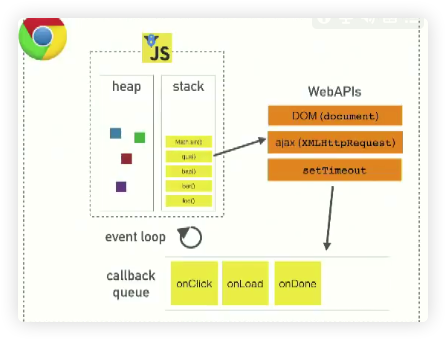

# eventLoop

JavaScript 是一个单线程、非阻塞、异步、解释性脚本语言

所以我想问问 V8：你是否有调用栈、事件循环、回调队列和其他 API

V8：我有一个调用栈和堆，我不知道其他东西是什么

那么如果我们看看 JavaScript 运行环境，比如 V8，V8 是 Chrome 里的 JavaScript 运行环境。

这是一个 JavaScript 的运行环境示意图。堆记录了内存的分配。然后是调用栈，这是帧这类东西的所在之处，但是如果你克隆了 V8 的代码，然后，搜索 setTimeout 或者 DOM，HTTP 请求这类东西，它们并不在里面。它们不存在于 V8 引擎，我对此大吃一惊，当你想要异步编程的时候，这些是你首先需要考虑要使用的东西。

 

首先是 V8 运行环境，然后是浏览器提供的其他东西，被称之为 web APIs，DOM，AJAX，setTimeout 之类的东西，在然后是神秘的事件循环和回调队列。我可以肯定你们事先听过这些术语，但是你未必那么理解这些部分是怎么结合在一起的

JavaScript 是一个单线程的编程语言，单线程的运行环境，它且只有一个调用栈，它每次只能够做一件事，这是单线程的意思，程序每次只可以运行一段代码

// 04:00 start

[EventLoop 可视化工具](https://github.com/latentflip/loupe)

如果一个方法不断调用自身，会造成内存泄漏，导致整个调用栈崩溃

什么使程序运行变慢？所以我们谈谈阻塞

没有严格的定义说什么是阻塞，什么不阻塞。仅仅是指代码运行得很慢。

比如说，console.log 不慢，遍历从从 1 到 10 亿很慢，网络请求很慢，下载图片也很慢。反正在栈里表现很慢的东西都加阻塞。

