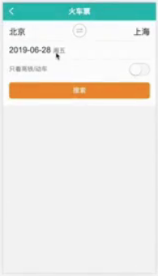

先根据业务需求设计程序的状态字段和可能变更的数据操作，特别是 react 视觉组件的模块化，算是搭建的一个架子，这样才能在后面的开发中解决各个小问题，所以看到需求后，不要着急开发细节逻辑，特别是很容易按照页面从上到下的顺序开始做，做到哪里才想到哪里，很容易反攻，浪费时间。

- React 视觉组件拆分

- redux store 状态涉及

- redux action / reducer 设计

 
 
 

1、顶部导航栏 ( 四个页面公用，公共组件 )
2、始发站 - 终到站
3、出发日期
4、只看高铁动车
5、搜索按钮

 

1、编写 store -> 定义 action -> 实现 reducer

2、编写导航栏

3、始发站 - 终到站
